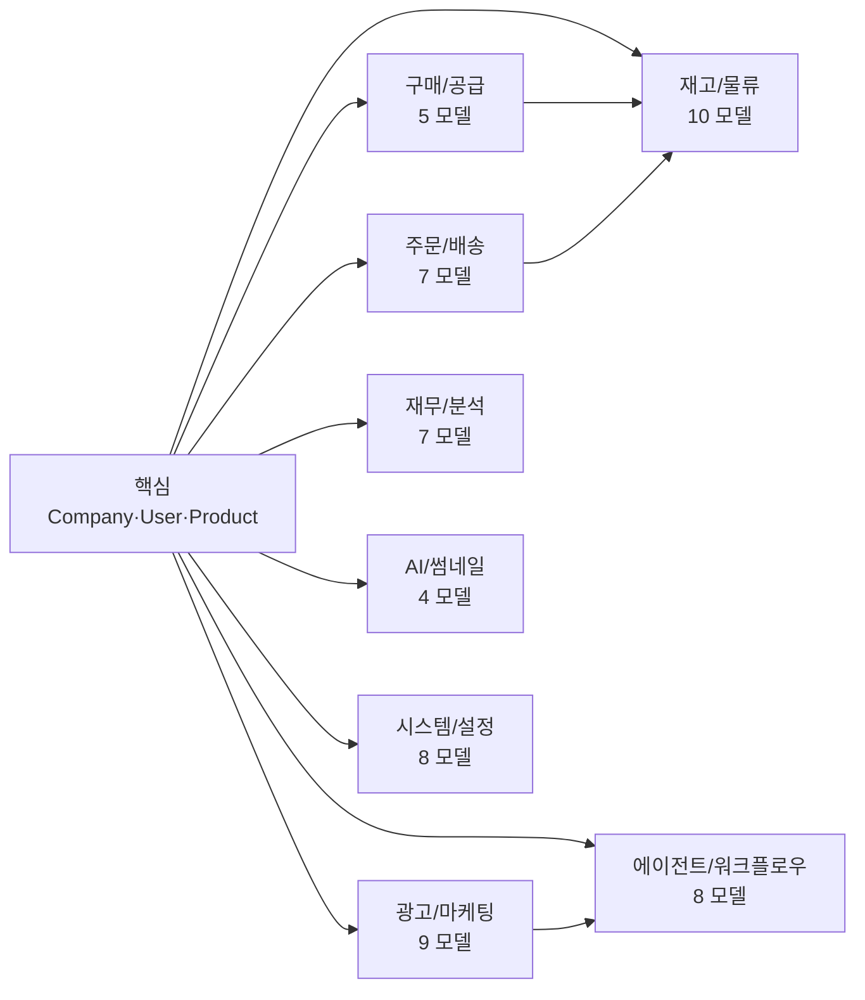
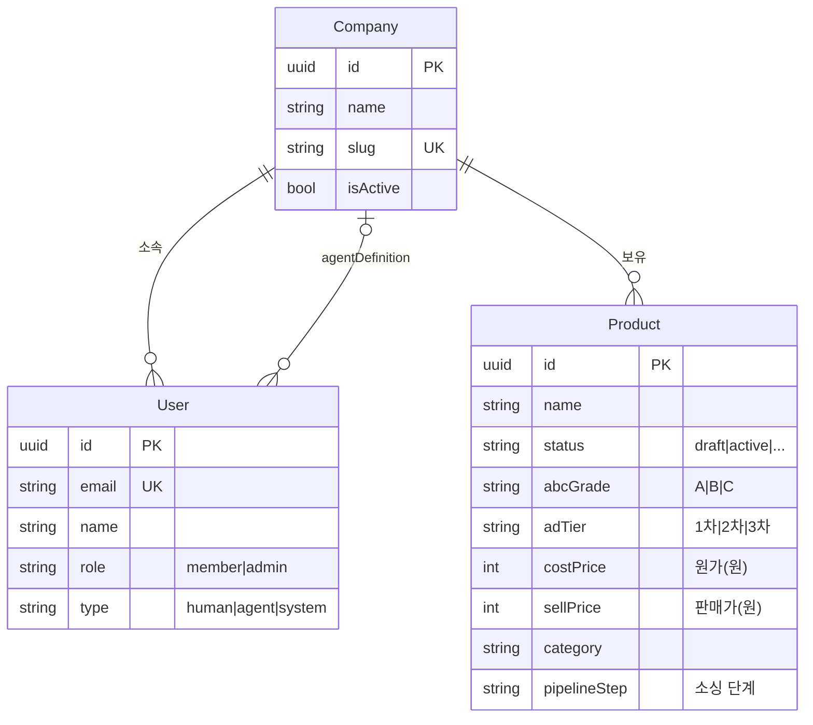
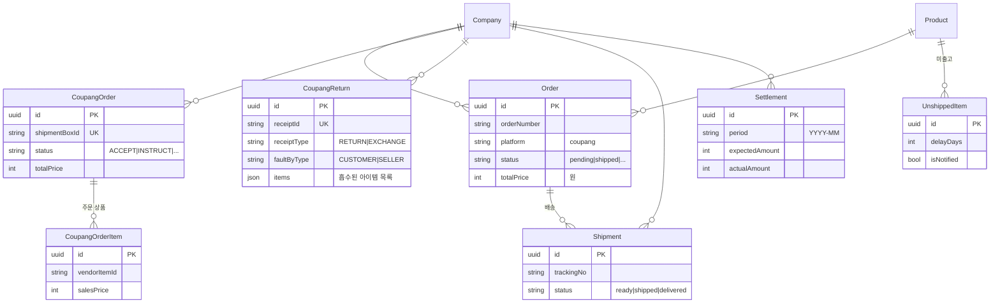
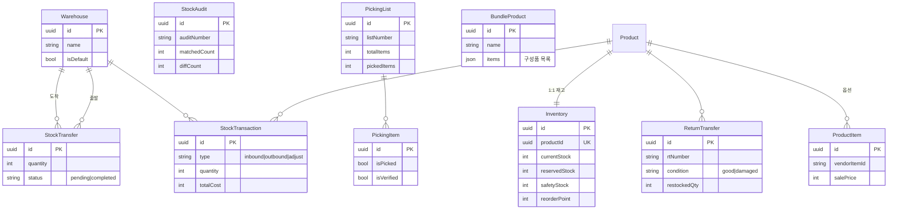
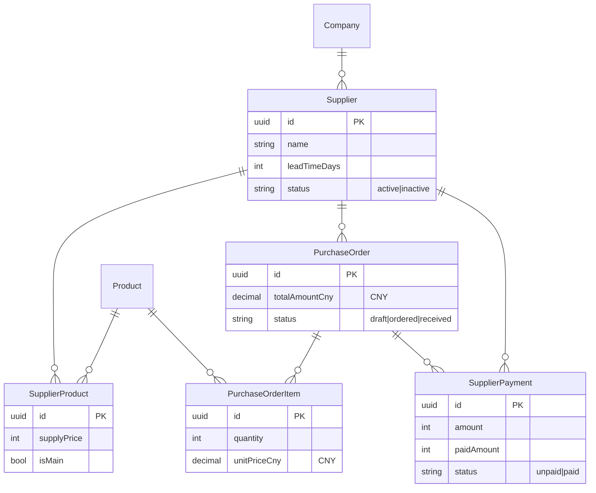
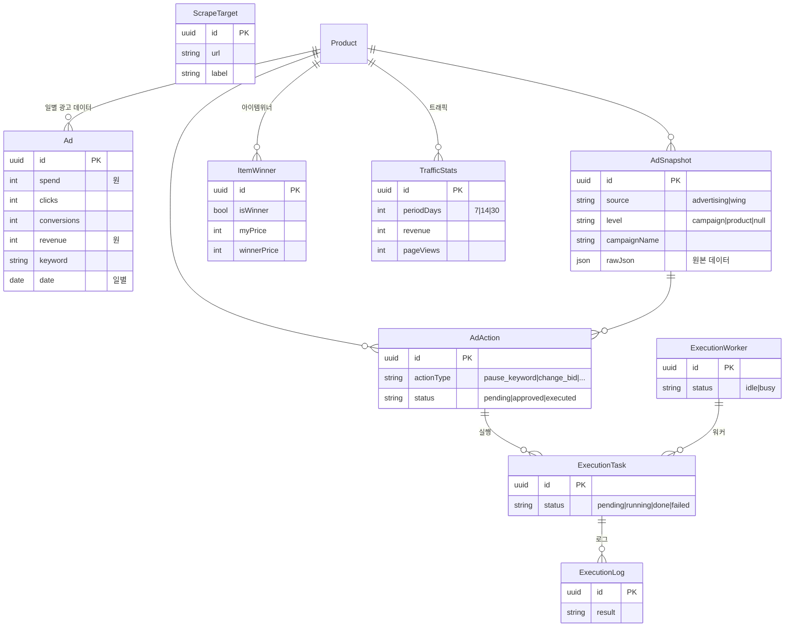
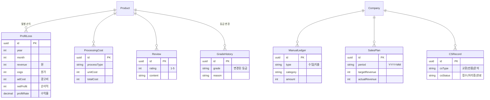
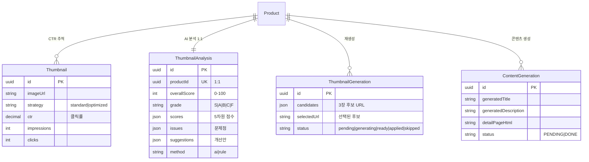
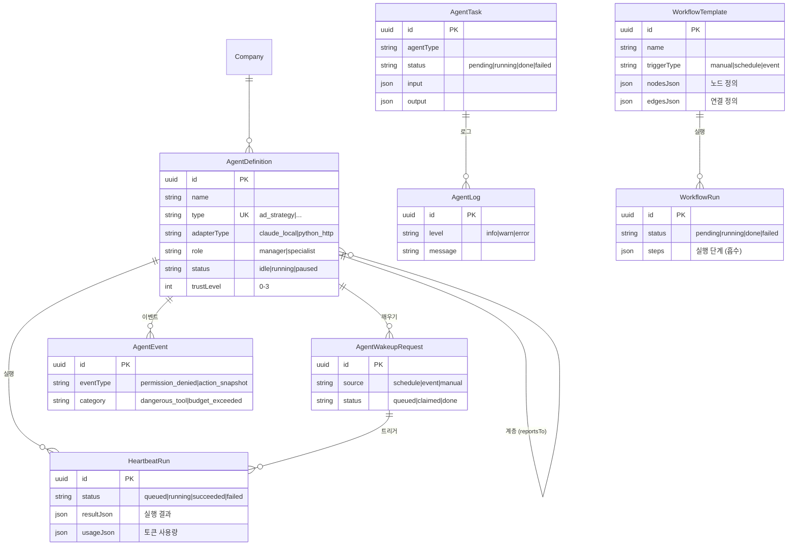
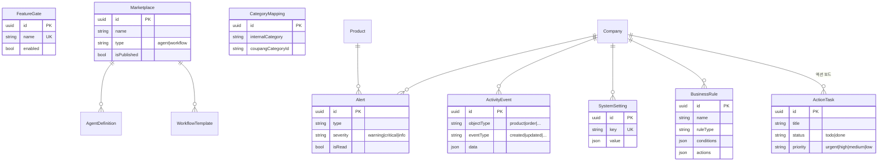

# KidItem ERD — 도메인별 DB 모델 관계도

> 63개 Prisma 모델을 9개 도메인으로 분류. 핵심 필드와 관계만 표시.
> 소스 오브 트루스: `prisma/schema.prisma`

## 전체 도메인 맵

---

## 1. 핵심 — Company · User · Product

> 모든 데이터의 루트. Company가 최상위, Product가 대부분의 하위 모델과 연결되는 허브.

**핵심 포인트:**
- `Product.abcGrade` — 매출 기반 ABC 등급 (광고 전략의 핵심 기준)
- `Product.adTier` — 광고 티어 (1차/2차/3차)
- `Product.pipelineStep` — 소싱→가공→등록 파이프라인 단계
- `User.type` — `human`(사람), `agent`(AI), `system`(챗봇) 통합 관리

---

## 2. 주문/배송

> 쿠팡 주문 수집 → 출고 → 배송 추적. Order(내부)와 CoupangOrder(외부)가 병존.

**핵심 포인트:**
- `CoupangReturn.items` — Json 배열로 반품 아이템 흡수 (별도 테이블 없음)
- `Settlement` — 월별 정산 (예상 vs 실제 비교)
- `Order` vs `CoupangOrder` — 내부 주문 vs 쿠팡 API 원본

---

## 3. 재고/물류

> 입출고, 창고 간 이동, 재고 실사, 피킹, 반품 재입고.

**핵심 포인트:**
- `Inventory` — Product와 1:1 (`productId` unique)
- `BundleProduct.items` — Json으로 구성품 흡수 (별도 BundleItem 없음)
- `StockTransfer` — 창고 간 이동 (from → to warehouse)

---

## 4. 구매/공급

> 중국 소싱 → 발주 → 입고 검수 → 공급가 결제.

**핵심 포인트:**
- 금액 단위: 발주는 CNY (`Decimal(12,2)`), 국내는 KRW (`Int`)
- `SupplierProduct` — 공급사별 상품 공급가 관리
- `PurchaseOrder` — 입고 검수 필드 포함 (receivedQty, defectQty)

---

## 5. 광고/마케팅

> 익스텐션 데이터 수집 → DB 저장 → AI 전략 분석 → 액션 실행.

**핵심 포인트:**
- `Ad` — 상품×날짜별 광고 성과 (groupBy로 집계)
- `AdSnapshot` — 익스텐션이 수집한 raw 데이터. `level`로 구분 (campaign/product/null)
- `AdAction` → `ExecutionTask` → `ExecutionLog` — 광고 액션 자동 실행 파이프라인
- `ItemWinner` — 아이템위너 현황 (Wing 데이터)

---

## 6. 재무/분석

> 상품별 월간 손익, 가공비, 수기 장부, 리뷰, 등급 이력.

**핵심 포인트:**
- `ProfitLoss` — companyId+productId+year+month unique (월간 손익)
- `GradeHistory` — ABC 등급 변경 추적
- `ManualLedger` — 자동 집계 외 수기 수입/지출

---

## 7. AI/썸네일

> 상품 썸네일 AI 분석 (Gemini Vision) → 재생성 (Imagen 3.0) → 적용.

**핵심 포인트:**
- `ThumbnailAnalysis.scores` — 5차원: guideline(25), heroShot(20), composition(20), branding(15), mobile(20)
- `ThumbnailGeneration` 상태 흐름: pending → generating → ready → applied/skipped
- `Thumbnail` vs `ThumbnailAnalysis` — CTR 기반 vs AI 기반 (별도 시스템)

---

## 8. 에이전트/워크플로우

> AI 에이전트 정의 → 하트비트 실행 → 태스크 처리 → 로그.

**핵심 포인트:**
- `AgentDefinition` — 런타임 상태(`rt_*` 필드)를 직접 보유 (별도 테이블 없음)
- `AgentDefinition` 계층 — `reportsTo` 자기참조 (매니저→전문가 조직도)
- `WorkflowRun.steps` — Json으로 단계별 결과 흡수 (별도 StepRun 없음)
- `AgentEvent.eventType` — `permission_denied`(권한 거부) / `action_snapshot`(변경 스냅샷) 통합

---

## 9. 시스템/설정

> 알림, 활동 로그, 피처 게이트, 비즈니스 룰, 마켓플레이스.

**핵심 포인트:**
- `Marketplace` — `type`으로 에이전트/워크플로우 마켓플레이스 통합
- `BusinessRule` — 온톨로지 룰 엔진 (조건→액션 자동화)
- `ActionTask` — 액션 보드 (수동 할일 관리)
- `FeatureGate` — Claude Code 스타일 피처 플래그
