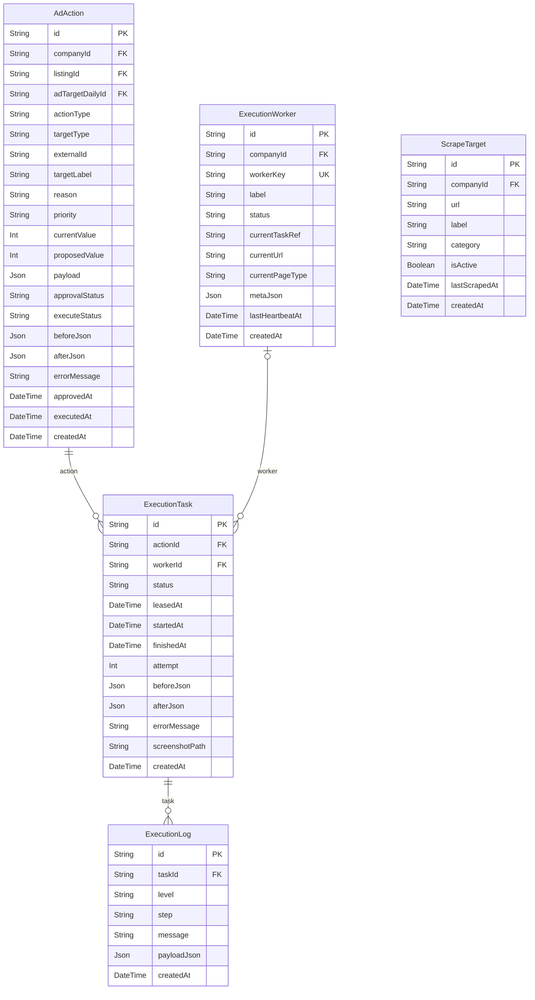

# Advertising ERD

> Generated from `prisma/models/*.prisma`. Do not edit by hand.
> Regenerate with `npm run db:erd` or `npm run graphify:schema`.

[Back to full ERD](../ERD.md)

## Models

| Model | Table | Description |
|---|---|---|
| AdAction | `ad_actions` | 광고 자동 실행 큐. ChannelAdTargetDailySnapshot→AdAction→ExecutionTask→ExecutionLog 파이프라인. |
| ExecutionLog | `execution_logs` | - |
| ExecutionTask | `execution_tasks` | - |
| ExecutionWorker | `execution_workers` | - |
| ScrapeTarget | `scrape_targets` | - |

## Mermaid ER Diagram

## External References

| Local model | Relation | Direction | External domain | External model |
|---|---|---|---|---|
| AdAction | adTargetDaily | references external | Channels | ChannelAdTargetDailySnapshot |
| AdAction | company | references external | Core | Company |
| AdAction | listing | references external | Core | ChannelListing |
| ExecutionWorker | company | references external | Core | Company |
| ScrapeTarget | company | references external | Core | Company |
