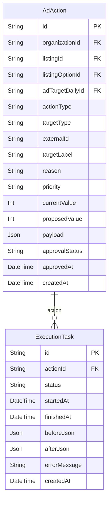

# Advertising ERD

> Generated from `prisma/models/*.prisma`. Do not edit by hand.
> Regenerate with `npm run db:erd` after Prisma schema changes.

[Back to full ERD](../ERD.md)

## Models

| Model | Table | Description |
|---|---|---|
| AdAction | `ad_actions` | 광고 자동 실행 큐. ChannelAdTargetDailySnapshot→AdAction→ExecutionTask 파이프라인. 실행 상태는 최신 ExecutionTask에서 파생한다. |
| ExecutionTask | `execution_tasks` | - |

## Mermaid ER Diagram

```mermaid
erDiagram
  AdAction {
    String id PK
    String organizationId FK
    String listingId FK
    String listingOptionId FK
    String adTargetDailyId FK
    String actionType
    String targetType
    String externalId
    String targetLabel
    String reason
    String priority
    Int currentValue
    Int proposedValue
    Json payload
    String approvalStatus
    DateTime approvedAt
    DateTime createdAt
  }
  ExecutionTask {
    String id PK
    String actionId FK
    String status
    DateTime startedAt
    DateTime finishedAt
    Json beforeJson
    Json afterJson
    String errorMessage
    DateTime createdAt
  }
  AdAction ||--o{ ExecutionTask : "action"
```

## External References

| Local model | Relation | Direction | External domain | External model |
|---|---|---|---|---|
| AdAction | adTargetDaily | references external | Channels | ChannelAdTargetDailySnapshot |
| AdAction | listing | references external | Channels | ChannelListing |
| AdAction | listingOption | references external | Core | ChannelListingOption |
| AdAction | organization | references external | Core | Organization |
