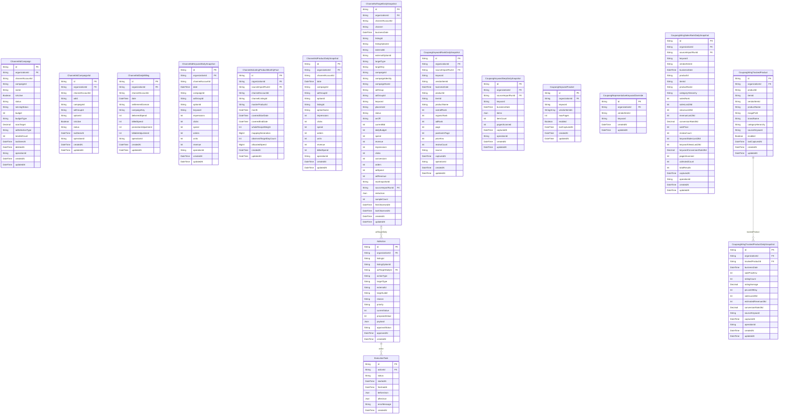

# Advertising ERD

> Generated from `prisma/models/*.prisma`. Do not edit by hand.
> Regenerate with `npm run db:erd` after Prisma schema changes.

[Back to full ERD](../ERD.md)

## Models

| Model | Table | Description |
|---|---|---|
| AdAction | `ad_actions` | 광고 자동 실행 큐. ChannelAdTargetDailySnapshot→AdAction→ExecutionTask 파이프라인. 실행 상태는 최신 ExecutionTask에서 파생한다. |
| ChannelAdCampaign | `channel_ad_campaigns` | ChannelAdCampaign canonical state owned by advertising. |
| ChannelAdCampaignAd | `channel_ad_campaign_ads` | ChannelAdCampaignAd canonical state owned by advertising. |
| ChannelAdDailyBilling | `channel_ad_daily_billings` | ChannelAdDailyBilling canonical state owned by advertising. |
| ChannelAdKeywordDailySnapshot | `channel_ad_keyword_daily_snapshots` | ChannelAdKeywordDailySnapshot canonical state owned by advertising. |
| ChannelAdListingProductMonthlyFact | `channel_ad_listing_product_monthly_facts` | ChannelAdListingProductMonthlyFact canonical state owned by advertising. |
| ChannelAdProductDailySnapshot | `channel_ad_product_daily_snapshots` | ChannelAdProductDailySnapshot canonical state owned by advertising. |
| ChannelAdTargetDailySnapshot | `channel_ad_target_daily_snapshots` | ChannelAdTargetDailySnapshot canonical state owned by advertising. |
| CoupangKeywordRankDailySnapshot | `coupang_keyword_rank_daily_snapshots` | CoupangKeywordRankDailySnapshot canonical state owned by advertising. |
| CoupangKeywordSerpDailySnapshot | `coupang_keyword_serp_daily_snapshots` | CoupangKeywordSerpDailySnapshot canonical state owned by advertising. |
| CoupangKeywordTracker | `coupang_keyword_trackers` | CoupangKeywordTracker canonical state owned by advertising. |
| CoupangRepresentativeKeywordOverride | `coupang_representative_keyword_overrides` | CoupangRepresentativeKeywordOverride canonical state owned by advertising. |
| CoupangWingSalesRankDailySnapshot | `coupang_wing_sales_rank_daily_snapshots` | CoupangWingSalesRankDailySnapshot canonical state owned by advertising. |
| CoupangWingTrackedProduct | `coupang_wing_tracked_products` | CoupangWingTrackedProduct canonical state owned by advertising. |
| CoupangWingTrackedProductDailySnapshot | `coupang_wing_tracked_product_daily_snapshots` | CoupangWingTrackedProductDailySnapshot canonical state owned by advertising. |
| ExecutionTask | `execution_tasks` | - |

## Mermaid ER Diagram

```mermaid
erDiagram
  AdAction {
    String id PK
    String organizationId FK
    String listingId
    String listingOptionId
    String adTargetDailyId FK
    String actionType
    String targetType
    String externalId
    String targetLabel
    String reason
    String priority
    Int currentValue
    Int proposedValue
    Json payload
    String approvalStatus
    DateTime approvedAt
    DateTime createdAt
  }
  ChannelAdCampaign {
    String id PK
    String organizationId FK
    String channelAccountId
    String campaignId
    String name
    Boolean isActive
    String status
    String servingStatus
    Int budget
    String budgetType
    Decimal roasTarget
    String adSelectionType
    Int totalAdCount
    DateTime lastSeenAt
    DateTime deletedAt
    String operationId
    DateTime createdAt
    DateTime updatedAt
  }
  ChannelAdCampaignAd {
    String id PK
    String organizationId FK
    String channelAccountId
    String adId
    String campaignId
    String adGroupId
    String optionId
    Boolean isActive
    String status
    DateTime lastSeenAt
    String operationId
    DateTime createdAt
    DateTime updatedAt
  }
  ChannelAdDailyBilling {
    String id PK
    String organizationId FK
    String channelAccountId
    DateTime date
    String settlementDomain
    String campaignKey
    Int deliveredSpend
    Int billedSpend
    Int promotionAdjustment
    Int billableAdjustment
    String operationId
    DateTime createdAt
    DateTime updatedAt
  }
  ChannelAdKeywordDailySnapshot {
    String id PK
    String organizationId FK
    String channelAccountId
    DateTime date
    String campaignId
    String adGroupId
    String optionId
    String keyword
    Int impressions
    Int clicks
    Int spend
    Int orders
    Int units
    Int revenue
    String operationId
    DateTime createdAt
    DateTime updatedAt
  }
  ChannelAdListingProductMonthlyFact {
    String id PK
    String organizationId FK
    String sourceImportRunId FK
    String channelAccountId
    String channelListingId
    String masterProductId
    DateTime month
    DateTime coveredStartDate
    DateTime coveredEndDate
    Int wholeRecipeWeight
    BigInt mappingGeneration
    Int observedTargetDayCount
    BigInt allocatedSpend
    DateTime createdAt
    DateTime updatedAt
  }
  ChannelAdProductDailySnapshot {
    String id PK
    String organizationId FK
    String channelAccountId
    DateTime date
    String campaignId
    String adGroupId
    String optionId
    String listingId
    String optionName
    Int impressions
    Int clicks
    Int spend
    Int orders
    Int units
    Int revenue
    Int billedSpend
    String operationId
    DateTime createdAt
    DateTime updatedAt
  }
  ChannelAdTargetDailySnapshot {
    String id PK
    String organizationId FK
    String channelAccountId
    String channel
    DateTime businessDate
    String listingId
    String listingOptionId
    String externalId
    String externalOptionId
    String targetType
    String targetKey
    String campaignId
    String campaignIdentity
    String campaignName
    String adGroup
    String adGroupId
    String keyword
    String placement
    String status
    String onOff
    Int currentBid
    Int dailyBudget
    Int spend
    Int revenue
    Int impressions
    Int clicks
    Int conversions
    Int orders
    Int adSpend
    Int adRevenue
    String rawSnapshotId
    String sourceImportRunId FK
    Json metaJson
    Int sampleCount
    DateTime firstObservedAt
    DateTime lastObservedAt
    DateTime createdAt
    DateTime updatedAt
  }
  CoupangKeywordRankDailySnapshot {
    String id PK
    String organizationId FK
    String sourceImportRunId FK
    String keyword
    String vendorItemId
    DateTime businessDate
    String productId
    String itemId
    String productName
    Int overallRank
    Int organicRank
    Int adRank
    Int page
    Int positionInPage
    Int priceKrw
    Int reviewCount
    String source
    DateTime capturedAt
    String operationId
    DateTime createdAt
    DateTime updatedAt
  }
  CoupangKeywordSerpDailySnapshot {
    String id PK
    String organizationId FK
    String sourceImportRunId FK
    String keyword
    DateTime businessDate
    Json items
    Int itemCount
    Int pagesScanned
    DateTime capturedAt
    String operationId
    DateTime createdAt
    DateTime updatedAt
  }
  CoupangKeywordTracker {
    String id PK
    String organizationId FK
    String keyword
    StringArray vendorItemIds
    Int maxPages
    Boolean enabled
    DateTime lastCapturedAt
    DateTime createdAt
    DateTime updatedAt
  }
  CoupangRepresentativeKeywordOverride {
    String id PK
    String organizationId FK
    String vendorItemId
    String keyword
    DateTime createdAt
    DateTime updatedAt
  }
  CoupangWingSalesRankDailySnapshot {
    String id PK
    String organizationId FK
    String sourceImportRunId FK
    String keyword
    String vendorItemId
    DateTime businessDate
    String productId
    String itemId
    String productName
    String categoryHierarchy
    Int salesRank
    Int salesLast28d
    Int viewsLast28d
    Int revenueLast28d
    Decimal conversionRate28d
    Int salePrice
    Int reviewCount
    Int keywordSalesLast28d
    Int keywordViewsLast28d
    Decimal keywordConversionRate28d
    Int pagesScanned
    Int collectedCount
    Int totalResults
    DateTime capturedAt
    String operationId
    DateTime createdAt
    DateTime updatedAt
  }
  CoupangWingTrackedProduct {
    String id PK
    String organizationId FK
    String productId
    String itemId
    String vendorItemId
    String productName
    String imagePath
    String brandName
    String categoryHierarchy
    String sourceKeyword
    Boolean enabled
    DateTime lastCapturedAt
    DateTime createdAt
    DateTime updatedAt
  }
  CoupangWingTrackedProductDailySnapshot {
    String id PK
    String organizationId FK
    String trackedProductId FK
    DateTime businessDate
    Int salePriceKrw
    Int ratingCount
    Decimal ratingAverage
    Int pvLast28Day
    Int salesLast28d
    Int estimatedRevenue28d
    Decimal conversionRate28d
    String sourceKeyword
    DateTime capturedAt
    String operationId
    DateTime createdAt
    DateTime updatedAt
  }
  ExecutionTask {
    String id PK
    String actionId FK
    String status
    DateTime startedAt
    DateTime finishedAt
    Json beforeJson
    Json afterJson
    String errorMessage
    DateTime createdAt
  }
  AdAction ||--o{ ExecutionTask : "action"
  ChannelAdTargetDailySnapshot o|--o{ AdAction : "adTargetDaily"
  CoupangWingTrackedProduct ||--o{ CoupangWingTrackedProductDailySnapshot : "trackedProduct"
```

## External References

| Local model | Relation | Direction | External domain | External model |
|---|---|---|---|---|
| AdAction | organization | references external | Core | Organization |
| ChannelAdCampaign | organization | references external | Core | Organization |
| ChannelAdCampaignAd | organization | references external | Core | Organization |
| ChannelAdDailyBilling | organization | references external | Core | Organization |
| ChannelAdKeywordDailySnapshot | organization | references external | Core | Organization |
| ChannelAdListingProductMonthlyFact | organization | references external | Core | Organization |
| ChannelAdListingProductMonthlyFact | sourceImportRun | references external | Core | SourceImportRun |
| ChannelAdProductDailySnapshot | organization | references external | Core | Organization |
| ChannelAdTargetDailySnapshot | organization | references external | Core | Organization |
| ChannelAdTargetDailySnapshot | sourceImportRun | references external | Core | SourceImportRun |
| CoupangKeywordRankDailySnapshot | organization | references external | Core | Organization |
| CoupangKeywordRankDailySnapshot | sourceImportRun | references external | Core | SourceImportRun |
| CoupangKeywordSerpDailySnapshot | organization | references external | Core | Organization |
| CoupangKeywordSerpDailySnapshot | sourceImportRun | references external | Core | SourceImportRun |
| CoupangKeywordTracker | organization | references external | Core | Organization |
| CoupangRepresentativeKeywordOverride | organization | references external | Core | Organization |
| CoupangWingSalesRankDailySnapshot | organization | references external | Core | Organization |
| CoupangWingSalesRankDailySnapshot | sourceImportRun | references external | Core | SourceImportRun |
| CoupangWingTrackedProduct | organization | references external | Core | Organization |
| CoupangWingTrackedProductDailySnapshot | organization | references external | Core | Organization |
