# AgentOS ERD

> Generated from `prisma/models/*.prisma`. Do not edit by hand.
> Regenerate with `npm run db:erd` or `npm run graphify:schema`.

[Back to full ERD](../ERD.md)

## Models

| Model | Table | Description |
|---|---|---|
| AgentApprovalRequest | `agent_approval_requests` | Human approval state. While pending, AgentRunRequest.status = requires_approval. |
| AgentAuthorizationEvent | `agent_authorization_events` | Authorization audit. Logged before, during, and outside runs (eg. admin policy widening). |
| AgentBlueprint | `agent_blueprints` | Global catalog template for an agent kind. Replaces the global side of the legacy AgentDefinition. |
| AgentBlueprintToolPolicy | `agent_blueprint_tool_policies` | Default tool policy at the blueprint level (allow / deny / approval_required). |
| AgentCostEvent | `agent_cost_events` | Cost ledger source of truth. Insert + AgentRuntimeState aggregate update share one transaction. |
| AgentInstance | `agent_instances` | Organization-owned runnable subject. Replaces the tenant-owned side of legacy AgentDefinition. |
| AgentInstanceToolPolicy | `agent_instance_tool_policies` | Per-instance override for tool policy. Resolution: instance overrides blueprint, deny wins. |
| AgentRun | `agent_runs` | Accepted execution attempt. Replaces HeartbeatRun. Always starts at status="running"; queue state lives on AgentRunRequest. |
| AgentRunEvent | `agent_run_events` | Run-local event timeline (status, tool, model, safety, fallback). Bulk logs go to external store via logRef. |
| AgentRunRequest | `agent_run_requests` | Durable request inbox + queue + dedupe + audit. Replaces AgentWakeupRequest. Queue state lives here, not on AgentRun. |
| AgentRuntimeState | `agent_runtime_states` | Frequently-changing per-instance runtime state (last run, totals, cached aggregates). 1:1 with AgentInstance. |
| AgentTaskSession | `agent_task_sessions` | Per-task durable session. taskKey defaults to "default" only at API boundary. |
| AgentToolDefinition | `agent_tool_definitions` | Catalog of business tools agents may invoke. KidItem ships a curated set; not a generic HTTP/DB tool marketplace. |
| WorkflowRun | `workflow_runs` | Workflow run record. Workflow runner triggers Agent OS via AgentRunnerPort with sourceWorkflowRunId. |
| WorkflowTemplate | `workflow_templates` | Workflow definition. Trigger config + nodes/edges. |

## Mermaid ER Diagram

```mermaid
erDiagram
  AgentApprovalRequest {
    String id PK
    String organizationId FK
    String agentInstanceId FK
    String requestId FK
    String runId FK
    String status
    String reasonCode
    String reason
    String prompt
    Json payload
    Json actionSnapshot
    String requestedByActorType
    String requestedByActorId
    String requestedByUserId FK
    String approverUserId FK
    String decidedByUserId FK
    DateTime decidedAt
    String decisionReason
    DateTime expiresAt
    DateTime createdAt
    DateTime updatedAt
  }
  AgentAuthorizationEvent {
    String id PK
    String organizationId FK
    String agentInstanceId FK
    String requestId FK
    String runId FK
    String toolId FK
    String actorType
    String actorId
    String action
    String decision
    String reasonCode
    String reason
    String resourceType
    String resourceId
    Json policySnapshot
    String requestedByUserId FK
    String decidedByUserId FK
    DateTime createdAt
  }
  AgentBlueprint {
    String id PK
    String type UK
    String name
    String description
    String promptPath
    String defaultAdapterType
    String defaultModel
    Json defaultRuntimeConfig
    Json defaultCapabilities
    String catalogStatus
    String marketplaceId FK
    DateTime createdAt
    DateTime updatedAt
  }
  AgentBlueprintToolPolicy {
    String id PK
    String blueprintId FK
    String toolId FK
    String effect
    String approvalMode
    String dryRunMode
    Json constraints
    DateTime createdAt
    DateTime updatedAt
  }
  AgentCostEvent {
    String id PK
    String organizationId FK
    String agentInstanceId FK
    String requestId FK
    String runId FK
    String provider
    String model
    String biller
    String billingType
    Int inputTokens
    Int outputTokens
    Int cachedInputTokens
    BigInt costMicros
    Json metadata
    DateTime occurredAt
    DateTime createdAt
  }
  AgentInstance {
    String id PK
    String organizationId FK
    String blueprintId FK
    String type
    String name
    String role
    String title
    String icon
    String reportsToId FK
    String lifecycleStatus
    String pauseReason
    DateTime pausedAt
    Int trustLevel
    String adapterType
    String modelOverride
    Json adapterConfig
    Json runtimeConfig
    String promptPathOverride
    DateTime createdAt
    DateTime updatedAt
  }
  AgentInstanceToolPolicy {
    String id PK
    String organizationId FK
    String agentInstanceId FK
    String toolId FK
    String effect
    String approvalMode
    String dryRunMode
    Json constraints
    DateTime createdAt
    DateTime updatedAt
  }
  AgentRun {
    String id PK
    String organizationId FK
    String agentInstanceId FK
    String requestId FK
    String taskSessionId FK
    String retryOfRunId FK
    String status
    Int attempt
    String invocationSource
    String adapterType
    String model
    String provider
    String taskKey
    String sessionDisplayBefore
    String sessionDisplayAfter
    Json input
    Json output
    DateTime startedAt
    DateTime finishedAt
    DateTime heartbeatAt
    Int exitCode
    String signal
    String errorCode
    String errorMessage
    Json usageJson
    Json resultJson
    String logStore
    String logRef
    String logSha256
    BigInt logBytes
    Boolean logCompressed
    String stdoutExcerpt
    String stderrExcerpt
    Int lastEventSeq
    DateTime createdAt
    DateTime updatedAt
  }
  AgentRunEvent {
    String id PK
    String organizationId FK
    String runId FK
    String agentInstanceId FK
    Int seq
    String type
    String level
    String stream
    String message
    Json data
    String logRef
    DateTime createdAt
  }
  AgentRunRequest {
    String id PK
    String organizationId FK
    String agentInstanceId FK
    String taskSessionId FK
    String source
    String triggerDetail
    String reason
    String idempotencyKey
    Int priority
    String sourceWorkflowRunId FK
    String sourceWorkflowNodeId
    String sourceResourceType
    String sourceResourceId
    String requestedByUserId FK
    String requestedByActorType
    String requestedByActorId
    Json payload
    String status
    DateTime scheduledFor
    DateTime claimedAt
    String claimedBy
    Int attempts
    Int maxAttempts
    DateTime finishedAt
    String coalescedIntoRequestId FK
    String lastErrorCode
    String lastErrorMessage
    DateTime createdAt
    DateTime updatedAt
  }
  AgentRuntimeState {
    String id PK
    String organizationId FK
    String agentInstanceId FK,UK
    String lastRunId FK
    String lastRunStatus
    String lastError
    DateTime lastHeartbeatAt
    Int consecutiveFailureCount
    Int totalRuns
    Int totalInputTokens
    Int totalOutputTokens
    BigInt totalCostMicros
    Json stateJson
    DateTime createdAt
    DateTime updatedAt
  }
  AgentTaskSession {
    String id PK
    String organizationId FK
    String agentInstanceId FK
    String adapterType
    String taskKey
    String title
    Json metadata
    Json sessionParams
    String sessionDisplay
    String lastRunId FK
    String lastError
    DateTime createdAt
    DateTime updatedAt
  }
  AgentToolDefinition {
    String id PK
    String key UK
    String name
    String description
    String riskLevel
    String credentialKind
    Json inputSchemaJson
    Json outputSchemaJson
    Boolean isActive
    DateTime createdAt
    DateTime updatedAt
  }
  WorkflowRun {
    String id PK
    String organizationId
    String templateId FK
    String status
    String triggeredBy
    String triggeredByUserId FK
    Json contextData
    Json steps
    String error
    DateTime startedAt
    DateTime completedAt
    DateTime createdAt
    DateTime updatedAt
  }
  WorkflowTemplate {
    String id PK
    String organizationId FK
    String name
    String description
    String module
    Boolean isActive
    String triggerType
    String schedule
    Json nodesJson
    Json edgesJson
    Int version
    DateTime createdAt
    DateTime updatedAt
    String marketplaceId FK
  }
  AgentBlueprint ||--o{ AgentBlueprintToolPolicy : "blueprint"
  AgentBlueprint ||--o{ AgentInstance : "blueprint"
  AgentInstance ||--o{ AgentApprovalRequest : "agentInstance"
  AgentInstance ||--o{ AgentAuthorizationEvent : "agentInstance"
  AgentInstance ||--o{ AgentCostEvent : "agentInstance"
  AgentInstance o|--o{ AgentInstance : "parent"
  AgentInstance ||--o{ AgentInstanceToolPolicy : "agentInstance"
  AgentInstance ||--o{ AgentRun : "agentInstance"
  AgentInstance ||--o{ AgentRunEvent : "agentInstance"
  AgentInstance ||--o{ AgentRunRequest : "agentInstance"
  AgentInstance ||--|| AgentRuntimeState : "agentInstance"
  AgentInstance ||--o{ AgentTaskSession : "agentInstance"
  AgentRun o|--o{ AgentApprovalRequest : "run"
  AgentRun o|--o{ AgentAuthorizationEvent : "run"
  AgentRun ||--o{ AgentCostEvent : "run"
  AgentRun o|--o{ AgentRun : "retryOfRun"
  AgentRun ||--o{ AgentRunEvent : "run"
  AgentRun o|--o{ AgentRuntimeState : "lastRun"
  AgentRun o|--o{ AgentTaskSession : "lastRun"
  AgentRunRequest ||--o{ AgentApprovalRequest : "request"
  AgentRunRequest o|--o{ AgentAuthorizationEvent : "request"
  AgentRunRequest ||--o{ AgentCostEvent : "request"
  AgentRunRequest ||--o{ AgentRun : "request"
  AgentRunRequest o|--o{ AgentRunRequest : "coalescedIntoRequest"
  AgentTaskSession ||--o{ AgentRun : "taskSession"
  AgentTaskSession ||--o{ AgentRunRequest : "taskSession"
  AgentToolDefinition o|--o{ AgentAuthorizationEvent : "tool"
  AgentToolDefinition ||--o{ AgentBlueprintToolPolicy : "tool"
  AgentToolDefinition ||--o{ AgentInstanceToolPolicy : "tool"
  WorkflowRun o|--o{ AgentRunRequest : "sourceWorkflowRun"
  WorkflowTemplate ||--o{ WorkflowRun : "template"
```

## External References

| Local model | Relation | Direction | External domain | External model |
|---|---|---|---|---|
| AgentApprovalRequest | approver | references external | Core | User |
| AgentApprovalRequest | decidedBy | references external | Core | User |
| AgentApprovalRequest | organization | references external | Core | Organization |
| AgentApprovalRequest | requestedBy | references external | Core | User |
| AgentAuthorizationEvent | decidedBy | references external | Core | User |
| AgentAuthorizationEvent | organization | references external | Core | Organization |
| AgentAuthorizationEvent | requestedBy | references external | Core | User |
| AgentBlueprint | marketplace | references external | System | Marketplace |
| AgentCostEvent | organization | references external | Core | Organization |
| AgentInstance | agentInstance | referenced by external | Core | User |
| AgentInstance | organization | references external | Core | Organization |
| AgentInstanceToolPolicy | organization | references external | Core | Organization |
| AgentRun | organization | references external | Core | Organization |
| AgentRunEvent | organization | references external | Core | Organization |
| AgentRunRequest | organization | references external | Core | Organization |
| AgentRunRequest | requestedBy | references external | Core | User |
| AgentRuntimeState | organization | references external | Core | Organization |
| AgentTaskSession | organization | references external | Core | Organization |
| WorkflowRun | triggeredByUser | references external | Core | User |
| WorkflowTemplate | marketplace | references external | System | Marketplace |
| WorkflowTemplate | organization | references external | Core | Organization |
