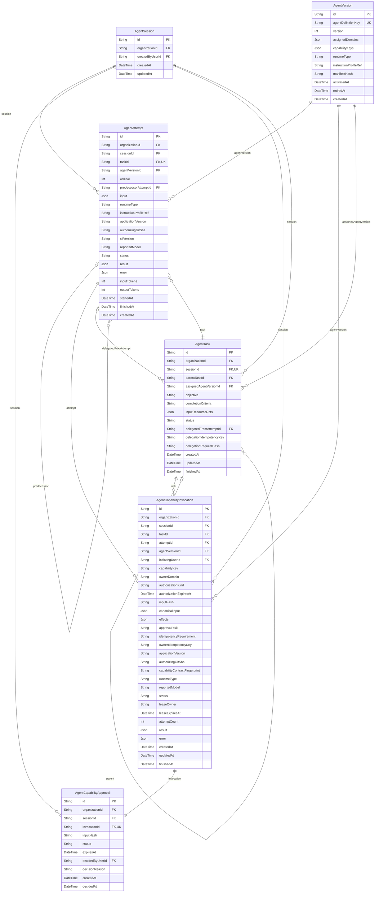

# AgentOS ERD

> Generated from `prisma/models/*.prisma`. Do not edit by hand.
> Regenerate with `npm run db:erd` after Prisma schema changes.

[Back to full ERD](../ERD.md)

## Models

| Model | Table | Description |
|---|---|---|
| AgentAttempt | `agent_attempts` | One immutable local CLI process attempt. |
| AgentCapabilityApproval | `agent_capability_approvals` | One immutable human decision for one mutation invocation. |
| AgentCapabilityInvocation | `agent_capability_invocations` | Exact capability authorization and mutation work item. |
| AgentSession | `agent_work_sessions` | User-visible work grouping and terminal deletion boundary. |
| AgentTask | `agent_work_tasks` | Root or delegated durable work responsibility. |
| AgentVersion | `agent_work_versions` | Immutable code-owned agent definition version. |

## Mermaid ER Diagram

```mermaid
erDiagram
  AgentAttempt {
    String id PK
    String organizationId FK
    String sessionId FK
    String taskId FK,UK
    String agentVersionId FK
    Int ordinal
    String predecessorAttemptId FK
    Json input
    String runtimeType
    String instructionProfileRef
    String applicationVersion
    String authorizingGitSha
    String cliVersion
    String reportedModel
    String status
    Json result
    Json error
    Int inputTokens
    Int outputTokens
    DateTime startedAt
    DateTime finishedAt
    DateTime createdAt
  }
  AgentCapabilityApproval {
    String id PK
    String organizationId FK
    String sessionId FK
    String invocationId FK,UK
    String inputHash
    String status
    DateTime expiresAt
    String decidedByUserId FK
    String decisionReason
    DateTime createdAt
    DateTime decidedAt
  }
  AgentCapabilityInvocation {
    String id PK
    String organizationId FK
    String sessionId FK
    String taskId FK
    String attemptId FK
    String agentVersionId FK
    String initiatingUserId FK
    String capabilityKey
    String ownerDomain
    String authorizationKind
    DateTime authorizationExpiresAt
    String inputHash
    Json canonicalInput
    Json effects
    String approvalRisk
    String idempotencyRequirement
    String ownerIdempotencyKey
    String applicationVersion
    String authorizingGitSha
    String capabilityContractFingerprint
    String runtimeType
    String reportedModel
    String status
    String leaseOwner
    DateTime leaseExpiresAt
    Int attemptCount
    Json result
    Json error
    DateTime createdAt
    DateTime updatedAt
    DateTime finishedAt
  }
  AgentSession {
    String id PK
    String organizationId FK
    String createdByUserId FK
    DateTime createdAt
    DateTime updatedAt
  }
  AgentTask {
    String id PK
    String organizationId FK
    String sessionId FK,UK
    String parentTaskId FK
    String assignedAgentVersionId FK
    String objective
    String completionCriteria
    Json inputResourceRefs
    String status
    String delegatedFromAttemptId FK
    String delegationIdempotencyKey
    String delegationRequestHash
    DateTime createdAt
    DateTime updatedAt
    DateTime finishedAt
  }
  AgentVersion {
    String id PK
    String agentDefinitionKey UK
    Int version
    Json assignedDomains
    Json capabilityKeys
    String runtimeType
    String instructionProfileRef
    String manifestHash
    DateTime activatedAt
    DateTime retiredAt
    DateTime createdAt
  }
  AgentAttempt o|--o{ AgentAttempt : "predecessor"
  AgentAttempt ||--o{ AgentCapabilityInvocation : "attempt"
  AgentAttempt o|--o{ AgentTask : "delegatedFromAttempt"
  AgentCapabilityInvocation ||--|| AgentCapabilityApproval : "invocation"
  AgentSession ||--o{ AgentAttempt : "session"
  AgentSession ||--o{ AgentCapabilityApproval : "session"
  AgentSession ||--o{ AgentCapabilityInvocation : "session"
  AgentSession ||--o{ AgentTask : "session"
  AgentTask ||--o{ AgentAttempt : "task"
  AgentTask ||--o{ AgentCapabilityInvocation : "task"
  AgentTask o|--o{ AgentTask : "parent"
  AgentVersion ||--o{ AgentAttempt : "agentVersion"
  AgentVersion ||--o{ AgentCapabilityInvocation : "agentVersion"
  AgentVersion ||--o{ AgentTask : "assignedAgentVersion"
```

## External References

| Local model | Relation | Direction | External domain | External model |
|---|---|---|---|---|
| AgentCapabilityApproval | decidedByUser | references external | Core | User |
| AgentCapabilityInvocation | initiatingUser | references external | Core | User |
| AgentSession | creator | references external | Core | User |
| AgentSession | organization | references external | Core | Organization |
