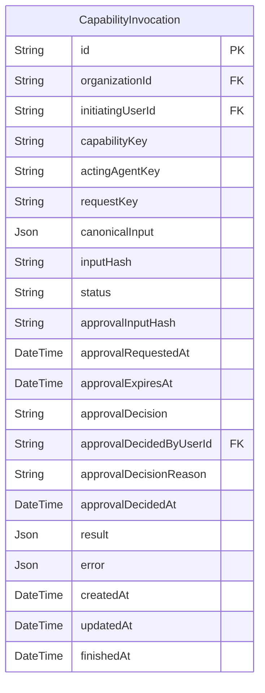

# AgentOS ERD

> Generated from `prisma/models/*.prisma`. Do not edit by hand.
> Regenerate with `npm run db:erd` after Prisma schema changes.

[Back to full ERD](../ERD.md)

## Models

| Model | Table | Description |
|---|---|---|
| CapabilityInvocation | `capability_invocations` | Exact request-driven mutation admission and replay receipt. |

## Mermaid ER Diagram

```mermaid
erDiagram
  CapabilityInvocation {
    String id PK
    String organizationId FK
    String initiatingUserId FK
    String capabilityKey
    String actingAgentKey
    String requestKey
    Json canonicalInput
    String inputHash
    String status
    String approvalInputHash
    DateTime approvalRequestedAt
    DateTime approvalExpiresAt
    String approvalDecision
    String approvalDecidedByUserId FK
    String approvalDecisionReason
    DateTime approvalDecidedAt
    Json result
    Json error
    DateTime createdAt
    DateTime updatedAt
    DateTime finishedAt
  }
```

## External References

| Local model | Relation | Direction | External domain | External model |
|---|---|---|---|---|
| CapabilityInvocation | approvalDecidedByUser | references external | Core | User |
| CapabilityInvocation | initiatingUser | references external | Core | User |
| CapabilityInvocation | organization | references external | Core | Organization |
