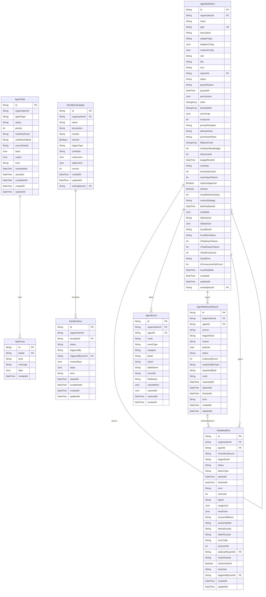

# Agents ERD

> Generated from `prisma/models/*.prisma`. Do not edit by hand.
> Regenerate with `npm run db:erd` or `npm run graphify:schema`.

[Back to full ERD](../ERD.md)

## Models

| Model | Table | Description |
|---|---|---|
| AgentDefinition | `agent_definitions` | 에이전트 정의. rt_* 필드로 런타임 상태 내장 (별도 테이블 없음). reportsTo 자기참조 (매니저→전문가 계층). |
| AgentEvent | `agent_events` | eventType 으로 permission_denied / action_snapshot 통합. |
| AgentLog | `agent_logs` | - |
| AgentTask | `agent_tasks` | - |
| AgentWakeupRequest | `agent_wakeup_requests` | - |
| HeartbeatRun | `heartbeat_runs` | 에이전트 안전 파이프라인 (Budget/Cap/DryRun). AgentDefinition 과 함께 agent runtime state 구성. |
| WorkflowRun | `workflow_runs` | steps Json 으로 단계별 결과 흡수 (별도 StepRun 없음). |
| WorkflowTemplate | `workflow_templates` | - |

## Mermaid ER Diagram

## External References

| Local model | Relation | Direction | External domain | External model |
|---|---|---|---|---|
| AgentDefinition | agentDefinition | referenced by external | Core | User |
| AgentDefinition | marketplace | references external | System | Marketplace |
| AgentDefinition | organization | references external | Core | Organization |
| AgentEvent | organization | references external | Core | Organization |
| AgentWakeupRequest | organization | references external | Core | Organization |
| HeartbeatRun | organization | references external | Core | Organization |
| HeartbeatRun | triggeredByUser | references external | Core | User |
| WorkflowRun | triggeredByUser | references external | Core | User |
| WorkflowTemplate | marketplace | references external | System | Marketplace |
| WorkflowTemplate | organization | references external | Core | Organization |
