# AI ERD

> Generated from `prisma/models/*.prisma`. Do not edit by hand.
> Regenerate with `npm run db:erd` or `npm run graphify:schema`.

[Back to full ERD](../ERD.md)

## Models

| Model | Table | Description |
|---|---|---|
| ContentAsset | `content_assets` | Generated/editable media workspace asset. Product gallery adoption copies selected rows into MasterProductImage. |
| ContentGeneration | `content_generations` | - |
| ContentGenerationAssetUsage | `content_generation_asset_usages` | Current image assets used by a generated content row. Asset location stays on ContentAsset; this table is the replace-on-save usage set. |
| ContentGenerationGroup | `content_generation_groups` | Same-input generation group. Product-less groups are standalone generated-content workspaces; product-bound groups remain candidate lineage inside a Master workspace. |
| ContentGenerationSource | `content_generation_sources` | Generation-level provenance. The source of a generated work unit can be a sourcing candidate, input asset, or another generation. |
| ContentWorkspace | `content_workspaces` | Product content workspace. Detail-page and thumbnail generations for the same owner/title accumulate here as versioned content history before or after MasterProduct creation. |
| DetailPageArtifact | `detail_page_artifacts` | Candidate-centered editable detail-page artifact. One artifact owns the user-visible draft line; revisions keep generated/manual HTML history. |
| DetailPageRevision | `detail_page_revisions` | Append-only detail-page HTML revision. Editor saves create rows; DetailPageArtifact.currentRevisionId selects the active version. |
| ProductPreparation | `product_preparations` | Product pipeline preparation state. Stores operator-confirmed registration inputs and selected generated assets before marketplace listing. |
| Thumbnail | `thumbnails` | CTR 기반 썸네일 트래킹 (ThumbnailAnalysis 와 별도 시스템). |
| ThumbnailAnalysis | `thumbnail_analyses` | 5차원 scores(heroShot·composition·branding·mobile·differentiation) + complianceGrade(PASS/WARN/FAIL) + imageSpec(사전검수). 스펙 FAIL 시 AI 호출 생략. |
| ThumbnailGeneration | `thumbnail_generations` | 상태: status=pending/running/succeeded/failed/cancelled, phase=ready/applied. method=generate/creative/auto. |
| ThumbnailGenerationCandidate | `thumbnail_generation_candidates` | 썸네일 생성 후보 이미지. 바이너리는 object storage 에 저장하고 DB 는 URL/key 메타데이터만 보관한다. |
| ThumbnailGenerationEvent | `thumbnail_generation_events` | ThumbnailGeneration 의 status/phase/attempt/error 전이 audit ledger. row 누적, 덮어쓰기 X. |
| ThumbnailGenerationInputImage | `thumbnail_generation_input_images` | 썸네일 편집/생성 입력 이미지. base64 원문 대신 object storage 참조와 역할 메타데이터만 저장한다. |
| ThumbnailRegistrationAttempt | `thumbnail_registration_attempts` | Wing 등 외부 채널 등록 시도 이력. 마지막 상태만 덮어쓰지 않고 재시도/실패 원인을 보존한다. |
| ThumbnailTracking | `thumbnail_trackings` | - |
| ThumbnailTrackingDailySnapshot | `thumbnail_tracking_daily_snapshots` | 적용된 썸네일의 30일 매출/판매량 시계열 — playwriter 로 Wing vendor-inventory 검색해서 매일 한 row 씩 적재. |

## Mermaid ER Diagram

```mermaid
erDiagram
  ContentAsset {
    String id PK
    String organizationId FK
    String generationGroupId FK
    String createdByUserId FK
    String assetKey
    String url
    String storageKey
    String assetType
    String role
    String label
    Int sortOrder
    String mimeType
    Int width
    Int height
    Int fileSize
    Json metadata
    Boolean isDeleted
    DateTime deletedAt
    DateTime createdAt
    DateTime updatedAt
  }
  ContentGeneration {
    String id PK
    String organizationId FK
    String generationGroupId FK
    String contentWorkspaceId FK
    String sourceCandidateId FK
    String detailPageArtifactId FK
    String contentType
    String templateId
    Json generationInput
    Json generationResult
    String generatedTitle
    String generatedDescription
    String generatedCopy
    String editedHtml
    DateTime editedHtmlSavedAt
    String status
    Int retryCount
    String errorMessage
    String triggeredByUserId FK
    Boolean isDeleted
    DateTime deletedAt
    DateTime createdAt
    DateTime updatedAt
  }
  ContentGenerationAssetUsage {
    String id PK
    String organizationId FK
    String contentGenerationId FK
    String contentAssetId FK
    DateTime createdAt
    DateTime updatedAt
  }
  ContentGenerationGroup {
    String id PK
    String organizationId FK
    String groupType
    String targetMasterId FK
    String baseContentGenerationId FK
    String title
    String inputFingerprint
    Json metadata
    String createdByUserId
    DateTime createdAt
    DateTime updatedAt
  }
  ContentGenerationSource {
    String id PK
    String organizationId FK
    String contentGenerationId FK
    String sourceType
    String sourceCandidateId FK
    String sourceContentGenerationId FK
    String contentAssetId FK
    String label
    Int sortOrder
    Json metadata
    DateTime createdAt
    DateTime updatedAt
  }
  ContentWorkspace {
    String id PK
    String organizationId FK
    String ownerType
    String sourceCandidateId FK
    String targetMasterId FK
    String displayName
    String normalizedTitle
    String status
    String currentDetailPageArtifactId FK
    String currentDetailPageRevisionId FK
    String createdByUserId FK
    Boolean isDeleted
    DateTime deletedAt
    DateTime createdAt
    DateTime updatedAt
  }
  DetailPageArtifact {
    String id PK
    String organizationId FK
    String contentWorkspaceId FK
    String sourceCandidateId FK
    String targetMasterId FK
    String sourceContentGenerationId FK
    String currentRevisionId FK
    String title
    String status
    Json metadata
    String createdByUserId FK
    Boolean isDeleted
    DateTime deletedAt
    DateTime createdAt
    DateTime updatedAt
  }
  DetailPageRevision {
    String id PK
    String organizationId FK
    String artifactId FK
    String contentGenerationId FK
    String revisionType
    String html
    Json assetUrlMap
    Json imageUrls
    String createdByUserId FK
    DateTime createdAt
  }
  ProductPreparation {
    String id PK
    String organizationId FK
    String sourceCandidateId FK
    String masterId FK
    String contentWorkspaceId FK
    String displayName
    String status
    Boolean isCurrentForMaster
    DateTime appliedToMasterAt
    String selectedThumbnailUrl
    String selectedThumbnailGenerationId FK
    String selectedThumbnailGenerationCandidateId FK
    String selectedDetailPageArtifactId FK
    String selectedDetailPageRevisionId FK
    String selectedDetailPageGenerationId FK
    Json registrationInput
    String createdByUserId FK
    Boolean isDeleted
    DateTime deletedAt
    DateTime createdAt
    DateTime updatedAt
  }
  Thumbnail {
    String id PK
    String organizationId FK
    String listingId FK
    String imageUrl
    String strategy
    String status
    Decimal ctr
    Decimal prevClickRate
    Int impressions
    Int clicks
    DateTime measuredAt
    DateTime createdAt
    DateTime updatedAt
  }
  ThumbnailAnalysis {
    String id PK
    String organizationId FK
    String masterId FK,UK
    String imageUrl
    Int overallScore
    String grade
    Json scores
    Json issues
    Json suggestions
    String method
    String complianceGrade
    Json complianceScores
    Json imageSpec
    Json recompose
    DateTime qualityAnalyzedAt
    DateTime complianceAnalyzedAt
    DateTime createdAt
    DateTime updatedAt
  }
  ThumbnailGeneration {
    String id PK
    String organizationId FK
    String masterId FK
    String sourceCandidateId FK
    String contentWorkspaceId FK
    String originalUrl
    String selectedUrl
    String status
    String phase
    String grade
    Int score
    String prompt
    String method
    Json editAnalysis
    Json inputMeta
    Int inputMetaVersion
    String errorMessage
    Int attemptCount
    String triggeredByUserId FK
    Boolean isDeleted
    DateTime deletedAt
    DateTime createdAt
    DateTime updatedAt
  }
  ThumbnailGenerationCandidate {
    String id PK
    String organizationId FK
    String generationId FK
    String url
    String storageKey
    String filename
    Int sortOrder
    String mimeType
    Int width
    Int height
    Int fileSize
    DateTime createdAt
    DateTime updatedAt
  }
  ThumbnailGenerationEvent {
    String id PK
    String organizationId FK
    String generationId FK
    String eventType
    String fromStatus
    String toStatus
    String fromPhase
    String toPhase
    Int attemptNumber
    String errorMessage
    Json payload
    String actorUserId FK
    DateTime occurredAt
    DateTime createdAt
  }
  ThumbnailGenerationInputImage {
    String id PK
    String organizationId FK
    String generationId FK
    String url
    String storageKey
    String role
    String label
    Int sortOrder
    String source
    String masterImageId FK
    String candidateImageId FK
    String sourceThumbnailCandidateId FK
    String mimeType
    Int width
    Int height
    Int fileSize
    DateTime createdAt
    DateTime updatedAt
  }
  ThumbnailRegistrationAttempt {
    String id PK
    String organizationId FK
    String generationId FK
    String status
    String errorMessage
    String screenshotUrl
    String externalId
    DateTime startedAt
    DateTime finishedAt
    DateTime createdAt
    DateTime updatedAt
  }
  ThumbnailTracking {
    String id PK
    String organizationId FK
    String listingId FK
    String generationId FK
    String originalGrade
    Int originalScore
    DateTime appliedAt
    Float ctrBefore
    Float ctrAfter
    Int reviewsBefore
    Int reviewsAfter
    Int salesBefore
    Int salesAfter
    String status
    DateTime createdAt
    DateTime updatedAt
  }
  ThumbnailTrackingDailySnapshot {
    String id PK
    String organizationId FK
    String trackingId FK
    DateTime capturedAt
    DateTime capturedDate
    Int unitsSold30d
    Int unitsSold7d
    Int revenueKrw
    Int reviewCount
    Float ratingAvg
    Json rawCellTexts
    String scrapeStatus
    String errorMessage
    DateTime createdAt
  }
  ContentAsset ||--o{ ContentGenerationAssetUsage : "contentAsset"
  ContentAsset o|--o{ ContentGenerationSource : "contentAsset"
  ContentGeneration ||--o{ ContentGenerationAssetUsage : "contentGeneration"
  ContentGeneration o|--o{ ContentGenerationGroup : "baseContentGeneration"
  ContentGeneration ||--o{ ContentGenerationSource : "contentGeneration"
  ContentGeneration o|--o{ ContentGenerationSource : "sourceContentGeneration"
  ContentGeneration o|--o{ DetailPageArtifact : "sourceContentGeneration"
  ContentGeneration o|--o{ DetailPageRevision : "contentGeneration"
  ContentGeneration o|--o{ ProductPreparation : "selectedDetailPageGeneration"
  ContentGenerationGroup ||--o{ ContentAsset : "generationGroup"
  ContentGenerationGroup ||--o{ ContentGeneration : "generationGroup"
  ContentWorkspace o|--o{ ContentGeneration : "contentWorkspace"
  ContentWorkspace o|--o{ DetailPageArtifact : "contentWorkspace"
  ContentWorkspace o|--o{ ProductPreparation : "contentWorkspace"
  ContentWorkspace o|--o{ ThumbnailGeneration : "contentWorkspace"
  DetailPageArtifact o|--o{ ContentGeneration : "detailPageArtifact"
  DetailPageArtifact o|--o{ ContentWorkspace : "currentDetailPageArtifact"
  DetailPageArtifact ||--o{ DetailPageRevision : "artifact"
  DetailPageArtifact o|--o{ ProductPreparation : "selectedDetailPageArtifact"
  DetailPageRevision o|--o{ ContentWorkspace : "currentDetailPageRevision"
  DetailPageRevision o|--o{ DetailPageArtifact : "currentRevision"
  DetailPageRevision o|--o{ ProductPreparation : "selectedDetailPageRevision"
  ThumbnailGeneration o|--o{ ProductPreparation : "selectedThumbnailGeneration"
  ThumbnailGeneration ||--o{ ThumbnailGenerationCandidate : "generation"
  ThumbnailGeneration ||--o{ ThumbnailGenerationEvent : "generation"
  ThumbnailGeneration ||--o{ ThumbnailGenerationInputImage : "generation"
  ThumbnailGeneration ||--o{ ThumbnailRegistrationAttempt : "generation"
  ThumbnailGeneration ||--o{ ThumbnailTracking : "generation"
  ThumbnailGenerationCandidate o|--o{ ProductPreparation : "selectedThumbnailGenerationCandidate"
  ThumbnailGenerationCandidate o|--o{ ThumbnailGenerationInputImage : "sourceThumbnailCandidate"
  ThumbnailTracking ||--o{ ThumbnailTrackingDailySnapshot : "tracking"
```

## External References

| Local model | Relation | Direction | External domain | External model |
|---|---|---|---|---|
| ContentAsset | createdByUser | references external | Core | User |
| ContentAsset | organization | references external | Core | Organization |
| ContentGeneration | organization | references external | Core | Organization |
| ContentGeneration | sourceCandidate | references external | Sourcing | SourcingCandidate |
| ContentGeneration | triggeredByUser | references external | Core | User |
| ContentGenerationAssetUsage | organization | references external | Core | Organization |
| ContentGenerationGroup | organization | references external | Core | Organization |
| ContentGenerationGroup | targetMaster | references external | Core | MasterProduct |
| ContentGenerationSource | organization | references external | Core | Organization |
| ContentGenerationSource | sourceCandidate | references external | Sourcing | SourcingCandidate |
| ContentWorkspace | createdByUser | references external | Core | User |
| ContentWorkspace | organization | references external | Core | Organization |
| ContentWorkspace | sourceCandidate | references external | Sourcing | SourcingCandidate |
| ContentWorkspace | targetMaster | references external | Core | MasterProduct |
| DetailPageArtifact | createdByUser | references external | Core | User |
| DetailPageArtifact | organization | references external | Core | Organization |
| DetailPageArtifact | sourceCandidate | references external | Sourcing | SourcingCandidate |
| DetailPageArtifact | targetMaster | references external | Core | MasterProduct |
| DetailPageRevision | createdByUser | references external | Core | User |
| DetailPageRevision | organization | references external | Core | Organization |
| ProductPreparation | createdByUser | references external | Core | User |
| ProductPreparation | master | references external | Core | MasterProduct |
| ProductPreparation | organization | references external | Core | Organization |
| ProductPreparation | sourceCandidate | references external | Sourcing | SourcingCandidate |
| Thumbnail | listing | references external | Core | ChannelListing |
| Thumbnail | organization | references external | Core | Organization |
| ThumbnailAnalysis | master | references external | Core | MasterProduct |
| ThumbnailAnalysis | organization | references external | Core | Organization |
| ThumbnailGeneration | master | references external | Core | MasterProduct |
| ThumbnailGeneration | organization | references external | Core | Organization |
| ThumbnailGeneration | sourceCandidate | references external | Sourcing | SourcingCandidate |
| ThumbnailGeneration | triggeredByUser | references external | Core | User |
| ThumbnailGenerationCandidate | organization | references external | Core | Organization |
| ThumbnailGenerationEvent | actor | references external | Core | User |
| ThumbnailGenerationEvent | organization | references external | Core | Organization |
| ThumbnailGenerationInputImage | candidateImage | references external | Sourcing | CandidateImage |
| ThumbnailGenerationInputImage | masterImage | references external | Core | MasterProductImage |
| ThumbnailGenerationInputImage | organization | references external | Core | Organization |
| ThumbnailRegistrationAttempt | organization | references external | Core | Organization |
| ThumbnailTracking | listing | references external | Core | ChannelListing |
| ThumbnailTracking | organization | references external | Core | Organization |
| ThumbnailTrackingDailySnapshot | organization | references external | Core | Organization |
