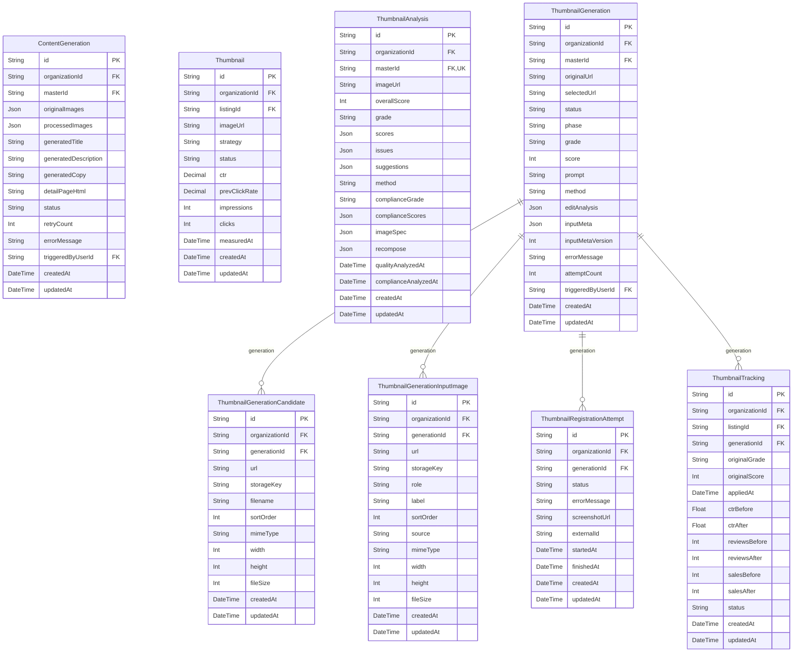

# AI ERD

> Generated from `prisma/models/*.prisma`. Do not edit by hand.
> Regenerate with `npm run db:erd` or `npm run graphify:schema`.

[Back to full ERD](../ERD.md)

## Models

| Model | Table | Description |
|---|---|---|
| ContentGeneration | `content_generations` | - |
| Thumbnail | `thumbnails` | CTR 기반 썸네일 트래킹 (ThumbnailAnalysis 와 별도 시스템). |
| ThumbnailAnalysis | `thumbnail_analyses` | 5차원 scores(heroShot·composition·branding·mobile·differentiation) + complianceGrade(PASS/WARN/FAIL) + imageSpec(사전검수). 스펙 FAIL 시 AI 호출 생략. |
| ThumbnailGeneration | `thumbnail_generations` | 상태: pending→generating→ready/failed→applied/skipped. method=edit 만 사용 (generate Imagen 방식 삭제됨). |
| ThumbnailGenerationCandidate | `thumbnail_generation_candidates` | 썸네일 생성 후보 이미지. 바이너리는 object storage 에 저장하고 DB 는 URL/key 메타데이터만 보관한다. |
| ThumbnailGenerationInputImage | `thumbnail_generation_input_images` | 썸네일 편집/생성 입력 이미지. base64 원문 대신 object storage 참조와 역할 메타데이터만 저장한다. |
| ThumbnailRegistrationAttempt | `thumbnail_registration_attempts` | Wing 등 외부 채널 등록 시도 이력. 마지막 상태만 덮어쓰지 않고 재시도/실패 원인을 보존한다. |
| ThumbnailTracking | `thumbnail_trackings` | - |

## Mermaid ER Diagram

## External References

| Local model | Relation | Direction | External domain | External model |
|---|---|---|---|---|
| ContentGeneration | master | references external | Core | MasterProduct |
| ContentGeneration | organization | references external | Core | Organization |
| ContentGeneration | triggeredByUser | references external | Core | User |
| Thumbnail | listing | references external | Core | ChannelListing |
| Thumbnail | organization | references external | Core | Organization |
| ThumbnailAnalysis | master | references external | Core | MasterProduct |
| ThumbnailAnalysis | organization | references external | Core | Organization |
| ThumbnailGeneration | master | references external | Core | MasterProduct |
| ThumbnailGeneration | organization | references external | Core | Organization |
| ThumbnailGeneration | triggeredByUser | references external | Core | User |
| ThumbnailGenerationCandidate | organization | references external | Core | Organization |
| ThumbnailGenerationInputImage | organization | references external | Core | Organization |
| ThumbnailRegistrationAttempt | organization | references external | Core | Organization |
| ThumbnailTracking | listing | references external | Core | ChannelListing |
| ThumbnailTracking | organization | references external | Core | Organization |
