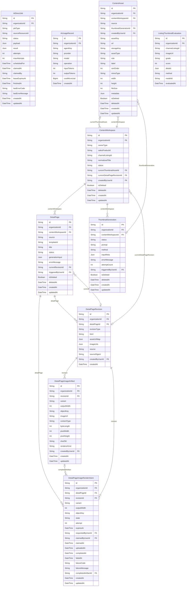

# AI ERD

> Generated from `prisma/models/*.prisma`. Do not edit by hand.
> Regenerate with `npm run db:erd` after Prisma schema changes.

[Back to full ERD](../ERD.md)

## Models

| Model | Table | Description |
|---|---|---|
| AiDirectJob | `ai_direct_jobs` | Durable queue and projection checkpoint for direct thumbnail, detail-page, and image-edit model work. |
| AiUsageRecord | `ai_usage_records` | Append-only metering of one Gemini call: tokens and an estimated cost, attributed to the agent whose request or job made it. Cost is null when the model has no registered price. |
| ContentAsset | `content_assets` | 워크스페이스가 소유한 관리 이미지 한 표(KID-313 W3a): 운영자 업로드 · AI 썸네일 후보 · 상세 이미지 · 몰 카탈로그 사진이 모두 여기 한 행이다. 대표이미지는 ContentWorkspace.current_thumbnail_asset_id 가 가리킨다. |
| ContentWorkspace | `content_workspaces` | Product content workspace owned by a sales product draft, its channel listing, or a direct detail page. |
| DetailPage | `detail_pages` | 상세 페이지 하나(KID-313 W3b, ← content_generations + detail_page_artifacts): AI 생성 · 직접 작성 · 올린 파일 · 가져오기(사방넷) 어느 것이든 한 행이고, 그 이력은 detail_page_revisions 다. 워크스페이스에 여럿 있을 수 있고 몰로 가는 것은 ContentWorkspace.current_detail_page_revision_id 하나다. |
| DetailPageImageArtifact | `detail_page_image_artifacts` | Durable single-JPEG marketplace rendition for one immutable detail-page revision and renderer variant. |
| DetailPageImageRenderIntent | `detail_page_image_render_intents` | Short-lived organization-scoped claim that binds a browser renderer to one exact detail-page revision and object key. |
| DetailPageRevision | `detail_page_revisions` | Append-only detail-page HTML revision. AI 결과(generated) · 편집(manual_edit) · 복제(duplicate) · 가져오기(imported)가 한 이력에 쌓이고, DetailPage.current_revision_id 와 ContentWorkspace.current_detail_page_revision_id 가 현재를 고른다. |
| ListingThumbnailEvaluation | `listing_thumbnail_evaluations` | 몰에 실제 등록된 리스팅 대표이미지 한 장당 평가 한 행(KID-313 W3a, Content 소유). channel_listing_id 는 교차 owner scalar id(FK 없음), image_url 은 channel_listings.image_url 그 시점 값. 이미지가 바뀌면 새 행이 생기고 옛 평가는 남는다. 규칙 검사는 저장하지 않고 계산한다. |
| ThumbnailGeneration | `thumbnail_generations` | 대표이미지 생성 job 하나(KID-313 W3a): status=pending/running/succeeded/failed/cancelled, method=generate/creative/auto/edit. 결과 후보는 content_assets(thumbnail_generation_id) 행이고 채택은 ContentWorkspace.current_thumbnail_asset_id 다. 입력 사진 · 편집 분석 · 원본 URL 은 input_meta 에 둔다. |

## Mermaid ER Diagram

```mermaid
erDiagram
  AiDirectJob {
    String id PK
    String organizationId FK
    String jobType
    String sourceResourceId
    String status
    Json payload
    Json result
    Int attempts
    Int maxAttempts
    DateTime scheduledFor
    DateTime claimedAt
    String claimedBy
    DateTime leaseExpiresAt
    DateTime finishedAt
    String lastErrorCode
    String lastErrorMessage
    DateTime createdAt
    DateTime updatedAt
  }
  AiUsageRecord {
    String id PK
    String organizationId FK
    String agentKey
    String provider
    String model
    String operation
    Int inputTokens
    Int outputTokens
    BigInt costMicroUsd
    DateTime createdAt
  }
  ContentAsset {
    String id PK
    String organizationId FK
    String contentWorkspaceId FK
    String source
    String thumbnailGenerationId FK
    String createdByUserId FK
    String assetKey
    String url
    String storageKey
    String assetType
    String role
    String label
    Int sortOrder
    String mimeType
    Int width
    Int height
    Int fileSize
    Json metadata
    Boolean isDeleted
    DateTime deletedAt
    DateTime createdAt
    DateTime updatedAt
  }
  ContentWorkspace {
    String id PK
    String organizationId FK
    String ownerType
    String salesProductId
    String channelListingId
    String normalizedTitle
    String status
    String currentThumbnailAssetId FK
    String currentDetailPageRevisionId FK
    String createdByUserId FK
    Boolean isDeleted
    DateTime deletedAt
    DateTime createdAt
    DateTime updatedAt
  }
  DetailPage {
    String id PK
    String organizationId FK
    String contentWorkspaceId FK
    String source
    String templateId
    String title
    String status
    Json generationInput
    String errorMessage
    String currentRevisionId FK
    String triggeredByUserId FK
    Boolean isDeleted
    DateTime deletedAt
    DateTime createdAt
    DateTime updatedAt
  }
  DetailPageImageArtifact {
    String id PK
    String organizationId FK
    String revisionId FK
    String variant
    Int outputWidth
    String objectKey
    String imageUrl
    String contentType
    Int byteLength
    Int pixelWidth
    Int pixelHeight
    String sha256
    String rendererKind
    String createdByUserId FK
    DateTime createdAt
    DateTime updatedAt
  }
  DetailPageImageRenderIntent {
    String id PK
    String organizationId FK
    String detailPageId FK
    String revisionId FK
    String variant
    Int outputWidth
    String objectKey
    String state
    Int attempt
    DateTime expiresAt
    String requestedByUserId FK
    String claimedByUserId FK
    DateTime claimedAt
    DateTime uploadedAt
    DateTime completedAt
    DateTime failedAt
    String failureCode
    String failureMessage
    String completedArtifactId FK
    DateTime createdAt
    DateTime updatedAt
  }
  DetailPageRevision {
    String id PK
    String organizationId FK
    String detailPageId FK
    String revisionType
    String html
    Json assetUrlMap
    Json imageUrls
    String source
    String sourceDigest
    String createdByUserId FK
    DateTime createdAt
  }
  ListingThumbnailEvaluation {
    String id PK
    String organizationId FK
    String channelListingId
    String imageUrl
    String grade
    Int score
    Json details
    String method
    String modelId
    DateTime evaluatedAt
  }
  ThumbnailGeneration {
    String id PK
    String organizationId FK
    String contentWorkspaceId FK
    String status
    String prompt
    String method
    Json inputMeta
    String errorMessage
    Int attemptCount
    String triggeredByUserId FK
    Boolean isDeleted
    DateTime deletedAt
    DateTime createdAt
    DateTime updatedAt
  }
  ContentAsset o|--o{ ContentWorkspace : "currentThumbnailAsset"
  ContentWorkspace ||--o{ ContentAsset : "contentWorkspace"
  ContentWorkspace ||--o{ DetailPage : "contentWorkspace"
  ContentWorkspace ||--o{ ThumbnailGeneration : "contentWorkspace"
  DetailPage ||--o{ DetailPageImageRenderIntent : "detailPage"
  DetailPage ||--o{ DetailPageRevision : "detailPage"
  DetailPageImageArtifact o|--o{ DetailPageImageRenderIntent : "completedArtifact"
  DetailPageRevision o|--o{ ContentWorkspace : "currentDetailPageRevision"
  DetailPageRevision o|--o{ DetailPage : "currentRevision"
  DetailPageRevision ||--o{ DetailPageImageArtifact : "revision"
  DetailPageRevision ||--o{ DetailPageImageRenderIntent : "revision"
  ThumbnailGeneration o|--o{ ContentAsset : "thumbnailGeneration"
```

## External References

| Local model | Relation | Direction | External domain | External model |
|---|---|---|---|---|
| AiDirectJob | organization | references external | Core | Organization |
| AiUsageRecord | organization | references external | Core | Organization |
| ContentAsset | createdByUser | references external | Core | User |
| ContentAsset | organization | references external | Core | Organization |
| ContentWorkspace | createdByUser | references external | Core | User |
| ContentWorkspace | organization | references external | Core | Organization |
| DetailPage | organization | references external | Core | Organization |
| DetailPage | triggeredByUser | references external | Core | User |
| DetailPageImageArtifact | createdBy | references external | Core | User |
| DetailPageImageArtifact | organization | references external | Core | Organization |
| DetailPageImageRenderIntent | claimedBy | references external | Core | User |
| DetailPageImageRenderIntent | organization | references external | Core | Organization |
| DetailPageImageRenderIntent | requestedBy | references external | Core | User |
| DetailPageRevision | createdByUser | references external | Core | User |
| DetailPageRevision | organization | references external | Core | Organization |
| ListingThumbnailEvaluation | organization | references external | Core | Organization |
| ThumbnailGeneration | organization | references external | Core | Organization |
| ThumbnailGeneration | triggeredByUser | references external | Core | User |
