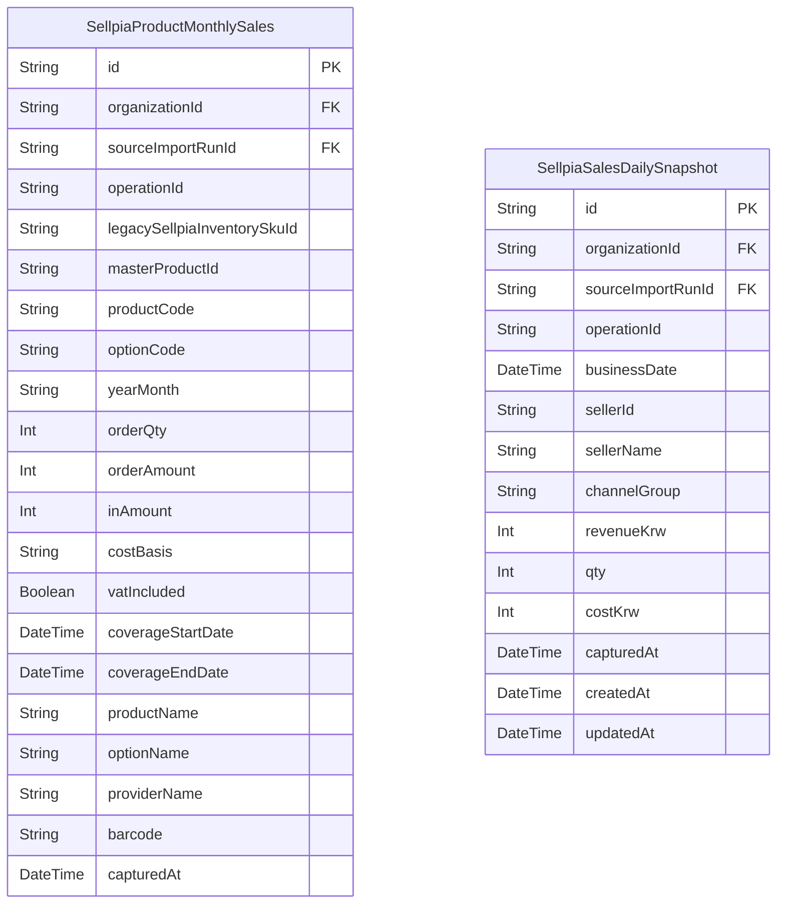

# Analytics ERD

> Generated from `prisma/models/*.prisma`. Do not edit by hand.
> Regenerate with `npm run db:erd` after Prisma schema changes.

[Back to full ERD](../ERD.md)

## Models

| Model | Table | Description |
|---|---|---|
| SellpiaProductMonthlySales | `sellpia_product_monthly_sales` | SellpiaProductMonthlySales canonical state owned by analytics. |
| SellpiaSalesDailySnapshot | `sellpia_sales_daily_snapshots` | SellpiaSalesDailySnapshot canonical state owned by analytics. |

## Mermaid ER Diagram

## External References

| Local model | Relation | Direction | External domain | External model |
|---|---|---|---|---|
| SellpiaProductMonthlySales | organization | references external | Core | Organization |
| SellpiaProductMonthlySales | sourceImportRun | references external | Core | SourceImportRun |
| SellpiaSalesDailySnapshot | organization | references external | Core | Organization |
| SellpiaSalesDailySnapshot | sourceImportRun | references external | Core | SourceImportRun |
