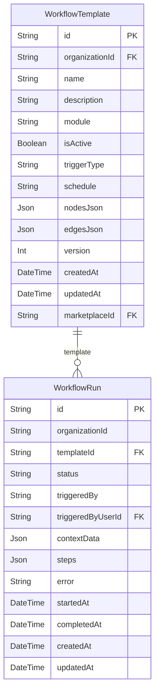

# Automation ERD

> Generated from `prisma/models/*.prisma`. Do not edit by hand.
> Regenerate with `npm run db:erd` after Prisma schema changes.

[Back to full ERD](../ERD.md)

## Models

| Model | Table | Description |
|---|---|---|
| WorkflowRun | `workflow_runs` | Durable deterministic workflow run. |
| WorkflowTemplate | `workflow_templates` | Deterministic workflow definition. |

## Mermaid ER Diagram

## External References

| Local model | Relation | Direction | External domain | External model |
|---|---|---|---|---|
| WorkflowRun | triggeredByUser | references external | Core | User |
| WorkflowTemplate | marketplace | references external | System | Marketplace |
| WorkflowTemplate | organization | references external | Core | Organization |
