# Channels ERD

> Generated from `prisma/models/*.prisma`. Do not edit by hand.
> Regenerate with `npm run db:erd` or `npm run graphify:schema`.

[Back to full ERD](../ERD.md)

## Models

| Model | Table | Description |
|---|---|---|
| ChannelAccountDailyKpiSnapshot | `channel_account_daily_kpi_snapshots` | 채널 계정/스토어 단위 KPI 일별 정규화 fact (listing 에 귀속되지 않는 dashboard KPI 용). |
| ChannelAdTargetDailySnapshot | `channel_ad_target_daily_snapshots` | 채널 광고 타겟(캠페인/키워드/상품)의 일별 정규화 fact. 기간 view 는 SUM 으로 derive. |
| ChannelListingDailySnapshot | `channel_listing_daily_snapshots` | 채널 listing 의 일별 정규화 상태. 반복 scrape 는 businessDate row 를 upsert. |
| ChannelListingOptionDailySnapshot | `channel_listing_option_daily_snapshots` | 채널 listing option/vendor item 의 일별 정규화 상태. |
| ChannelScrapeChunk | `channel_scrape_chunks` | Browser catalog collection payloads kept in JSONB until an atomic publication succeeds. |
| ChannelScrapeRun | `channel_scrape_runs` | 채널별 상품/광고/트래픽 스크래핑 실행 단위. 원본 row 는 ChannelScrapeSnapshot 에 저장. |
| ChannelScrapeSnapshot | `channel_scrape_snapshots` | 채널 스크래퍼/API 가 본 원본 row. 매칭 실패/파서 변경 대비 rawJson 을 보존. |
| ChannelSkuComponent | `channel_sku_components` | Confirmed channel-SKU recipe. mappingSource: product_code \| barcode \| manual. |
| RocketPurchaseOrder | `rocket_purchase_orders` | 쿠팡 로켓 발주 단건(per-PO) 상세 — 매출분석 드릴다운(일자→발주→품목)용. items 는 발주서 품목(SKU) 라인 JSON(표시 전용). |
| RocketSupplyDailySnapshot | `rocket_supply_daily_snapshots` | 쿠팡 로켓(공급사 발주) 일별 매출 fact. po-web 발주리스트의 발주금액(공급가)을 입고예정일(KST) 기준으로 집계한 값으로, 윙 매출과 분리된 로켓 매출 소스. |

## Mermaid ER Diagram

```mermaid
erDiagram
  ChannelAccountDailyKpiSnapshot {
    String id PK
    String organizationId FK
    String channelAccountId FK
    String channel
    String source
    String kpiType
    DateTime businessDate
    DateTime periodStart
    DateTime periodEnd
    Json normalizedJson
    Json rawJson
    String rawSnapshotId FK
    Int sampleCount
    DateTime firstObservedAt
    DateTime lastObservedAt
    DateTime createdAt
    DateTime updatedAt
  }
  ChannelAdTargetDailySnapshot {
    String id PK
    String organizationId FK
    String channel
    DateTime businessDate
    String listingId FK
    String listingOptionId FK
    String externalId
    String externalOptionId
    String targetType
    String targetKey
    String campaignId
    String campaignName
    String adGroup
    String keyword
    String placement
    String status
    String onOff
    Int currentBid
    Int dailyBudget
    Int spend
    Int revenue
    Int impressions
    Int clicks
    Int conversions
    Int orders
    Int adSpend
    Int adRevenue
    String rawSnapshotId FK
    Json metaJson
    Int sampleCount
    DateTime firstObservedAt
    DateTime lastObservedAt
    DateTime createdAt
    DateTime updatedAt
  }
  ChannelListingDailySnapshot {
    String id PK
    String organizationId FK
    String listingId FK
    String channel
    String externalId
    DateTime businessDate
    String productName
    String status
    String exposureStatus
    String saleStatus
    Int channelPrice
    Int reviewCount
    Decimal avgRating
    Boolean isOfferWinner
    Int myPrice
    Int winnerPrice
    Int winnerGapPrice
    Int productRank
    Int categoryRank
    Int adSpend
    Int adRevenue
    Int adImpressions
    Int adClicks
    Int adConversions
    Int adOrders
    Int adDirectOrders1d
    Int adIndirectOrders1d
    Int adDirectQty1d
    Int adIndirectQty1d
    Int adDirectRevenue1d
    Int adIndirectRevenue1d
    Int adTotalOrders14d
    Int adDirectOrders14d
    Int adIndirectOrders14d
    Int adTotalQty14d
    Int adDirectQty14d
    Int adIndirectQty14d
    Int adTotalRevenue14d
    Int adDirectRevenue14d
    Int adIndirectRevenue14d
    Int trafficVisitors
    Int trafficViews
    Int trafficCartAdds
    Int trafficOrders
    Int trafficSalesQty
    Int trafficRevenue
    Int sampleCount
    DateTime firstObservedAt
    DateTime lastObservedAt
    String rawSnapshotId FK
    Json metaJson
    DateTime createdAt
    DateTime updatedAt
  }
  ChannelListingOptionDailySnapshot {
    String id PK
    String organizationId FK
    String listingId FK
    String listingOptionId FK
    String channel
    String externalId
    String externalOptionId
    DateTime businessDate
    String optionName
    Int salePrice
    Int stockQty
    String saleStatus
    Boolean isActive
    Boolean isOfferWinner
    Int myPrice
    Int winnerPrice
    Int winnerGapPrice
    Int sampleCount
    DateTime firstObservedAt
    DateTime lastObservedAt
    String rawSnapshotId FK
    Json metaJson
    DateTime createdAt
    DateTime updatedAt
  }
  ChannelScrapeChunk {
    String id PK
    String organizationId FK
    String scrapeRunId FK
    String kind
    Int sequence
    String checksum
    Int itemCount
    Json payload
    DateTime publishedAt
    Json publicationJson
    DateTime createdAt
    DateTime updatedAt
  }
  ChannelScrapeRun {
    String id PK
    String organizationId FK
    String channelAccountId FK
    String clientRunKey
    String sourceImportRunId FK
    String channel
    String source
    String pageType
    DateTime businessDate
    DateTime periodStart
    DateTime periodEnd
    String status
    String targetUrl
    String period
    String parserVersion
    Int rowCount
    Int matchedCount
    Int unmatchedCount
    Int errorCount
    DateTime startedAt
    DateTime finishedAt
    DateTime createdAt
    DateTime updatedAt
    Json metaJson
    Json errorJson
  }
  ChannelScrapeSnapshot {
    String id PK
    String organizationId FK
    String scrapeRunId FK
    String channel
    String source
    String pageType
    DateTime businessDate
    DateTime observedAt
    String externalId
    String externalOptionId
    String listingId FK
    String listingOptionId FK
    String matchStatus
    String matchReason
    String rowHash
    Json rawJson
    Json normalizedJson
    DateTime createdAt
  }
  ChannelSkuComponent {
    String id PK
    String organizationId FK
    String channelSkuId FK
    String masterProductId FK
    Int quantity
    String mappingSource
    String createdBy
    DateTime createdAt
    DateTime updatedAt
  }
  RocketPurchaseOrder {
    String id PK
    String organizationId FK
    Int poSeq
    DateTime businessDate
    DateTime orderedAt
    String status
    String vendorName
    String centerName
    String firstSkuName
    Int skuCount
    Int orderQty
    Int orderAmount
    Json items
    DateTime createdAt
    DateTime updatedAt
  }
  RocketSupplyDailySnapshot {
    String id PK
    String organizationId FK
    DateTime businessDate
    Int revenueKrw
    Int poCount
    Int itemQty
    String source
    Json rawJson
    DateTime createdAt
    DateTime updatedAt
  }
  ChannelScrapeRun ||--o{ ChannelScrapeChunk : "scrapeRun"
  ChannelScrapeRun o|--o{ ChannelScrapeSnapshot : "scrapeRun"
  ChannelScrapeSnapshot o|--o{ ChannelAccountDailyKpiSnapshot : "rawSnapshot"
  ChannelScrapeSnapshot o|--o{ ChannelAdTargetDailySnapshot : "rawSnapshot"
  ChannelScrapeSnapshot o|--o{ ChannelListingDailySnapshot : "rawSnapshot"
  ChannelScrapeSnapshot o|--o{ ChannelListingOptionDailySnapshot : "rawSnapshot"
```

## External References

| Local model | Relation | Direction | External domain | External model |
|---|---|---|---|---|
| ChannelAccountDailyKpiSnapshot | channelAccount | references external | Core | ChannelAccount |
| ChannelAccountDailyKpiSnapshot | organization | references external | Core | Organization |
| ChannelAdTargetDailySnapshot | adTargetDaily | referenced by external | Advertising | AdAction |
| ChannelAdTargetDailySnapshot | listing | references external | Core | ChannelListing |
| ChannelAdTargetDailySnapshot | listingOption | references external | Core | ChannelListingOption |
| ChannelAdTargetDailySnapshot | organization | references external | Core | Organization |
| ChannelListingDailySnapshot | listing | references external | Core | ChannelListing |
| ChannelListingDailySnapshot | organization | references external | Core | Organization |
| ChannelListingOptionDailySnapshot | listing | references external | Core | ChannelListing |
| ChannelListingOptionDailySnapshot | listingOption | references external | Core | ChannelListingOption |
| ChannelListingOptionDailySnapshot | organization | references external | Core | Organization |
| ChannelScrapeChunk | organization | references external | Core | Organization |
| ChannelScrapeRun | channelAccount | references external | Core | ChannelAccount |
| ChannelScrapeRun | organization | references external | Core | Organization |
| ChannelScrapeRun | sourceImportRun | references external | Core | SourceImportRun |
| ChannelScrapeSnapshot | listing | references external | Core | ChannelListing |
| ChannelScrapeSnapshot | listingOption | references external | Core | ChannelListingOption |
| ChannelScrapeSnapshot | organization | references external | Core | Organization |
| ChannelSkuComponent | channelSku | references external | Core | ChannelListingOption |
| ChannelSkuComponent | masterProduct | references external | Core | MasterProduct |
| ChannelSkuComponent | organization | references external | Core | Organization |
| RocketPurchaseOrder | organization | references external | Core | Organization |
| RocketSupplyDailySnapshot | organization | references external | Core | Organization |
