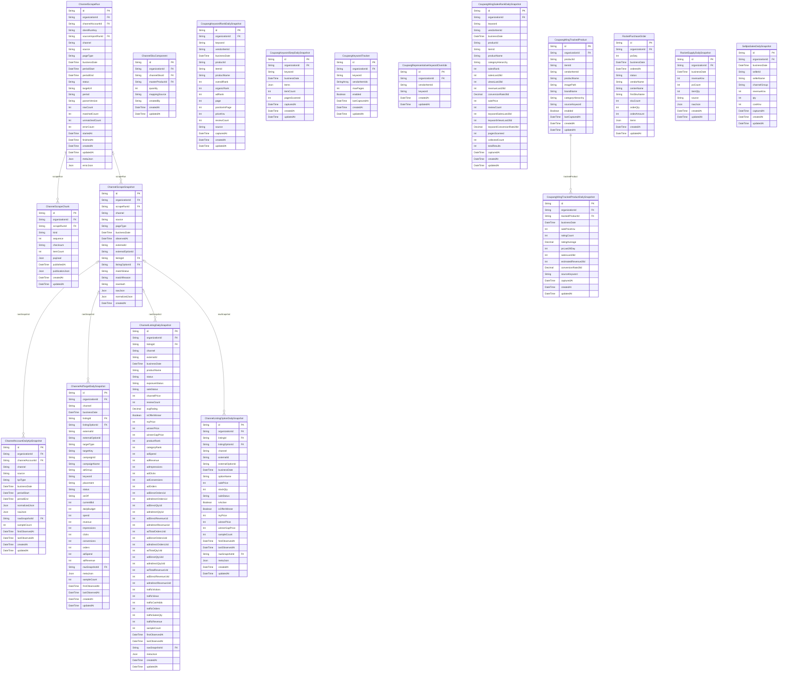

# Channels ERD

> Generated from `prisma/models/*.prisma`. Do not edit by hand.
> Regenerate with `npm run db:erd` or `npm run graphify:schema`.

[Back to full ERD](../ERD.md)

## Models

| Model | Table | Description |
|---|---|---|
| ChannelAccountDailyKpiSnapshot | `channel_account_daily_kpi_snapshots` | 채널 계정/스토어 단위 KPI 일별 정규화 fact (listing 에 귀속되지 않는 dashboard KPI 용). |
| ChannelAdTargetDailySnapshot | `channel_ad_target_daily_snapshots` | 채널 광고 타겟(캠페인/키워드/상품)의 일별 정규화 fact. 기간 view 는 SUM 으로 derive. |
| ChannelListingDailySnapshot | `channel_listing_daily_snapshots` | 채널 listing 의 일별 정규화 상태. 반복 scrape 는 businessDate row 를 upsert. |
| ChannelListingOptionDailySnapshot | `channel_listing_option_daily_snapshots` | 채널 listing option/vendor item 의 일별 정규화 상태. |
| ChannelScrapeChunk | `channel_scrape_chunks` | Browser catalog collection payloads kept in JSONB until an atomic publication succeeds. |
| ChannelScrapeRun | `channel_scrape_runs` | 채널별 상품/광고/트래픽 스크래핑 실행 단위. 원본 row 는 ChannelScrapeSnapshot 에 저장. |
| ChannelScrapeSnapshot | `channel_scrape_snapshots` | 채널 스크래퍼/API 가 본 원본 row. 매칭 실패/파서 변경 대비 rawJson 을 보존. |
| ChannelSkuComponent | `channel_sku_components` | Confirmed channel-SKU recipe. mappingSource: product_code \| barcode \| manual. |
| CoupangKeywordRankDailySnapshot | `coupang_keyword_rank_daily_snapshots` | 쿠팡 검색 키워드×상품(vendorItemId) 일별 순위 fact. 순위 null = 스캔한 페이지 내 미노출(순위권 밖). overallRank 는 광고 포함 전체 순위, organicRank 는 오가닉만, adRank 는 광고만 센 순위. |
| CoupangKeywordSerpDailySnapshot | `coupang_keyword_serp_daily_snapshots` | 쿠팡 검색 키워드별 SERP 전체 캡처(키워드-일자당 최신본 upsert). items 는 DOM 순서 그대로의 결과 리스트 JSON — 경쟁사 노출 확인·순위 재계산용. |
| CoupangKeywordTracker | `coupang_keyword_trackers` | 쿠팡 검색 키워드별 자사 상품 순위 추적 대상. 확장이 www.coupang.com 검색결과(SERP)를 수집할 키워드 정의. vendorItemIds 는 명시 추적 타깃(빈 배열 = 자사 카탈로그 자동매칭만). |
| CoupangRepresentativeKeywordOverride | `coupang_representative_keyword_overrides` | 자사 쿠팡 상품(vendorItemId)별 사용자가 직접 지정한 대표 검색 키워드. 없으면 쿠팡 카테고리와 Wing 28일 지표로 자동 추천한다. |
| CoupangWingSalesRankDailySnapshot | `coupang_wing_sales_rank_daily_snapshots` | Wing 상품 매칭 API의 키워드별 최근 28일 판매량순에서 자사 vendorItemId가 차지한 일별 순위. salesRank null은 수집 범위 밖이며 판매량·조회·매출 지표도 같은 Wing 응답에서 저장한다. |
| CoupangWingTrackedProduct | `coupang_wing_tracked_products` | 쿠팡 Wing 카탈로그 경쟁상품 추적 대상. 상품분석(wing-catalog)에서 사용자가 추적 등록한 카탈로그 상품(자사/경쟁 무관). sourceKeyword = 지표 갱신 시 재검색할 키워드. |
| CoupangWingTrackedProductDailySnapshot | `coupang_wing_tracked_product_daily_snapshots` | 쿠팡 Wing 추적상품 일별 지표 스냅샷(상품×일자당 최신본 upsert). Wing 카탈로그 28일 지표(클릭 pv·판매·매출·전환) + 판매가·리뷰. |
| RocketPurchaseOrder | `rocket_purchase_orders` | 쿠팡 로켓 발주 단건(per-PO) 상세 — 매출분석 드릴다운(일자→발주→품목)용. items 는 발주서 품목(SKU) 라인 JSON(표시 전용). |
| RocketSupplyDailySnapshot | `rocket_supply_daily_snapshots` | 쿠팡 로켓(공급사 발주) 일별 매출 fact. po-web 발주리스트의 발주금액(공급가)을 입고예정일(KST) 기준으로 집계한 값으로, 윙 매출과 분리된 로켓 매출 소스. |
| SellpiaSalesDailySnapshot | `sellpia_sales_daily_snapshots` | Sellpia 판매현황(sale_summary) 몰별·일별 매출 fact. order_search.ajax.html(mode=selldate, 주문일자 기준)에서 판매처(seller)별로 수집. channelGroup 으로 rocket(쿠팡-직배송) / others(쿠팡윙+기타 전체몰) 버킷을 구분해 대시보드 '몰별 매출' 섹션에 표시한다. price=판매금액, buy_price=매입금액, amount=판매수량. |

## Mermaid ER Diagram

## External References

| Local model | Relation | Direction | External domain | External model |
|---|---|---|---|---|
| ChannelAccountDailyKpiSnapshot | channelAccount | references external | Core | ChannelAccount |
| ChannelAccountDailyKpiSnapshot | organization | references external | Core | Organization |
| ChannelAdTargetDailySnapshot | adTargetDaily | referenced by external | Advertising | AdAction |
| ChannelAdTargetDailySnapshot | listing | references external | Core | ChannelListing |
| ChannelAdTargetDailySnapshot | listingOption | references external | Core | ChannelListingOption |
| ChannelAdTargetDailySnapshot | organization | references external | Core | Organization |
| ChannelListingDailySnapshot | listing | references external | Core | ChannelListing |
| ChannelListingDailySnapshot | organization | references external | Core | Organization |
| ChannelListingOptionDailySnapshot | listing | references external | Core | ChannelListing |
| ChannelListingOptionDailySnapshot | listingOption | references external | Core | ChannelListingOption |
| ChannelListingOptionDailySnapshot | organization | references external | Core | Organization |
| ChannelScrapeChunk | organization | references external | Core | Organization |
| ChannelScrapeRun | channelAccount | references external | Core | ChannelAccount |
| ChannelScrapeRun | organization | references external | Core | Organization |
| ChannelScrapeRun | sourceImportRun | references external | Core | SourceImportRun |
| ChannelScrapeSnapshot | listing | references external | Core | ChannelListing |
| ChannelScrapeSnapshot | listingOption | references external | Core | ChannelListingOption |
| ChannelScrapeSnapshot | organization | references external | Core | Organization |
| ChannelSkuComponent | channelSku | references external | Core | ChannelListingOption |
| ChannelSkuComponent | masterProduct | references external | Core | MasterProduct |
| ChannelSkuComponent | organization | references external | Core | Organization |
| CoupangKeywordRankDailySnapshot | organization | references external | Core | Organization |
| CoupangKeywordSerpDailySnapshot | organization | references external | Core | Organization |
| CoupangKeywordTracker | organization | references external | Core | Organization |
| CoupangRepresentativeKeywordOverride | organization | references external | Core | Organization |
| CoupangWingSalesRankDailySnapshot | organization | references external | Core | Organization |
| CoupangWingTrackedProduct | organization | references external | Core | Organization |
| CoupangWingTrackedProductDailySnapshot | organization | references external | Core | Organization |
| RocketPurchaseOrder | organization | references external | Core | Organization |
| RocketSupplyDailySnapshot | organization | references external | Core | Organization |
| SellpiaSalesDailySnapshot | organization | references external | Core | Organization |
