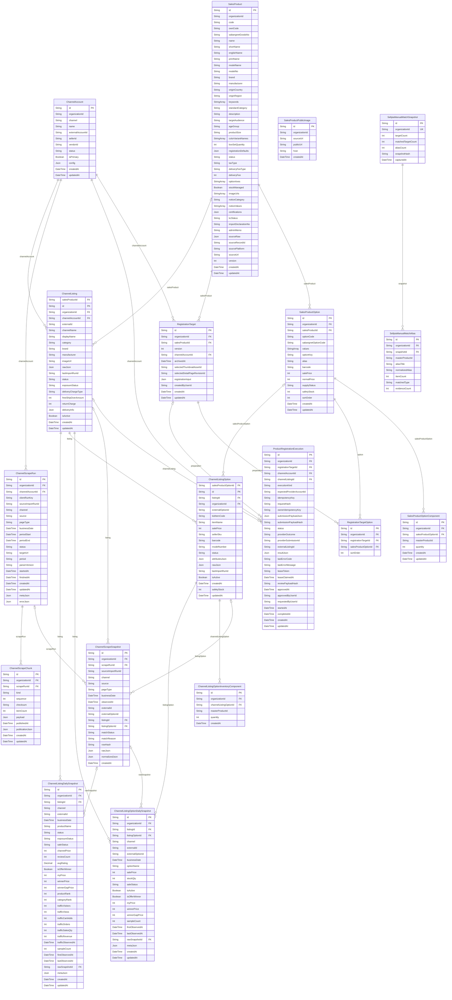

# Channels ERD

> Generated from `prisma/models/*.prisma`. Do not edit by hand.
> Regenerate with `npm run db:erd` after Prisma schema changes.

[Back to full ERD](../ERD.md)

## Models

| Model | Table | Description |
|---|---|---|
| ChannelAccount | `channel_accounts` | ChannelAccount canonical state owned by channels. |
| ChannelListing | `channel_listings` | ChannelListing canonical state owned by channels. |
| ChannelListingDailySnapshot | `channel_listing_daily_snapshots` | 채널 listing 의 일별 정규화 상태. 반복 scrape 는 businessDate row 를 upsert. |
| ChannelListingOption | `channel_listing_options` | ChannelListingOption canonical state owned by channels. |
| ChannelListingOptionDailySnapshot | `channel_listing_option_daily_snapshots` | 채널 listing option/vendor item 의 일별 정규화 상태. |
| ChannelListingOptionInventoryComponent | `channel_listing_option_inventory_components` | ChannelListingOptionInventoryComponent canonical state owned by channels. |
| ChannelScrapeChunk | `channel_scrape_chunks` | Browser catalog collection payloads kept in JSONB until an atomic publication succeeds. |
| ChannelScrapeRun | `channel_scrape_runs` | 채널별 상품/광고/트래픽 스크래핑 실행 단위. 원본 row 는 ChannelScrapeSnapshot 에 저장. |
| ChannelScrapeSnapshot | `channel_scrape_snapshots` | 채널 스크래퍼/API 가 본 원본 row. 매칭 실패/파서 변경 대비 rawJson 을 보존. |
| ProductRegistrationExecution | `product_registration_executions` | One frozen registration intent. A reusable target has many executions; one active execution per target and idempotent requests prevent duplicate submissions (ADR-0020). |
| RegistrationTarget | `registration_targets` | Persistent registration target with explicit marketplace overrides. Executions freeze submitted values separately (ADR-0020). |
| RegistrationTargetOption | `registration_target_options` | Selected common option and explicit price overrides for one persistent registration target. |
| SalesProduct | `sales_products` | Channels-owned common selling product identified by its KID. Reusable registration targets select its options and override its defaults; inventory and ABC remain Products-owned (ADR-0020). |
| SalesProductOption | `sales_product_options` | Selling composition with a stable UUID, issued KID and final option price. Its template is not operational inventory; confirmed channel recipes own that composition (ADR-0020). |
| SalesProductOptionComponent | `sales_product_option_components` | Declared source composition for a selling option. Applied to an empty channel recipe only by an explicit request; never a capacity source (ADR-0020). |
| SalesProductPublicImage | `sales_product_public_images` | Public copy of a sales-product image or detail image that malls can download (우리 저장소는 사무실 밖에서 열리지 않는다). Keyed by our storage URL; the sales product keeps its own URL and mall bulk sheets use the copy (ADR-0014). |
| SellpiaManualMatchAlias | `sellpia_manual_match_aliases` | Exact normalized marketplace-title evidence linking one historical Sellpia manual match to an active physical SKU and positive unit quantity. |
| SellpiaManualMatchSnapshot | `sellpia_manual_match_snapshots` | Current organization-scoped, read-only Sellpia manual-match evidence restricted to exact aliases used by current channel listings. |

## Mermaid ER Diagram

```mermaid
erDiagram
  ChannelAccount {
    String id PK
    String organizationId
    String channel
    String name
    String externalAccountId
    String sellerId
    String vendorId
    String status
    Boolean isPrimary
    Json config
    DateTime createdAt
    DateTime updatedAt
  }
  ChannelListing {
    String salesProductId FK
    String id PK
    String organizationId FK
    String channelAccountId FK
    String externalId
    String channelName
    String displayName
    String category
    String brand
    String manufacturer
    String imageUrl
    Json rawJson
    String lastImportRunId
    String status
    String exposureStatus
    String deliveryChargeType
    Int freeShipOverAmount
    Int returnCharge
    Json deliveryInfo
    Boolean isActive
    DateTime createdAt
    DateTime updatedAt
  }
  ChannelListingDailySnapshot {
    String id PK
    String organizationId FK
    String listingId FK
    String channel
    String externalId
    DateTime businessDate
    String productName
    String status
    String exposureStatus
    String saleStatus
    Int channelPrice
    Int reviewCount
    Decimal avgRating
    Boolean isOfferWinner
    Int myPrice
    Int winnerPrice
    Int winnerGapPrice
    Int productRank
    Int categoryRank
    Int trafficVisitors
    Int trafficViews
    Int trafficCartAdds
    Int trafficOrders
    Int trafficSalesQty
    Int trafficRevenue
    DateTime trafficObservedAt
    Int sampleCount
    DateTime firstObservedAt
    DateTime lastObservedAt
    String rawSnapshotId FK
    Json metaJson
    DateTime createdAt
    DateTime updatedAt
  }
  ChannelListingOption {
    String salesProductOptionId FK
    String id PK
    String listingId FK
    String organizationId FK
    String externalOptionId
    String kidItemCode
    String itemName
    Int salePrice
    String sellerSku
    String barcode
    String modelNumber
    String status
    Json attributesJson
    Json rawJson
    String lastImportRunId
    Boolean isActive
    DateTime createdAt
    Int safetyStock
    DateTime updatedAt
  }
  ChannelListingOptionDailySnapshot {
    String id PK
    String organizationId FK
    String listingId FK
    String listingOptionId FK
    String channel
    String externalId
    String externalOptionId
    DateTime businessDate
    String optionName
    Int salePrice
    Int stockQty
    String saleStatus
    Boolean isActive
    Boolean isOfferWinner
    Int myPrice
    Int winnerPrice
    Int winnerGapPrice
    Int sampleCount
    DateTime firstObservedAt
    DateTime lastObservedAt
    String rawSnapshotId FK
    Json metaJson
    DateTime createdAt
    DateTime updatedAt
  }
  ChannelListingOptionInventoryComponent {
    String id PK
    String organizationId FK
    String channelListingOptionId FK
    String masterProductId
    Int quantity
    DateTime createdAt
  }
  ChannelScrapeChunk {
    String id PK
    String organizationId FK
    String scrapeRunId FK
    String kind
    Int sequence
    String checksum
    Int itemCount
    Json payload
    DateTime publishedAt
    Json publicationJson
    DateTime createdAt
    DateTime updatedAt
  }
  ChannelScrapeRun {
    String id PK
    String organizationId FK
    String channelAccountId FK
    String clientRunKey
    String sourceImportRunId
    String channel
    String source
    String pageType
    DateTime businessDate
    DateTime periodStart
    DateTime periodEnd
    String status
    String targetUrl
    String period
    String parserVersion
    DateTime startedAt
    DateTime finishedAt
    DateTime createdAt
    DateTime updatedAt
    Json metaJson
    Json errorJson
  }
  ChannelScrapeSnapshot {
    String id PK
    String organizationId FK
    String scrapeRunId FK
    String sourceImportRunId
    String channel
    String source
    String pageType
    DateTime businessDate
    DateTime observedAt
    String externalId
    String externalOptionId
    String listingId FK
    String listingOptionId FK
    String matchStatus
    String matchReason
    String rowHash
    Json rawJson
    Json normalizedJson
    DateTime createdAt
  }
  ProductRegistrationExecution {
    String id PK
    String organizationId FK
    String registrationTargetId FK
    String channelAccountId FK
    String channelListingId FK
    String executionKind
    String expectedProviderAccountId
    String idempotencyKey
    String requestHash
    String ownerIdempotencyKey
    Json submissionPayloadJson
    String submissionPayloadHash
    String status
    String providerOutcome
    String providerSubmissionId
    String externalListingId
    Json resultJson
    String lastErrorCode
    String lastErrorMessage
    String leaseToken
    DateTime leaseClaimedAt
    String reviewPayloadHash
    DateTime approvedAt
    String approvedByUserId
    String requestedByUserId
    DateTime startedAt
    DateTime completedAt
    DateTime createdAt
    DateTime updatedAt
  }
  RegistrationTarget {
    String id PK
    String organizationId FK
    String salesProductId FK
    Int version
    String channelAccountId FK
    DateTime archivedAt
    String selectedThumbnailAssetId
    String selectedDetailPageRevisionId
    Json registrationInput
    String createdByUserId
    DateTime createdAt
    DateTime updatedAt
  }
  RegistrationTargetOption {
    String id PK
    String organizationId FK
    String registrationTargetId FK
    String salesProductOptionId FK
    Int sortOrder
  }
  SalesProduct {
    String id PK
    String organizationId
    String code
    String ownCode
    String sabangnetGoodsNo
    String name
    String shortName
    String englishName
    String printName
    String modelName
    String modelNo
    String brand
    String manufacturer
    String originCountry
    String originRegion
    StringArray keywords
    String standardCategory
    String description
    String targetAudience
    String ageGroup
    String productSize
    StringArray colorVariantNames
    Int boxSetQuantity
    Json registrationDefaults
    String status
    String taxType
    String deliveryFeeType
    Int deliveryFee
    StringArray optionAxes
    Boolean stockManaged
    StringArray imageUrls
    String noticeCategory
    StringArray noticeValues
    Json certifications
    String kcStatus
    String importDeclarationNo
    String adminMemo
    Json sourceRaw
    String sourceRecordId
    String sourcePlatform
    String sourceUrl
    Int version
    DateTime createdAt
    DateTime updatedAt
  }
  SalesProductOption {
    String id PK
    String organizationId FK
    String salesProductId FK
    String optionCode
    String sabangnetOptionCode
    StringArray values
    String optionKey
    String alias
    String barcode
    Int salePrice
    Int normalPrice
    String supplyStatus
    Int safetyStock
    Int sortOrder
    DateTime createdAt
    DateTime updatedAt
  }
  SalesProductOptionComponent {
    String id PK
    String organizationId FK
    String salesProductOptionId FK
    String masterProductId
    Int quantity
    DateTime createdAt
    DateTime updatedAt
  }
  SalesProductPublicImage {
    String id PK
    String organizationId
    String sourceUrl
    String publicUrl
    String host
    DateTime createdAt
  }
  SellpiaManualMatchAlias {
    String id PK
    String organizationId FK
    String snapshotId FK
    String masterProductId
    String aliasTitle
    String normalizedAlias
    Int itemCount
    String matchedType
    Int evidenceCount
  }
  SellpiaManualMatchSnapshot {
    String id PK
    String organizationId UK
    Int targetCount
    Int matchedTargetCount
    Int aliasCount
    String snapshotHash
    DateTime capturedAt
  }
  ChannelAccount ||--o{ ChannelListing : "channelAccount"
  ChannelAccount ||--o{ ChannelScrapeRun : "channelAccount"
  ChannelAccount ||--o{ ProductRegistrationExecution : "channelAccount"
  ChannelAccount ||--o{ RegistrationTarget : "channelAccount"
  ChannelListing ||--o{ ChannelListingDailySnapshot : "listing"
  ChannelListing ||--o{ ChannelListingOption : "listing"
  ChannelListing ||--o{ ChannelListingOptionDailySnapshot : "listing"
  ChannelListing o|--o{ ChannelScrapeSnapshot : "listing"
  ChannelListing o|--o{ ProductRegistrationExecution : "channelListing"
  ChannelListingOption ||--o{ ChannelListingOptionDailySnapshot : "listingOption"
  ChannelListingOption ||--o{ ChannelListingOptionInventoryComponent : "channelListingOption"
  ChannelListingOption o|--o{ ChannelScrapeSnapshot : "listingOption"
  ChannelScrapeRun ||--o{ ChannelScrapeChunk : "scrapeRun"
  ChannelScrapeRun o|--o{ ChannelScrapeSnapshot : "scrapeRun"
  ChannelScrapeSnapshot o|--o{ ChannelListingDailySnapshot : "rawSnapshot"
  ChannelScrapeSnapshot o|--o{ ChannelListingOptionDailySnapshot : "rawSnapshot"
  RegistrationTarget o|--o{ ProductRegistrationExecution : "preparation"
  RegistrationTarget ||--o{ RegistrationTargetOption : "preparation"
  SalesProduct o|--o{ ChannelListing : "salesProduct"
  SalesProduct ||--o{ RegistrationTarget : "salesProduct"
  SalesProduct ||--o{ SalesProductOption : "salesProduct"
  SalesProductOption o|--o{ ChannelListingOption : "salesProductOption"
  SalesProductOption ||--o{ RegistrationTargetOption : "option"
  SalesProductOption ||--o{ SalesProductOptionComponent : "salesProductOption"
  SellpiaManualMatchSnapshot ||--o{ SellpiaManualMatchAlias : "snapshot"
```

## External References

No external references.
