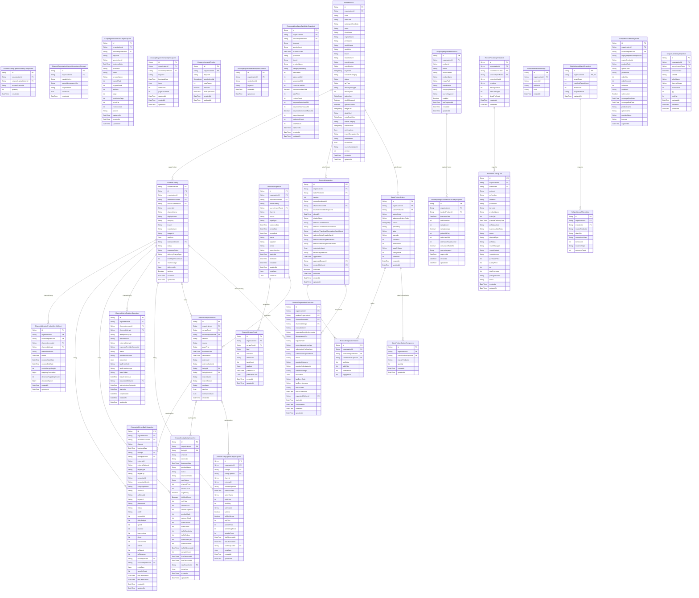

# Channels ERD

> Generated from `prisma/models/*.prisma`. Do not edit by hand.
> Regenerate with `npm run db:erd` after Prisma schema changes.

[Back to full ERD](../ERD.md)

## Models

| Model | Table | Description |
|---|---|---|
| ChannelAdListingProductMonthlyFact | `channel_ad_listing_product_monthly_facts` | Immutable monthly recipe basis and integer-KRW allocation for one completed advertising source generation. |
| ChannelAdTargetDailySnapshot | `channel_ad_target_daily_snapshots` | 채널 광고 타겟(캠페인/키워드/상품)의 일별 정규화 fact. 기간 view 는 SUM 으로 derive. |
| ChannelListing | `channel_listings` | 채널에 올라간 판매 등록상품. 쿠팡 등록상품ID, 네이버 상품번호 등. |
| ChannelListingDailySnapshot | `channel_listing_daily_snapshots` | 채널 listing 의 일별 정규화 상태. 반복 scrape 는 businessDate row 를 upsert. |
| ChannelListingDeletionOperation | `channel_listing_deletion_operations` | Channel listing 삭제의 provider side effect 실행 기록. 삭제 대상 외부 listing identity를 요청 시점에 동결한다. |
| ChannelListingOptionDailySnapshot | `channel_listing_option_daily_snapshots` | 채널 listing option/vendor item 의 일별 정규화 상태. |
| ChannelListingOptionInventoryComponent | `channel_listing_option_inventory_components` | Confirmed source-product quantities for one channel sellable option. |
| ChannelRegistrationOwnerIdempotencyReceipt | `channel_registration_owner_idempotency_receipts` | Agent-triggered registration mutation receipt keyed by the exact Channels owner input, atomically retained with local listing resolution. |
| ChannelScrapeChunk | `channel_scrape_chunks` | Browser catalog collection payloads kept in JSONB until an atomic publication succeeds. |
| ChannelScrapeRun | `channel_scrape_runs` | 채널별 상품/광고/트래픽 스크래핑 실행 단위. 원본 row 는 ChannelScrapeSnapshot 에 저장. |
| ChannelScrapeSnapshot | `channel_scrape_snapshots` | 채널 스크래퍼/API 가 본 원본 row. 매칭 실패/파서 변경 대비 rawJson 을 보존. |
| CoupangKeywordRankDailySnapshot | `coupang_keyword_rank_daily_snapshots` | 쿠팡 검색 키워드×상품(vendorItemId) 일별 순위 fact. 순위 null = 스캔한 페이지 내 미노출(순위권 밖). overallRank 는 광고 포함 전체 순위, organicRank 는 오가닉만, adRank 는 광고만 센 순위. |
| CoupangKeywordSerpDailySnapshot | `coupang_keyword_serp_daily_snapshots` | 쿠팡 검색 키워드별 SERP 전체 캡처(키워드-일자당 최신본 upsert). items 는 DOM 순서 그대로의 결과 리스트 JSON — 경쟁사 노출 확인·순위 재계산용. |
| CoupangKeywordTracker | `coupang_keyword_trackers` | 쿠팡 검색 키워드별 자사 상품 순위 추적 대상. 확장이 www.coupang.com 검색결과(SERP)를 수집할 키워드 정의. vendorItemIds 는 명시 추적 타깃(빈 배열 = 자사 카탈로그 자동매칭만). |
| CoupangRepresentativeKeywordOverride | `coupang_representative_keyword_overrides` | 자사 쿠팡 상품(vendorItemId)별 사용자가 직접 지정한 대표 검색 키워드. 없으면 쿠팡 카테고리와 Wing 28일 지표로 자동 추천한다. |
| CoupangWingSalesRankDailySnapshot | `coupang_wing_sales_rank_daily_snapshots` | Wing 상품 매칭 API의 키워드별 최근 28일 판매량순에서 자사 vendorItemId가 차지한 일별 순위. salesRank null은 수집 범위 밖이며 판매량·조회·매출 지표도 같은 Wing 응답에서 저장한다. |
| CoupangWingTrackedProduct | `coupang_wing_tracked_products` | 쿠팡 Wing 카탈로그 경쟁상품 추적 대상. 상품분석(wing-catalog)에서 사용자가 추적 등록한 카탈로그 상품(자사/경쟁 무관). sourceKeyword = 지표 갱신 시 재검색할 키워드. |
| CoupangWingTrackedProductDailySnapshot | `coupang_wing_tracked_product_daily_snapshots` | 쿠팡 Wing 추적상품 일별 지표 스냅샷(상품×일자당 최신본 upsert). Wing 카탈로그 28일 지표(클릭 pv·판매·매출·전환) + 판매가·리뷰. |
| ProductPreparation | `product_preparations` | Persistent registration target with explicit marketplace overrides. Executions freeze submitted values separately (ADR-0020). |
| ProductPreparationOption | `product_preparation_options` | Selected common option and explicit price overrides for one persistent registration target. |
| ProductRegistrationExecution | `product_registration_executions` | One frozen registration intent. A reusable target has many executions; one active execution per target and idempotent requests prevent duplicate submissions (ADR-0020). |
| RocketPoCatalogLine | `rocket_po_catalog_lines` | Normalized Rocket PO line and confirmation-workbook evidence owned by one completed catalog snapshot. |
| RocketPoCatalogSnapshot | `rocket_po_catalog_snapshots` | Completed Coupang Rocket PO collection evidence that can be reopened without another provider collection. Inventory capacity is never stored here. |
| SalesProduct | `sales_products` | Channels-owned common selling product identified by its KID. Reusable registration targets select its options and override its defaults; inventory and ABC remain Products-owned (ADR-0020). |
| SalesProductOption | `sales_product_options` | Selling composition with a stable UUID, issued KID and final option price. Its template is not operational inventory; confirmed channel recipes own that composition (ADR-0020). |
| SalesProductOptionComponent | `sales_product_option_components` | Declared source composition for a selling option. Applied to an empty channel recipe only by an explicit request; never a capacity source (ADR-0020). |
| SalesProductPublicImage | `sales_product_public_images` | Public copy of a sales-product image or detail image that malls can download (우리 저장소는 사무실 밖에서 열리지 않는다). Keyed by our storage URL; the sales product keeps its own URL and mall bulk sheets use the copy (ADR-0014). |
| SellpiaManualMatchAlias | `sellpia_manual_match_aliases` | Exact normalized marketplace-title evidence linking one historical Sellpia manual match to an active physical SKU and positive unit quantity. |
| SellpiaManualMatchSnapshot | `sellpia_manual_match_snapshots` | Current organization-scoped, read-only Sellpia manual-match evidence restricted to exact aliases used by current channel listings. |
| SellpiaProductMonthlySales | `sellpia_product_monthly_sales` | Sellpia 상품별 이익현황(stat_prd_profit) 월별 판매수량(재고 소진) fact. stat_action.ajax.html(mode=stat_prd_profit)의 graph(월별 매입액/판매액/판매수량)에서 상품×옵션×연월로 수집. 재고관리용 1개월/2개월 평균 소진량 산정 소스. 메이크샵 주문 데이터 기준. |
| SellpiaSalesDailySnapshot | `sellpia_sales_daily_snapshots` | Sellpia 판매현황(sale_summary) 몰별·일별 매출 fact. order_search.ajax.html(mode=selldate, 주문일자 기준)에서 판매처(seller)별로 수집. channelGroup 으로 rocket(쿠팡-직배송) / others(쿠팡윙+기타 전체몰) 버킷을 구분해 대시보드 '몰별 매출' 섹션에 표시한다. price=판매금액, buy_price=매입금액, amount=판매수량. |

## Mermaid ER Diagram

```mermaid
erDiagram
  ChannelAdListingProductMonthlyFact {
    String id PK
    String organizationId FK
    String sourceImportRunId FK
    String channelAccountId FK
    String channelListingId FK
    String masterProductId
    DateTime month
    DateTime coveredStartDate
    DateTime coveredEndDate
    Int wholeRecipeWeight
    BigInt mappingGeneration
    Int observedTargetDayCount
    BigInt allocatedSpend
    DateTime createdAt
    DateTime updatedAt
  }
  ChannelAdTargetDailySnapshot {
    String id PK
    String organizationId FK
    String channelAccountId FK
    String channel
    DateTime businessDate
    String listingId FK
    String listingOptionId FK
    String externalId
    String externalOptionId
    String targetType
    String targetKey
    String campaignId
    String campaignIdentity
    String campaignName
    String adGroup
    String adGroupId
    String keyword
    String placement
    String status
    String onOff
    Int currentBid
    Int dailyBudget
    Int spend
    Int revenue
    Int impressions
    Int clicks
    Int conversions
    Int orders
    Int adSpend
    Int adRevenue
    String rawSnapshotId FK
    String sourceImportRunId FK
    Json metaJson
    Int sampleCount
    DateTime firstObservedAt
    DateTime lastObservedAt
    DateTime createdAt
    DateTime updatedAt
  }
  ChannelListing {
    String salesProductId FK
    String id PK
    String organizationId FK
    String channelAccountId FK
    String sourceCandidateId FK
    String externalId
    String channelName
    String displayName
    String category
    String brand
    String manufacturer
    String imageUrl
    Json rawJson
    String lastImportRunId FK
    String status
    String exposureStatus
    String deliveryChargeType
    Int freeShipOverAmount
    Int returnCharge
    Json deliveryInfo
    Boolean isActive
    DateTime createdAt
    DateTime updatedAt
  }
  ChannelListingDailySnapshot {
    String id PK
    String organizationId FK
    String listingId FK
    String channel
    String externalId
    DateTime businessDate
    String productName
    String status
    String exposureStatus
    String saleStatus
    Int channelPrice
    Int reviewCount
    Decimal avgRating
    Boolean isOfferWinner
    Int myPrice
    Int winnerPrice
    Int winnerGapPrice
    Int productRank
    Int categoryRank
    Int trafficVisitors
    Int trafficViews
    Int trafficCartAdds
    Int trafficOrders
    Int trafficSalesQty
    Int trafficRevenue
    DateTime trafficObservedAt
    Int sampleCount
    DateTime firstObservedAt
    DateTime lastObservedAt
    String rawSnapshotId FK
    Json metaJson
    DateTime createdAt
    DateTime updatedAt
  }
  ChannelListingDeletionOperation {
    String id PK
    String organizationId FK
    String channelAccountId FK
    String channelListingId FK
    String idempotencyKey
    String requestHash
    String externalListingId
    String expectedProviderAccountId
    String status
    String providerOutcome
    Json resultJson
    String lastErrorCode
    String lastErrorMessage
    String leaseToken
    DateTime leaseClaimedAt
    String requestedByUserId FK
    DateTime authorizationExpiresAt
    DateTime startedAt
    DateTime completedAt
    DateTime createdAt
    DateTime updatedAt
  }
  ChannelListingOptionDailySnapshot {
    String id PK
    String organizationId FK
    String listingId FK
    String listingOptionId FK
    String channel
    String externalId
    String externalOptionId
    DateTime businessDate
    String optionName
    Int salePrice
    Int stockQty
    String saleStatus
    Boolean isActive
    Boolean isOfferWinner
    Int myPrice
    Int winnerPrice
    Int winnerGapPrice
    Int sampleCount
    DateTime firstObservedAt
    DateTime lastObservedAt
    String rawSnapshotId FK
    Json metaJson
    DateTime createdAt
    DateTime updatedAt
  }
  ChannelListingOptionInventoryComponent {
    String id PK
    String organizationId FK
    String channelListingOptionId FK
    String masterProductId
    Int quantity
    DateTime createdAt
  }
  ChannelRegistrationOwnerIdempotencyReceipt {
    String id PK
    String organizationId FK
    String capabilityKey
    String ownerIdempotencyKey
    String requestHash
    Json resultJson
    DateTime createdAt
  }
  ChannelScrapeChunk {
    String id PK
    String organizationId FK
    String scrapeRunId FK
    String kind
    Int sequence
    String checksum
    Int itemCount
    Json payload
    DateTime publishedAt
    Json publicationJson
    DateTime createdAt
    DateTime updatedAt
  }
  ChannelScrapeRun {
    String id PK
    String organizationId FK
    String channelAccountId FK
    String clientRunKey
    String sourceImportRunId FK
    String channel
    String source
    String pageType
    DateTime businessDate
    DateTime periodStart
    DateTime periodEnd
    String status
    String targetUrl
    String period
    String parserVersion
    DateTime startedAt
    DateTime finishedAt
    DateTime createdAt
    DateTime updatedAt
    Json metaJson
    Json errorJson
  }
  ChannelScrapeSnapshot {
    String id PK
    String organizationId FK
    String scrapeRunId FK
    String sourceImportRunId FK
    String channel
    String source
    String pageType
    DateTime businessDate
    DateTime observedAt
    String externalId
    String externalOptionId
    String listingId FK
    String listingOptionId FK
    String matchStatus
    String matchReason
    String rowHash
    Json rawJson
    Json normalizedJson
    DateTime createdAt
  }
  CoupangKeywordRankDailySnapshot {
    String id PK
    String organizationId FK
    String sourceImportRunId FK
    String keyword
    String vendorItemId
    DateTime businessDate
    String productId
    String itemId
    String productName
    Int overallRank
    Int organicRank
    Int adRank
    Int page
    Int positionInPage
    Int priceKrw
    Int reviewCount
    String source
    DateTime capturedAt
    DateTime createdAt
    DateTime updatedAt
  }
  CoupangKeywordSerpDailySnapshot {
    String id PK
    String organizationId FK
    String sourceImportRunId FK
    String keyword
    DateTime businessDate
    Json items
    Int itemCount
    Int pagesScanned
    DateTime capturedAt
    DateTime createdAt
    DateTime updatedAt
  }
  CoupangKeywordTracker {
    String id PK
    String organizationId FK
    String keyword
    StringArray vendorItemIds
    Int maxPages
    Boolean enabled
    DateTime lastCapturedAt
    DateTime createdAt
    DateTime updatedAt
  }
  CoupangRepresentativeKeywordOverride {
    String id PK
    String organizationId FK
    String vendorItemId
    String keyword
    DateTime createdAt
    DateTime updatedAt
  }
  CoupangWingSalesRankDailySnapshot {
    String id PK
    String organizationId FK
    String sourceImportRunId FK
    String keyword
    String vendorItemId
    DateTime businessDate
    String productId
    String itemId
    String productName
    String categoryHierarchy
    Int salesRank
    Int salesLast28d
    Int viewsLast28d
    Int revenueLast28d
    Decimal conversionRate28d
    Int salePrice
    Int reviewCount
    Int keywordSalesLast28d
    Int keywordViewsLast28d
    Decimal keywordConversionRate28d
    Int pagesScanned
    Int collectedCount
    Int totalResults
    DateTime capturedAt
    DateTime createdAt
    DateTime updatedAt
  }
  CoupangWingTrackedProduct {
    String id PK
    String organizationId FK
    String productId
    String itemId
    String vendorItemId
    String productName
    String imagePath
    String brandName
    String categoryHierarchy
    String sourceKeyword
    Boolean enabled
    DateTime lastCapturedAt
    DateTime createdAt
    DateTime updatedAt
  }
  CoupangWingTrackedProductDailySnapshot {
    String id PK
    String organizationId FK
    String trackedProductId FK
    DateTime businessDate
    Int salePriceKrw
    Int ratingCount
    Decimal ratingAverage
    Int pvLast28Day
    Int salesLast28d
    Int estimatedRevenue28d
    Decimal conversionRate28d
    String sourceKeyword
    DateTime capturedAt
    DateTime createdAt
    DateTime updatedAt
  }
  ProductPreparation {
    String id PK
    String organizationId FK
    String salesProductId FK
    Int version
    String sourceCandidateId
    String channelAccountId FK
    String sourceContentWorkspaceId
    DateTime closedAt
    String displayName
    String selectedThumbnailUrl
    String selectedThumbnailGenerationId
    String selectedThumbnailGenerationCandidateId
    String selectedDetailPageArtifactId
    String selectedDetailPageRevisionId
    String selectedDetailPageGenerationId
    Json registrationInput
    String reviewPayloadHash
    DateTime approvedAt
    String approvedByUserId FK
    String createdByUserId FK
    Boolean isDeleted
    DateTime deletedAt
    DateTime createdAt
    DateTime updatedAt
  }
  ProductPreparationOption {
    String id PK
    String organizationId FK
    String productPreparationId FK
    String salesProductOptionId FK
    Int sortOrder
    Int salePrice
    Int normalPrice
    Int supplyPrice
  }
  ProductRegistrationExecution {
    String id PK
    String organizationId FK
    String productPreparationId FK
    String channelAccountId FK
    String channelListingId FK
    String executionKind
    String expectedProviderAccountId
    String idempotencyKey
    String requestHash
    String ownerIdempotencyKey
    Json submissionPayloadJson
    String submissionPayloadHash
    String status
    String providerOutcome
    String providerSubmissionId
    String externalListingId
    Json resultJson
    String lastErrorCode
    String lastErrorMessage
    String leaseToken
    DateTime leaseClaimedAt
    String requestedByUserId FK
    DateTime startedAt
    DateTime completedAt
    DateTime createdAt
    DateTime updatedAt
  }
  RocketPoCatalogLine {
    String id PK
    String organizationId FK
    String snapshotId FK
    String poLineId
    String poNumber
    String vendorId
    String productNo
    String barcode
    String productName
    Int orderQty
    DateTime plannedDeliveryDate
    String poStatusCode
    String businessDateBasis
    String center
    String inboundType
    String poStatus
    String returnManager
    String returnContact
    String returnAddress
    Int purchasePrice
    Int supplyPrice
    Int vat
    Int totalPurchase
    String poRegisteredAt
    String xdock
    DateTime createdAt
    DateTime updatedAt
  }
  RocketPoCatalogSnapshot {
    String id PK
    String organizationId FK
    String channelAccountId FK
    String sourceImportRunId FK
    String collectionRunId
    String vendorId
    Int listPagesRead
    Int totalListPages
    Int detailPoCount
    DateTime createdAt
    DateTime updatedAt
  }
  SalesProduct {
    String id PK
    String organizationId FK
    String code
    String ownCode
    String sabangnetGoodsNo
    String name
    String shortName
    String englishName
    String printName
    String modelName
    String modelNo
    String brand
    String manufacturer
    String originCountry
    String originRegion
    StringArray keywords
    String standardCategory
    String status
    String taxType
    String deliveryFeeType
    Int deliveryFee
    StringArray optionAxes
    Boolean stockManaged
    Boolean optionsLocked
    StringArray imageUrls
    String detailHtml
    StringArray extraDetailHtml
    String noticeCategory
    StringArray noticeValues
    Json certifications
    String importDeclarationNo
    String adminMemo
    Json sourceRaw
    String sourceCandidateId
    Int version
    DateTime createdAt
    DateTime updatedAt
  }
  SalesProductOption {
    String id PK
    String organizationId FK
    String salesProductId FK
    String optionCode
    String sabangnetOptionCode
    StringArray values
    String optionKey
    String alias
    String barcode
    Int salePrice
    Int normalPrice
    String supplyStatus
    Int safetyStock
    Int sortOrder
    DateTime createdAt
    DateTime updatedAt
  }
  SalesProductOptionComponent {
    String id PK
    String organizationId FK
    String salesProductOptionId FK
    String masterProductId
    Int quantity
    DateTime createdAt
    DateTime updatedAt
  }
  SalesProductPublicImage {
    String id PK
    String organizationId FK
    String sourceUrl
    String publicUrl
    String host
    DateTime createdAt
  }
  SellpiaManualMatchAlias {
    String id PK
    String organizationId FK
    String snapshotId FK
    String masterProductId
    String aliasTitle
    String normalizedAlias
    Int itemCount
    String matchedType
    Int evidenceCount
  }
  SellpiaManualMatchSnapshot {
    String id PK
    String organizationId FK,UK
    Int targetCount
    Int matchedTargetCount
    Int aliasCount
    String snapshotHash
    DateTime capturedAt
  }
  SellpiaProductMonthlySales {
    String id PK
    String organizationId FK
    String sourceImportRunId FK
    String legacySellpiaInventorySkuId
    String masterProductId
    String productCode
    String optionCode
    String yearMonth
    Int orderQty
    Int orderAmount
    Int inAmount
    String costBasis
    Boolean vatIncluded
    DateTime coverageStartDate
    DateTime coverageEndDate
    String productName
    String optionName
    String providerName
    String barcode
    DateTime capturedAt
  }
  SellpiaSalesDailySnapshot {
    String id PK
    String organizationId FK
    String sourceImportRunId FK
    DateTime businessDate
    String sellerId
    String sellerName
    String channelGroup
    Int revenueKrw
    Int qty
    Int costKrw
    DateTime capturedAt
    DateTime createdAt
    DateTime updatedAt
  }
  ChannelListing ||--o{ ChannelAdListingProductMonthlyFact : "channelListing"
  ChannelListing o|--o{ ChannelAdTargetDailySnapshot : "listing"
  ChannelListing ||--o{ ChannelListingDailySnapshot : "listing"
  ChannelListing ||--o{ ChannelListingDeletionOperation : "channelListing"
  ChannelListing ||--o{ ChannelListingOptionDailySnapshot : "listing"
  ChannelListing o|--o{ ChannelScrapeSnapshot : "listing"
  ChannelListing o|--o{ ProductRegistrationExecution : "channelListing"
  ChannelScrapeRun ||--o{ ChannelScrapeChunk : "scrapeRun"
  ChannelScrapeRun o|--o{ ChannelScrapeSnapshot : "scrapeRun"
  ChannelScrapeSnapshot o|--o{ ChannelAdTargetDailySnapshot : "rawSnapshot"
  ChannelScrapeSnapshot o|--o{ ChannelListingDailySnapshot : "rawSnapshot"
  ChannelScrapeSnapshot o|--o{ ChannelListingOptionDailySnapshot : "rawSnapshot"
  CoupangWingTrackedProduct ||--o{ CoupangWingTrackedProductDailySnapshot : "trackedProduct"
  ProductPreparation ||--o{ ProductPreparationOption : "preparation"
  ProductPreparation o|--o{ ProductRegistrationExecution : "preparation"
  RocketPoCatalogSnapshot ||--o{ RocketPoCatalogLine : "snapshot"
  SalesProduct o|--o{ ChannelListing : "salesProduct"
  SalesProduct ||--o{ ProductPreparation : "salesProduct"
  SalesProduct ||--o{ SalesProductOption : "salesProduct"
  SalesProductOption ||--o{ ProductPreparationOption : "option"
  SalesProductOption ||--o{ SalesProductOptionComponent : "salesProductOption"
  SellpiaManualMatchSnapshot ||--o{ SellpiaManualMatchAlias : "snapshot"
```

## External References

| Local model | Relation | Direction | External domain | External model |
|---|---|---|---|---|
| ChannelAdListingProductMonthlyFact | channelAccount | references external | Core | ChannelAccount |
| ChannelAdListingProductMonthlyFact | organization | references external | Core | Organization |
| ChannelAdListingProductMonthlyFact | sourceImportRun | references external | Core | SourceImportRun |
| ChannelAdTargetDailySnapshot | adTargetDaily | referenced by external | Advertising | AdAction |
| ChannelAdTargetDailySnapshot | channelAccount | references external | Core | ChannelAccount |
| ChannelAdTargetDailySnapshot | listingOption | references external | Core | ChannelListingOption |
| ChannelAdTargetDailySnapshot | organization | references external | Core | Organization |
| ChannelAdTargetDailySnapshot | sourceImportRun | references external | Core | SourceImportRun |
| ChannelListing | channelAccount | references external | Core | ChannelAccount |
| ChannelListing | channelListing | referenced by external | AI | ContentWorkspace |
| ChannelListing | lastImportRun | references external | Core | SourceImportRun |
| ChannelListing | listing | referenced by external | Advertising | AdAction |
| ChannelListing | listing | referenced by external | AI | Thumbnail |
| ChannelListing | listing | referenced by external | AI | ThumbnailTracking |
| ChannelListing | listing | referenced by external | Core | ChannelListingOption |
| ChannelListing | listing | referenced by external | Orders | Review |
| ChannelListing | organization | references external | Core | Organization |
| ChannelListing | sourceCandidate | references external | Sourcing | SourcingCandidate |
| ChannelListingDailySnapshot | organization | references external | Core | Organization |
| ChannelListingDeletionOperation | channelAccount | references external | Core | ChannelAccount |
| ChannelListingDeletionOperation | organization | references external | Core | Organization |
| ChannelListingDeletionOperation | requestedByUser | references external | Core | User |
| ChannelListingOptionDailySnapshot | listingOption | references external | Core | ChannelListingOption |
| ChannelListingOptionDailySnapshot | organization | references external | Core | Organization |
| ChannelListingOptionInventoryComponent | channelListingOption | references external | Core | ChannelListingOption |
| ChannelListingOptionInventoryComponent | organization | references external | Core | Organization |
| ChannelRegistrationOwnerIdempotencyReceipt | organization | references external | Core | Organization |
| ChannelScrapeChunk | organization | references external | Core | Organization |
| ChannelScrapeRun | channelAccount | references external | Core | ChannelAccount |
| ChannelScrapeRun | organization | references external | Core | Organization |
| ChannelScrapeRun | sourceImportRun | references external | Core | SourceImportRun |
| ChannelScrapeSnapshot | listingOption | references external | Core | ChannelListingOption |
| ChannelScrapeSnapshot | organization | references external | Core | Organization |
| ChannelScrapeSnapshot | sourceImportRun | references external | Core | SourceImportRun |
| CoupangKeywordRankDailySnapshot | organization | references external | Core | Organization |
| CoupangKeywordRankDailySnapshot | sourceImportRun | references external | Core | SourceImportRun |
| CoupangKeywordSerpDailySnapshot | organization | references external | Core | Organization |
| CoupangKeywordSerpDailySnapshot | sourceImportRun | references external | Core | SourceImportRun |
| CoupangKeywordTracker | organization | references external | Core | Organization |
| CoupangRepresentativeKeywordOverride | organization | references external | Core | Organization |
| CoupangWingSalesRankDailySnapshot | organization | references external | Core | Organization |
| CoupangWingSalesRankDailySnapshot | sourceImportRun | references external | Core | SourceImportRun |
| CoupangWingTrackedProduct | organization | references external | Core | Organization |
| CoupangWingTrackedProductDailySnapshot | organization | references external | Core | Organization |
| ProductPreparation | approvedByUser | references external | Core | User |
| ProductPreparation | channelAccount | references external | Core | ChannelAccount |
| ProductPreparation | createdByUser | references external | Core | User |
| ProductPreparation | organization | references external | Core | Organization |
| ProductPreparationOption | organization | references external | Core | Organization |
| ProductRegistrationExecution | channelAccount | references external | Core | ChannelAccount |
| ProductRegistrationExecution | organization | references external | Core | Organization |
| ProductRegistrationExecution | requestedByUser | references external | Core | User |
| RocketPoCatalogLine | organization | references external | Core | Organization |
| RocketPoCatalogSnapshot | channelAccount | references external | Core | ChannelAccount |
| RocketPoCatalogSnapshot | organization | references external | Core | Organization |
| RocketPoCatalogSnapshot | sourceImportRun | references external | Core | SourceImportRun |
| SalesProduct | organization | references external | Core | Organization |
| SalesProductOption | organization | references external | Core | Organization |
| SalesProductOption | salesProductOption | referenced by external | Core | ChannelListingOption |
| SalesProductOptionComponent | organization | references external | Core | Organization |
| SalesProductPublicImage | organization | references external | Core | Organization |
| SellpiaManualMatchAlias | organization | references external | Core | Organization |
| SellpiaManualMatchSnapshot | organization | references external | Core | Organization |
| SellpiaProductMonthlySales | organization | references external | Core | Organization |
| SellpiaProductMonthlySales | sourceImportRun | references external | Core | SourceImportRun |
| SellpiaSalesDailySnapshot | organization | references external | Core | Organization |
| SellpiaSalesDailySnapshot | sourceImportRun | references external | Core | SourceImportRun |
