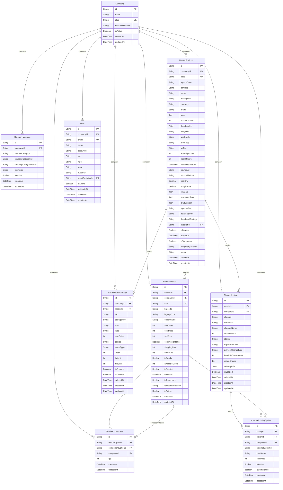

# Core ERD

> Generated from `prisma/models/*.prisma`. Do not edit by hand.
> Regenerate with `npm run db:erd` or `npm run graphify:schema`.

[Back to full ERD](../ERD.md)

## Models

| Model | Table | Description |
|---|---|---|
| BundleComponent | `bundle_components` | 세트 옵션의 구성품 관계. bundleOption(isBundle=true) ↔ componentOption. Cross-master 허용, cross-company 금지. |
| CategoryMapping | `category_mappings` | - |
| ChannelListing | `channel_listings` | 채널에 올라간 판매 등록상품. 쿠팡 등록상품ID, 네이버 상품번호 등. |
| ChannelListingOption | `channel_listing_options` | 채널 listing 내 옵션 externalOptionId 와 내부 ProductOption 매핑. |
| Company | `companies` | - |
| MasterProduct | `master_products` | 기획상품 family. 같은 컨셉의 옵션들을 묶는 entity. 운영/광고/전략 단위. |
| MasterProductImage | `master_product_images` | MasterProduct 이미지 갤러리. Source of truth 이며 MasterProduct.imageUrl 은 대표 이미지 캐시로만 동기화된다. |
| ProductOption | `product_options` | 물리 SKU. 바코드 1:1. 재고/매입/창고 단위. isBundle 이면 구성품 기반 계산. |
| User | `users` | human(직원) / agent(AI, agentDefinitionId 연결) / system(챗봇, companyId=null) 통합 관리. |

## Mermaid ER Diagram

## External References

| Local model | Relation | Direction | External domain | External model |
|---|---|---|---|---|
| ChannelListing | listing | referenced by external | Advertising | AdAction |
| ChannelListing | listing | referenced by external | AI | Thumbnail |
| ChannelListing | listing | referenced by external | AI | ThumbnailTracking |
| ChannelListing | listing | referenced by external | Channels | ChannelAdTargetDailySnapshot |
| ChannelListing | listing | referenced by external | Channels | ChannelListingDailySnapshot |
| ChannelListing | listing | referenced by external | Channels | ChannelListingOptionDailySnapshot |
| ChannelListing | listing | referenced by external | Channels | ChannelScrapeSnapshot |
| ChannelListing | listing | referenced by external | Finance | ProfitLoss |
| ChannelListing | listing | referenced by external | Orders | CSRecord |
| ChannelListing | listing | referenced by external | Orders | Order |
| ChannelListing | listing | referenced by external | Orders | Review |
| ChannelListing | listing | referenced by external | Orders | Shipment |
| ChannelListing | listing | referenced by external | Orders | UnshippedItem |
| ChannelListingOption | listingOption | referenced by external | Channels | ChannelAdTargetDailySnapshot |
| ChannelListingOption | listingOption | referenced by external | Channels | ChannelListingOptionDailySnapshot |
| ChannelListingOption | listingOption | referenced by external | Channels | ChannelScrapeSnapshot |
| ChannelListingOption | listingOption | referenced by external | Orders | OrderLineItem |
| Company | company | referenced by external | Advertising | AdAction |
| Company | company | referenced by external | Advertising | ExecutionWorker |
| Company | company | referenced by external | Advertising | ScrapeTarget |
| Company | company | referenced by external | Agents | AgentDefinition |
| Company | company | referenced by external | Agents | AgentEvent |
| Company | company | referenced by external | Agents | AgentWakeupRequest |
| Company | company | referenced by external | Agents | HeartbeatRun |
| Company | company | referenced by external | Agents | WorkflowTemplate |
| Company | company | referenced by external | AI | ContentGeneration |
| Company | company | referenced by external | AI | Thumbnail |
| Company | company | referenced by external | AI | ThumbnailAnalysis |
| Company | company | referenced by external | AI | ThumbnailGeneration |
| Company | company | referenced by external | AI | ThumbnailGenerationCandidate |
| Company | company | referenced by external | AI | ThumbnailGenerationInputImage |
| Company | company | referenced by external | AI | ThumbnailRegistrationAttempt |
| Company | company | referenced by external | AI | ThumbnailTracking |
| Company | company | referenced by external | Channels | ChannelAccountDailyKpiSnapshot |
| Company | company | referenced by external | Channels | ChannelAdTargetDailySnapshot |
| Company | company | referenced by external | Channels | ChannelListingDailySnapshot |
| Company | company | referenced by external | Channels | ChannelListingOptionDailySnapshot |
| Company | company | referenced by external | Channels | ChannelScrapeRun |
| Company | company | referenced by external | Channels | ChannelScrapeSnapshot |
| Company | company | referenced by external | Finance | GradeHistory |
| Company | company | referenced by external | Finance | ManualLedger |
| Company | company | referenced by external | Finance | ProcessingCost |
| Company | company | referenced by external | Finance | ProfitLoss |
| Company | company | referenced by external | Finance | SalesPlan |
| Company | company | referenced by external | Inventory | Inventory |
| Company | company | referenced by external | Inventory | PickingList |
| Company | company | referenced by external | Inventory | ReturnTransfer |
| Company | company | referenced by external | Inventory | StockAudit |
| Company | company | referenced by external | Inventory | StockTransaction |
| Company | company | referenced by external | Inventory | StockTransfer |
| Company | company | referenced by external | Inventory | Warehouse |
| Company | company | referenced by external | Orders | CSRecord |
| Company | company | referenced by external | Orders | Order |
| Company | company | referenced by external | Orders | OrderLineItem |
| Company | company | referenced by external | Orders | OrderReturn |
| Company | company | referenced by external | Orders | OrderReturnLineItem |
| Company | company | referenced by external | Orders | Review |
| Company | company | referenced by external | Orders | Settlement |
| Company | company | referenced by external | Orders | Shipment |
| Company | company | referenced by external | Orders | UnshippedItem |
| Company | company | referenced by external | Supply | PurchaseOrder |
| Company | company | referenced by external | Supply | Supplier |
| Company | company | referenced by external | Supply | SupplierPayment |
| Company | company | referenced by external | System | ActionTask |
| Company | company | referenced by external | System | ActivityEvent |
| Company | company | referenced by external | System | Alert |
| Company | company | referenced by external | System | BusinessRule |
| Company | company | referenced by external | System | SystemSetting |
| MasterProduct | master | referenced by external | AI | ContentGeneration |
| MasterProduct | master | referenced by external | AI | ThumbnailAnalysis |
| MasterProduct | master | referenced by external | AI | ThumbnailGeneration |
| MasterProduct | master | referenced by external | Finance | GradeHistory |
| MasterProduct | master | referenced by external | Finance | ProcessingCost |
| MasterProduct | master | referenced by external | Supply | MasterSupplierProduct |
| MasterProduct | supplier | references external | Supply | Supplier |
| ProductOption | option | referenced by external | Channels | ChannelAdTargetDailySnapshot |
| ProductOption | option | referenced by external | Channels | ChannelListingOptionDailySnapshot |
| ProductOption | option | referenced by external | Channels | ChannelScrapeSnapshot |
| ProductOption | option | referenced by external | Inventory | Inventory |
| ProductOption | option | referenced by external | Inventory | PickingItem |
| ProductOption | option | referenced by external | Inventory | ReturnTransfer |
| ProductOption | option | referenced by external | Inventory | StockTransaction |
| ProductOption | option | referenced by external | Inventory | StockTransfer |
| ProductOption | option | referenced by external | Orders | OrderLineItem |
| ProductOption | option | referenced by external | Orders | OrderReturnLineItem |
| ProductOption | option | referenced by external | Orders | Shipment |
| ProductOption | option | referenced by external | Orders | UnshippedItem |
| ProductOption | option | referenced by external | Supply | PurchaseOrderItem |
| ProductOption | option | referenced by external | Supply | SupplierProduct |
| User | agentDefinition | references external | Agents | AgentDefinition |
| User | assigneeUser | referenced by external | System | ActionTask |
| User | triggeredByUser | referenced by external | Agents | HeartbeatRun |
| User | triggeredByUser | referenced by external | Agents | WorkflowRun |
| User | triggeredByUser | referenced by external | AI | ThumbnailGeneration |
