# Core ERD

> Generated from `prisma/models/*.prisma`. Do not edit by hand.
> Regenerate with `npm run db:erd` or `npm run graphify:schema`.

[Back to full ERD](../ERD.md)

## Models

| Model | Table | Description |
|---|---|---|
| CategoryMapping | `category_mappings` | - |
| ChannelAccount | `channel_accounts` | Marketplace/store account such as Coupang Wing or Naver SmartStore. Operational channel ownership is distinct from the SaaS organization. |
| ChannelListing | `channel_listings` | 채널에 올라간 판매 등록상품. 쿠팡 등록상품ID, 네이버 상품번호 등. |
| ChannelListingOption | `channel_listing_options` | One sellable SKU under a channel listing. |
| LegalEntity | `legal_entities` | Legal/business entity under an organization. This stores tax, invoice, and settlement identity separately from the SaaS organization boundary. |
| MasterProduct | `master_products` | KidItem-operated product identity and product-level operating metadata. |
| Organization | `organizations` | - |
| OrganizationMembership | `organization_memberships` | B2B customer/workspace membership. A user may belong to multiple organizations; this row supplies request organization and role. |
| ProductVariant | `product_variants` | Reusable sellable unit beneath one MasterProduct. Code is stable organization-scoped identity. |
| ProductVariantComponent | `product_variant_components` | Central confirmed variant recipe. source: manual \| deterministic; quantity is positive and validated by shared/service contracts. |
| SourceImportRun | `source_import_runs` | Durable provenance and publication fence for Sellpia and channel full-snapshot imports. |
| User | `users` | human(직원) / agent(AI, agentInstanceId 연결) / system(챗봇). 조직 소속은 OrganizationMembership 이 source of truth. |

## Mermaid ER Diagram

```mermaid
erDiagram
  CategoryMapping {
    String id PK
    String organizationId FK
    String internalCategory
    String coupangCategoryId
    String coupangCategoryName
    String keywords
    Boolean isActive
    DateTime createdAt
    DateTime updatedAt
  }
  ChannelAccount {
    String id PK
    String organizationId FK
    String channel
    String name
    String externalAccountId
    String sellerId
    String vendorId
    String status
    Boolean isPrimary
    Json config
    DateTime createdAt
    DateTime updatedAt
  }
  ChannelListing {
    String id PK
    String organizationId FK
    String channelAccountId FK
    String sourceCandidateId FK
    String masterProductId FK
    String externalId
    String channelName
    String displayName
    String category
    String brand
    String manufacturer
    Json rawJson
    String lastImportRunId FK
    String status
    String exposureStatus
    String deliveryChargeType
    Int freeShipOverAmount
    Int returnCharge
    Json deliveryInfo
    Boolean isActive
    DateTime createdAt
    DateTime updatedAt
  }
  ChannelListingOption {
    String id PK
    String listingId FK
    String organizationId FK
    String productVariantId FK
    String externalOptionId
    String itemName
    Int salePrice
    Int costPriceOverride
    Decimal commissionRate
    Int shippingCost
    Int otherCost
    String sellerSku
    String barcode
    String modelNumber
    String status
    Json attributesJson
    Json rawJson
    String lastImportRunId FK
    Boolean isActive
    DateTime createdAt
    DateTime updatedAt
  }
  LegalEntity {
    String id PK
    String organizationId FK
    String name
    String businessNumber
    String countryCode
    String representativeName
    String address
    Boolean isPrimary
    Json metadata
    DateTime createdAt
    DateTime updatedAt
  }
  MasterProduct {
    String id PK
    String organizationId FK
    String originChannelListingId FK
    String code
    String name
    String description
    String category
    String brand
    StringArray tags
    StringArray imageUrls
    String abcGrade
    String profitTag
    String adTier
    Int adBudgetLimit
    Int healthScore
    DateTime healthUpdatedAt
    Boolean isActive
    DateTime createdAt
    DateTime updatedAt
  }
  Organization {
    String id PK
    String name
    String slug UK
    Boolean isActive
    DateTime createdAt
    DateTime updatedAt
  }
  OrganizationMembership {
    String id PK
    String organizationId FK
    String userId FK
    String role
    String status
    String invitedById FK
    DateTime joinedAt
    DateTime lastSelectedAt
    DateTime createdAt
    DateTime updatedAt
  }
  ProductVariant {
    String id PK
    String organizationId FK
    String masterProductId FK,UK
    String code
    String name
    String optionLabel
    Boolean isDefault
    Boolean isActive
    DateTime createdAt
    DateTime updatedAt
  }
  ProductVariantComponent {
    String id PK
    String organizationId FK
    String productVariantId FK
    String sellpiaInventorySkuId FK
    Int quantity
    String source
    String confirmedBy
    DateTime confirmedAt
    DateTime createdAt
    DateTime updatedAt
  }
  SourceImportRun {
    String id PK
    String organizationId FK
    String sourceType
    String channelAccountId FK
    String fileName
    String fileHash
    String status
    Int rowCount
    DateTime importedAt
    DateTime lastVerifiedAt
    Int verificationCount
    String lastTrigger
    BigInt freshnessGeneration
    DateTime manualFreshExportConfirmedAt
    String manualFreshExportConfirmedBy FK
    Json qualityReport
    String errorCode
    String errorMessage
    String createdBy
    String attemptToken
    BigInt publicationSequence
    DateTime createdAt
    DateTime updatedAt
  }
  User {
    String id PK
    String email UK
    String name
    String password
    String role
    String type
    String team
    String avatarUrl
    String agentInstanceId FK
    Boolean isActive
    DateTime lastLoginAt
    DateTime createdAt
    DateTime updatedAt
  }
  ChannelAccount ||--o{ ChannelListing : "channelAccount"
  ChannelAccount o|--o{ SourceImportRun : "channelAccount"
  ChannelListing ||--o{ ChannelListingOption : "listing"
  ChannelListing o|--o| MasterProduct : "originChannelListing"
  MasterProduct o|--o{ ChannelListing : "masterProduct"
  MasterProduct ||--o{ ProductVariant : "masterProduct"
  Organization ||--o{ CategoryMapping : "organization"
  Organization ||--o{ ChannelAccount : "organization"
  Organization ||--o{ ChannelListing : "organization"
  Organization ||--o{ ChannelListingOption : "organization"
  Organization ||--o{ LegalEntity : "organization"
  Organization ||--o{ MasterProduct : "organization"
  Organization ||--o{ OrganizationMembership : "organization"
  Organization ||--o{ ProductVariant : "organization"
  Organization ||--o{ ProductVariantComponent : "organization"
  Organization ||--o{ SourceImportRun : "organization"
  ProductVariant o|--o{ ChannelListingOption : "productVariant"
  ProductVariant ||--o{ ProductVariantComponent : "productVariant"
  SourceImportRun o|--o{ ChannelListing : "lastImportRun"
  SourceImportRun o|--o{ ChannelListingOption : "lastImportRun"
  User o|--o{ OrganizationMembership : "invitedBy"
  User ||--o{ OrganizationMembership : "user"
  User o|--o{ SourceImportRun : "manualFreshExportConfirmer"
```

## External References

| Local model | Relation | Direction | External domain | External model |
|---|---|---|---|---|
| ChannelAccount | channelAccount | referenced by external | AI | ProductPreparation |
| ChannelAccount | channelAccount | referenced by external | Channels | ChannelAccountDailyKpiSnapshot |
| ChannelAccount | channelAccount | referenced by external | Channels | ChannelScrapeRun |
| ChannelAccount | channelAccount | referenced by external | Channels | RocketPoCatalogSnapshot |
| ChannelAccount | channelAccount | referenced by external | Orders | Order |
| ChannelAccount | channelAccount | referenced by external | Orders | OrderReturn |
| ChannelAccount | channelAccount | referenced by external | Supply | RocketPurchaseConfirmation |
| ChannelListing | channelListing | referenced by external | AI | ContentWorkspace |
| ChannelListing | channelListing | referenced by external | AI | ProductPreparation |
| ChannelListing | listing | referenced by external | Advertising | AdAction |
| ChannelListing | listing | referenced by external | AI | Thumbnail |
| ChannelListing | listing | referenced by external | AI | ThumbnailTracking |
| ChannelListing | listing | referenced by external | Channels | ChannelAdTargetDailySnapshot |
| ChannelListing | listing | referenced by external | Channels | ChannelListingDailySnapshot |
| ChannelListing | listing | referenced by external | Channels | ChannelListingOptionDailySnapshot |
| ChannelListing | listing | referenced by external | Channels | ChannelScrapeSnapshot |
| ChannelListing | listing | referenced by external | Finance | GradeHistory |
| ChannelListing | listing | referenced by external | Finance | ProfitLoss |
| ChannelListing | listing | referenced by external | Orders | CSRecord |
| ChannelListing | listing | referenced by external | Orders | Review |
| ChannelListing | sourceCandidate | references external | Sourcing | SourcingCandidate |
| ChannelListingOption | channelListingOption | referenced by external | Supply | RocketPurchaseConfirmationLine |
| ChannelListingOption | listingOption | referenced by external | Advertising | AdAction |
| ChannelListingOption | listingOption | referenced by external | Channels | ChannelAdTargetDailySnapshot |
| ChannelListingOption | listingOption | referenced by external | Channels | ChannelListingOptionDailySnapshot |
| ChannelListingOption | listingOption | referenced by external | Channels | ChannelScrapeSnapshot |
| ChannelListingOption | listingOption | referenced by external | Orders | OrderLineItem |
| ChannelListingOption | listingOption | referenced by external | Orders | OrderReturnLineItem |
| MasterProduct | master | referenced by external | Finance | ProcessingCost |
| MasterProduct | provenanceMasterProduct | referenced by external | Sourcing | SourcingCandidate |
| Organization | organization | referenced by external | Advertising | AdAction |
| Organization | organization | referenced by external | Advertising | ExecutionWorker |
| Organization | organization | referenced by external | Advertising | ScrapeTarget |
| Organization | organization | referenced by external | AgentOS | AgentApprovalRequest |
| Organization | organization | referenced by external | AgentOS | AgentArtifact |
| Organization | organization | referenced by external | AgentOS | AgentAuthorizationEvent |
| Organization | organization | referenced by external | AgentOS | AgentConversation |
| Organization | organization | referenced by external | AgentOS | AgentCostEvent |
| Organization | organization | referenced by external | AgentOS | AgentInstance |
| Organization | organization | referenced by external | AgentOS | AgentInstanceToolPolicy |
| Organization | organization | referenced by external | AgentOS | AgentMessage |
| Organization | organization | referenced by external | AgentOS | AgentRun |
| Organization | organization | referenced by external | AgentOS | AgentRunEvent |
| Organization | organization | referenced by external | AgentOS | AgentRunRequest |
| Organization | organization | referenced by external | AgentOS | AgentRuntimeState |
| Organization | organization | referenced by external | AgentOS | AgentTaskSession |
| Organization | organization | referenced by external | AgentOS | AgentToolInvocation |
| Organization | organization | referenced by external | AgentOS | WorkflowTemplate |
| Organization | organization | referenced by external | AI | ContentAsset |
| Organization | organization | referenced by external | AI | ContentGeneration |
| Organization | organization | referenced by external | AI | ContentGenerationAssetUsage |
| Organization | organization | referenced by external | AI | ContentGenerationGroup |
| Organization | organization | referenced by external | AI | ContentGenerationSource |
| Organization | organization | referenced by external | AI | ContentWorkspace |
| Organization | organization | referenced by external | AI | ContentWorkspaceThumbnailSelection |
| Organization | organization | referenced by external | AI | DetailPageArtifact |
| Organization | organization | referenced by external | AI | DetailPageRevision |
| Organization | organization | referenced by external | AI | ProductPreparation |
| Organization | organization | referenced by external | AI | Thumbnail |
| Organization | organization | referenced by external | AI | ThumbnailAnalysis |
| Organization | organization | referenced by external | AI | ThumbnailGeneration |
| Organization | organization | referenced by external | AI | ThumbnailGenerationCandidate |
| Organization | organization | referenced by external | AI | ThumbnailGenerationEvent |
| Organization | organization | referenced by external | AI | ThumbnailGenerationInputImage |
| Organization | organization | referenced by external | AI | ThumbnailRegistrationAttempt |
| Organization | organization | referenced by external | AI | ThumbnailTracking |
| Organization | organization | referenced by external | AI | ThumbnailTrackingDailySnapshot |
| Organization | organization | referenced by external | Channels | ChannelAccountDailyKpiSnapshot |
| Organization | organization | referenced by external | Channels | ChannelAdTargetDailySnapshot |
| Organization | organization | referenced by external | Channels | ChannelListingDailySnapshot |
| Organization | organization | referenced by external | Channels | ChannelListingOptionDailySnapshot |
| Organization | organization | referenced by external | Channels | ChannelScrapeChunk |
| Organization | organization | referenced by external | Channels | ChannelScrapeRun |
| Organization | organization | referenced by external | Channels | ChannelScrapeSnapshot |
| Organization | organization | referenced by external | Channels | CoupangKeywordRankDailySnapshot |
| Organization | organization | referenced by external | Channels | CoupangKeywordSerpDailySnapshot |
| Organization | organization | referenced by external | Channels | CoupangKeywordTracker |
| Organization | organization | referenced by external | Channels | CoupangRepresentativeKeywordOverride |
| Organization | organization | referenced by external | Channels | CoupangWingSalesRankDailySnapshot |
| Organization | organization | referenced by external | Channels | CoupangWingTrackedProduct |
| Organization | organization | referenced by external | Channels | CoupangWingTrackedProductDailySnapshot |
| Organization | organization | referenced by external | Channels | RocketPoCatalogLine |
| Organization | organization | referenced by external | Channels | RocketPoCatalogSnapshot |
| Organization | organization | referenced by external | Channels | RocketPurchaseOrder |
| Organization | organization | referenced by external | Channels | RocketSupplyDailySnapshot |
| Organization | organization | referenced by external | Channels | SellpiaProductMonthlySales |
| Organization | organization | referenced by external | Channels | SellpiaSalesDailySnapshot |
| Organization | organization | referenced by external | Finance | GradeHistory |
| Organization | organization | referenced by external | Finance | ManualLedger |
| Organization | organization | referenced by external | Finance | ProcessingCost |
| Organization | organization | referenced by external | Finance | ProfitLoss |
| Organization | organization | referenced by external | Finance | SalesPlan |
| Organization | organization | referenced by external | Inventory | InventoryCommitment |
| Organization | organization | referenced by external | Inventory | InventoryCommitmentAllocation |
| Organization | organization | referenced by external | Inventory | PickingItem |
| Organization | organization | referenced by external | Inventory | PickingList |
| Organization | organization | referenced by external | Inventory | ReturnTransfer |
| Organization | organization | referenced by external | Inventory | SellpiaInventorySku |
| Organization | organization | referenced by external | Inventory | SellpiaInventoryState |
| Organization | organization | referenced by external | Inventory | SellpiaOrderTransmissionIntent |
| Organization | organization | referenced by external | Inventory | SellpiaOrderTransmissionIntentReconciliation |
| Organization | organization | referenced by external | Inventory | SellpiaReceiptUploadBatch |
| Organization | organization | referenced by external | Inventory | StockAudit |
| Organization | organization | referenced by external | Inventory | StockTransfer |
| Organization | organization | referenced by external | Inventory | Warehouse |
| Organization | organization | referenced by external | Orders | CSRecord |
| Organization | organization | referenced by external | Orders | Order |
| Organization | organization | referenced by external | Orders | OrderLineItem |
| Organization | organization | referenced by external | Orders | OrderReturn |
| Organization | organization | referenced by external | Orders | OrderReturnLineItem |
| Organization | organization | referenced by external | Orders | Review |
| Organization | organization | referenced by external | Orders | Settlement |
| Organization | organization | referenced by external | Orders | Shipment |
| Organization | organization | referenced by external | Orders | ShipmentItem |
| Organization | organization | referenced by external | Orders | UnshippedItem |
| Organization | organization | referenced by external | Sourcing | CandidateImage |
| Organization | organization | referenced by external | Sourcing | LiveCommerceBroadcastDailySnapshot |
| Organization | organization | referenced by external | Sourcing | LiveCommerceProductDailySnapshot |
| Organization | organization | referenced by external | Sourcing | NaverKeywordDailySnapshot |
| Organization | organization | referenced by external | Sourcing | NaverPopularKeywordDailySnapshot |
| Organization | organization | referenced by external | Sourcing | ShortsTrendDailySnapshot |
| Organization | organization | referenced by external | Sourcing | Sourcing1688HotProductDailySnapshot |
| Organization | organization | referenced by external | Sourcing | SourcingCandidate |
| Organization | organization | referenced by external | Sourcing | SourcingWorkspaceSnapshot |
| Organization | organization | referenced by external | Sourcing | TrendSeedKeyword |
| Organization | organization | referenced by external | Supply | PurchaseOrder |
| Organization | organization | referenced by external | Supply | PurchaseOrderItem |
| Organization | organization | referenced by external | Supply | PurchaseOrderSubmissionAttempt |
| Organization | organization | referenced by external | Supply | RocketPurchaseConfirmation |
| Organization | organization | referenced by external | Supply | RocketPurchaseConfirmationAllocation |
| Organization | organization | referenced by external | Supply | RocketPurchaseConfirmationLine |
| Organization | organization | referenced by external | Supply | Supplier |
| Organization | organization | referenced by external | Supply | SupplierPayment |
| Organization | organization | referenced by external | Supply | SupplierProduct |
| Organization | organization | referenced by external | System | ActionTask |
| Organization | organization | referenced by external | System | ActivityEvent |
| Organization | organization | referenced by external | System | Alert |
| Organization | organization | referenced by external | System | BusinessRule |
| Organization | organization | referenced by external | System | SystemSetting |
| ProductVariant | productVariant | referenced by external | Supply | RocketPurchaseConfirmationLine |
| ProductVariantComponent | sellpiaInventorySku | references external | Inventory | SellpiaInventorySku |
| SourceImportRun | lastCompletedImportRun | referenced by external | Inventory | SellpiaInventoryState |
| SourceImportRun | lastImportRun | referenced by external | Inventory | SellpiaInventorySku |
| SourceImportRun | sourceImportRun | referenced by external | Channels | ChannelScrapeRun |
| SourceImportRun | sourceImportRun | referenced by external | Channels | RocketPoCatalogSnapshot |
| SourceImportRun | sourceImportRun | referenced by external | Orders | Order |
| SourceImportRun | sourceImportRun | referenced by external | Supply | RocketPurchaseConfirmation |
| User | activeSyncOwner | referenced by external | Inventory | SellpiaInventoryState |
| User | actor | referenced by external | AI | ThumbnailGenerationEvent |
| User | actorUser | referenced by external | System | Alert |
| User | agentInstance | references external | AgentOS | AgentInstance |
| User | approver | referenced by external | AgentOS | AgentApprovalRequest |
| User | assigneeUser | referenced by external | System | ActionTask |
| User | confirmer | referenced by external | Supply | RocketPurchaseConfirmation |
| User | createdBy | referenced by external | AgentOS | AgentConversation |
| User | createdByUser | referenced by external | AI | ContentAsset |
| User | createdByUser | referenced by external | AI | ContentWorkspace |
| User | createdByUser | referenced by external | AI | ContentWorkspaceThumbnailSelection |
| User | createdByUser | referenced by external | AI | DetailPageArtifact |
| User | createdByUser | referenced by external | AI | DetailPageRevision |
| User | createdByUser | referenced by external | AI | ProductPreparation |
| User | creator | referenced by external | Inventory | InventoryCommitment |
| User | creator | referenced by external | Inventory | SellpiaOrderTransmissionIntent |
| User | decidedBy | referenced by external | AgentOS | AgentApprovalRequest |
| User | decidedBy | referenced by external | AgentOS | AgentAuthorizationEvent |
| User | reconciler | referenced by external | Inventory | SellpiaOrderTransmissionIntentReconciliation |
| User | reconciler | referenced by external | Supply | PurchaseOrderSubmissionAttempt |
| User | rejectedByUser | referenced by external | Sourcing | SourcingCandidate |
| User | releaser | referenced by external | Inventory | InventoryCommitment |
| User | releaser | referenced by external | Supply | RocketPurchaseConfirmation |
| User | requestedBy | referenced by external | AgentOS | AgentApprovalRequest |
| User | requestedBy | referenced by external | AgentOS | AgentAuthorizationEvent |
| User | requestedBy | referenced by external | AgentOS | AgentRunRequest |
| User | settler | referenced by external | Inventory | InventoryCommitment |
| User | triggeredByUser | referenced by external | AgentOS | WorkflowRun |
| User | triggeredByUser | referenced by external | AI | ContentGeneration |
| User | triggeredByUser | referenced by external | AI | ThumbnailGeneration |
| User | triggeredByUser | referenced by external | Sourcing | SourcingCandidate |
