# Core ERD

> Generated from `prisma/models/*.prisma`. Do not edit by hand.
> Regenerate with `npm run db:erd` or `npm run graphify:schema`.

[Back to full ERD](../ERD.md)

## Models

| Model | Table | Description |
|---|---|---|
| BundleComponent | `bundle_components` | 세트 옵션의 구성품 관계. bundleOption(isBundle=true) ↔ componentOption. Cross-master 허용, cross-organization 금지. |
| CategoryMapping | `category_mappings` | - |
| ChannelAccount | `channel_accounts` | Marketplace/store account such as Coupang Wing or Naver SmartStore. Operational channel ownership is distinct from the SaaS organization. |
| ChannelListing | `channel_listings` | 채널에 올라간 판매 등록상품. 쿠팡 등록상품ID, 네이버 상품번호 등. |
| ChannelListingOption | `channel_listing_options` | 채널 listing 내 옵션 externalOptionId 와 내부 ProductOption 매핑. |
| LegalEntity | `legal_entities` | Legal/business entity under an organization. This stores tax, invoice, and settlement identity separately from the SaaS organization boundary. |
| MasterCodeCounter | `master_code_counters` | MasterProduct.code allocator. Prisma-owned replacement for the former PostgreSQL sequence. |
| MasterProduct | `master_products` | 기획상품 family. 같은 컨셉의 옵션들을 묶는 entity. 운영/광고/전략 단위. |
| MasterProductImage | `master_product_images` | MasterProduct 이미지 갤러리. Source of truth 이며 MasterProduct.imageUrl 은 대표 이미지 캐시로만 동기화된다. |
| Organization | `organizations` | - |
| OrganizationMembership | `organization_memberships` | B2B customer/workspace membership. A user may belong to multiple organizations; this row supplies request organization and role. |
| ProductOption | `product_options` | 물리 SKU. 바코드 1:1. 재고/매입/창고 단위. isBundle 이면 구성품 기반 계산. |
| SourceImportRun | `source_import_runs` | Durable provenance and publication fence for Sellpia and channel full-snapshot imports. |
| User | `users` | human(직원) / agent(AI, agentInstanceId 연결) / system(챗봇). 조직 소속은 OrganizationMembership 이 source of truth. |

## Mermaid ER Diagram

```mermaid
erDiagram
  BundleComponent {
    String id PK
    String bundleOptionId FK
    String componentOptionId FK
    String organizationId FK
    Int qty
    DateTime createdAt
    DateTime updatedAt
  }
  CategoryMapping {
    String id PK
    String organizationId FK
    String internalCategory
    String coupangCategoryId
    String coupangCategoryName
    String keywords
    Boolean isActive
    DateTime createdAt
    DateTime updatedAt
  }
  ChannelAccount {
    String id PK
    String organizationId FK
    String channel
    String name
    String externalAccountId
    String sellerId
    String vendorId
    String status
    Boolean isPrimary
    Json config
    DateTime createdAt
    DateTime updatedAt
  }
  ChannelListing {
    String id PK
    String masterId FK
    String organizationId FK
    String channelAccountId FK
    String sourceCandidateId FK
    String channel
    String externalId
    String channelName
    Int channelPrice
    String displayName
    String category
    String brand
    String manufacturer
    Json rawJson
    String lastImportRunId FK
    String status
    String exposureStatus
    String deliveryChargeType
    Int freeShipOverAmount
    Int returnCharge
    Json deliveryInfo
    String abcGrade
    String profitTag
    String adTier
    Int adBudgetLimit
    Int healthScore
    DateTime healthUpdatedAt
    Boolean isActive
    Boolean isDeleted
    DateTime deletedAt
    DateTime createdAt
    DateTime updatedAt
  }
  ChannelListingOption {
    String id PK
    String listingId FK
    String optionId FK
    String organizationId FK
    String channelAccountId FK
    String externalOptionId
    String itemName
    Int salePrice
    Int costPriceOverride
    Decimal commissionRate
    Int shippingCost
    Int otherCost
    String sellerSku
    String barcode
    String modelNumber
    String status
    String mappingStatus
    Json attributesJson
    Json rawJson
    String lastImportRunId FK
    Boolean isActive
    Boolean isUnmatched
    DateTime createdAt
    DateTime updatedAt
  }
  LegalEntity {
    String id PK
    String organizationId FK
    String name
    String businessNumber
    String countryCode
    String representativeName
    String address
    Boolean isPrimary
    Json metadata
    DateTime createdAt
    DateTime updatedAt
  }
  MasterCodeCounter {
    String key PK
    Int value
    DateTime updatedAt
  }
  MasterProduct {
    String id PK
    String organizationId FK
    String code UK
    String legacyCode
    String barcode
    String name
    String description
    String category
    String brand
    Json tags
    Int optionCounter
    String sellpiaProductCode
    String sellpiaName
    String sellpiaBarcode
    String optionName
    Int currentStock
    Int purchasePrice
    Int salePrice
    Boolean isActive
    Json rawJson
    String lastImportRunId FK
    String thumbnailUrl
    String imageUrl
    String abcGrade
    String profitTag
    String adTier
    Int adBudgetLimit
    Int healthScore
    DateTime healthUpdatedAt
    String sourceUrl
    String sourcePlatform
    Decimal costCny
    Decimal marginRate
    Json rawData
    String pipelineStep
    Json processedData
    Json draftContent
    String detailPageUrl
    String thumbnailStrategy
    Boolean isDeleted
    DateTime deletedAt
    Boolean isTemporary
    String lifecycleState
    String temporaryReason
    String memo
    DateTime createdAt
    DateTime updatedAt
  }
  MasterProductImage {
    String id PK
    String organizationId FK
    String masterId FK
    String url
    String storageKey
    String role
    String label
    Int sortOrder
    String source
    String mimeType
    Int width
    Int height
    Int fileSize
    Boolean isPrimary
    Boolean isDeleted
    DateTime deletedAt
    DateTime createdAt
    DateTime updatedAt
  }
  Organization {
    String id PK
    String name
    String slug UK
    Boolean isActive
    DateTime createdAt
    DateTime updatedAt
  }
  OrganizationMembership {
    String id PK
    String organizationId FK
    String userId FK
    String role
    String status
    String invitedById FK
    DateTime joinedAt
    DateTime lastSelectedAt
    DateTime createdAt
    DateTime updatedAt
  }
  ProductOption {
    String id PK
    String masterId FK,UK
    String organizationId FK
    String sku UK
    String barcode
    String legacyCode
    String optionName
    Int sortOrder
    Int costPrice
    Int sellPrice
    Decimal commissionRate
    Int shippingCost
    Int otherCost
    Boolean isBundle
    Int availableStock
    Boolean isDeleted
    DateTime deletedAt
    Boolean isTemporary
    String temporaryReason
    Boolean isActive
    DateTime createdAt
    DateTime updatedAt
  }
  SourceImportRun {
    String id PK
    String organizationId FK
    String sourceType
    String channelAccountId FK
    String fileName
    String fileHash
    String status
    Int rowCount
    DateTime importedAt
    String createdBy
    String attemptToken
    BigInt publicationSequence
    DateTime createdAt
    DateTime updatedAt
  }
  User {
    String id PK
    String email UK
    String name
    String password
    String role
    String type
    String team
    String avatarUrl
    String agentInstanceId FK
    Boolean isActive
    DateTime lastLoginAt
    DateTime createdAt
    DateTime updatedAt
  }
  ChannelAccount o|--o{ ChannelListing : "channelAccount"
  ChannelAccount o|--o{ ChannelListingOption : "channelAccount"
  ChannelAccount o|--o{ SourceImportRun : "channelAccount"
  ChannelListing ||--o{ ChannelListingOption : "listing"
  MasterProduct o|--o{ ChannelListing : "master"
  MasterProduct ||--o{ MasterProductImage : "master"
  MasterProduct ||--|| ProductOption : "master"
  Organization ||--o{ BundleComponent : "organization"
  Organization ||--o{ CategoryMapping : "organization"
  Organization ||--o{ ChannelAccount : "organization"
  Organization ||--o{ ChannelListing : "organization"
  Organization ||--o{ ChannelListingOption : "organization"
  Organization ||--o{ LegalEntity : "organization"
  Organization ||--o{ MasterProduct : "organization"
  Organization ||--o{ MasterProductImage : "organization"
  Organization ||--o{ OrganizationMembership : "organization"
  Organization ||--o{ ProductOption : "organization"
  Organization ||--o{ SourceImportRun : "organization"
  ProductOption ||--o{ BundleComponent : "bundleOption"
  ProductOption ||--o{ BundleComponent : "componentOption"
  ProductOption o|--o{ ChannelListingOption : "option"
  SourceImportRun o|--o{ ChannelListing : "lastImportRun"
  SourceImportRun o|--o{ ChannelListingOption : "lastImportRun"
  SourceImportRun o|--o{ MasterProduct : "lastImportRun"
  User o|--o{ OrganizationMembership : "invitedBy"
  User ||--o{ OrganizationMembership : "user"
```

## External References

| Local model | Relation | Direction | External domain | External model |
|---|---|---|---|---|
| ChannelAccount | channelAccount | referenced by external | AI | ProductPreparation |
| ChannelAccount | channelAccount | referenced by external | Channels | ChannelAccountDailyKpiSnapshot |
| ChannelAccount | channelAccount | referenced by external | Channels | ChannelScrapeRun |
| ChannelAccount | channelAccount | referenced by external | Orders | Order |
| ChannelAccount | channelAccount | referenced by external | Orders | OrderReturn |
| ChannelListing | channelListing | referenced by external | AI | ContentWorkspace |
| ChannelListing | channelListing | referenced by external | AI | ProductPreparation |
| ChannelListing | listing | referenced by external | Advertising | AdAction |
| ChannelListing | listing | referenced by external | AI | Thumbnail |
| ChannelListing | listing | referenced by external | AI | ThumbnailTracking |
| ChannelListing | listing | referenced by external | Channels | ChannelAdTargetDailySnapshot |
| ChannelListing | listing | referenced by external | Channels | ChannelListingDailySnapshot |
| ChannelListing | listing | referenced by external | Channels | ChannelListingOptionDailySnapshot |
| ChannelListing | listing | referenced by external | Channels | ChannelScrapeSnapshot |
| ChannelListing | listing | referenced by external | Finance | GradeHistory |
| ChannelListing | listing | referenced by external | Finance | ProfitLoss |
| ChannelListing | listing | referenced by external | Orders | CSRecord |
| ChannelListing | listing | referenced by external | Orders | Order |
| ChannelListing | listing | referenced by external | Orders | Review |
| ChannelListing | listing | referenced by external | Orders | Shipment |
| ChannelListing | listing | referenced by external | Orders | UnshippedItem |
| ChannelListing | sourceCandidate | references external | Sourcing | SourcingCandidate |
| ChannelListingOption | channelSku | referenced by external | Channels | ChannelSkuComponent |
| ChannelListingOption | listingOption | referenced by external | Advertising | AdAction |
| ChannelListingOption | listingOption | referenced by external | Channels | ChannelAdTargetDailySnapshot |
| ChannelListingOption | listingOption | referenced by external | Channels | ChannelListingOptionDailySnapshot |
| ChannelListingOption | listingOption | referenced by external | Channels | ChannelScrapeSnapshot |
| ChannelListingOption | listingOption | referenced by external | Orders | OrderLineItem |
| ChannelListingOption | listingOption | referenced by external | Orders | OrderReturnLineItem |
| MasterProduct | master | referenced by external | AI | ProductPreparation |
| MasterProduct | master | referenced by external | AI | ThumbnailAnalysis |
| MasterProduct | master | referenced by external | AI | ThumbnailGeneration |
| MasterProduct | master | referenced by external | Finance | GradeHistory |
| MasterProduct | master | referenced by external | Finance | ProcessingCost |
| MasterProduct | master | referenced by external | Supply | MasterSupplierProduct |
| MasterProduct | masterProduct | referenced by external | Channels | ChannelSkuComponent |
| MasterProduct | masterProduct | referenced by external | Inventory | InventorySkuMasterProductMap |
| MasterProduct | masterProduct | referenced by external | Inventory | PickingItem |
| MasterProduct | masterProduct | referenced by external | Inventory | ReturnTransfer |
| MasterProduct | masterProduct | referenced by external | Inventory | RocketInventoryLedger |
| MasterProduct | masterProduct | referenced by external | Inventory | SellpiaStockSnapshotItem |
| MasterProduct | masterProduct | referenced by external | Inventory | StockTransfer |
| MasterProduct | masterProduct | referenced by external | Supply | PurchaseOrderItem |
| MasterProduct | masterProduct | referenced by external | Supply | SupplierProduct |
| MasterProduct | promotedMaster | referenced by external | Sourcing | SourcingCandidate |
| MasterProduct | provenanceMasterProduct | referenced by external | Sourcing | SourcingCandidate |
| MasterProduct | targetMaster | referenced by external | AI | ContentGenerationGroup |
| MasterProduct | targetMaster | referenced by external | AI | ContentWorkspace |
| MasterProduct | targetMaster | referenced by external | AI | DetailPageArtifact |
| MasterProductImage | masterImage | referenced by external | AI | ThumbnailGenerationInputImage |
| Organization | organization | referenced by external | Advertising | AdAction |
| Organization | organization | referenced by external | Advertising | ExecutionWorker |
| Organization | organization | referenced by external | Advertising | ScrapeTarget |
| Organization | organization | referenced by external | AgentOS | AgentApprovalRequest |
| Organization | organization | referenced by external | AgentOS | AgentArtifact |
| Organization | organization | referenced by external | AgentOS | AgentAuthorizationEvent |
| Organization | organization | referenced by external | AgentOS | AgentConversation |
| Organization | organization | referenced by external | AgentOS | AgentCostEvent |
| Organization | organization | referenced by external | AgentOS | AgentInstance |
| Organization | organization | referenced by external | AgentOS | AgentInstanceToolPolicy |
| Organization | organization | referenced by external | AgentOS | AgentMessage |
| Organization | organization | referenced by external | AgentOS | AgentRun |
| Organization | organization | referenced by external | AgentOS | AgentRunEvent |
| Organization | organization | referenced by external | AgentOS | AgentRunRequest |
| Organization | organization | referenced by external | AgentOS | AgentRuntimeState |
| Organization | organization | referenced by external | AgentOS | AgentTaskSession |
| Organization | organization | referenced by external | AgentOS | AgentToolInvocation |
| Organization | organization | referenced by external | AgentOS | WorkflowTemplate |
| Organization | organization | referenced by external | AI | ContentAsset |
| Organization | organization | referenced by external | AI | ContentGeneration |
| Organization | organization | referenced by external | AI | ContentGenerationAssetUsage |
| Organization | organization | referenced by external | AI | ContentGenerationGroup |
| Organization | organization | referenced by external | AI | ContentGenerationSource |
| Organization | organization | referenced by external | AI | ContentWorkspace |
| Organization | organization | referenced by external | AI | ContentWorkspaceThumbnailSelection |
| Organization | organization | referenced by external | AI | DetailPageArtifact |
| Organization | organization | referenced by external | AI | DetailPageRevision |
| Organization | organization | referenced by external | AI | ProductPreparation |
| Organization | organization | referenced by external | AI | Thumbnail |
| Organization | organization | referenced by external | AI | ThumbnailAnalysis |
| Organization | organization | referenced by external | AI | ThumbnailGeneration |
| Organization | organization | referenced by external | AI | ThumbnailGenerationCandidate |
| Organization | organization | referenced by external | AI | ThumbnailGenerationEvent |
| Organization | organization | referenced by external | AI | ThumbnailGenerationInputImage |
| Organization | organization | referenced by external | AI | ThumbnailRegistrationAttempt |
| Organization | organization | referenced by external | AI | ThumbnailTracking |
| Organization | organization | referenced by external | AI | ThumbnailTrackingDailySnapshot |
| Organization | organization | referenced by external | Channels | ChannelAccountDailyKpiSnapshot |
| Organization | organization | referenced by external | Channels | ChannelAdTargetDailySnapshot |
| Organization | organization | referenced by external | Channels | ChannelListingDailySnapshot |
| Organization | organization | referenced by external | Channels | ChannelListingOptionDailySnapshot |
| Organization | organization | referenced by external | Channels | ChannelReconciliationItem |
| Organization | organization | referenced by external | Channels | ChannelReconciliationRun |
| Organization | organization | referenced by external | Channels | ChannelScrapeRun |
| Organization | organization | referenced by external | Channels | ChannelScrapeSnapshot |
| Organization | organization | referenced by external | Channels | ChannelSkuComponent |
| Organization | organization | referenced by external | Channels | RocketPurchaseOrder |
| Organization | organization | referenced by external | Channels | RocketSupplyDailySnapshot |
| Organization | organization | referenced by external | Finance | GradeHistory |
| Organization | organization | referenced by external | Finance | ManualLedger |
| Organization | organization | referenced by external | Finance | ProcessingCost |
| Organization | organization | referenced by external | Finance | ProfitLoss |
| Organization | organization | referenced by external | Finance | SalesPlan |
| Organization | organization | referenced by external | Inventory | Inventory |
| Organization | organization | referenced by external | Inventory | InventorySku |
| Organization | organization | referenced by external | Inventory | InventorySkuMasterProductMap |
| Organization | organization | referenced by external | Inventory | PickingItem |
| Organization | organization | referenced by external | Inventory | PickingList |
| Organization | organization | referenced by external | Inventory | ReturnTransfer |
| Organization | organization | referenced by external | Inventory | RocketInventoryLedger |
| Organization | organization | referenced by external | Inventory | SellpiaNewProductCandidate |
| Organization | organization | referenced by external | Inventory | SellpiaReceiptUploadBatch |
| Organization | organization | referenced by external | Inventory | SellpiaStockSnapshot |
| Organization | organization | referenced by external | Inventory | SellpiaStockSnapshotItem |
| Organization | organization | referenced by external | Inventory | StockAudit |
| Organization | organization | referenced by external | Inventory | StockTransaction |
| Organization | organization | referenced by external | Inventory | StockTransfer |
| Organization | organization | referenced by external | Inventory | Warehouse |
| Organization | organization | referenced by external | Orders | CSRecord |
| Organization | organization | referenced by external | Orders | Order |
| Organization | organization | referenced by external | Orders | OrderLineItem |
| Organization | organization | referenced by external | Orders | OrderReturn |
| Organization | organization | referenced by external | Orders | OrderReturnLineItem |
| Organization | organization | referenced by external | Orders | Review |
| Organization | organization | referenced by external | Orders | Settlement |
| Organization | organization | referenced by external | Orders | Shipment |
| Organization | organization | referenced by external | Orders | ShipmentItem |
| Organization | organization | referenced by external | Orders | UnshippedItem |
| Organization | organization | referenced by external | Sourcing | CandidateImage |
| Organization | organization | referenced by external | Sourcing | SourcingCandidate |
| Organization | organization | referenced by external | Sourcing | SourcingWorkspaceSnapshot |
| Organization | organization | referenced by external | Supply | PurchaseOrder |
| Organization | organization | referenced by external | Supply | PurchaseOrderItem |
| Organization | organization | referenced by external | Supply | Supplier |
| Organization | organization | referenced by external | Supply | SupplierPayment |
| Organization | organization | referenced by external | Supply | SupplierProduct |
| Organization | organization | referenced by external | System | ActionTask |
| Organization | organization | referenced by external | System | ActivityEvent |
| Organization | organization | referenced by external | System | Alert |
| Organization | organization | referenced by external | System | BusinessRule |
| Organization | organization | referenced by external | System | SystemSetting |
| ProductOption | option | referenced by external | Channels | ChannelAdTargetDailySnapshot |
| ProductOption | option | referenced by external | Channels | ChannelListingOptionDailySnapshot |
| ProductOption | option | referenced by external | Channels | ChannelScrapeSnapshot |
| ProductOption | option | referenced by external | Inventory | Inventory |
| ProductOption | option | referenced by external | Inventory | PickingItem |
| ProductOption | option | referenced by external | Inventory | ReturnTransfer |
| ProductOption | option | referenced by external | Inventory | RocketInventoryLedger |
| ProductOption | option | referenced by external | Inventory | SellpiaStockSnapshotItem |
| ProductOption | option | referenced by external | Inventory | StockTransaction |
| ProductOption | option | referenced by external | Inventory | StockTransfer |
| ProductOption | option | referenced by external | Orders | OrderLineItem |
| ProductOption | option | referenced by external | Orders | OrderReturnLineItem |
| ProductOption | option | referenced by external | Orders | Shipment |
| ProductOption | option | referenced by external | Orders | UnshippedItem |
| ProductOption | option | referenced by external | Supply | PurchaseOrderItem |
| ProductOption | option | referenced by external | Supply | SupplierProduct |
| ProductOption | resolvedOption | referenced by external | Inventory | SellpiaNewProductCandidate |
| SourceImportRun | lastImportRun | referenced by external | Inventory | InventorySku |
| User | actor | referenced by external | AI | ThumbnailGenerationEvent |
| User | actorUser | referenced by external | System | Alert |
| User | agentInstance | references external | AgentOS | AgentInstance |
| User | approver | referenced by external | AgentOS | AgentApprovalRequest |
| User | assigneeUser | referenced by external | System | ActionTask |
| User | createdBy | referenced by external | AgentOS | AgentConversation |
| User | createdByUser | referenced by external | AI | ContentAsset |
| User | createdByUser | referenced by external | AI | ContentWorkspace |
| User | createdByUser | referenced by external | AI | ContentWorkspaceThumbnailSelection |
| User | createdByUser | referenced by external | AI | DetailPageArtifact |
| User | createdByUser | referenced by external | AI | DetailPageRevision |
| User | createdByUser | referenced by external | AI | ProductPreparation |
| User | decidedBy | referenced by external | AgentOS | AgentApprovalRequest |
| User | decidedBy | referenced by external | AgentOS | AgentAuthorizationEvent |
| User | rejectedByUser | referenced by external | Sourcing | SourcingCandidate |
| User | requestedBy | referenced by external | AgentOS | AgentApprovalRequest |
| User | requestedBy | referenced by external | AgentOS | AgentAuthorizationEvent |
| User | requestedBy | referenced by external | AgentOS | AgentRunRequest |
| User | triggeredByUser | referenced by external | AgentOS | WorkflowRun |
| User | triggeredByUser | referenced by external | AI | ContentGeneration |
| User | triggeredByUser | referenced by external | AI | ThumbnailGeneration |
| User | triggeredByUser | referenced by external | Sourcing | SourcingCandidate |
