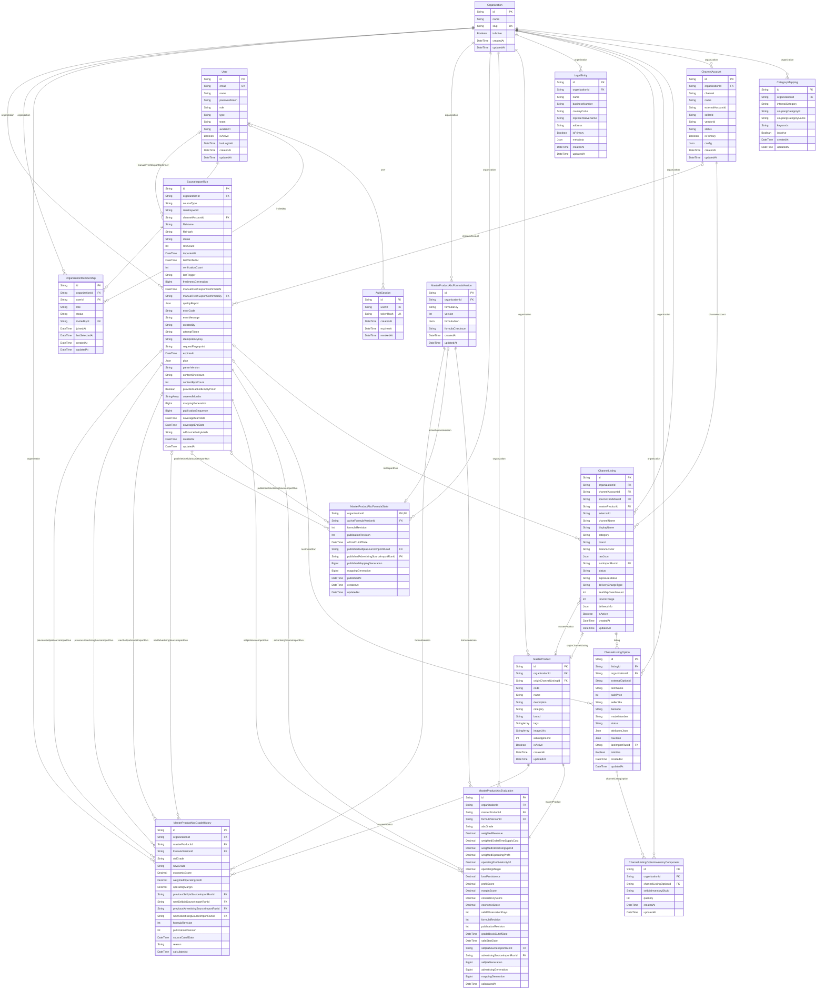

# Core ERD

> Generated from `prisma/models/*.prisma`. Do not edit by hand.
> Regenerate with `npm run db:erd` after Prisma schema changes.

[Back to full ERD](../ERD.md)

## Models

| Model | Table | Description |
|---|---|---|
| AuthSession | `auth_sessions` | Revocable KidItem-owned browser and extension authentication session. Only a SHA-256 token hash is persisted. |
| CategoryMapping | `category_mappings` | - |
| ChannelAccount | `channel_accounts` | Marketplace/store account such as Coupang Wing or Naver SmartStore. Operational channel ownership is distinct from the SaaS organization. |
| ChannelListing | `channel_listings` | 채널에 올라간 판매 등록상품. 쿠팡 등록상품ID, 네이버 상품번호 등. |
| ChannelListingOption | `channel_listing_options` | One sellable SKU under a channel listing. |
| ChannelListingOptionInventoryComponent | `channel_listing_option_inventory_components` | Confirmed Sellpia inventory consumption for one channel sellable option. |
| LegalEntity | `legal_entities` | Legal/business entity under an organization. This stores tax, invoice, and settlement identity separately from the SaaS organization boundary. |
| MasterProduct | `master_products` | Organization-owned canonical inventory product and sole official product ABC identity. |
| MasterProductAbcEvaluation | `master_product_abc_evaluations` | Current Products-owned normal absolute ABC evaluation for one MasterProduct. |
| MasterProductAbcFormulaState | `master_product_abc_formula_states` | One organization-owned formula and official publication envelope. |
| MasterProductAbcFormulaVersion | `master_product_abc_formula_versions` | Immutable organization-owned formula versions for absolute product ABC publication. |
| MasterProductAbcGradeHistory | `master_product_abc_grade_histories` | Immutable absolute ABC grade transitions after the initial baseline. |
| Organization | `organizations` | - |
| OrganizationMembership | `organization_memberships` | B2B customer/workspace membership. A user may belong to multiple organizations; this row supplies request organization and role. |
| SourceImportRun | `source_import_runs` | Durable provenance and publication fence for Sellpia and channel full-snapshot imports. |
| User | `users` | Human or system account. Organization membership is the source of truth. |

## Mermaid ER Diagram

```mermaid
erDiagram
  AuthSession {
    String id PK
    String userId FK
    String tokenHash UK
    DateTime createdAt
    DateTime expiresAt
    DateTime revokedAt
  }
  CategoryMapping {
    String id PK
    String organizationId FK
    String internalCategory
    String coupangCategoryId
    String coupangCategoryName
    String keywords
    Boolean isActive
    DateTime createdAt
    DateTime updatedAt
  }
  ChannelAccount {
    String id PK
    String organizationId FK
    String channel
    String name
    String externalAccountId
    String sellerId
    String vendorId
    String status
    Boolean isPrimary
    Json config
    DateTime createdAt
    DateTime updatedAt
  }
  ChannelListing {
    String id PK
    String organizationId FK
    String channelAccountId FK
    String sourceCandidateId FK
    String masterProductId FK
    String externalId
    String channelName
    String displayName
    String category
    String brand
    String manufacturer
    Json rawJson
    String lastImportRunId FK
    String status
    String exposureStatus
    String deliveryChargeType
    Int freeShipOverAmount
    Int returnCharge
    Json deliveryInfo
    Boolean isActive
    DateTime createdAt
    DateTime updatedAt
  }
  ChannelListingOption {
    String id PK
    String listingId FK
    String organizationId FK
    String externalOptionId
    String itemName
    Int salePrice
    String sellerSku
    String barcode
    String modelNumber
    String status
    Json attributesJson
    Json rawJson
    String lastImportRunId FK
    Boolean isActive
    DateTime createdAt
    DateTime updatedAt
  }
  ChannelListingOptionInventoryComponent {
    String id PK
    String organizationId FK
    String channelListingOptionId FK
    String sellpiaInventorySkuId
    Int quantity
    DateTime createdAt
    DateTime updatedAt
  }
  LegalEntity {
    String id PK
    String organizationId FK
    String name
    String businessNumber
    String countryCode
    String representativeName
    String address
    Boolean isPrimary
    Json metadata
    DateTime createdAt
    DateTime updatedAt
  }
  MasterProduct {
    String id PK
    String organizationId FK
    String originChannelListingId FK
    String code
    String name
    String description
    String category
    String brand
    StringArray tags
    StringArray imageUrls
    Int adBudgetLimit
    Boolean isActive
    DateTime createdAt
    DateTime updatedAt
  }
  MasterProductAbcEvaluation {
    String id PK
    String organizationId FK
    String masterProductId FK
    String formulaVersionId FK
    String abcGrade
    Decimal weightedRevenue
    Decimal weightedOrderTimeSupplyCost
    Decimal weightedAdvertisingSpend
    Decimal weightedOperatingProfit
    Decimal operatingProfitVelocity30
    Decimal operatingMargin
    Decimal lossPersistence
    Decimal profitScore
    Decimal marginScore
    Decimal consistencyScore
    Decimal economicScore
    Int validObservationDays
    Int formulaRevision
    Int publicationRevision
    DateTime gradeBasisCutoffDate
    DateTime saleStartDate
    String sellpiaSourceImportRunId FK
    String advertisingSourceImportRunId FK
    BigInt sellpiaGeneration
    BigInt advertisingGeneration
    BigInt mappingGeneration
    DateTime calculatedAt
  }
  MasterProductAbcFormulaState {
    String organizationId PK,FK
    String activeFormulaVersionId FK
    Int formulaRevision
    Int publicationRevision
    DateTime officialCutoffDate
    String publishedSellpiaSourceImportRunId FK
    String publishedAdvertisingSourceImportRunId FK
    BigInt publishedMappingGeneration
    BigInt mappingGeneration
    DateTime publishedAt
    DateTime createdAt
    DateTime updatedAt
  }
  MasterProductAbcFormulaVersion {
    String id PK
    String organizationId FK
    String formulaKey
    Int version
    Json formulaJson
    String formulaChecksum
    DateTime createdAt
    DateTime updatedAt
  }
  MasterProductAbcGradeHistory {
    String id PK
    String organizationId FK
    String masterProductId FK
    String formulaVersionId FK
    String oldGrade
    String newGrade
    Decimal economicScore
    Decimal weightedOperatingProfit
    Decimal operatingMargin
    String previousSellpiaSourceImportRunId FK
    String nextSellpiaSourceImportRunId FK
    String previousAdvertisingSourceImportRunId FK
    String nextAdvertisingSourceImportRunId FK
    Int formulaRevision
    Int publicationRevision
    DateTime sourceCutoffDate
    String reason
    DateTime calculatedAt
  }
  Organization {
    String id PK
    String name
    String slug UK
    Boolean isActive
    DateTime createdAt
    DateTime updatedAt
  }
  OrganizationMembership {
    String id PK
    String organizationId FK
    String userId FK
    String role
    String status
    String invitedById FK
    DateTime joinedAt
    DateTime lastSelectedAt
    DateTime createdAt
    DateTime updatedAt
  }
  SourceImportRun {
    String id PK
    String organizationId FK
    String sourceType
    String rankKeyword
    String channelAccountId FK
    String fileName
    String fileHash
    String status
    Int rowCount
    DateTime importedAt
    DateTime lastVerifiedAt
    Int verificationCount
    String lastTrigger
    BigInt freshnessGeneration
    DateTime manualFreshExportConfirmedAt
    String manualFreshExportConfirmedBy FK
    Json qualityReport
    String errorCode
    String errorMessage
    String createdBy
    String attemptToken
    String idempotencyKey
    String requestFingerprint
    DateTime expiresAt
    Json plan
    String parserVersion
    String contentChecksum
    Int contentByteCount
    Boolean providerBackedEmptyProof
    StringArray coveredMonths
    BigInt mappingGeneration
    BigInt publicationSequence
    DateTime coverageStartDate
    DateTime coverageEndDate
    String adSourcePolicyHash
    DateTime createdAt
    DateTime updatedAt
  }
  User {
    String id PK
    String email UK
    String name
    String passwordHash
    String role
    String type
    String team
    String avatarUrl
    Boolean isActive
    DateTime lastLoginAt
    DateTime createdAt
    DateTime updatedAt
  }
  ChannelAccount ||--o{ ChannelListing : "channelAccount"
  ChannelAccount o|--o{ SourceImportRun : "channelAccount"
  ChannelListing ||--o{ ChannelListingOption : "listing"
  ChannelListing o|--o| MasterProduct : "originChannelListing"
  ChannelListingOption ||--o{ ChannelListingOptionInventoryComponent : "channelListingOption"
  MasterProduct o|--o{ ChannelListing : "masterProduct"
  MasterProduct ||--|| MasterProductAbcEvaluation : "masterProduct"
  MasterProduct ||--o{ MasterProductAbcGradeHistory : "masterProduct"
  MasterProductAbcFormulaVersion ||--o{ MasterProductAbcEvaluation : "formulaVersion"
  MasterProductAbcFormulaVersion o|--o| MasterProductAbcFormulaState : "activeFormulaVersion"
  MasterProductAbcFormulaVersion ||--o{ MasterProductAbcGradeHistory : "formulaVersion"
  Organization ||--o{ CategoryMapping : "organization"
  Organization ||--o{ ChannelAccount : "organization"
  Organization ||--o{ ChannelListing : "organization"
  Organization ||--o{ ChannelListingOption : "organization"
  Organization ||--o{ ChannelListingOptionInventoryComponent : "organization"
  Organization ||--o{ LegalEntity : "organization"
  Organization ||--o{ MasterProduct : "organization"
  Organization ||--o{ MasterProductAbcEvaluation : "organization"
  Organization ||--o{ MasterProductAbcFormulaState : "organization"
  Organization ||--o{ MasterProductAbcFormulaVersion : "organization"
  Organization ||--o{ MasterProductAbcGradeHistory : "organization"
  Organization ||--o{ OrganizationMembership : "organization"
  Organization ||--o{ SourceImportRun : "organization"
  SourceImportRun o|--o{ ChannelListing : "lastImportRun"
  SourceImportRun o|--o{ ChannelListingOption : "lastImportRun"
  SourceImportRun ||--o{ MasterProductAbcEvaluation : "advertisingSourceImportRun"
  SourceImportRun ||--o{ MasterProductAbcEvaluation : "sellpiaSourceImportRun"
  SourceImportRun o|--o{ MasterProductAbcFormulaState : "publishedAdvertisingSourceImportRun"
  SourceImportRun o|--o{ MasterProductAbcFormulaState : "publishedSellpiaSourceImportRun"
  SourceImportRun o|--o{ MasterProductAbcGradeHistory : "nextAdvertisingSourceImportRun"
  SourceImportRun o|--o{ MasterProductAbcGradeHistory : "nextSellpiaSourceImportRun"
  SourceImportRun o|--o{ MasterProductAbcGradeHistory : "previousAdvertisingSourceImportRun"
  SourceImportRun o|--o{ MasterProductAbcGradeHistory : "previousSellpiaSourceImportRun"
  User ||--o{ AuthSession : "user"
  User o|--o{ OrganizationMembership : "invitedBy"
  User ||--o{ OrganizationMembership : "user"
  User o|--o{ SourceImportRun : "manualFreshExportConfirmer"
```

## External References

| Local model | Relation | Direction | External domain | External model |
|---|---|---|---|---|
| ChannelAccount | channelAccount | referenced by external | AI | ProductPreparation |
| ChannelAccount | channelAccount | referenced by external | Channels | ChannelAdListingProductMonthlyFact |
| ChannelAccount | channelAccount | referenced by external | Channels | ChannelAdTargetDailySnapshot |
| ChannelAccount | channelAccount | referenced by external | Channels | ChannelListingDeletionOperation |
| ChannelAccount | channelAccount | referenced by external | Channels | ChannelScrapeRun |
| ChannelAccount | channelAccount | referenced by external | Channels | RocketPoCatalogSnapshot |
| ChannelAccount | channelAccount | referenced by external | Orders | CoupangDirectTransportReceipt |
| ChannelAccount | channelAccount | referenced by external | Orders | Order |
| ChannelAccount | channelAccount | referenced by external | Sourcing | ProductRegistrationExecution |
| ChannelAccount | channelAccount | referenced by external | Supply | RocketPurchaseConfirmation |
| ChannelAccount | targetChannelAccount | referenced by external | Sourcing | SourcingLaunchCandidate |
| ChannelListing | channelListing | referenced by external | AI | ContentWorkspace |
| ChannelListing | channelListing | referenced by external | AI | ProductPreparation |
| ChannelListing | channelListing | referenced by external | Channels | ChannelAdListingProductMonthlyFact |
| ChannelListing | channelListing | referenced by external | Channels | ChannelListingDeletionOperation |
| ChannelListing | channelListing | referenced by external | Sourcing | ProductRegistrationExecution |
| ChannelListing | listing | referenced by external | Advertising | AdAction |
| ChannelListing | listing | referenced by external | AI | Thumbnail |
| ChannelListing | listing | referenced by external | AI | ThumbnailTracking |
| ChannelListing | listing | referenced by external | Channels | ChannelAdTargetDailySnapshot |
| ChannelListing | listing | referenced by external | Channels | ChannelListingDailySnapshot |
| ChannelListing | listing | referenced by external | Channels | ChannelListingOptionDailySnapshot |
| ChannelListing | listing | referenced by external | Channels | ChannelScrapeSnapshot |
| ChannelListing | listing | referenced by external | Orders | Review |
| ChannelListing | sourceCandidate | references external | Sourcing | SourcingCandidate |
| ChannelListingOption | channelListingOption | referenced by external | Supply | RocketPurchaseConfirmationLine |
| ChannelListingOption | listingOption | referenced by external | Advertising | AdAction |
| ChannelListingOption | listingOption | referenced by external | Channels | ChannelAdTargetDailySnapshot |
| ChannelListingOption | listingOption | referenced by external | Channels | ChannelListingOptionDailySnapshot |
| ChannelListingOption | listingOption | referenced by external | Channels | ChannelScrapeSnapshot |
| ChannelListingOption | listingOption | referenced by external | Orders | OrderLineItem |
| MasterProduct | frozenMasterProduct | referenced by external | Channels | SellpiaProductMonthlySales |
| MasterProduct | masterProduct | referenced by external | Channels | ChannelAdListingProductMonthlyFact |
| MasterProduct | masterProduct | referenced by external | Inventory | SellpiaInventorySku |
| MasterProduct | provenanceMasterProduct | referenced by external | Sourcing | SourcingCandidate |
| Organization | organization | referenced by external | Advertising | AdAction |
| Organization | organization | referenced by external | AgentOS | CapabilityInvocation |
| Organization | organization | referenced by external | AI | AiDirectJob |
| Organization | organization | referenced by external | AI | ContentAsset |
| Organization | organization | referenced by external | AI | ContentGeneration |
| Organization | organization | referenced by external | AI | ContentGenerationAssetUsage |
| Organization | organization | referenced by external | AI | ContentGenerationGroup |
| Organization | organization | referenced by external | AI | ContentGenerationSource |
| Organization | organization | referenced by external | AI | ContentWorkspace |
| Organization | organization | referenced by external | AI | ContentWorkspaceThumbnailSelection |
| Organization | organization | referenced by external | AI | DetailPageArtifact |
| Organization | organization | referenced by external | AI | DetailPageImageArtifact |
| Organization | organization | referenced by external | AI | DetailPageImageRenderIntent |
| Organization | organization | referenced by external | AI | DetailPageRevision |
| Organization | organization | referenced by external | AI | ProductPreparation |
| Organization | organization | referenced by external | AI | Thumbnail |
| Organization | organization | referenced by external | AI | ThumbnailAnalysis |
| Organization | organization | referenced by external | AI | ThumbnailGeneration |
| Organization | organization | referenced by external | AI | ThumbnailGenerationCandidate |
| Organization | organization | referenced by external | AI | ThumbnailGenerationEvent |
| Organization | organization | referenced by external | AI | ThumbnailGenerationInputImage |
| Organization | organization | referenced by external | AI | ThumbnailRegistrationAttempt |
| Organization | organization | referenced by external | AI | ThumbnailTracking |
| Organization | organization | referenced by external | AI | ThumbnailTrackingDailySnapshot |
| Organization | organization | referenced by external | Channels | ChannelAdListingProductMonthlyFact |
| Organization | organization | referenced by external | Channels | ChannelAdTargetDailySnapshot |
| Organization | organization | referenced by external | Channels | ChannelListingDailySnapshot |
| Organization | organization | referenced by external | Channels | ChannelListingDeletionOperation |
| Organization | organization | referenced by external | Channels | ChannelListingOptionDailySnapshot |
| Organization | organization | referenced by external | Channels | ChannelRegistrationOwnerIdempotencyReceipt |
| Organization | organization | referenced by external | Channels | ChannelScrapeChunk |
| Organization | organization | referenced by external | Channels | ChannelScrapeRun |
| Organization | organization | referenced by external | Channels | ChannelScrapeSnapshot |
| Organization | organization | referenced by external | Channels | CoupangKeywordRankDailySnapshot |
| Organization | organization | referenced by external | Channels | CoupangKeywordSerpDailySnapshot |
| Organization | organization | referenced by external | Channels | CoupangKeywordTracker |
| Organization | organization | referenced by external | Channels | CoupangRepresentativeKeywordOverride |
| Organization | organization | referenced by external | Channels | CoupangWingSalesRankDailySnapshot |
| Organization | organization | referenced by external | Channels | CoupangWingTrackedProduct |
| Organization | organization | referenced by external | Channels | CoupangWingTrackedProductDailySnapshot |
| Organization | organization | referenced by external | Channels | MallOperationOutcome |
| Organization | organization | referenced by external | Channels | RocketPoCatalogLine |
| Organization | organization | referenced by external | Channels | RocketPoCatalogSnapshot |
| Organization | organization | referenced by external | Channels | SellpiaManualMatchAlias |
| Organization | organization | referenced by external | Channels | SellpiaManualMatchSnapshot |
| Organization | organization | referenced by external | Channels | SellpiaProductMonthlySales |
| Organization | organization | referenced by external | Channels | SellpiaSalesDailySnapshot |
| Organization | organization | referenced by external | Finance | SalesPlan |
| Organization | organization | referenced by external | Inventory | ReturnTransfer |
| Organization | organization | referenced by external | Inventory | SellpiaInventorySku |
| Organization | organization | referenced by external | Inventory | SellpiaInventoryState |
| Organization | organization | referenced by external | Inventory | StockTransfer |
| Organization | organization | referenced by external | Inventory | Warehouse |
| Organization | organization | referenced by external | Orders | CoupangDirectPoSnapshot |
| Organization | organization | referenced by external | Orders | CoupangDirectTransportConsumption |
| Organization | organization | referenced by external | Orders | CoupangDirectTransportReceipt |
| Organization | organization | referenced by external | Orders | CoupangShipmentDateSummary |
| Organization | organization | referenced by external | Orders | Order |
| Organization | organization | referenced by external | Orders | OrderCollectionArtifact |
| Organization | organization | referenced by external | Orders | OrderLineItem |
| Organization | organization | referenced by external | Orders | Review |
| Organization | organization | referenced by external | Orders | ReviewCollectionChunk |
| Organization | organization | referenced by external | Orders | SellpiaOrderTransmissionIntent |
| Organization | organization | referenced by external | Orders | SellpiaOrderTransmissionIntentReconciliation |
| Organization | organization | referenced by external | Orders | Settlement |
| Organization | organization | referenced by external | Sourcing | CandidateImage |
| Organization | organization | referenced by external | Sourcing | LiveCommerceBroadcastDailySnapshot |
| Organization | organization | referenced by external | Sourcing | LiveCommerceProductDailySnapshot |
| Organization | organization | referenced by external | Sourcing | NaverKeywordDailySnapshot |
| Organization | organization | referenced by external | Sourcing | NaverPopularKeywordDailySnapshot |
| Organization | organization | referenced by external | Sourcing | ProductRegistrationExecution |
| Organization | organization | referenced by external | Sourcing | ShortsTrendDailySnapshot |
| Organization | organization | referenced by external | Sourcing | Sourcing1688OfferKeywordObservation |
| Organization | organization | referenced by external | Sourcing | SourcingCandidate |
| Organization | organization | referenced by external | Sourcing | SourcingCollectionSourceControl |
| Organization | organization | referenced by external | Sourcing | SourcingDecisionBatch |
| Organization | organization | referenced by external | Sourcing | SourcingDecisionBatchItem |
| Organization | organization | referenced by external | Sourcing | SourcingDecisionEvidence |
| Organization | organization | referenced by external | Sourcing | SourcingEvidenceIngestionRun |
| Organization | organization | referenced by external | Sourcing | SourcingEvidenceObservation |
| Organization | organization | referenced by external | Sourcing | SourcingInterestTarget |
| Organization | organization | referenced by external | Sourcing | SourcingKeywordPreference |
| Organization | organization | referenced by external | Sourcing | SourcingKeywordSuggestionFact |
| Organization | organization | referenced by external | Sourcing | SourcingLaunchCandidate |
| Organization | organization | referenced by external | Sourcing | SourcingMarketShadowFact |
| Organization | organization | referenced by external | Sourcing | SourcingNaverKeywordAnalysisFact |
| Organization | organization | referenced by external | Sourcing | SourcingOwnerIdempotencyReceipt |
| Organization | organization | referenced by external | Sourcing | SourcingRecommendationItem |
| Organization | organization | referenced by external | Sourcing | SourcingRecommendationItemEvidence |
| Organization | organization | referenced by external | Sourcing | SourcingRecommendationRun |
| Organization | organization | referenced by external | Sourcing | SourcingReviewBatch |
| Organization | organization | referenced by external | Sourcing | SourcingReviewBatchItem |
| Organization | organization | referenced by external | Sourcing | SourcingReviewSelection |
| Organization | organization | referenced by external | Sourcing | SourcingValidationCheck |
| Organization | organization | referenced by external | Sourcing | SourcingValidationCheckEvidence |
| Organization | organization | referenced by external | Sourcing | SourcingValidationEpisode |
| Organization | organization | referenced by external | Sourcing | SourcingWingCatalogProductFact |
| Organization | organization | referenced by external | Sourcing | SourcingWorkspaceSnapshot |
| Organization | organization | referenced by external | Sourcing | TiktokCreativeTrendDailySnapshot |
| Organization | organization | referenced by external | Sourcing | TrendSeedKeyword |
| Organization | organization | referenced by external | Supply | ProcurementTestIntent |
| Organization | organization | referenced by external | Supply | PurchaseOrder |
| Organization | organization | referenced by external | Supply | PurchaseOrderItem |
| Organization | organization | referenced by external | Supply | PurchaseOrderSubmissionAttempt |
| Organization | organization | referenced by external | Supply | RocketPurchaseConfirmation |
| Organization | organization | referenced by external | Supply | RocketPurchaseConfirmationAllocation |
| Organization | organization | referenced by external | Supply | RocketPurchaseConfirmationLine |
| Organization | organization | referenced by external | Supply | RocketPurchaseConfirmationTransmission |
| Organization | organization | referenced by external | Supply | Supplier |
| Organization | organization | referenced by external | Supply | SupplierOfferPriceTier |
| Organization | organization | referenced by external | Supply | SupplierOfferSkuSnapshot |
| Organization | organization | referenced by external | Supply | SupplierPayment |
| Organization | organization | referenced by external | Supply | SupplierProduct |
| Organization | organization | referenced by external | System | Alert |
| Organization | organization | referenced by external | System | SystemSetting |
| SourceImportRun | effectSourceImportRun | referenced by external | Orders | CoupangDirectTransportReceipt |
| SourceImportRun | lastCompletedImportRun | referenced by external | Inventory | SellpiaInventoryState |
| SourceImportRun | lastImportRun | referenced by external | Inventory | SellpiaInventorySku |
| SourceImportRun | sourceImportRun | referenced by external | Channels | ChannelAdListingProductMonthlyFact |
| SourceImportRun | sourceImportRun | referenced by external | Channels | ChannelAdTargetDailySnapshot |
| SourceImportRun | sourceImportRun | referenced by external | Channels | ChannelScrapeRun |
| SourceImportRun | sourceImportRun | referenced by external | Channels | ChannelScrapeSnapshot |
| SourceImportRun | sourceImportRun | referenced by external | Channels | CoupangKeywordRankDailySnapshot |
| SourceImportRun | sourceImportRun | referenced by external | Channels | CoupangKeywordSerpDailySnapshot |
| SourceImportRun | sourceImportRun | referenced by external | Channels | CoupangWingSalesRankDailySnapshot |
| SourceImportRun | sourceImportRun | referenced by external | Channels | RocketPoCatalogSnapshot |
| SourceImportRun | sourceImportRun | referenced by external | Channels | SellpiaProductMonthlySales |
| SourceImportRun | sourceImportRun | referenced by external | Channels | SellpiaSalesDailySnapshot |
| SourceImportRun | sourceImportRun | referenced by external | Orders | CoupangDirectTransportConsumption |
| SourceImportRun | sourceImportRun | referenced by external | Orders | CoupangShipmentDateSummary |
| SourceImportRun | sourceImportRun | referenced by external | Orders | Order |
| SourceImportRun | sourceImportRun | referenced by external | Orders | OrderCollectionArtifact |
| SourceImportRun | sourceImportRun | referenced by external | Orders | Review |
| SourceImportRun | sourceImportRun | referenced by external | Orders | ReviewCollectionChunk |
| SourceImportRun | sourceImportRun | referenced by external | Supply | RocketPurchaseConfirmation |
| SourceImportRun | sourceImportRun | referenced by external | Supply | RocketPurchaseConfirmationTransmission |
| User | activeSyncOwner | referenced by external | Inventory | SellpiaInventoryState |
| User | actor | referenced by external | AI | ThumbnailGenerationEvent |
| User | actorUser | referenced by external | Channels | MallOperationOutcome |
| User | approvalDecidedByUser | referenced by external | AgentOS | CapabilityInvocation |
| User | approvedByUser | referenced by external | AI | ProductPreparation |
| User | claimedBy | referenced by external | AI | DetailPageImageRenderIntent |
| User | confirmer | referenced by external | Supply | RocketPurchaseConfirmation |
| User | createdBy | referenced by external | AI | DetailPageImageArtifact |
| User | createdByUser | referenced by external | AI | ContentAsset |
| User | createdByUser | referenced by external | AI | ContentWorkspace |
| User | createdByUser | referenced by external | AI | ContentWorkspaceThumbnailSelection |
| User | createdByUser | referenced by external | AI | DetailPageArtifact |
| User | createdByUser | referenced by external | AI | DetailPageRevision |
| User | createdByUser | referenced by external | AI | ProductPreparation |
| User | createdByUser | referenced by external | Sourcing | SourcingLaunchCandidate |
| User | creator | referenced by external | Orders | SellpiaOrderTransmissionIntent |
| User | initiatingUser | referenced by external | AgentOS | CapabilityInvocation |
| User | reconciler | referenced by external | Orders | SellpiaOrderTransmissionIntentReconciliation |
| User | reconciler | referenced by external | Supply | PurchaseOrderSubmissionAttempt |
| User | rejectedByUser | referenced by external | Sourcing | SourcingCandidate |
| User | requestedBy | referenced by external | AI | DetailPageImageRenderIntent |
| User | requestedBy | referenced by external | Sourcing | SourcingReviewBatch |
| User | requestedByUser | referenced by external | Channels | ChannelListingDeletionOperation |
| User | requestedByUser | referenced by external | Sourcing | ProductRegistrationExecution |
| User | requestedByUser | referenced by external | Sourcing | SourcingDecisionBatch |
| User | requestedByUser | referenced by external | Supply | ProcurementTestIntent |
| User | reviewedByUser | referenced by external | Supply | ProcurementTestIntent |
| User | triggeredByUser | referenced by external | AI | ContentGeneration |
| User | triggeredByUser | referenced by external | AI | ThumbnailGeneration |
| User | triggeredByUser | referenced by external | Sourcing | SourcingCandidate |
| User | triggeredByUser | referenced by external | Sourcing | SourcingEvidenceIngestionRun |
