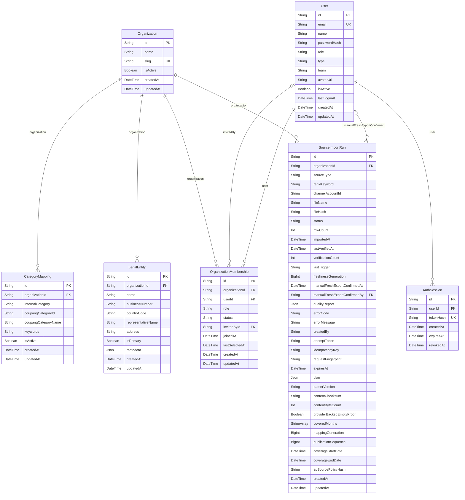

# Core ERD

> Generated from `prisma/models/*.prisma`. Do not edit by hand.
> Regenerate with `npm run db:erd` after Prisma schema changes.

[Back to full ERD](../ERD.md)

## Models

| Model | Table | Description |
|---|---|---|
| AuthSession | `auth_sessions` | Revocable KidItem-owned browser and extension authentication session. Only a SHA-256 token hash is persisted. |
| CategoryMapping | `category_mappings` | - |
| LegalEntity | `legal_entities` | Legal/business entity under an organization. This stores tax, invoice, and settlement identity separately from the SaaS organization boundary. |
| Organization | `organizations` | - |
| OrganizationMembership | `organization_memberships` | B2B customer/workspace membership. A user may belong to multiple organizations; this row supplies request organization and role. |
| SourceImportRun | `source_import_runs` | Durable provenance and publication fence for Sellpia and channel full-snapshot imports. |
| User | `users` | Human or system account. Organization membership is the source of truth. |

## Mermaid ER Diagram

```mermaid
erDiagram
  AuthSession {
    String id PK
    String userId FK
    String tokenHash UK
    DateTime createdAt
    DateTime expiresAt
    DateTime revokedAt
  }
  CategoryMapping {
    String id PK
    String organizationId FK
    String internalCategory
    String coupangCategoryId
    String coupangCategoryName
    String keywords
    Boolean isActive
    DateTime createdAt
    DateTime updatedAt
  }
  LegalEntity {
    String id PK
    String organizationId FK
    String name
    String businessNumber
    String countryCode
    String representativeName
    String address
    Boolean isPrimary
    Json metadata
    DateTime createdAt
    DateTime updatedAt
  }
  Organization {
    String id PK
    String name
    String slug UK
    Boolean isActive
    DateTime createdAt
    DateTime updatedAt
  }
  OrganizationMembership {
    String id PK
    String organizationId FK
    String userId FK
    String role
    String status
    String invitedById FK
    DateTime joinedAt
    DateTime lastSelectedAt
    DateTime createdAt
    DateTime updatedAt
  }
  SourceImportRun {
    String id PK
    String organizationId FK
    String sourceType
    String rankKeyword
    String channelAccountId
    String fileName
    String fileHash
    String status
    Int rowCount
    DateTime importedAt
    DateTime lastVerifiedAt
    Int verificationCount
    String lastTrigger
    BigInt freshnessGeneration
    DateTime manualFreshExportConfirmedAt
    String manualFreshExportConfirmedBy FK
    Json qualityReport
    String errorCode
    String errorMessage
    String createdBy
    String attemptToken
    String idempotencyKey
    String requestFingerprint
    DateTime expiresAt
    Json plan
    String parserVersion
    String contentChecksum
    Int contentByteCount
    Boolean providerBackedEmptyProof
    StringArray coveredMonths
    BigInt mappingGeneration
    BigInt publicationSequence
    DateTime coverageStartDate
    DateTime coverageEndDate
    String adSourcePolicyHash
    DateTime createdAt
    DateTime updatedAt
  }
  User {
    String id PK
    String email UK
    String name
    String passwordHash
    String role
    String type
    String team
    String avatarUrl
    Boolean isActive
    DateTime lastLoginAt
    DateTime createdAt
    DateTime updatedAt
  }
  Organization ||--o{ CategoryMapping : "organization"
  Organization ||--o{ LegalEntity : "organization"
  Organization ||--o{ OrganizationMembership : "organization"
  Organization ||--o{ SourceImportRun : "organization"
  User ||--o{ AuthSession : "user"
  User o|--o{ OrganizationMembership : "invitedBy"
  User ||--o{ OrganizationMembership : "user"
  User o|--o{ SourceImportRun : "manualFreshExportConfirmer"
```

## External References

| Local model | Relation | Direction | External domain | External model |
|---|---|---|---|---|
| Organization | organization | referenced by external | Advertising | AdAction |
| Organization | organization | referenced by external | Advertising | ChannelAdListingProductMonthlyFact |
| Organization | organization | referenced by external | Advertising | ChannelAdTargetDailySnapshot |
| Organization | organization | referenced by external | Advertising | CoupangKeywordRankDailySnapshot |
| Organization | organization | referenced by external | Advertising | CoupangKeywordSerpDailySnapshot |
| Organization | organization | referenced by external | Advertising | CoupangKeywordTracker |
| Organization | organization | referenced by external | Advertising | CoupangRepresentativeKeywordOverride |
| Organization | organization | referenced by external | Advertising | CoupangWingSalesRankDailySnapshot |
| Organization | organization | referenced by external | Advertising | CoupangWingTrackedProduct |
| Organization | organization | referenced by external | Advertising | CoupangWingTrackedProductDailySnapshot |
| Organization | organization | referenced by external | AgentOS | CapabilityInvocation |
| Organization | organization | referenced by external | AI | AiDirectJob |
| Organization | organization | referenced by external | AI | AiUsageRecord |
| Organization | organization | referenced by external | AI | ContentAsset |
| Organization | organization | referenced by external | AI | ContentGeneration |
| Organization | organization | referenced by external | AI | ContentGenerationAssetUsage |
| Organization | organization | referenced by external | AI | ContentGenerationGroup |
| Organization | organization | referenced by external | AI | ContentGenerationSource |
| Organization | organization | referenced by external | AI | ContentWorkspace |
| Organization | organization | referenced by external | AI | ContentWorkspaceThumbnailSelection |
| Organization | organization | referenced by external | AI | DetailPageArtifact |
| Organization | organization | referenced by external | AI | DetailPageImageArtifact |
| Organization | organization | referenced by external | AI | DetailPageImageRenderIntent |
| Organization | organization | referenced by external | AI | DetailPageRevision |
| Organization | organization | referenced by external | AI | Thumbnail |
| Organization | organization | referenced by external | AI | ThumbnailAnalysis |
| Organization | organization | referenced by external | AI | ThumbnailGeneration |
| Organization | organization | referenced by external | AI | ThumbnailGenerationCandidate |
| Organization | organization | referenced by external | AI | ThumbnailGenerationEvent |
| Organization | organization | referenced by external | AI | ThumbnailGenerationInputImage |
| Organization | organization | referenced by external | AI | ThumbnailTracking |
| Organization | organization | referenced by external | AI | ThumbnailTrackingDailySnapshot |
| Organization | organization | referenced by external | Analytics | SellpiaProductMonthlySales |
| Organization | organization | referenced by external | Analytics | SellpiaSalesDailySnapshot |
| Organization | organization | referenced by external | Finance | SalesPlan |
| Organization | organization | referenced by external | Inventory | ReturnTransfer |
| Organization | organization | referenced by external | Inventory | StockTransfer |
| Organization | organization | referenced by external | Inventory | Warehouse |
| Organization | organization | referenced by external | Orders | CoupangDirectPoSnapshot |
| Organization | organization | referenced by external | Orders | CoupangDirectTransportConsumption |
| Organization | organization | referenced by external | Orders | CoupangDirectTransportReceipt |
| Organization | organization | referenced by external | Orders | CoupangShipmentDateSummary |
| Organization | organization | referenced by external | Orders | Order |
| Organization | organization | referenced by external | Orders | OrderCollectionArtifact |
| Organization | organization | referenced by external | Orders | OrderLineItem |
| Organization | organization | referenced by external | Orders | Review |
| Organization | organization | referenced by external | Orders | ReviewCollectionChunk |
| Organization | organization | referenced by external | Orders | SellpiaOrderTransmissionIntent |
| Organization | organization | referenced by external | Orders | SellpiaOrderTransmissionIntentReconciliation |
| Organization | organization | referenced by external | Orders | Settlement |
| Organization | organization | referenced by external | Products | MasterProduct |
| Organization | organization | referenced by external | Products | MasterProductAbcEvaluation |
| Organization | organization | referenced by external | Products | MasterProductAbcFormulaState |
| Organization | organization | referenced by external | Products | MasterProductAbcFormulaVersion |
| Organization | organization | referenced by external | Products | MasterProductAbcGradeHistory |
| Organization | organization | referenced by external | Products | SellpiaInventoryState |
| Organization | organization | referenced by external | Sourcing | LiveCommerceBroadcastDailySnapshot |
| Organization | organization | referenced by external | Sourcing | LiveCommerceProductDailySnapshot |
| Organization | organization | referenced by external | Sourcing | NaverKeywordDailySnapshot |
| Organization | organization | referenced by external | Sourcing | NaverPopularKeywordDailySnapshot |
| Organization | organization | referenced by external | Sourcing | ShortsTrendDailySnapshot |
| Organization | organization | referenced by external | Sourcing | SourceRecord |
| Organization | organization | referenced by external | Sourcing | SourceRecordImage |
| Organization | organization | referenced by external | Sourcing | Sourcing1688OfferKeywordObservation |
| Organization | organization | referenced by external | Sourcing | SourcingCollectionSourceControl |
| Organization | organization | referenced by external | Sourcing | SourcingDecisionBatch |
| Organization | organization | referenced by external | Sourcing | SourcingDecisionBatchItem |
| Organization | organization | referenced by external | Sourcing | SourcingDecisionEvidence |
| Organization | organization | referenced by external | Sourcing | SourcingEvidenceIngestionRun |
| Organization | organization | referenced by external | Sourcing | SourcingEvidenceObservation |
| Organization | organization | referenced by external | Sourcing | SourcingInterestTarget |
| Organization | organization | referenced by external | Sourcing | SourcingKeywordPreference |
| Organization | organization | referenced by external | Sourcing | SourcingKeywordSuggestionFact |
| Organization | organization | referenced by external | Sourcing | SourcingLaunchCandidate |
| Organization | organization | referenced by external | Sourcing | SourcingMarketShadowFact |
| Organization | organization | referenced by external | Sourcing | SourcingNaverKeywordAnalysisFact |
| Organization | organization | referenced by external | Sourcing | SourcingOwnerIdempotencyReceipt |
| Organization | organization | referenced by external | Sourcing | SourcingRecommendationItem |
| Organization | organization | referenced by external | Sourcing | SourcingRecommendationItemEvidence |
| Organization | organization | referenced by external | Sourcing | SourcingRecommendationRun |
| Organization | organization | referenced by external | Sourcing | SourcingReviewBatch |
| Organization | organization | referenced by external | Sourcing | SourcingReviewBatchItem |
| Organization | organization | referenced by external | Sourcing | SourcingReviewSelection |
| Organization | organization | referenced by external | Sourcing | SourcingValidationCheck |
| Organization | organization | referenced by external | Sourcing | SourcingValidationCheckEvidence |
| Organization | organization | referenced by external | Sourcing | SourcingValidationEpisode |
| Organization | organization | referenced by external | Sourcing | SourcingWingCatalogProductFact |
| Organization | organization | referenced by external | Sourcing | SourcingWorkspaceSnapshot |
| Organization | organization | referenced by external | Sourcing | TiktokCreativeTrendDailySnapshot |
| Organization | organization | referenced by external | Sourcing | TrendSeedKeyword |
| Organization | organization | referenced by external | Supply | ProcurementTestIntent |
| Organization | organization | referenced by external | Supply | PurchaseOrder |
| Organization | organization | referenced by external | Supply | PurchaseOrderItem |
| Organization | organization | referenced by external | Supply | PurchaseOrderSubmissionAttempt |
| Organization | organization | referenced by external | Supply | RocketPurchaseConfirmation |
| Organization | organization | referenced by external | Supply | RocketPurchaseConfirmationAllocation |
| Organization | organization | referenced by external | Supply | RocketPurchaseConfirmationLine |
| Organization | organization | referenced by external | Supply | RocketPurchaseConfirmationTransmission |
| Organization | organization | referenced by external | Supply | Supplier |
| Organization | organization | referenced by external | Supply | SupplierOfferPriceTier |
| Organization | organization | referenced by external | Supply | SupplierOfferSkuSnapshot |
| Organization | organization | referenced by external | Supply | SupplierPayment |
| Organization | organization | referenced by external | Supply | SupplierProduct |
| Organization | organization | referenced by external | System | Alert |
| Organization | organization | referenced by external | System | SystemSetting |
| Organization | organization | referenced by external | System | TodoItem |
| SourceImportRun | advertisingSourceImportRun | referenced by external | Products | MasterProductAbcEvaluation |
| SourceImportRun | effectSourceImportRun | referenced by external | Orders | CoupangDirectTransportReceipt |
| SourceImportRun | lastCompletedImportRun | referenced by external | Products | SellpiaInventoryState |
| SourceImportRun | nextAdvertisingSourceImportRun | referenced by external | Products | MasterProductAbcGradeHistory |
| SourceImportRun | nextSellpiaSourceImportRun | referenced by external | Products | MasterProductAbcGradeHistory |
| SourceImportRun | previousAdvertisingSourceImportRun | referenced by external | Products | MasterProductAbcGradeHistory |
| SourceImportRun | previousSellpiaSourceImportRun | referenced by external | Products | MasterProductAbcGradeHistory |
| SourceImportRun | publishedAdvertisingSourceImportRun | referenced by external | Products | MasterProductAbcFormulaState |
| SourceImportRun | publishedSellpiaSourceImportRun | referenced by external | Products | MasterProductAbcFormulaState |
| SourceImportRun | sellpiaSourceImportRun | referenced by external | Products | MasterProductAbcEvaluation |
| SourceImportRun | sourceImportRun | referenced by external | Advertising | ChannelAdListingProductMonthlyFact |
| SourceImportRun | sourceImportRun | referenced by external | Advertising | ChannelAdTargetDailySnapshot |
| SourceImportRun | sourceImportRun | referenced by external | Advertising | CoupangKeywordRankDailySnapshot |
| SourceImportRun | sourceImportRun | referenced by external | Advertising | CoupangKeywordSerpDailySnapshot |
| SourceImportRun | sourceImportRun | referenced by external | Advertising | CoupangWingSalesRankDailySnapshot |
| SourceImportRun | sourceImportRun | referenced by external | Analytics | SellpiaProductMonthlySales |
| SourceImportRun | sourceImportRun | referenced by external | Analytics | SellpiaSalesDailySnapshot |
| SourceImportRun | sourceImportRun | referenced by external | Orders | CoupangDirectTransportConsumption |
| SourceImportRun | sourceImportRun | referenced by external | Orders | CoupangShipmentDateSummary |
| SourceImportRun | sourceImportRun | referenced by external | Orders | Order |
| SourceImportRun | sourceImportRun | referenced by external | Orders | OrderCollectionArtifact |
| SourceImportRun | sourceImportRun | referenced by external | Orders | Review |
| SourceImportRun | sourceImportRun | referenced by external | Orders | ReviewCollectionChunk |
| SourceImportRun | sourceImportRun | referenced by external | Supply | RocketPurchaseConfirmation |
| SourceImportRun | sourceImportRun | referenced by external | Supply | RocketPurchaseConfirmationTransmission |
| User | activeSyncOwner | referenced by external | Products | SellpiaInventoryState |
| User | actor | referenced by external | AI | ThumbnailGenerationEvent |
| User | approvalDecidedByUser | referenced by external | AgentOS | CapabilityInvocation |
| User | claimedBy | referenced by external | AI | DetailPageImageRenderIntent |
| User | confirmer | referenced by external | Supply | RocketPurchaseConfirmation |
| User | createdBy | referenced by external | AI | DetailPageImageArtifact |
| User | createdByUser | referenced by external | AI | ContentAsset |
| User | createdByUser | referenced by external | AI | ContentWorkspace |
| User | createdByUser | referenced by external | AI | ContentWorkspaceThumbnailSelection |
| User | createdByUser | referenced by external | AI | DetailPageArtifact |
| User | createdByUser | referenced by external | AI | DetailPageRevision |
| User | createdByUser | referenced by external | Sourcing | SourcingLaunchCandidate |
| User | creator | referenced by external | Orders | SellpiaOrderTransmissionIntent |
| User | initiatingUser | referenced by external | AgentOS | CapabilityInvocation |
| User | reconciler | referenced by external | Orders | SellpiaOrderTransmissionIntentReconciliation |
| User | reconciler | referenced by external | Supply | PurchaseOrderSubmissionAttempt |
| User | requestedBy | referenced by external | AI | DetailPageImageRenderIntent |
| User | requestedBy | referenced by external | Sourcing | SourcingReviewBatch |
| User | requestedByUser | referenced by external | Sourcing | SourcingDecisionBatch |
| User | requestedByUser | referenced by external | Supply | ProcurementTestIntent |
| User | reviewedByUser | referenced by external | Supply | ProcurementTestIntent |
| User | triggeredByUser | referenced by external | AI | ContentGeneration |
| User | triggeredByUser | referenced by external | AI | ThumbnailGeneration |
| User | triggeredByUser | referenced by external | Sourcing | SourceRecord |
| User | triggeredByUser | referenced by external | Sourcing | SourcingEvidenceIngestionRun |
