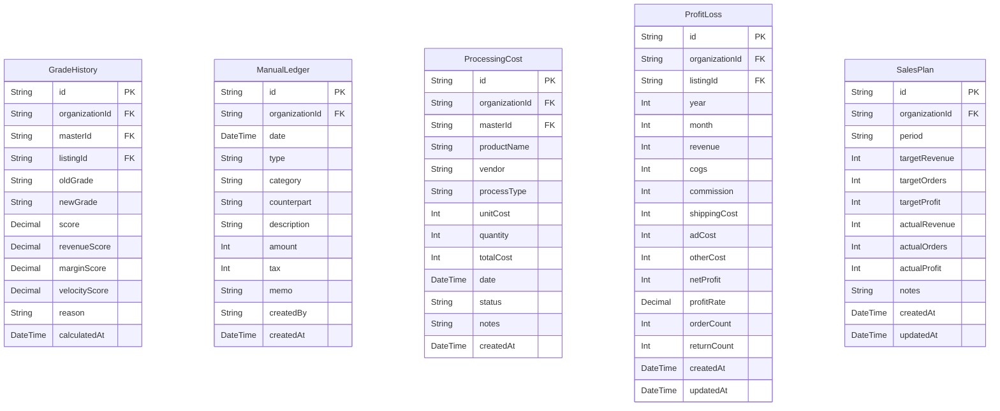

# Finance ERD

> Generated from `prisma/models/*.prisma`. Do not edit by hand.
> Regenerate with `npm run db:erd` or `npm run graphify:schema`.

[Back to full ERD](../ERD.md)

## Models

| Model | Table | Description |
|---|---|---|
| GradeHistory | `grade_histories` | ABC 등급 변경 추적. |
| ManualLedger | `manual_ledgers` | 자동 집계 외 수기 수입/지출. |
| ProcessingCost | `processing_costs` | - |
| ProfitLoss | `profit_loss` | 월간 손익. organizationId+listingId+year+month unique. |
| SalesPlan | `sales_plans` | - |

## Mermaid ER Diagram

## External References

| Local model | Relation | Direction | External domain | External model |
|---|---|---|---|---|
| GradeHistory | listing | references external | Core | ChannelListing |
| GradeHistory | master | references external | Core | MasterProduct |
| GradeHistory | organization | references external | Core | Organization |
| ManualLedger | organization | references external | Core | Organization |
| ProcessingCost | master | references external | Core | MasterProduct |
| ProcessingCost | organization | references external | Core | Organization |
| ProfitLoss | listing | references external | Core | ChannelListing |
| ProfitLoss | organization | references external | Core | Organization |
| SalesPlan | organization | references external | Core | Organization |
