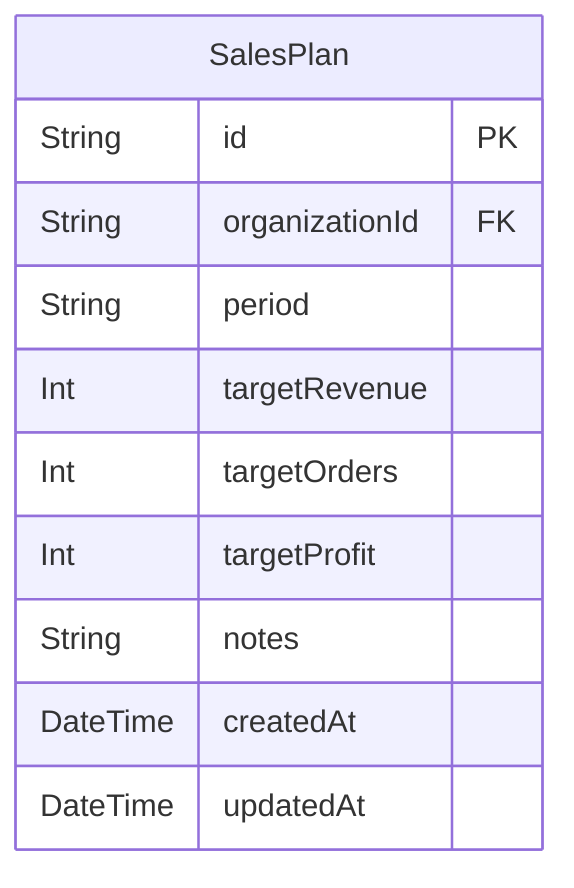

# Finance ERD

> Generated from `prisma/models/*.prisma`. Do not edit by hand.
> Regenerate with `npm run db:erd` after Prisma schema changes.

[Back to full ERD](../ERD.md)

## Models

| Model | Table | Description |
|---|---|---|
| SalesPlan | `sales_plans` | - |

## Mermaid ER Diagram

```mermaid
erDiagram
  SalesPlan {
    String id PK
    String organizationId FK
    String period
    Int targetRevenue
    Int targetOrders
    Int targetProfit
    String notes
    DateTime createdAt
    DateTime updatedAt
  }
```

## External References

| Local model | Relation | Direction | External domain | External model |
|---|---|---|---|---|
| SalesPlan | organization | references external | Core | Organization |
