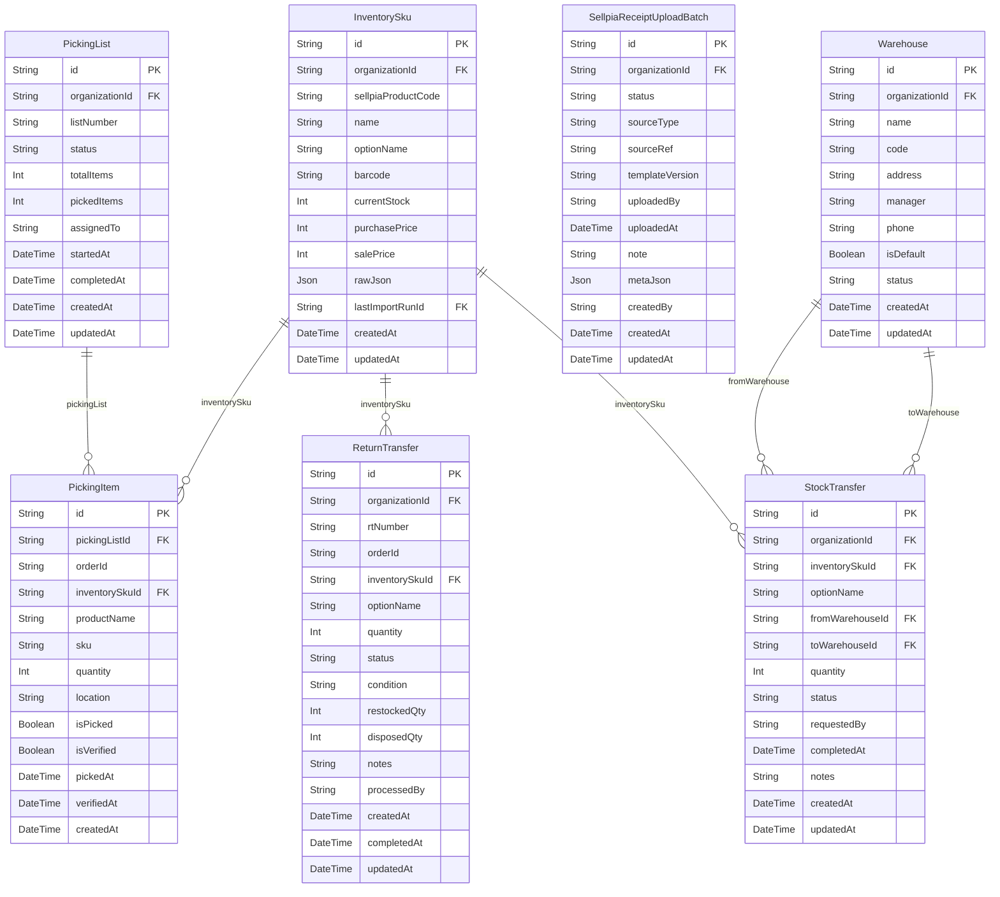

# Inventory ERD

> Generated from `prisma/models/*.prisma`. Do not edit by hand.
> Regenerate with `npm run db:erd` or `npm run graphify:schema`.

[Back to full ERD](../ERD.md)

## Models

| Model | Table | Description |
|---|---|---|
| InventorySku | `inventory_skus` | Sellpia 상품코드 한 행에 대응하는 물리 재고 SKU. currentStock 은 완료된 Sellpia 전체 스냅샷만 교체한다. |
| PickingItem | `picking_items` | - |
| PickingList | `picking_lists` | - |
| ReturnTransfer | `return_transfers` | - |
| SellpiaReceiptUploadBatch | `sellpia_receipt_upload_batches` | KidItem receipt batch that still needs Sellpia upload confirmation. |
| StockTransfer | `stock_transfers` | 창고 간 이동 (from → to warehouse). |
| Warehouse | `warehouses` | - |

## Mermaid ER Diagram

## External References

| Local model | Relation | Direction | External domain | External model |
|---|---|---|---|---|
| InventorySku | inventorySku | referenced by external | Channels | ChannelSkuComponent |
| InventorySku | lastImportRun | references external | Core | SourceImportRun |
| InventorySku | organization | references external | Core | Organization |
| PickingList | organization | references external | Core | Organization |
| ReturnTransfer | organization | references external | Core | Organization |
| SellpiaReceiptUploadBatch | organization | references external | Core | Organization |
| StockTransfer | organization | references external | Core | Organization |
| Warehouse | organization | references external | Core | Organization |
| Warehouse | warehouse | referenced by external | Orders | Shipment |
