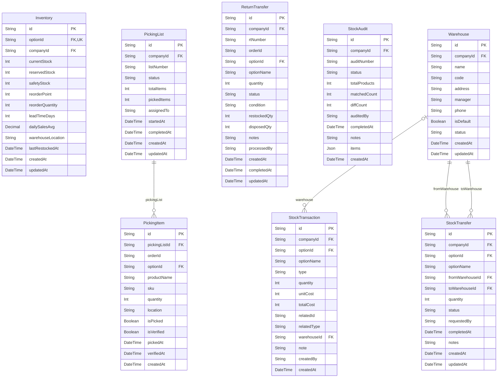

# Inventory ERD

> Generated from `prisma/models/*.prisma`. Do not edit by hand.
> Regenerate with `npm run db:erd` or `npm run graphify:schema`.

[Back to full ERD](../ERD.md)

## Models

| Model | Table | Description |
|---|---|---|
| Inventory | `inventory` | ProductOption 에 1:1. Bundle option 은 inventory 미생성 (availableStock 계산값 사용). |
| PickingItem | `picking_items` | - |
| PickingList | `picking_lists` | - |
| ReturnTransfer | `return_transfers` | - |
| StockAudit | `stock_audits` | - |
| StockTransaction | `stock_transactions` | - |
| StockTransfer | `stock_transfers` | 창고 간 이동 (from → to warehouse). |
| Warehouse | `warehouses` | - |

## Mermaid ER Diagram

## External References

| Local model | Relation | Direction | External domain | External model |
|---|---|---|---|---|
| Inventory | company | references external | Core | Company |
| Inventory | option | references external | Core | ProductOption |
| PickingItem | option | references external | Core | ProductOption |
| PickingList | company | references external | Core | Company |
| ReturnTransfer | company | references external | Core | Company |
| ReturnTransfer | option | references external | Core | ProductOption |
| StockAudit | company | references external | Core | Company |
| StockTransaction | company | references external | Core | Company |
| StockTransaction | option | references external | Core | ProductOption |
| StockTransfer | company | references external | Core | Company |
| StockTransfer | option | references external | Core | ProductOption |
| Warehouse | company | references external | Core | Company |
| Warehouse | warehouse | referenced by external | Orders | Shipment |
