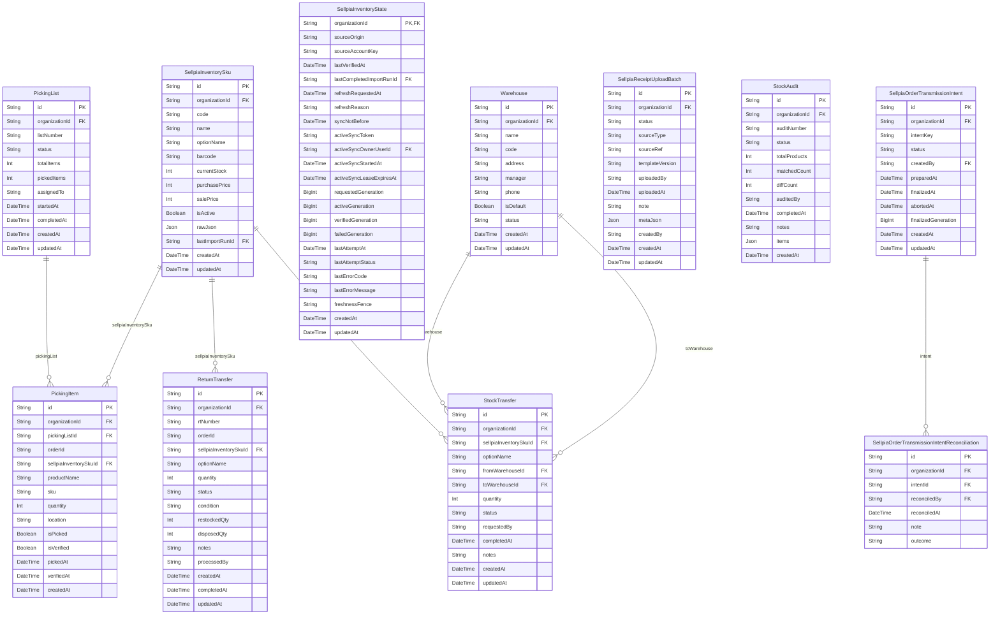

# Inventory ERD

> Generated from `prisma/models/*.prisma`. Do not edit by hand.
> Regenerate with `npm run db:erd` or `npm run graphify:schema`.

[Back to full ERD](../ERD.md)

## Models

| Model | Table | Description |
|---|---|---|
| PickingItem | `picking_items` | - |
| PickingList | `picking_lists` | - |
| ReturnTransfer | `return_transfers` | - |
| SellpiaInventorySku | `sellpia_inventory_skus` | One physical Sellpia product-code row and its latest imported current stock. |
| SellpiaInventoryState | `sellpia_inventory_states` | Organization-scoped Sellpia inventory trust state, source binding, generation fence, and active collection lease. |
| SellpiaOrderTransmissionIntent | `sellpia_order_transmission_intents` | Organization-scoped idempotency fence for browser Sellpia order transmission and its post-submit inventory generation. |
| SellpiaOrderTransmissionIntentReconciliation | `sellpia_order_transmission_intent_reconciliations` | Append-only owner/admin audit for resolving an ambiguous Sellpia order transmission outcome. |
| SellpiaReceiptUploadBatch | `sellpia_receipt_upload_batches` | Record of an operator-confirmed receipt file upload to Sellpia. |
| StockAudit | `stock_audits` | - |
| StockTransfer | `stock_transfers` | Warehouse-to-warehouse movement record. It never mutates SellpiaInventorySku.currentStock. |
| Warehouse | `warehouses` | - |

## Mermaid ER Diagram

## External References

| Local model | Relation | Direction | External domain | External model |
|---|---|---|---|---|
| PickingItem | organization | references external | Core | Organization |
| PickingList | organization | references external | Core | Organization |
| ReturnTransfer | organization | references external | Core | Organization |
| SellpiaInventorySku | lastImportRun | references external | Core | SourceImportRun |
| SellpiaInventorySku | organization | references external | Core | Organization |
| SellpiaInventorySku | sellpiaInventorySku | referenced by external | Core | ProductVariantComponent |
| SellpiaInventorySku | sellpiaInventorySku | referenced by external | Supply | PurchaseOrderItem |
| SellpiaInventorySku | sellpiaInventorySku | referenced by external | Supply | RocketPurchaseConfirmationAllocation |
| SellpiaInventorySku | sellpiaInventorySku | referenced by external | Supply | SupplierProduct |
| SellpiaInventoryState | activeSyncOwner | references external | Core | User |
| SellpiaInventoryState | lastCompletedImportRun | references external | Core | SourceImportRun |
| SellpiaInventoryState | organization | references external | Core | Organization |
| SellpiaOrderTransmissionIntent | creator | references external | Core | User |
| SellpiaOrderTransmissionIntent | organization | references external | Core | Organization |
| SellpiaOrderTransmissionIntentReconciliation | organization | references external | Core | Organization |
| SellpiaOrderTransmissionIntentReconciliation | reconciler | references external | Core | User |
| SellpiaReceiptUploadBatch | organization | references external | Core | Organization |
| StockAudit | organization | references external | Core | Organization |
| StockTransfer | organization | references external | Core | Organization |
| Warehouse | organization | references external | Core | Organization |
| Warehouse | warehouse | referenced by external | Orders | Shipment |
