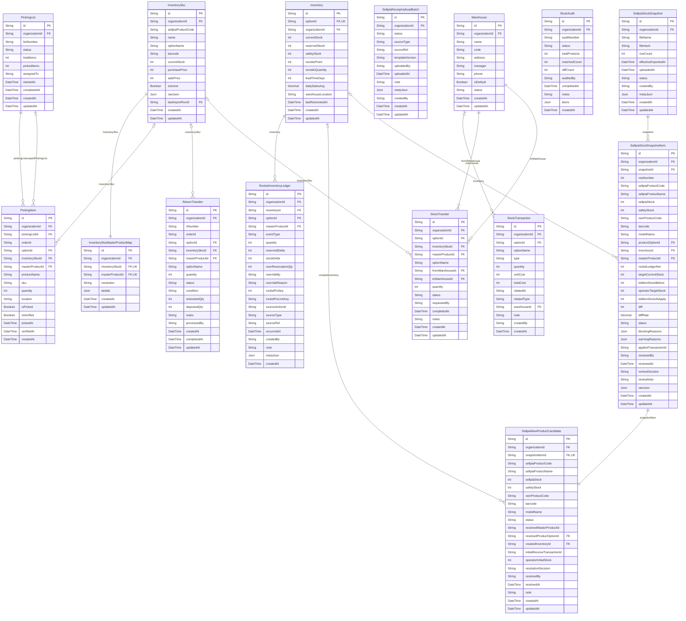

# Inventory ERD

> Generated from `prisma/models/*.prisma`. Do not edit by hand.
> Regenerate with `npm run db:erd` or `npm run graphify:schema`.

[Back to full ERD](../ERD.md)

## Models

| Model | Table | Description |
|---|---|---|
| Inventory | `inventory` | ProductOption 에 1:1. Bundle option 은 inventory 미생성 (availableStock 계산값 사용). |
| InventorySku | `inventory_skus` | 0.1.8 dual-write Sellpia row retained until the MasterProduct cutover contracts in 0.1.10. |
| InventorySkuMasterProductMap | `inventory_sku_master_product_maps` | Audited one-to-one identity ledger between the legacy InventorySku and staged physical MasterProduct. |
| PickingItem | `picking_items` | - |
| PickingList | `picking_lists` | - |
| ReturnTransfer | `return_transfers` | - |
| RocketInventoryLedger | `rocket_inventory_ledger` | Coupang Rocket stock event ledger. Sellpia never contains these effects. |
| SellpiaNewProductCandidate | `sellpia_new_product_candidates` | Unmatched Sellpia row that must be explicitly created, linked, ignored, or rejected. |
| SellpiaReceiptUploadBatch | `sellpia_receipt_upload_batches` | KidItem receipt batch that still needs Sellpia upload confirmation. |
| SellpiaStockSnapshot | `sellpia_stock_snapshots` | Sellpia stock export import attempt. Imports are row-scoped; absent products are ignored. |
| SellpiaStockSnapshotItem | `sellpia_stock_snapshot_items` | One imported Sellpia product row with recommendation/review state. |
| StockAudit | `stock_audits` | - |
| StockTransaction | `stock_transactions` | - |
| StockTransfer | `stock_transfers` | 창고 간 이동 (from → to warehouse). |
| Warehouse | `warehouses` | - |

## Mermaid ER Diagram

## External References

| Local model | Relation | Direction | External domain | External model |
|---|---|---|---|---|
| Inventory | option | references external | Core | ProductOption |
| Inventory | organization | references external | Core | Organization |
| InventorySku | inventorySku | referenced by external | Channels | ChannelSkuComponent |
| InventorySku | lastImportRun | references external | Core | SourceImportRun |
| InventorySku | organization | references external | Core | Organization |
| InventorySkuMasterProductMap | masterProduct | references external | Core | MasterProduct |
| InventorySkuMasterProductMap | organization | references external | Core | Organization |
| PickingItem | masterProduct | references external | Core | MasterProduct |
| PickingItem | option | references external | Core | ProductOption |
| PickingItem | organization | references external | Core | Organization |
| PickingList | organization | references external | Core | Organization |
| ReturnTransfer | masterProduct | references external | Core | MasterProduct |
| ReturnTransfer | option | references external | Core | ProductOption |
| ReturnTransfer | organization | references external | Core | Organization |
| RocketInventoryLedger | masterProduct | references external | Core | MasterProduct |
| RocketInventoryLedger | option | references external | Core | ProductOption |
| RocketInventoryLedger | organization | references external | Core | Organization |
| SellpiaNewProductCandidate | organization | references external | Core | Organization |
| SellpiaNewProductCandidate | resolvedOption | references external | Core | ProductOption |
| SellpiaReceiptUploadBatch | organization | references external | Core | Organization |
| SellpiaStockSnapshot | organization | references external | Core | Organization |
| SellpiaStockSnapshotItem | masterProduct | references external | Core | MasterProduct |
| SellpiaStockSnapshotItem | option | references external | Core | ProductOption |
| SellpiaStockSnapshotItem | organization | references external | Core | Organization |
| StockAudit | organization | references external | Core | Organization |
| StockTransaction | option | references external | Core | ProductOption |
| StockTransaction | organization | references external | Core | Organization |
| StockTransfer | masterProduct | references external | Core | MasterProduct |
| StockTransfer | option | references external | Core | ProductOption |
| StockTransfer | organization | references external | Core | Organization |
| Warehouse | organization | references external | Core | Organization |
| Warehouse | warehouse | referenced by external | Orders | Shipment |
