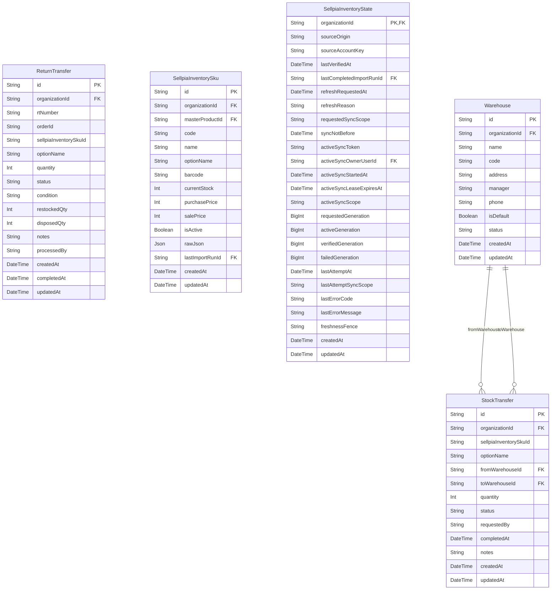

# Inventory ERD

> Generated from `prisma/models/*.prisma`. Do not edit by hand.
> Regenerate with `npm run db:erd` after Prisma schema changes.

[Back to full ERD](../ERD.md)

## Models

| Model | Table | Description |
|---|---|---|
| ReturnTransfer | `return_transfers` | - |
| SellpiaInventorySku | `sellpia_inventory_skus` | One physical Sellpia source SKU owned by at most one canonical MasterProduct, with its latest imported current stock. |
| SellpiaInventoryState | `sellpia_inventory_states` | Organization-scoped Sellpia inventory trust state, source binding, generation fence, and active collection lease. |
| StockTransfer | `stock_transfers` | Warehouse-to-warehouse movement record. It never mutates SellpiaInventorySku.currentStock. |
| Warehouse | `warehouses` | - |

## Mermaid ER Diagram

```mermaid
erDiagram
  ReturnTransfer {
    String id PK
    String organizationId FK
    String rtNumber
    String orderId
    String sellpiaInventorySkuId
    String optionName
    Int quantity
    String status
    String condition
    Int restockedQty
    Int disposedQty
    String notes
    String processedBy
    DateTime createdAt
    DateTime completedAt
    DateTime updatedAt
  }
  SellpiaInventorySku {
    String id PK
    String organizationId FK
    String masterProductId FK
    String code
    String name
    String optionName
    String barcode
    Int currentStock
    Int purchasePrice
    Int salePrice
    Boolean isActive
    Json rawJson
    String lastImportRunId FK
    DateTime createdAt
    DateTime updatedAt
  }
  SellpiaInventoryState {
    String organizationId PK,FK
    String sourceOrigin
    String sourceAccountKey
    DateTime lastVerifiedAt
    String lastCompletedImportRunId FK
    DateTime refreshRequestedAt
    String refreshReason
    String requestedSyncScope
    DateTime syncNotBefore
    String activeSyncToken
    String activeSyncOwnerUserId FK
    DateTime activeSyncStartedAt
    DateTime activeSyncLeaseExpiresAt
    String activeSyncScope
    BigInt requestedGeneration
    BigInt activeGeneration
    BigInt verifiedGeneration
    BigInt failedGeneration
    DateTime lastAttemptAt
    String lastAttemptSyncScope
    String lastErrorCode
    String lastErrorMessage
    String freshnessFence
    DateTime createdAt
    DateTime updatedAt
  }
  StockTransfer {
    String id PK
    String organizationId FK
    String sellpiaInventorySkuId
    String optionName
    String fromWarehouseId FK
    String toWarehouseId FK
    Int quantity
    String status
    String requestedBy
    DateTime completedAt
    String notes
    DateTime createdAt
    DateTime updatedAt
  }
  Warehouse {
    String id PK
    String organizationId FK
    String name
    String code
    String address
    String manager
    String phone
    Boolean isDefault
    String status
    DateTime createdAt
    DateTime updatedAt
  }
  Warehouse ||--o{ StockTransfer : "fromWarehouse"
  Warehouse ||--o{ StockTransfer : "toWarehouse"
```

## External References

| Local model | Relation | Direction | External domain | External model |
|---|---|---|---|---|
| ReturnTransfer | organization | references external | Core | Organization |
| SellpiaInventorySku | lastImportRun | references external | Core | SourceImportRun |
| SellpiaInventorySku | masterProduct | references external | Core | MasterProduct |
| SellpiaInventorySku | organization | references external | Core | Organization |
| SellpiaInventoryState | activeSyncOwner | references external | Core | User |
| SellpiaInventoryState | lastCompletedImportRun | references external | Core | SourceImportRun |
| SellpiaInventoryState | organization | references external | Core | Organization |
| StockTransfer | organization | references external | Core | Organization |
| Warehouse | organization | references external | Core | Organization |
