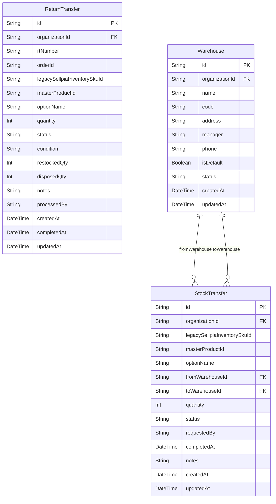

# Inventory ERD

> Generated from `prisma/models/*.prisma`. Do not edit by hand.
> Regenerate with `npm run db:erd` after Prisma schema changes.

[Back to full ERD](../ERD.md)

## Models

| Model | Table | Description |
|---|---|---|
| ReturnTransfer | `return_transfers` | - |
| StockTransfer | `stock_transfers` | Warehouse-to-warehouse movement record. It never mutates MasterProduct.currentStock. |
| Warehouse | `warehouses` | - |

## Mermaid ER Diagram

```mermaid
erDiagram
  ReturnTransfer {
    String id PK
    String organizationId FK
    String rtNumber
    String orderId
    String legacySellpiaInventorySkuId
    String masterProductId
    String optionName
    Int quantity
    String status
    String condition
    Int restockedQty
    Int disposedQty
    String notes
    String processedBy
    DateTime createdAt
    DateTime completedAt
    DateTime updatedAt
  }
  StockTransfer {
    String id PK
    String organizationId FK
    String legacySellpiaInventorySkuId
    String masterProductId
    String optionName
    String fromWarehouseId FK
    String toWarehouseId FK
    Int quantity
    String status
    String requestedBy
    DateTime completedAt
    String notes
    DateTime createdAt
    DateTime updatedAt
  }
  Warehouse {
    String id PK
    String organizationId FK
    String name
    String code
    String address
    String manager
    String phone
    Boolean isDefault
    String status
    DateTime createdAt
    DateTime updatedAt
  }
  Warehouse ||--o{ StockTransfer : "fromWarehouse"
  Warehouse ||--o{ StockTransfer : "toWarehouse"
```

## External References

| Local model | Relation | Direction | External domain | External model |
|---|---|---|---|---|
| ReturnTransfer | organization | references external | Core | Organization |
| StockTransfer | organization | references external | Core | Organization |
| Warehouse | organization | references external | Core | Organization |
