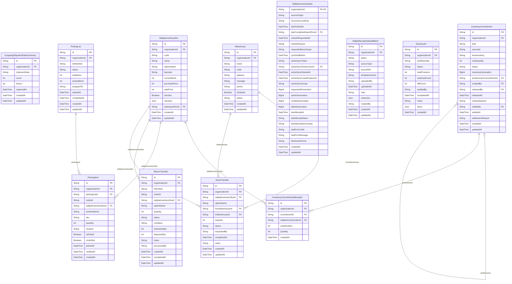

# Inventory ERD

> Generated from `prisma/models/*.prisma`. Do not edit by hand.
> Regenerate with `npm run db:erd` or `npm run graphify:schema`.

[Back to full ERD](../ERD.md)

## Models

| Model | Table | Description |
|---|---|---|
| CoupangShipmentDateSummary | `coupang_shipment_date_summaries` | Persisted Coupang shipment 발송일별 건수/박스 요약 snapshot so the calendar survives reload and only new dates are collected. |
| InventoryCommitment | `inventory_commitments` | Physical-stock-independent commitment that reduces common available Sellpia capacity. |
| InventoryCommitmentAllocation | `inventory_commitment_allocations` | Component-level Sellpia SKU quantity held by one inventory commitment. |
| PickingItem | `picking_items` | - |
| PickingList | `picking_lists` | - |
| ReturnTransfer | `return_transfers` | - |
| SellpiaInventorySku | `sellpia_inventory_skus` | One physical Sellpia product-code row and its latest imported current stock. |
| SellpiaInventoryState | `sellpia_inventory_states` | Organization-scoped Sellpia inventory trust state, source binding, generation fence, and active collection lease. |
| SellpiaReceiptUploadBatch | `sellpia_receipt_upload_batches` | Record of an operator-confirmed receipt file upload to Sellpia. |
| StockAudit | `stock_audits` | - |
| StockTransfer | `stock_transfers` | Warehouse-to-warehouse movement record. It never mutates SellpiaInventorySku.currentStock. |
| Warehouse | `warehouses` | - |

## Mermaid ER Diagram

```mermaid
erDiagram
  CoupangShipmentDateSummary {
    String id PK
    String organizationId FK
    String shipmentDate
    Int count
    Int boxes
    DateTime capturedAt
    DateTime createdAt
    DateTime updatedAt
  }
  InventoryCommitment {
    String id PK
    String organizationId FK
    String kind
    String sourceId
    String businessKey
    Int unitQuantity
    String status
    BigInt inventoryGeneration
    String predecessorCommitmentId FK
    String createdBy FK
    String releasedBy FK
    DateTime releasedAt
    String releaseReason
    String settledBy FK
    DateTime settledAt
    String settlementReason
    DateTime createdAt
    DateTime updatedAt
  }
  InventoryCommitmentAllocation {
    String id PK
    String organizationId FK
    String commitmentId FK
    String sellpiaInventorySkuId FK
    Int unitsPerItem
    Int quantity
    DateTime createdAt
  }
  PickingItem {
    String id PK
    String organizationId FK
    String pickingListId FK
    String orderId
    String sellpiaInventorySkuId FK
    String productName
    String sku
    Int quantity
    String location
    Boolean isPicked
    Boolean isVerified
    DateTime pickedAt
    DateTime verifiedAt
    DateTime createdAt
  }
  PickingList {
    String id PK
    String organizationId FK
    String listNumber
    String status
    Int totalItems
    Int pickedItems
    String assignedTo
    DateTime startedAt
    DateTime completedAt
    DateTime createdAt
    DateTime updatedAt
  }
  ReturnTransfer {
    String id PK
    String organizationId FK
    String rtNumber
    String orderId
    String sellpiaInventorySkuId FK
    String optionName
    Int quantity
    String status
    String condition
    Int restockedQty
    Int disposedQty
    String notes
    String processedBy
    DateTime createdAt
    DateTime completedAt
    DateTime updatedAt
  }
  SellpiaInventorySku {
    String id PK
    String organizationId FK
    String code
    String name
    String optionName
    String barcode
    Int currentStock
    Int purchasePrice
    Int salePrice
    Boolean isActive
    Json rawJson
    String lastImportRunId FK
    DateTime createdAt
    DateTime updatedAt
  }
  SellpiaInventoryState {
    String organizationId PK,FK
    String sourceOrigin
    String sourceAccountKey
    DateTime lastVerifiedAt
    String lastCompletedImportRunId FK
    DateTime refreshRequestedAt
    String refreshReason
    String requestedSyncScope
    DateTime syncNotBefore
    String activeSyncToken
    String activeSyncOwnerUserId FK
    DateTime activeSyncStartedAt
    DateTime activeSyncLeaseExpiresAt
    String activeSyncScope
    BigInt requestedGeneration
    BigInt activeGeneration
    BigInt verifiedGeneration
    BigInt failedGeneration
    DateTime lastAttemptAt
    String lastAttemptStatus
    String lastAttemptSyncScope
    String lastErrorCode
    String lastErrorMessage
    String freshnessFence
    DateTime createdAt
    DateTime updatedAt
  }
  SellpiaReceiptUploadBatch {
    String id PK
    String organizationId FK
    String status
    String sourceType
    String sourceRef
    String templateVersion
    String uploadedBy
    DateTime uploadedAt
    String note
    Json metaJson
    String createdBy
    DateTime createdAt
    DateTime updatedAt
  }
  StockAudit {
    String id PK
    String organizationId FK
    String auditNumber
    String status
    Int totalProducts
    Int matchedCount
    Int diffCount
    String auditedBy
    DateTime completedAt
    String notes
    Json items
    DateTime createdAt
  }
  StockTransfer {
    String id PK
    String organizationId FK
    String sellpiaInventorySkuId FK
    String optionName
    String fromWarehouseId FK
    String toWarehouseId FK
    Int quantity
    String status
    String requestedBy
    DateTime completedAt
    String notes
    DateTime createdAt
    DateTime updatedAt
  }
  Warehouse {
    String id PK
    String organizationId FK
    String name
    String code
    String address
    String manager
    String phone
    Boolean isDefault
    String status
    DateTime createdAt
    DateTime updatedAt
  }
  InventoryCommitment o|--o{ InventoryCommitment : "predecessor"
  InventoryCommitment ||--o{ InventoryCommitmentAllocation : "commitment"
  PickingList ||--o{ PickingItem : "pickingList"
  SellpiaInventorySku ||--o{ InventoryCommitmentAllocation : "sellpiaInventorySku"
  SellpiaInventorySku ||--o{ PickingItem : "sellpiaInventorySku"
  SellpiaInventorySku ||--o{ ReturnTransfer : "sellpiaInventorySku"
  SellpiaInventorySku ||--o{ StockTransfer : "sellpiaInventorySku"
  Warehouse ||--o{ StockTransfer : "fromWarehouse"
  Warehouse ||--o{ StockTransfer : "toWarehouse"
```

## External References

| Local model | Relation | Direction | External domain | External model |
|---|---|---|---|---|
| CoupangShipmentDateSummary | organization | references external | Core | Organization |
| InventoryCommitment | creator | references external | Core | User |
| InventoryCommitment | organization | references external | Core | Organization |
| InventoryCommitment | releaser | references external | Core | User |
| InventoryCommitment | settler | references external | Core | User |
| InventoryCommitmentAllocation | organization | references external | Core | Organization |
| PickingItem | organization | references external | Core | Organization |
| PickingList | organization | references external | Core | Organization |
| ReturnTransfer | organization | references external | Core | Organization |
| SellpiaInventorySku | lastImportRun | references external | Core | SourceImportRun |
| SellpiaInventorySku | organization | references external | Core | Organization |
| SellpiaInventorySku | sellpiaInventorySku | referenced by external | Channels | SellpiaManualMatchAlias |
| SellpiaInventorySku | sellpiaInventorySku | referenced by external | Core | ProductVariantComponent |
| SellpiaInventorySku | sellpiaInventorySku | referenced by external | Supply | PurchaseOrderItem |
| SellpiaInventorySku | sellpiaInventorySku | referenced by external | Supply | RocketPurchaseConfirmationAllocation |
| SellpiaInventorySku | sellpiaInventorySku | referenced by external | Supply | SupplierProduct |
| SellpiaInventoryState | activeSyncOwner | references external | Core | User |
| SellpiaInventoryState | lastCompletedImportRun | references external | Core | SourceImportRun |
| SellpiaInventoryState | organization | references external | Core | Organization |
| SellpiaReceiptUploadBatch | organization | references external | Core | Organization |
| StockAudit | organization | references external | Core | Organization |
| StockTransfer | organization | references external | Core | Organization |
| Warehouse | organization | references external | Core | Organization |
| Warehouse | warehouse | referenced by external | Orders | Shipment |
