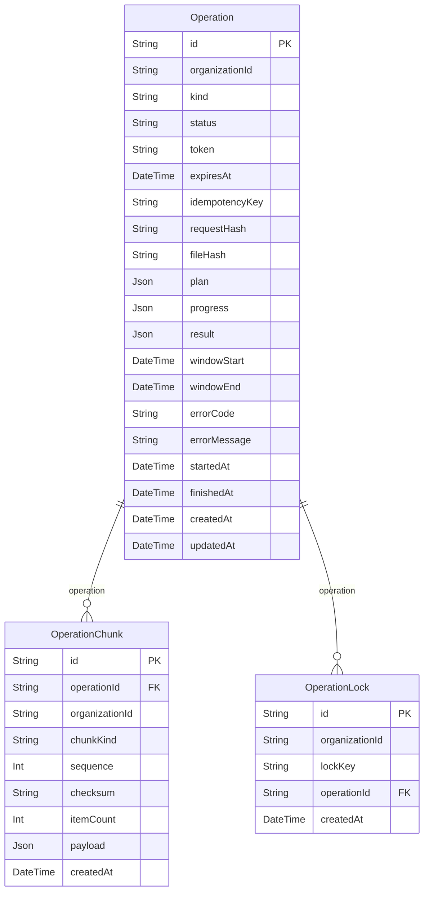

# Operation ERD

> Generated from `prisma/models/*.prisma`. Do not edit by hand.
> Regenerate with `npm run db:erd` after Prisma schema changes.

[Back to full ERD](../ERD.md)

## Models

| Model | Table | Description |
|---|---|---|
| Operation | `operations` | One run of any kind (collection, AI generation, ad action, registration) under the single operation contract (ADR-0025). Owned by common/operation; owner-specific values live in plan/progress/result JSON. |
| OperationChunk | `operation_chunks` | A staged chunk of an executing operation. Deleted in the finish transaction whether the operation succeeded or failed. |
| OperationLock | `operation_locks` | An overlap key an executing operation holds. Unique per organization without the kind, so one key fences across kinds (ADR-0025). |

## Mermaid ER Diagram

## External References

No external references.
