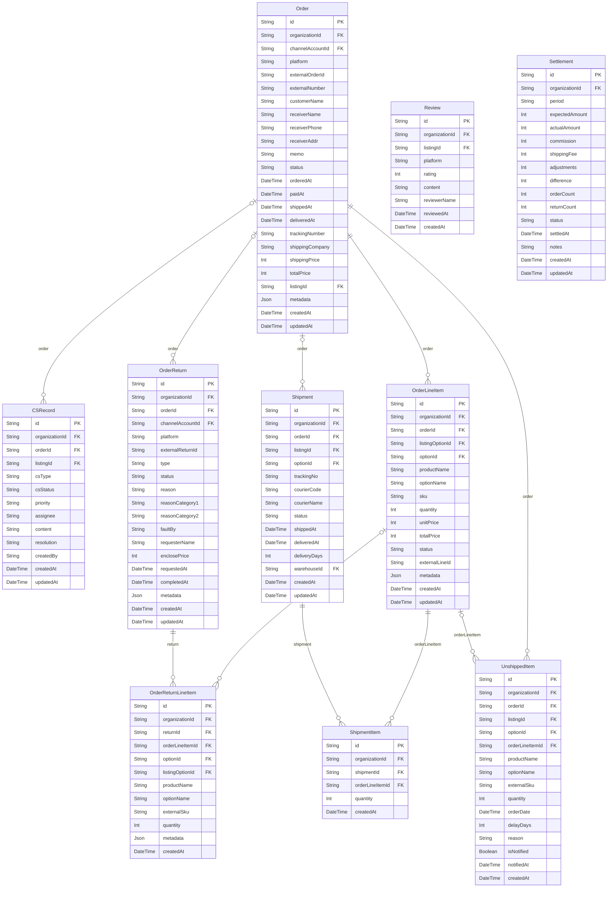

# Orders ERD

> Generated from `prisma/models/*.prisma`. Do not edit by hand.
> Regenerate with `npm run db:erd` or `npm run graphify:schema`.

[Back to full ERD](../ERD.md)

## Models

| Model | Table | Description |
|---|---|---|
| CSRecord | `cs_records` | - |
| Order | `orders` | 채널-agnostic 주문 aggregate. Coupang 등 채널별 raw payload 는 metadata Json. 라인 아이템은 OrderLineItem. |
| OrderLineItem | `order_line_items` | 주문 라인 아이템 — 1 SKU 단위. listingOption → option 으로 SKU 해상도. order FK 는 organizationId 를 함께 참조해 cross-organization mismatch 를 DB 가 차단한다. |
| OrderReturn | `order_returns` | 채널-agnostic 반품 aggregate. 반품 item 은 OrderReturnLineItem 으로 정규화. type=RETURN/EXCHANGE 구분 first-class. |
| OrderReturnLineItem | `order_return_line_items` | 반품 라인 아이템 — 반품 건 내 SKU 단위 상세. return FK 는 organizationId 를 함께 참조해 cross-organization mismatch 를 DB 가 차단한다. |
| Review | `reviews` | - |
| Settlement | `settlements` | 월별 정산 (예상 vs 실제 비교). |
| Shipment | `shipments` | - |
| ShipmentItem | `shipment_items` | Order-line shipment detail staged beside retained legacy Shipment listing/option columns. |
| UnshippedItem | `unshipped_items` | - |

## Mermaid ER Diagram

## External References

| Local model | Relation | Direction | External domain | External model |
|---|---|---|---|---|
| CSRecord | listing | references external | Core | ChannelListing |
| CSRecord | organization | references external | Core | Organization |
| Order | channelAccount | references external | Core | ChannelAccount |
| Order | listing | references external | Core | ChannelListing |
| Order | organization | references external | Core | Organization |
| OrderLineItem | listingOption | references external | Core | ChannelListingOption |
| OrderLineItem | option | references external | Core | ProductOption |
| OrderLineItem | organization | references external | Core | Organization |
| OrderReturn | channelAccount | references external | Core | ChannelAccount |
| OrderReturn | organization | references external | Core | Organization |
| OrderReturnLineItem | listingOption | references external | Core | ChannelListingOption |
| OrderReturnLineItem | option | references external | Core | ProductOption |
| OrderReturnLineItem | organization | references external | Core | Organization |
| Review | listing | references external | Core | ChannelListing |
| Review | organization | references external | Core | Organization |
| Settlement | organization | references external | Core | Organization |
| Shipment | listing | references external | Core | ChannelListing |
| Shipment | option | references external | Core | ProductOption |
| Shipment | organization | references external | Core | Organization |
| Shipment | warehouse | references external | Inventory | Warehouse |
| ShipmentItem | organization | references external | Core | Organization |
| UnshippedItem | listing | references external | Core | ChannelListing |
| UnshippedItem | option | references external | Core | ProductOption |
| UnshippedItem | organization | references external | Core | Organization |
