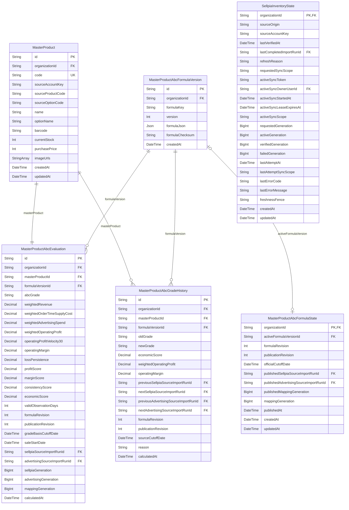

# Products ERD

> Generated from `prisma/models/*.prisma`. Do not edit by hand.
> Regenerate with `npm run db:erd` after Prisma schema changes.

[Back to full ERD](../ERD.md)

## Models

| Model | Table | Description |
|---|---|---|
| MasterProduct | `master_products` | Organization-owned canonical inventory product and sole official product ABC identity. |
| MasterProductAbcEvaluation | `master_product_abc_evaluations` | Current Products-owned normal absolute ABC evaluation for one MasterProduct. |
| MasterProductAbcFormulaState | `master_product_abc_formula_states` | One organization-owned formula and official publication envelope. |
| MasterProductAbcFormulaVersion | `master_product_abc_formula_versions` | Immutable organization-owned formula versions for absolute product ABC publication. |
| MasterProductAbcGradeHistory | `master_product_abc_grade_histories` | Immutable absolute ABC grade transitions after the initial baseline. |
| SellpiaInventoryState | `sellpia_inventory_states` | Organization-scoped Sellpia source binding, completion state, generation fence, and active collection lease. |

## Mermaid ER Diagram

## External References

| Local model | Relation | Direction | External domain | External model |
|---|---|---|---|---|
| MasterProduct | organization | references external | Core | Organization |
| MasterProductAbcEvaluation | advertisingSourceImportRun | references external | Core | SourceImportRun |
| MasterProductAbcEvaluation | organization | references external | Core | Organization |
| MasterProductAbcEvaluation | sellpiaSourceImportRun | references external | Core | SourceImportRun |
| MasterProductAbcFormulaState | organization | references external | Core | Organization |
| MasterProductAbcFormulaState | publishedAdvertisingSourceImportRun | references external | Core | SourceImportRun |
| MasterProductAbcFormulaState | publishedSellpiaSourceImportRun | references external | Core | SourceImportRun |
| MasterProductAbcFormulaVersion | organization | references external | Core | Organization |
| MasterProductAbcGradeHistory | nextAdvertisingSourceImportRun | references external | Core | SourceImportRun |
| MasterProductAbcGradeHistory | nextSellpiaSourceImportRun | references external | Core | SourceImportRun |
| MasterProductAbcGradeHistory | organization | references external | Core | Organization |
| MasterProductAbcGradeHistory | previousAdvertisingSourceImportRun | references external | Core | SourceImportRun |
| MasterProductAbcGradeHistory | previousSellpiaSourceImportRun | references external | Core | SourceImportRun |
| SellpiaInventoryState | activeSyncOwner | references external | Core | User |
| SellpiaInventoryState | lastCompletedImportRun | references external | Core | SourceImportRun |
| SellpiaInventoryState | organization | references external | Core | Organization |
