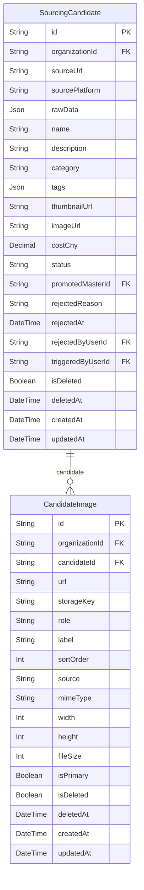

# Sourcing ERD

> Generated from `prisma/models/*.prisma`. Do not edit by hand.
> Regenerate with `npm run db:erd` or `npm run graphify:schema`.

[Back to full ERD](../ERD.md)

## Models

| Model | Table | Description |
|---|---|---|
| CandidateImage | `sourcing_candidate_images` | 소싱 후보의 이미지 갤러리. 승격 시 MasterProductImage로 clone. |
| SourcingCandidate | `sourcing_candidates` | 외부 플랫폼에서 스크랩한 소싱 후보. MasterProduct와 분리된 sourcing inbox. |

## Mermaid ER Diagram

## External References

| Local model | Relation | Direction | External domain | External model |
|---|---|---|---|---|
| CandidateImage | candidateImage | referenced by external | AI | ThumbnailGenerationInputImage |
| CandidateImage | organization | references external | Core | Organization |
| SourcingCandidate | organization | references external | Core | Organization |
| SourcingCandidate | promotedMaster | references external | Core | MasterProduct |
| SourcingCandidate | rejectedByUser | references external | Core | User |
| SourcingCandidate | sourceCandidate | referenced by external | AI | ContentGeneration |
| SourcingCandidate | sourceCandidate | referenced by external | AI | ContentGenerationSource |
| SourcingCandidate | sourceCandidate | referenced by external | AI | ContentWorkspace |
| SourcingCandidate | sourceCandidate | referenced by external | AI | DetailPageArtifact |
| SourcingCandidate | sourceCandidate | referenced by external | AI | ProductPreparation |
| SourcingCandidate | sourceCandidate | referenced by external | AI | ThumbnailGeneration |
| SourcingCandidate | triggeredByUser | references external | Core | User |
