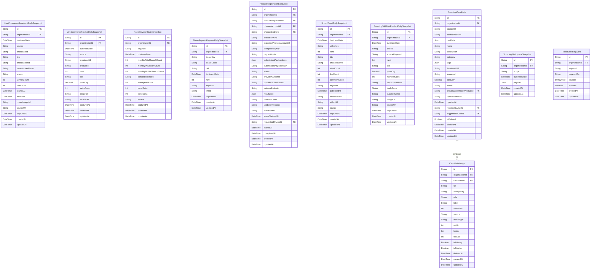

# Sourcing ERD

> Generated from `prisma/models/*.prisma`. Do not edit by hand.
> Regenerate with `npm run db:erd` or `npm run graphify:schema`.

[Back to full ERD](../ERD.md)

## Models

| Model | Table | Description |
|---|---|---|
| CandidateImage | `sourcing_candidate_images` | 소싱 후보가 소유하는 이미지 갤러리. 소싱 콘텐츠와 썸네일 생성 입력으로 사용한다. |
| LiveCommerceBroadcastDailySnapshot | `live_commerce_broadcast_daily_snapshots` | 타오바오 공식 API 또는 로그인된 1688·도우인 브라우저 화면에서 수집한 라이브 방송 일별 스냅샷. source와 broadcastId가 외부 방송 식별자를 이룬다. |
| LiveCommerceProductDailySnapshot | `live_commerce_product_daily_snapshots` | 중국 라이브 방송에 노출된 상품의 일별 스냅샷. broadcastId로 방송 스냅샷과 논리적으로 연결하고 상품 단위 비교를 지원한다. |
| NaverKeywordDailySnapshot | `naver_keyword_daily_snapshots` | 네이버 키워드(검색광고 월검색량 + 데이터랩 검색어트렌드) 일별 스냅샷. 시드 키워드당 하루 1행(최신본 upsert). trendRatio 는 latestRatio 반올림(0-100). |
| NaverPopularKeywordDailySnapshot | `naver_popular_keyword_daily_snapshots` | 네이버 데이터랩 인기키워드 보드(출산/육아·완구/인형·문구/사무 등)의 일별 순위 스냅샷. 보드×키워드 identity를 사용하고 매 수집마다 보드×일자 범위를 통째로 교체한다. |
| ProductRegistrationExecution | `product_registration_executions` | Reviewed product preparation의 marketplace create/reconcile side effect 실행 기록. 준비 입력과 provider lifecycle을 분리해 보존한다. |
| ShortsTrendDailySnapshot | `shorts_trend_daily_snapshots` | 쇼츠트렌드(shortstrend.co.kr) 급상승 쇼츠 일별 스냅샷. rank 는 소스 노출 순위, videoKey 는 영상 식별자. video×일자당 1행. |
| Sourcing1688HotProductDailySnapshot | `sourcing_1688_hot_product_daily_snapshots` | 1688 키워드별 핫셀링 offer 일별 스냅샷. sourceKeyword 는 시드 키워드, rank 는 해당 키워드 결과셋 내 monthlySales 내림차순 순위. offer×일자당 1행. |
| SourcingCandidate | `sourcing_candidates` | 외부 플랫폼에서 스크랩한 소싱 후보. MasterProduct와 분리된 sourcing inbox. |
| SourcingWorkspaceSnapshot | `sourcing_workspace_snapshots` | 조직/KST 날짜/scope 단위의 소싱 AI 결과 캐시. 오늘의 추천/키워드 분석 결과를 최신 1개로 재사용한다. |
| TrendSeedKeyword | `trend_seed_keywords` | 문구·완구 시장 트렌드 정기 수집의 시드 키워드. sources 로 몰별(naver/shorts/1688) 수집 대상을 제어. keywordCn 은 1688 中文 검색어(null이면 keyword 사용). |

## Mermaid ER Diagram

## External References

| Local model | Relation | Direction | External domain | External model |
|---|---|---|---|---|
| CandidateImage | candidateImage | referenced by external | AI | ThumbnailGenerationInputImage |
| CandidateImage | organization | references external | Core | Organization |
| LiveCommerceBroadcastDailySnapshot | organization | references external | Core | Organization |
| LiveCommerceProductDailySnapshot | organization | references external | Core | Organization |
| NaverKeywordDailySnapshot | organization | references external | Core | Organization |
| NaverPopularKeywordDailySnapshot | organization | references external | Core | Organization |
| ProductRegistrationExecution | channelAccount | references external | Core | ChannelAccount |
| ProductRegistrationExecution | channelListing | references external | Core | ChannelListing |
| ProductRegistrationExecution | organization | references external | Core | Organization |
| ProductRegistrationExecution | productPreparation | references external | AI | ProductPreparation |
| ProductRegistrationExecution | requestedByUser | references external | Core | User |
| ShortsTrendDailySnapshot | organization | references external | Core | Organization |
| Sourcing1688HotProductDailySnapshot | organization | references external | Core | Organization |
| SourcingCandidate | organization | references external | Core | Organization |
| SourcingCandidate | provenanceMasterProduct | references external | Core | MasterProduct |
| SourcingCandidate | rejectedByUser | references external | Core | User |
| SourcingCandidate | sourceCandidate | referenced by external | AI | ContentGeneration |
| SourcingCandidate | sourceCandidate | referenced by external | AI | ContentGenerationSource |
| SourcingCandidate | sourceCandidate | referenced by external | AI | ContentWorkspace |
| SourcingCandidate | sourceCandidate | referenced by external | AI | ProductPreparation |
| SourcingCandidate | sourceCandidate | referenced by external | AI | ThumbnailGeneration |
| SourcingCandidate | sourceCandidate | referenced by external | Core | ChannelListing |
| SourcingCandidate | triggeredByUser | references external | Core | User |
| SourcingWorkspaceSnapshot | organization | references external | Core | Organization |
| TrendSeedKeyword | organization | references external | Core | Organization |
