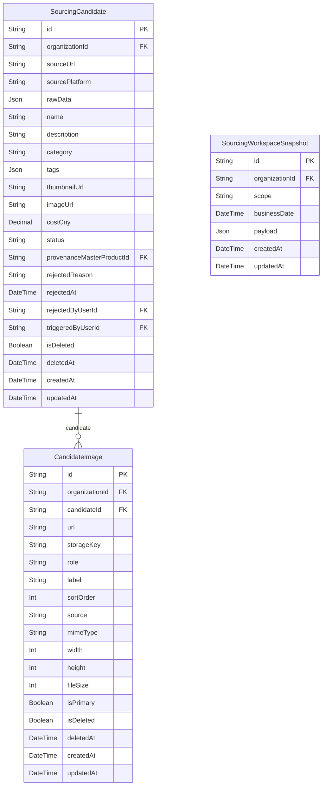

# Sourcing ERD

> Generated from `prisma/models/*.prisma`. Do not edit by hand.
> Regenerate with `npm run db:erd` or `npm run graphify:schema`.

[Back to full ERD](../ERD.md)

## Models

| Model | Table | Description |
|---|---|---|
| CandidateImage | `sourcing_candidate_images` | 소싱 후보가 소유하는 이미지 갤러리. 소싱 콘텐츠와 썸네일 생성 입력으로 사용한다. |
| SourcingCandidate | `sourcing_candidates` | 외부 플랫폼에서 스크랩한 소싱 후보. MasterProduct와 분리된 sourcing inbox. |
| SourcingWorkspaceSnapshot | `sourcing_workspace_snapshots` | 조직/KST 날짜/scope 단위의 소싱 AI 결과 캐시. 오늘의 추천/키워드 분석 결과를 최신 1개로 재사용한다. |

## Mermaid ER Diagram

## External References

| Local model | Relation | Direction | External domain | External model |
|---|---|---|---|---|
| CandidateImage | candidateImage | referenced by external | AI | ThumbnailGenerationInputImage |
| CandidateImage | organization | references external | Core | Organization |
| SourcingCandidate | organization | references external | Core | Organization |
| SourcingCandidate | provenanceMasterProduct | references external | Core | MasterProduct |
| SourcingCandidate | rejectedByUser | references external | Core | User |
| SourcingCandidate | sourceCandidate | referenced by external | AI | ContentGeneration |
| SourcingCandidate | sourceCandidate | referenced by external | AI | ContentGenerationSource |
| SourcingCandidate | sourceCandidate | referenced by external | AI | ContentWorkspace |
| SourcingCandidate | sourceCandidate | referenced by external | AI | ProductPreparation |
| SourcingCandidate | sourceCandidate | referenced by external | AI | ThumbnailGeneration |
| SourcingCandidate | sourceCandidate | referenced by external | Core | ChannelListing |
| SourcingCandidate | triggeredByUser | references external | Core | User |
| SourcingWorkspaceSnapshot | organization | references external | Core | Organization |
