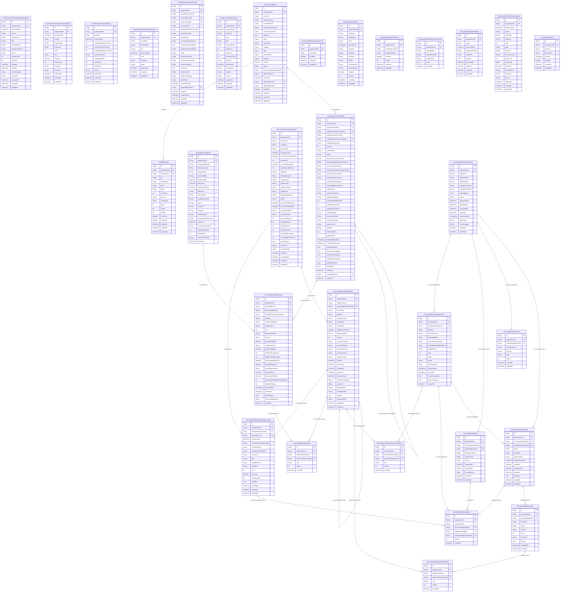

# Sourcing ERD

> Generated from `prisma/models/*.prisma`. Do not edit by hand.
> Regenerate with `npm run db:erd` after Prisma schema changes.

[Back to full ERD](../ERD.md)

## Models

| Model | Table | Description |
|---|---|---|
| CandidateImage | `sourcing_candidate_images` | 소싱 후보가 소유하는 이미지 갤러리. 소싱 콘텐츠와 썸네일 생성 입력으로 사용한다. |
| LiveCommerceBroadcastDailySnapshot | `live_commerce_broadcast_daily_snapshots` | 타오바오 공식 API 또는 로그인된 1688·도우인 브라우저 화면에서 수집한 라이브 방송 일별 스냅샷. source와 broadcastId가 외부 방송 식별자를 이룬다. |
| LiveCommerceProductDailySnapshot | `live_commerce_product_daily_snapshots` | 중국 라이브 방송에 노출된 상품의 일별 스냅샷. broadcastId로 방송 스냅샷과 논리적으로 연결하고 상품 단위 비교를 지원한다. |
| NaverKeywordDailySnapshot | `naver_keyword_daily_snapshots` | 네이버 키워드(검색광고 월검색량 + 데이터랩 검색어트렌드) 일별 스냅샷. 시드 키워드당 하루 1행(최신본 upsert). trendRatio 는 latestRatio 반올림(0-100). |
| NaverPopularKeywordDailySnapshot | `naver_popular_keyword_daily_snapshots` | 네이버 데이터랩 인기키워드 보드(출산/육아·완구/인형·문구/사무 등)의 일별 순위 스냅샷. 보드×키워드 identity를 사용하고 매 수집마다 보드×일자 범위를 통째로 교체한다. |
| ProductRegistrationExecution | `product_registration_executions` | Reviewed product preparation의 marketplace create/reconcile side effect 실행 기록. 준비 입력과 provider lifecycle을 분리해 보존한다. |
| ShortsTrendDailySnapshot | `shorts_trend_daily_snapshots` | 쇼츠트렌드(shortstrend.co.kr) 급상승 쇼츠 일별 스냅샷. rank 는 소스 노출 순위, videoKey 는 영상 식별자. video×일자당 1행. |
| Sourcing1688OfferKeywordObservation | `sourcing_1688_offer_keyword_observations` | 1688 키워드 검색에서 수집한 정확한 offer/variant 관측치. 같은 offer가 여러 키워드에서 발견된 provenance를 보존한다. |
| SourcingCandidate | `sourcing_candidates` | 외부 플랫폼에서 스크랩한 소싱 후보. MasterProduct와 분리된 sourcing inbox. |
| SourcingCollectionSourceControl | `sourcing_collection_source_controls` | Optional organization-level pause for an allowlisted collection source. Absence means enabled. |
| SourcingDecisionBatch | `sourcing_decision_batches` | Immutable point-in-time policy decision header. Items and evidence are inserted in the same transaction after deterministic evaluation succeeds. |
| SourcingDecisionBatchItem | `sourcing_decision_batch_items` | One immutable canonical test_order, hold, or reject decision. Offer-only rows support RFQ provenance before an exact LaunchCandidate exists. |
| SourcingDecisionEvidence | `sourcing_decision_evidence` | Immutable many-to-many link from one decision item to the exact observations available at its decision cutoff. |
| SourcingEvidenceIngestionRun | `sourcing_evidence_ingestion_runs` | Durable collector attempt with a fenced lease, request identity, collection window, coverage, and terminal result. |
| SourcingEvidenceObservation | `sourcing_evidence_observations` | Append-only, revision-aware source fact. Feature and decision reads must apply both availableAt and ingestedAt point-in-time cutoffs. |
| SourcingInterestTarget | `sourcing_interest_targets` | 서버가 소유하는 관심 키워드. 화면의 전체 JSON snapshot 대체를 금지하고 낙관적 버전으로 개별 변경을 보장한다. |
| SourcingKeywordPreference | `sourcing_keyword_preferences` | 조직별 키워드 제외 설정. 전체 JSON snapshot 대신 키 하나를 낙관적으로 갱신한다. |
| SourcingLaunchCandidate | `sourcing_launch_candidates` | Immutable launch and outcome identity that freezes an exact supplier variant, Korean bundle, launch plan, compliance/IP/quality versions, target account, price, and initial quantity. |
| SourcingOwnerIdempotencyReceipt | `sourcing_owner_idempotency_receipts` | 최종 소싱 capability의 불변 owner idempotency 결과. 후보 수명주기와 독립적으로 replay 결과를 보존한다. |
| SourcingRecommendationItem | `sourcing_recommendation_items` | 한 추천 실행 안의 stable offer/variant 후보. 점수와 근거는 이 행을 기준으로 추적한다. |
| SourcingRecommendationItemEvidence | `sourcing_recommendation_item_evidence` | 추천 후보가 사용한 immutable evidence 링크. retention과 재현성의 기준이다. |
| SourcingRecommendationRun | `sourcing_recommendation_runs` | 재현 가능한 추천 계산의 immutable header. 입력 manifest와 모델 버전을 함께 고정한다. |
| SourcingReviewBatch | `sourcing_review_batches` | Final 화면에서 생성하는 immutable review handoff. procurement intent나 provider side effect를 만들지 않는다. |
| SourcingReviewBatchItem | `sourcing_review_batch_items` | review batch가 실제로 검토한 recommendation, validation, exact offer observation을 동결한다. |
| SourcingReviewSelection | `sourcing_review_selections` | Entry/Final 화면 선택 상태의 org-scoped, optimistic-concurrency record. |
| SourcingValidationCheck | `sourcing_validation_checks` | 하나의 검증 episode를 구성하는 데이터 기반 check 결과. |
| SourcingValidationCheckEvidence | `sourcing_validation_check_evidence` | 검증 check가 참조한 immutable evidence link. |
| SourcingValidationEpisode | `sourcing_validation_episodes` | 추천 후보의 실데이터 검증 life-cycle. fixture 점수는 이 record로 대체된다. |
| SourcingWorkspaceSnapshot | `sourcing_workspace_snapshots` | 조직/KST 날짜/scope 단위의 소싱 AI 결과 캐시. 오늘의 추천/키워드 분석 결과를 최신 1개로 재사용한다. |
| TiktokCreativeTrendDailySnapshot | `tiktok_creative_trend_daily_snapshots` | 틱톡 크리에이티브 센터(Creative Center)에서 확장이 스크랩한 인기 트렌드 일별 스냅샷. trendType(hashtag\|keyword\|product\|song)으로 종류를, region(국가코드)으로 시장을 구분하고 (region,trendType,entityKey)가 외부 식별자를 이룬다. viewCount 는 int4 를 초과할 수 있어 BigInt. ⚠️ 라이브 틱톡 원본은 봇/리전 차단이라 무료로는 확장 스크랩 경로로만 적재한다([[reference_market_trend_research_tools]]). |
| TrendSeedKeyword | `trend_seed_keywords` | 문구·완구 시장 트렌드 정기 수집의 시드 키워드. sources 로 몰별(naver/shorts/1688) 수집 대상을 제어. keywordCn 은 1688 中文 검색어(null이면 keyword 사용). |

## Mermaid ER Diagram

```mermaid
erDiagram
  CandidateImage {
    String id PK
    String organizationId FK
    String candidateId FK
    String url
    String storageKey
    String role
    String label
    Int sortOrder
    String source
    String mimeType
    Int width
    Int height
    Int fileSize
    Boolean isPrimary
    Boolean isDeleted
    DateTime deletedAt
    DateTime createdAt
    DateTime updatedAt
  }
  LiveCommerceBroadcastDailySnapshot {
    String id PK
    String organizationId FK
    DateTime businessDate
    String source
    String broadcastId
    String title
    String broadcasterId
    String broadcasterName
    String status
    Int viewerCount
    Int likeCount
    DateTime startedAt
    DateTime endedAt
    String coverImageUrl
    String sourceUrl
    DateTime capturedAt
    DateTime createdAt
    DateTime updatedAt
  }
  LiveCommerceProductDailySnapshot {
    String id PK
    String organizationId FK
    DateTime businessDate
    String source
    String broadcastId
    String productId
    Int rank
    String title
    Decimal priceCny
    Int salesCount
    String imageUrl
    String sourceUrl
    DateTime capturedAt
    DateTime createdAt
    DateTime updatedAt
  }
  NaverKeywordDailySnapshot {
    String id PK
    String organizationId FK
    String keyword
    DateTime businessDate
    Int monthlyTotalSearchCount
    Int monthlyPcSearchCount
    Int monthlyMobileSearchCount
    String competitionIndex
    Int averageAdRank
    Int trendRatio
    Int trendDelta
    String source
    DateTime capturedAt
    DateTime createdAt
    DateTime updatedAt
  }
  NaverPopularKeywordDailySnapshot {
    String id PK
    String organizationId FK
    String boardKey
    String boardLabel
    String cid
    DateTime businessDate
    Int rank
    String keyword
    String linkId
    DateTime capturedAt
    DateTime createdAt
    DateTime updatedAt
  }
  ProductRegistrationExecution {
    String id PK
    String organizationId FK
    String productPreparationId FK
    String channelAccountId FK
    String channelListingId FK
    String executionKind
    String expectedProviderAccountId
    String idempotencyKey
    String requestHash
    String ownerIdempotencyKey
    Json submissionPayloadJson
    String submissionPayloadHash
    String status
    String providerOutcome
    String providerSubmissionId
    String externalListingId
    Json resultJson
    String lastErrorCode
    String lastErrorMessage
    String leaseToken
    DateTime leaseClaimedAt
    String requestedByUserId FK
    DateTime startedAt
    DateTime completedAt
    DateTime createdAt
    DateTime updatedAt
  }
  ShortsTrendDailySnapshot {
    String id PK
    String organizationId FK
    DateTime businessDate
    String videoKey
    Int rank
    String title
    String channelName
    Int viewCount
    Int likeCount
    Int commentCount
    String keyword
    DateTime publishedAt
    String thumbnailUrl
    String videoUrl
    String source
    DateTime capturedAt
    DateTime createdAt
    DateTime updatedAt
  }
  Sourcing1688OfferKeywordObservation {
    String id PK
    String organizationId FK
    String evidenceObservationId FK
    String ingestionRunId FK
    DateTime businessDate
    String sourceKeywordNormalized
    String externalOfferId
    String variantKeyNormalized
    String sourceUrl
    String title
    String supplierName
    String imageUrl
    Int rank
    Decimal priceCny
    Int monthlySales
    Json rawOffer
    DateTime capturedAt
    DateTime createdAt
    DateTime updatedAt
  }
  SourcingCandidate {
    String id PK
    String organizationId FK
    String sourceUrl
    String sourcePlatform
    String externalOfferId
    String variantKeyNormalized
    String sourceIdentityHash
    Json rawData
    String name
    String description
    String category
    Json tags
    String thumbnailUrl
    String imageUrl
    Decimal costCny
    String status
    String provenanceMasterProductId FK
    String rejectedReason
    DateTime rejectedAt
    String rejectedByUserId FK
    String triggeredByUserId FK
    Boolean isDeleted
    DateTime deletedAt
    DateTime createdAt
    DateTime updatedAt
  }
  SourcingCollectionSourceControl {
    String id PK
    String organizationId FK
    String sourceKey
    Boolean enabled
    DateTime createdAt
    DateTime updatedAt
  }
  SourcingDecisionBatch {
    String id PK
    String organizationId FK
    String requestedByUserId FK
    String idempotencyKey
    String requestHash
    String decisionMode
    DateTime businessDate
    DateTime decisionAt
    DateTime evidenceCutoffAt
    String policyKey
    String policyVersion
    String modelVersionKey
    String status
    String keyword
    String category
    String modelPipeline
    String modelGeneratorVersion
    DateTime expiresAt
    String heuristicArtifactHash
    Int capitalBudgetKrw
    Int testSlotLimit
    String constraintSetHash
    DateTime createdAt
  }
  SourcingDecisionBatchItem {
    String id PK
    String organizationId FK
    String decisionBatchId FK
    String launchCandidateId FK
    String supplierOfferSkuSnapshotId FK
    String itemKey
    String modelCandidateId
    String displayName
    Int rank
    String baselineDecision
    String decision
    Boolean executionEligible
    String confidenceKind
    Decimal policyProbability
    Int evidenceFamilyCount
    Int evidencePlatformCount
    Boolean hasCoupangEvidence
    Boolean has1688Evidence
    String nextEvidenceAction
    Decimal heuristicScore
    Decimal decisionConfidence
    Int expectedContributionProfit90dKrw
    Int capitalAtRiskKrw
    StringArray reasonCodes
    StringArray riskCodes
    Json modelOutput
    String featureManifestHash
    DateTime createdAt
  }
  SourcingDecisionEvidence {
    String id PK
    String organizationId FK
    String decisionBatchItemId FK
    String evidenceObservationId FK
    String role
    Int ordinal
    DateTime createdAt
  }
  SourcingEvidenceIngestionRun {
    String id PK
    String organizationId FK
    String sourceKey
    String scopeKey
    String leaseToken
    DateTime leaseExpiresAt
    DateTime sourceControlCheckedAt
    Int generation
    DateTime cancelRequestedAt
    Int staleDiscardedCount
    String targetKey
    String idempotencyKey
    String requestHash
    String collectorKey
    String collectorVersion
    String triggerKind
    String triggeredByUserId FK
    String status
    DateTime sourceWindowStartAt
    DateTime sourceWindowEndAt
    String watermarkBefore
    String watermarkAfter
    Int discoveredCount
    Int acceptedCount
    Int rejectedCount
    Int duplicateCount
    Int coverageNumerator
    Int coverageDenominator
    Json qualityReport
    String errorCode
    String errorMessage
    DateTime startedAt
    DateTime completedAt
    DateTime createdAt
    DateTime updatedAt
  }
  SourcingEvidenceObservation {
    String id PK
    String organizationId FK
    String ingestionRunId FK
    String supersedesObservationId FK
    String sourceKey
    String platform
    String evidenceFamily
    String signalRole
    String conceptKey
    Boolean supportsCandidate
    String observationKey
    Int revision
    String sourceEntityType
    String sourceEntityKey
    String observationType
    String schemaVersion
    String evidenceClass
    DateTime eventAt
    DateTime observedAt
    DateTime availableAt
    DateTime revisionAt
    DateTime businessDate
    String sourceRevisionKey
    String sourceUrl
    String payloadHash
    String envelopeHash
    Json payload
    String rawArtifactRef
    DateTime ingestedAt
    DateTime createdAt
  }
  SourcingInterestTarget {
    String id PK
    String organizationId FK
    String targetKey
    String targetType
    String label
    StringArray sourceKeys
    String keyword
    String category
    String productId
    String itemId
    String vendorItemId
    String productName
    Boolean enabled
    Int version
    DateTime createdAt
    DateTime updatedAt
  }
  SourcingKeywordPreference {
    String id PK
    String organizationId FK
    String keywordNormalized
    String displayKeyword
    Boolean excluded
    Int version
    DateTime createdAt
    DateTime updatedAt
  }
  SourcingLaunchCandidate {
    String id PK
    String organizationId FK
    String sourceCandidateId FK
    String supplierOfferSkuSnapshotId FK
    String targetChannelAccountId FK
    String supersedesLaunchCandidateId FK
    String candidateSeriesKey
    Int revision
    String identityHash
    String name
    String productConceptVersionKey
    String koreanSellableBundleVersionKey
    String launchPlanVersionKey
    String complianceAssessmentVersionKey
    String ipClearanceVersionKey
    String qualitySpecVersionKey
    Int intendedAgeMinMonths
    Int intendedAgeMaxMonths
    String intendedUse
    String materialProfileKey
    String labelingProfileKey
    Int unitsPerSellableBundle
    Int initialOrderQuantity
    Int targetSalePriceKrw
    String fulfillmentMode
    String economicsStatus
    String complianceStatus
    String qualityStatus
    String ipStatus
    Int landedCostKrw
    Int profitP10Krw
    StringArray blockingRiskCodes
    StringArray unknownRiskCodes
    Json bundleSnapshot
    Json launchPlanSnapshot
    Json economicsSnapshot
    Json complianceSnapshot
    Json qualitySnapshot
    Json ipSnapshot
    DateTime validUntil
    String createdByUserId FK
    DateTime createdAt
  }
  SourcingOwnerIdempotencyReceipt {
    String id PK
    String organizationId FK
    String capabilityKey
    String idempotencyKey
    String requestHash
    Json result
    DateTime createdAt
  }
  SourcingRecommendationItem {
    String id PK
    String organizationId FK
    String recommendationRunId FK
    String itemKey
    String sourcePlatform
    String externalOfferId
    String variantKeyNormalized
    String matchedCoupangProductId
    String displayName
    Int rank
    Int score
    String grade
    String baselineAction
    StringArray reasonCodes
    StringArray riskCodes
    Json scoreComponents
    Json sourceSnapshot
    DateTime createdAt
  }
  SourcingRecommendationItemEvidence {
    String id PK
    String organizationId FK
    String recommendationItemId FK
    String evidenceObservationId FK
    String role
    Int ordinal
    DateTime createdAt
  }
  SourcingRecommendationRun {
    String id PK
    String organizationId FK
    String policyKey
    String policyVersion
    String modelVersion
    String calculationVersion
    String inputManifestHash
    Json inputManifest
    String status
    DateTime businessDate
    DateTime generatedAt
    DateTime completedAt
    DateTime expiresAt
    StringArray warningCodes
    String errorCode
    String errorMessage
    DateTime createdAt
    DateTime updatedAt
  }
  SourcingReviewBatch {
    String id PK
    String organizationId FK
    String recommendationRunId FK
    String requestedByUserId FK
    String idempotencyKey
    String requestHash
    String status
    DateTime requestedAt
    DateTime cancelledAt
    String cancelReason
    DateTime createdAt
    DateTime updatedAt
  }
  SourcingReviewBatchItem {
    String id PK
    String organizationId FK
    String reviewBatchId FK
    String recommendationItemId FK
    String validationEpisodeId FK
    String offerKeywordObservationId FK
    Int ordinal
    DateTime createdAt
  }
  SourcingReviewSelection {
    String id PK
    String organizationId FK
    String recommendationRunId FK
    String workspaceKey
    String itemKey
    String state
    Int version
    DateTime createdAt
    DateTime updatedAt
  }
  SourcingValidationCheck {
    String id PK
    String organizationId FK
    String validationEpisodeId FK
    String checkKey
    String status
    String severity
    Int score
    String summary
    Json details
    DateTime evaluatedAt
    DateTime createdAt
  }
  SourcingValidationCheckEvidence {
    String id PK
    String organizationId FK
    String validationCheckId FK
    String evidenceObservationId FK
    String role
    Int ordinal
    DateTime createdAt
  }
  SourcingValidationEpisode {
    String id PK
    String organizationId FK
    String recommendationRunId FK
    String recommendationItemId FK
    String status
    String policyKey
    String policyVersion
    DateTime evidenceCutoffAt
    DateTime startedAt
    DateTime completedAt
    DateTime validUntil
    Json summary
    DateTime createdAt
    DateTime updatedAt
  }
  SourcingWorkspaceSnapshot {
    String id PK
    String organizationId FK
    String scope
    DateTime businessDate
    String projectionVersion
    String inputHash
    Json payload
    DateTime generatedAt
    DateTime expiresAt
    DateTime createdAt
    DateTime updatedAt
  }
  TiktokCreativeTrendDailySnapshot {
    String id PK
    String organizationId FK
    DateTime businessDate
    String region
    String trendType
    String entityKey
    Int rank
    String label
    String industry
    String sourceKeyword
    Int postCount
    BigInt viewCount
    Decimal growthPct
    String thumbnailUrl
    String sourceUrl
    String source
    DateTime capturedAt
    DateTime createdAt
    DateTime updatedAt
  }
  TrendSeedKeyword {
    String id PK
    String organizationId FK
    String keyword
    String keywordCn
    StringArray sources
    Boolean enabled
    DateTime createdAt
    DateTime updatedAt
  }
  Sourcing1688OfferKeywordObservation ||--o{ SourcingReviewBatchItem : "offerKeywordObservation"
  SourcingCandidate ||--o{ CandidateImage : "candidate"
  SourcingCandidate o|--o{ SourcingLaunchCandidate : "sourceCandidate"
  SourcingDecisionBatch ||--o{ SourcingDecisionBatchItem : "decisionBatch"
  SourcingDecisionBatchItem ||--o{ SourcingDecisionEvidence : "decisionBatchItem"
  SourcingEvidenceIngestionRun ||--o{ Sourcing1688OfferKeywordObservation : "ingestionRun"
  SourcingEvidenceIngestionRun ||--o{ SourcingEvidenceObservation : "ingestionRun"
  SourcingEvidenceObservation ||--|| Sourcing1688OfferKeywordObservation : "evidenceObservation"
  SourcingEvidenceObservation ||--o{ SourcingDecisionEvidence : "evidenceObservation"
  SourcingEvidenceObservation o|--o| SourcingEvidenceObservation : "supersedesObservation"
  SourcingEvidenceObservation ||--o{ SourcingRecommendationItemEvidence : "evidenceObservation"
  SourcingEvidenceObservation ||--o{ SourcingValidationCheckEvidence : "evidenceObservation"
  SourcingLaunchCandidate o|--o{ SourcingDecisionBatchItem : "launchCandidate"
  SourcingLaunchCandidate o|--o| SourcingLaunchCandidate : "supersedesLaunchCandidate"
  SourcingRecommendationItem ||--o{ SourcingRecommendationItemEvidence : "recommendationItem"
  SourcingRecommendationItem ||--o{ SourcingReviewBatchItem : "recommendationItem"
  SourcingRecommendationItem ||--o{ SourcingValidationEpisode : "recommendationItem"
  SourcingRecommendationRun ||--o{ SourcingRecommendationItem : "recommendationRun"
  SourcingRecommendationRun ||--o{ SourcingReviewBatch : "recommendationRun"
  SourcingRecommendationRun ||--o{ SourcingReviewSelection : "recommendationRun"
  SourcingRecommendationRun ||--o{ SourcingValidationEpisode : "recommendationRun"
  SourcingReviewBatch ||--o{ SourcingReviewBatchItem : "reviewBatch"
  SourcingValidationCheck ||--o{ SourcingValidationCheckEvidence : "validationCheck"
  SourcingValidationEpisode o|--o{ SourcingReviewBatchItem : "validationEpisode"
  SourcingValidationEpisode ||--o{ SourcingValidationCheck : "validationEpisode"
```

## External References

| Local model | Relation | Direction | External domain | External model |
|---|---|---|---|---|
| CandidateImage | candidateImage | referenced by external | AI | ThumbnailGenerationInputImage |
| CandidateImage | organization | references external | Core | Organization |
| LiveCommerceBroadcastDailySnapshot | organization | references external | Core | Organization |
| LiveCommerceProductDailySnapshot | organization | references external | Core | Organization |
| NaverKeywordDailySnapshot | organization | references external | Core | Organization |
| NaverPopularKeywordDailySnapshot | organization | references external | Core | Organization |
| ProductRegistrationExecution | channelAccount | references external | Core | ChannelAccount |
| ProductRegistrationExecution | channelListing | references external | Core | ChannelListing |
| ProductRegistrationExecution | organization | references external | Core | Organization |
| ProductRegistrationExecution | productPreparation | references external | AI | ProductPreparation |
| ProductRegistrationExecution | requestedByUser | references external | Core | User |
| ShortsTrendDailySnapshot | organization | references external | Core | Organization |
| Sourcing1688OfferKeywordObservation | organization | references external | Core | Organization |
| SourcingCandidate | organization | references external | Core | Organization |
| SourcingCandidate | provenanceMasterProduct | references external | Core | MasterProduct |
| SourcingCandidate | rejectedByUser | references external | Core | User |
| SourcingCandidate | sourceCandidate | referenced by external | AI | ContentGeneration |
| SourcingCandidate | sourceCandidate | referenced by external | AI | ContentGenerationSource |
| SourcingCandidate | sourceCandidate | referenced by external | AI | ContentWorkspace |
| SourcingCandidate | sourceCandidate | referenced by external | AI | DetailPageImageRenderIntent |
| SourcingCandidate | sourceCandidate | referenced by external | AI | ProductPreparation |
| SourcingCandidate | sourceCandidate | referenced by external | AI | ThumbnailGeneration |
| SourcingCandidate | sourceCandidate | referenced by external | Core | ChannelListing |
| SourcingCandidate | triggeredByUser | references external | Core | User |
| SourcingCollectionSourceControl | organization | references external | Core | Organization |
| SourcingDecisionBatch | organization | references external | Core | Organization |
| SourcingDecisionBatch | requestedByUser | references external | Core | User |
| SourcingDecisionBatchItem | decisionBatchItem | referenced by external | Supply | ProcurementTestIntent |
| SourcingDecisionBatchItem | organization | references external | Core | Organization |
| SourcingDecisionBatchItem | supplierOfferSkuSnapshot | references external | Supply | SupplierOfferSkuSnapshot |
| SourcingDecisionEvidence | organization | references external | Core | Organization |
| SourcingEvidenceIngestionRun | organization | references external | Core | Organization |
| SourcingEvidenceIngestionRun | triggeredByUser | references external | Core | User |
| SourcingEvidenceObservation | evidenceObservation | referenced by external | Supply | SupplierOfferSkuSnapshot |
| SourcingEvidenceObservation | organization | references external | Core | Organization |
| SourcingInterestTarget | organization | references external | Core | Organization |
| SourcingKeywordPreference | organization | references external | Core | Organization |
| SourcingLaunchCandidate | createdByUser | references external | Core | User |
| SourcingLaunchCandidate | launchCandidate | referenced by external | Supply | ProcurementTestIntent |
| SourcingLaunchCandidate | organization | references external | Core | Organization |
| SourcingLaunchCandidate | supplierOfferSkuSnapshot | references external | Supply | SupplierOfferSkuSnapshot |
| SourcingLaunchCandidate | targetChannelAccount | references external | Core | ChannelAccount |
| SourcingOwnerIdempotencyReceipt | organization | references external | Core | Organization |
| SourcingRecommendationItem | organization | references external | Core | Organization |
| SourcingRecommendationItemEvidence | organization | references external | Core | Organization |
| SourcingRecommendationRun | organization | references external | Core | Organization |
| SourcingReviewBatch | organization | references external | Core | Organization |
| SourcingReviewBatch | requestedBy | references external | Core | User |
| SourcingReviewBatchItem | organization | references external | Core | Organization |
| SourcingReviewSelection | organization | references external | Core | Organization |
| SourcingValidationCheck | organization | references external | Core | Organization |
| SourcingValidationCheckEvidence | organization | references external | Core | Organization |
| SourcingValidationEpisode | organization | references external | Core | Organization |
| SourcingWorkspaceSnapshot | organization | references external | Core | Organization |
| TiktokCreativeTrendDailySnapshot | organization | references external | Core | Organization |
| TrendSeedKeyword | organization | references external | Core | Organization |
