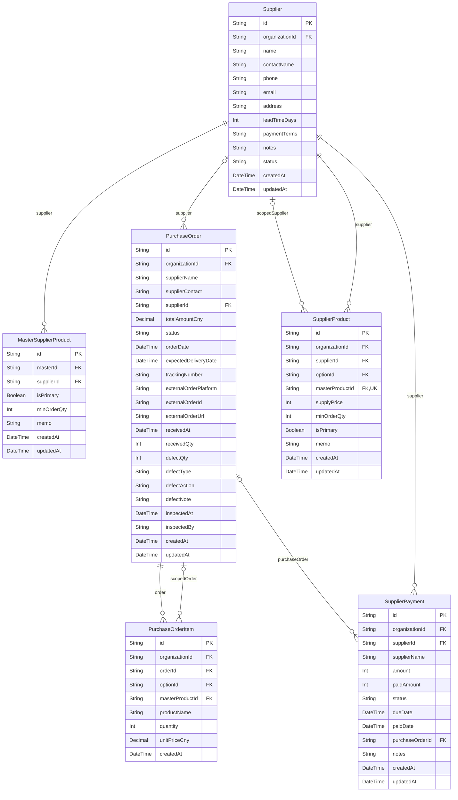

# Supply ERD

> Generated from `prisma/models/*.prisma`. Do not edit by hand.
> Regenerate with `npm run db:erd` or `npm run graphify:schema`.

[Back to full ERD](../ERD.md)

## Models

| Model | Table | Description |
|---|---|---|
| MasterSupplierProduct | `master_supplier_products` | Master 단위 주공급처 정책. 여러 supplier 후보 중 isPrimary 가 기본. |
| PurchaseOrder | `purchase_orders` | 발주 state machine (draft→pending→ordered→shipped→received). 입고 검수 필드 포함 (receivedQty, defectQty). 단위는 CNY(Decimal 12,2). |
| PurchaseOrderItem | `purchase_order_items` | - |
| Supplier | `suppliers` | - |
| SupplierPayment | `supplier_payments` | - |
| SupplierProduct | `supplier_products` | 공급사별 SKU(옵션) 단위 공급가 관리. |

## Mermaid ER Diagram

## External References

| Local model | Relation | Direction | External domain | External model |
|---|---|---|---|---|
| MasterSupplierProduct | master | references external | Core | MasterProduct |
| PurchaseOrder | organization | references external | Core | Organization |
| PurchaseOrderItem | masterProduct | references external | Core | MasterProduct |
| PurchaseOrderItem | option | references external | Core | ProductOption |
| PurchaseOrderItem | organization | references external | Core | Organization |
| Supplier | organization | references external | Core | Organization |
| SupplierPayment | organization | references external | Core | Organization |
| SupplierProduct | masterProduct | references external | Core | MasterProduct |
| SupplierProduct | option | references external | Core | ProductOption |
| SupplierProduct | organization | references external | Core | Organization |
