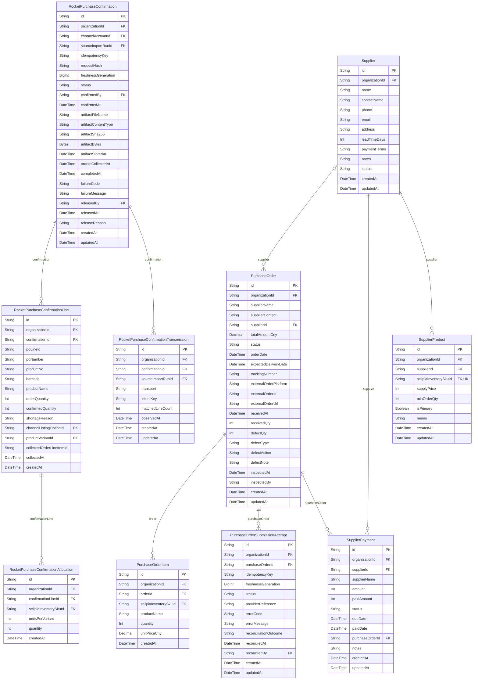

# Supply ERD

> Generated from `prisma/models/*.prisma`. Do not edit by hand.
> Regenerate with `npm run db:erd` or `npm run graphify:schema`.

[Back to full ERD](../ERD.md)

## Models

| Model | Table | Description |
|---|---|---|
| PurchaseOrder | `purchase_orders` | 발주 state machine (draft→pending→ordered→shipped→received). 입고 검수 필드 포함 (receivedQty, defectQty). 단위는 CNY(Decimal 12,2). |
| PurchaseOrderItem | `purchase_order_items` | - |
| PurchaseOrderSubmissionAttempt | `purchase_order_submission_attempts` | Durable idempotency intent and reconciliation record for an external purchase-order submission. |
| RocketPurchaseConfirmation | `rocket_purchase_confirmations` | Durable immutable Rocket workbook export and external synchronization workflow. |
| RocketPurchaseConfirmationAllocation | `rocket_purchase_confirmation_allocations` | Immutable component recipe evidence captured for one Rocket workbook line. |
| RocketPurchaseConfirmationLine | `rocket_purchase_confirmation_lines` | Immutable Rocket workbook line decision and matching final-order evidence. |
| RocketPurchaseConfirmationTransmission | `rocket_purchase_confirmation_transmissions` | One transport-specific Coupang collection probe and optional stable Sellpia transmission key for a Rocket workbook export. |
| Supplier | `suppliers` | - |
| SupplierPayment | `supplier_payments` | - |
| SupplierProduct | `supplier_products` | 공급사별 Sellpia 물리 상품 단위 공급가/주공급처 정책. |

## Mermaid ER Diagram

## External References

| Local model | Relation | Direction | External domain | External model |
|---|---|---|---|---|
| PurchaseOrder | organization | references external | Core | Organization |
| PurchaseOrderItem | organization | references external | Core | Organization |
| PurchaseOrderItem | sellpiaInventorySku | references external | Inventory | SellpiaInventorySku |
| PurchaseOrderSubmissionAttempt | organization | references external | Core | Organization |
| PurchaseOrderSubmissionAttempt | reconciler | references external | Core | User |
| RocketPurchaseConfirmation | channelAccount | references external | Core | ChannelAccount |
| RocketPurchaseConfirmation | confirmer | references external | Core | User |
| RocketPurchaseConfirmation | organization | references external | Core | Organization |
| RocketPurchaseConfirmation | releaser | references external | Core | User |
| RocketPurchaseConfirmation | sourceImportRun | references external | Core | SourceImportRun |
| RocketPurchaseConfirmationAllocation | organization | references external | Core | Organization |
| RocketPurchaseConfirmationAllocation | sellpiaInventorySku | references external | Inventory | SellpiaInventorySku |
| RocketPurchaseConfirmationLine | channelListingOption | references external | Core | ChannelListingOption |
| RocketPurchaseConfirmationLine | organization | references external | Core | Organization |
| RocketPurchaseConfirmationLine | productVariant | references external | Core | ProductVariant |
| RocketPurchaseConfirmationTransmission | organization | references external | Core | Organization |
| RocketPurchaseConfirmationTransmission | sourceImportRun | references external | Core | SourceImportRun |
| Supplier | organization | references external | Core | Organization |
| SupplierPayment | organization | references external | Core | Organization |
| SupplierProduct | organization | references external | Core | Organization |
| SupplierProduct | sellpiaInventorySku | references external | Inventory | SellpiaInventorySku |
