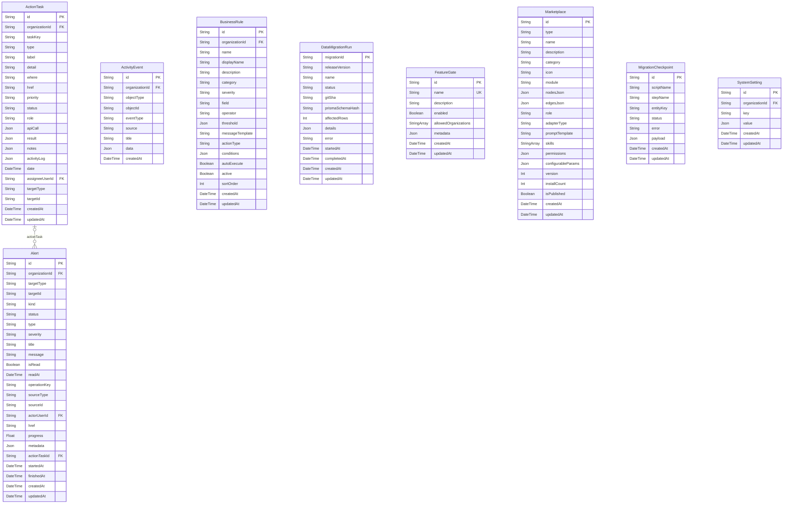

# System ERD

> Generated from `prisma/models/*.prisma`. Do not edit by hand.
> Regenerate with `npm run db:erd` or `npm run graphify:schema`.

[Back to full ERD](../ERD.md)

## Models

| Model | Table | Description |
|---|---|---|
| ActionTask | `action_tasks` | 액션 보드 (수동 할일 관리). |
| ActivityEvent | `activity_events` | - |
| Alert | `alerts` | - |
| BusinessRule | `business_rules` | 온톨로지 룰 엔진 (조건→액션 자동화). |
| DataMigrationRun | `data_migration_runs` | 운영 data migration ledger. Schema-only db push와 별도로 영속 데이터 보정 실행 여부를 기록한다. |
| FeatureGate | `feature_gates` | 피처 플래그. allowedOrganizations: string[] 로 회사별 enable. |
| Marketplace | `marketplace` | type 으로 agent/workflow 카탈로그 통합. |
| MigrationCheckpoint | `migration_checkpoints` | 이관 스크립트 체크포인트 (Plan C 용). 이관 완료 후 drop 가능. |
| SystemSetting | `system_settings` | - |

## Mermaid ER Diagram

## External References

| Local model | Relation | Direction | External domain | External model |
|---|---|---|---|---|
| ActionTask | assigneeUser | references external | Core | User |
| ActionTask | organization | references external | Core | Organization |
| ActivityEvent | organization | references external | Core | Organization |
| Alert | actorUser | references external | Core | User |
| Alert | organization | references external | Core | Organization |
| BusinessRule | organization | references external | Core | Organization |
| Marketplace | marketplace | referenced by external | AgentOS | WorkflowTemplate |
| SystemSetting | organization | references external | Core | Organization |
