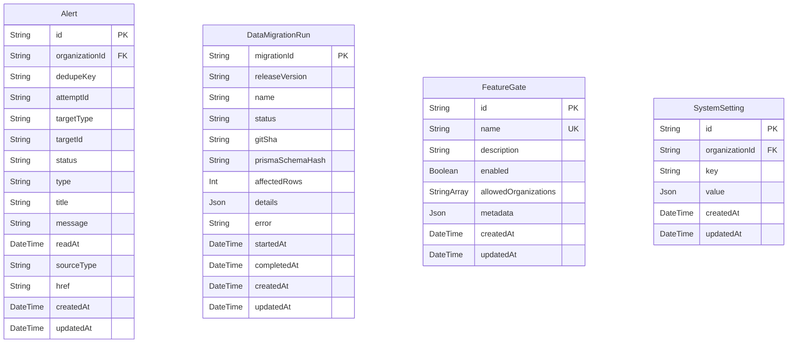

# System ERD

> Generated from `prisma/models/*.prisma`. Do not edit by hand.
> Regenerate with `npm run db:erd` after Prisma schema changes.

[Back to full ERD](../ERD.md)

## Models

| Model | Table | Description |
|---|---|---|
| Alert | `alerts` | - |
| DataMigrationRun | `data_migration_runs` | 운영 data migration ledger. Schema-only db push와 별도로 영속 데이터 보정 실행 여부를 기록한다. |
| FeatureGate | `feature_gates` | 피처 플래그. allowedOrganizations: string[] 로 회사별 enable. |
| SystemSetting | `system_settings` | - |

## Mermaid ER Diagram

```mermaid
erDiagram
  Alert {
    String id PK
    String organizationId FK
    String dedupeKey
    String attemptId
    String targetType
    String targetId
    String status
    String type
    String title
    String message
    DateTime readAt
    String sourceType
    String href
    DateTime createdAt
    DateTime updatedAt
  }
  DataMigrationRun {
    String migrationId PK
    String releaseVersion
    String name
    String status
    String gitSha
    String prismaSchemaHash
    Int affectedRows
    Json details
    String error
    DateTime startedAt
    DateTime completedAt
    DateTime createdAt
    DateTime updatedAt
  }
  FeatureGate {
    String id PK
    String name UK
    String description
    Boolean enabled
    StringArray allowedOrganizations
    Json metadata
    DateTime createdAt
    DateTime updatedAt
  }
  SystemSetting {
    String id PK
    String organizationId FK
    String key
    Json value
    DateTime createdAt
    DateTime updatedAt
  }
```

## External References

| Local model | Relation | Direction | External domain | External model |
|---|---|---|---|---|
| Alert | organization | references external | Core | Organization |
| SystemSetting | organization | references external | Core | Organization |
