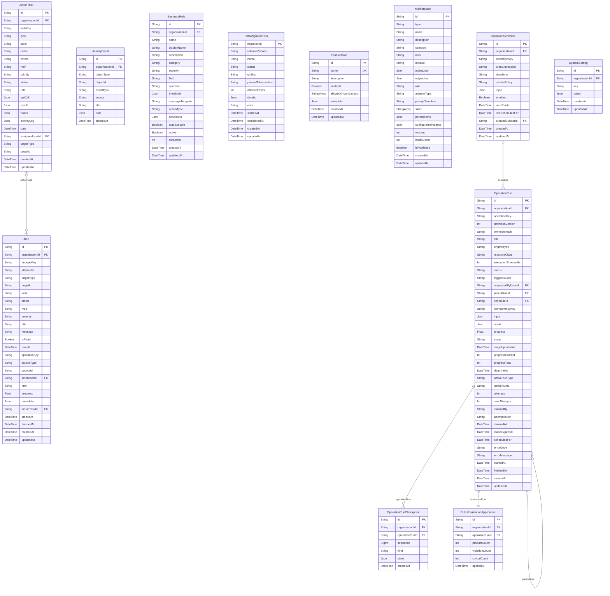

# System ERD

> Generated from `prisma/models/*.prisma`. Do not edit by hand.
> Regenerate with `npm run db:erd` after Prisma schema changes.

[Back to full ERD](../ERD.md)

## Models

| Model | Table | Description |
|---|---|---|
| ActionTask | `action_tasks` | 액션 보드 (수동 할일 관리). |
| ActivityEvent | `activity_events` | - |
| Alert | `alerts` | - |
| BusinessRule | `business_rules` | 온톨로지 룰 엔진 (조건→액션 자동화). |
| DataMigrationRun | `data_migration_runs` | 운영 data migration ledger. Schema-only db push와 별도로 영속 데이터 보정 실행 여부를 기록한다. |
| FeatureGate | `feature_gates` | 피처 플래그. allowedOrganizations: string[] 로 회사별 enable. |
| Marketplace | `marketplace` | type 으로 agent/workflow 카탈로그 통합. |
| OperationRun | `operation_runs` | Organization-scoped top-level execution ledger for dashboard, domain, Agent OS, and scheduled work. |
| OperationRunCheckpoint | `operation_run_checkpoints` | Immutable monotonic recovery checkpoint owned by an organization-scoped Operation run. |
| OperationSchedule | `operation_schedules` | Organization-managed cron schedule for a code-owned operation definition. All schedules start disabled. |
| RulesEvaluationApplication | `rules_evaluation_applications` | Exactly-once Rules result-application receipt for one organization-scoped Operation run. |
| SystemSetting | `system_settings` | - |

## Mermaid ER Diagram

```mermaid
erDiagram
  ActionTask {
    String id PK
    String organizationId FK
    String taskKey
    String type
    String label
    String detail
    String where
    String href
    String priority
    String status
    String role
    Json apiCall
    Json result
    Json notes
    Json activityLog
    DateTime date
    String assigneeUserId FK
    String targetType
    String targetId
    DateTime createdAt
    DateTime updatedAt
  }
  ActivityEvent {
    String id PK
    String organizationId FK
    String objectType
    String objectId
    String eventType
    String source
    String title
    Json data
    DateTime createdAt
  }
  Alert {
    String id PK
    String organizationId FK
    String dedupeKey
    String attemptId
    String targetType
    String targetId
    String kind
    String status
    String type
    String severity
    String title
    String message
    Boolean isRead
    DateTime readAt
    String operationKey
    String sourceType
    String sourceId
    String actorUserId FK
    String href
    Float progress
    Json metadata
    String actionTaskId FK
    DateTime startedAt
    DateTime finishedAt
    DateTime createdAt
    DateTime updatedAt
  }
  BusinessRule {
    String id PK
    String organizationId FK
    String name
    String displayName
    String description
    String category
    String severity
    String field
    String operator
    Json threshold
    String messageTemplate
    String actionType
    Json conditions
    Boolean autoExecute
    Boolean active
    Int sortOrder
    DateTime createdAt
    DateTime updatedAt
  }
  DataMigrationRun {
    String migrationId PK
    String releaseVersion
    String name
    String status
    String gitSha
    String prismaSchemaHash
    Int affectedRows
    Json details
    String error
    DateTime startedAt
    DateTime completedAt
    DateTime createdAt
    DateTime updatedAt
  }
  FeatureGate {
    String id PK
    String name UK
    String description
    Boolean enabled
    StringArray allowedOrganizations
    Json metadata
    DateTime createdAt
    DateTime updatedAt
  }
  Marketplace {
    String id PK
    String type
    String name
    String description
    String category
    String icon
    String module
    Json nodesJson
    Json edgesJson
    String role
    String adapterType
    String promptTemplate
    StringArray skills
    Json permissions
    Json configurableParams
    Int version
    Int installCount
    Boolean isPublished
    DateTime createdAt
    DateTime updatedAt
  }
  OperationRun {
    String id PK
    String organizationId FK
    String operationKey
    Int definitionVersion
    String ownerDomain
    String title
    String engineType
    String resourceClass
    Int executionTimeoutMs
    String status
    String triggerSource
    String requestedByUserId FK
    String parentRunId FK
    String scheduleId FK
    String idempotencyKey
    Json input
    Json result
    Float progress
    String stage
    DateTime stageUpdatedAt
    Int progressCurrent
    Int progressTotal
    DateTime deadlineAt
    String nativeRunType
    String nativeRunId
    Int attempts
    Int maxAttempts
    String claimedBy
    String attemptToken
    DateTime claimedAt
    DateTime leaseExpiresAt
    DateTime scheduledFor
    String errorCode
    String errorMessage
    DateTime startedAt
    DateTime finishedAt
    DateTime createdAt
    DateTime updatedAt
  }
  OperationRunCheckpoint {
    String id PK
    String organizationId FK
    String operationRunId FK
    BigInt sequence
    String kind
    Json state
    DateTime createdAt
  }
  OperationSchedule {
    String id PK
    String organizationId FK
    String operationKey
    String cronExpression
    String timeZone
    String misfirePolicy
    Json input
    Boolean enabled
    DateTime nextRunAt
    DateTime lastScheduledFor
    String createdByUserId FK
    DateTime createdAt
    DateTime updatedAt
  }
  RulesEvaluationApplication {
    String id PK
    String organizationId FK
    String operationRunId FK
    Int productCount
    Int violationCount
    Int criticalCount
    DateTime appliedAt
  }
  SystemSetting {
    String id PK
    String organizationId FK
    String key
    Json value
    DateTime createdAt
    DateTime updatedAt
  }
  ActionTask o|--o{ Alert : "actionTask"
  OperationRun o|--o{ OperationRun : "parentRun"
  OperationRun ||--o{ OperationRunCheckpoint : "operationRun"
  OperationRun ||--|| RulesEvaluationApplication : "operationRun"
  OperationSchedule o|--o{ OperationRun : "schedule"
```

## External References

| Local model | Relation | Direction | External domain | External model |
|---|---|---|---|---|
| ActionTask | assigneeUser | references external | Core | User |
| ActionTask | organization | references external | Core | Organization |
| ActivityEvent | organization | references external | Core | Organization |
| Alert | actorUser | references external | Core | User |
| Alert | organization | references external | Core | Organization |
| BusinessRule | organization | references external | Core | Organization |
| Marketplace | marketplace | referenced by external | Automation | WorkflowTemplate |
| OperationRun | organization | references external | Core | Organization |
| OperationRun | requestedBy | references external | Core | User |
| OperationRunCheckpoint | organization | references external | Core | Organization |
| OperationSchedule | createdBy | references external | Core | User |
| OperationSchedule | organization | references external | Core | Organization |
| RulesEvaluationApplication | organization | references external | Core | Organization |
| SystemSetting | organization | references external | Core | Organization |
