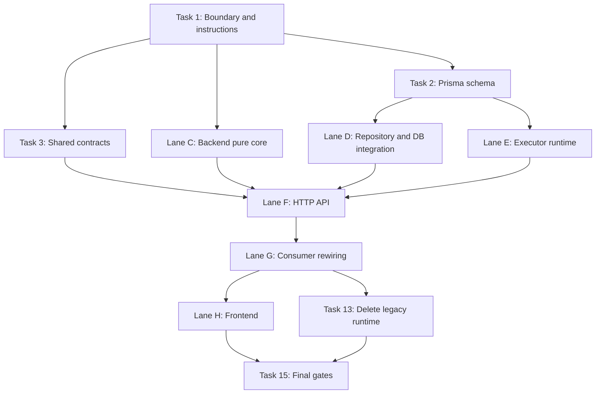

# Agent OS v2 Implementation Plan

> **For agentic workers:** REQUIRED SUB-SKILL: Use superpowers:subagent-driven-development (recommended) or superpowers:executing-plans to implement this plan task-by-task. Steps use checkbox (`- [ ]`) syntax for tracking.

**Goal:** Replace the legacy agent runtime (`AgentTask`, `AgentDefinition`, `AgentWakeupRequest`, `HeartbeatRun`, trace/log/registry coupling) with Agent OS v2: a Postgres-backed request inbox, explicit run ledger, blueprint/instance catalog, policy/approval/cost ledgers, and a top-level backend owner platform at `apps/server/src/agent-os`.

**Architecture:** Create `agent-os` as the owner platform for agent catalog, execution requests, run lifecycle, runtime adapter orchestration, tool policy, approval, cost, and observability. Keep `automation` as workflow/action-board/marketplace orchestration that calls Agent OS through an application port. Replace legacy `agent-registry` consumers with Agent OS contracts, then remove legacy runtime modules.

**Tech Stack:** Prisma multi-file schema, PostgreSQL row-lock queue with `FOR UPDATE SKIP LOCKED`, NestJS 11, Zod in `@kiditem/shared` subpath exports, Vitest unit/integration tests, Next.js 16 frontend consumers through NestJS APIs only.

---

## Reference Inputs

- Durable design: `docs/agent-os-v2-schema.md`
- Architecture index: `docs/ARCHITECTURE.md`
- Issue: GitHub #204, complete replacement research checkpoint
- External references used in design:
  - Dify `langgenius/dify@7e6745e105771a87853e1016bc241a2024629639`
  - Paperclip `paperclipai/paperclip@d0e9cc76f2eb114ed63d398ee0a0185d64bff852`
- Current branch state before implementation: detached `ef0d38e2`, with doc changes in progress

## File Structure

Create this backend structure:

```text
apps/server/src/agent-os/
  AGENTS.md
  agent-os.module.ts
  adapter/
    in/http/
      agent-catalog.controller.ts
      agent-runs.controller.ts
      dto/
        agent-catalog.dto.ts
        agent-runs.dto.ts
    out/repository/
      agent-os.repository.adapter.ts
    out/runtime/
      agent-runtime-adapter.port.ts
      local-runtime.adapter.ts
      types.ts
    out/log-store/
      agent-log-store.port.ts
      filesystem-agent-log-store.adapter.ts
  application/
    port/in/
      agent-runner.port.ts
    port/out/
      agent-os-repository.port.ts
      agent-runtime.port.ts
      agent-log-store.port.ts
    service/
      agent-catalog.service.ts
      agent-run-coordinator.service.ts
      agent-run-executor.service.ts
      agent-policy.service.ts
      agent-observability.service.ts
  domain/
    agent-os.errors.ts
    agent-os.types.ts
    policy.types.ts
```

Create shared contracts:

```text
packages/shared/src/
  agent-os.ts
  schemas/
    agent-os.ts
    agent-os.spec.ts
```

Expected Prisma edits:

```text
prisma/models/agents.prisma
prisma/models/core.prisma
prisma/models/system.prisma
```

Expected consumer rewiring:

```text
apps/server/src/app.module.ts
apps/server/src/automation/automation.module.ts
apps/server/src/automation/application/port/in/agent-runner.port.ts
apps/server/src/automation/**/*
apps/server/src/rules/**/*
apps/server/src/ai/**/*
apps/server/src/sourcing/**/*
apps/server/src/advertising/**/*
apps/web/src/app/**/*
packages/shared/package.json
```

## Parallel Execution Strategy

Use parallel workers only where ownership is disjoint. The coordinator keeps the branch, resolves merge conflicts, runs integration gates, and owns final deletion. Workers must not edit files outside their assigned ownership unless the coordinator explicitly expands the assignment.

Dependency graph:



Parallel lanes:

| Lane | Can Start After | Write Ownership | Output |
|---|---|---|---|
| A. Schema | Task 1 | `prisma/models/*`, generated Prisma/Graphify/ERD artifacts | Agent OS v2 DB contract and generated client |
| B. Shared | Task 1 | `packages/shared/package.json`, `packages/shared/src/agent-os.ts`, `packages/shared/src/schemas/agent-os*` | Zod contracts and subpath export |
| C. Backend Pure Core | Task 1 plus final status names from design | `apps/server/src/agent-os/domain/*`, `apps/server/src/agent-os/application/port/*`, `agent-policy.service.ts`, `agent-run-coordinator.service.ts`, matching unit tests | Port contracts, policy, coordinator without Prisma coupling |
| D. Repository | Lane A | `apps/server/src/agent-os/adapter/out/repository/*`, repository integration tests | Queue claim, event sequencing, idempotency, cost transaction |
| E. Executor Runtime | Lane A and Lane C port names | `apps/server/src/agent-os/adapter/out/runtime/*`, `apps/server/src/agent-os/adapter/out/log-store/*`, `agent-run-executor.service.ts`, executor tests | Runtime adapter boundary and run execution |
| F. HTTP API And Module | Lanes B, C, D, E | `apps/server/src/agent-os/adapter/in/http/*`, `apps/server/src/agent-os/agent-os.module.ts`, `apps/server/src/app.module.ts` | Controllers, DTOs, module wiring, e2e coverage |
| G. Server Consumers | Lane F | `apps/server/src/automation/**/*`, `apps/server/src/rules/**/*`, `apps/server/src/ai/**/*`, `apps/server/src/sourcing/**/*`, `apps/server/src/advertising/**/*` | All server calls use Agent OS port and `requestId` |
| H. Web Consumers | Lane F API contract and Lane B shared contract | `apps/web/src/app/**/*` for agent-facing views only | Web uses NestJS Agent OS APIs and shared contracts |
| I. Deletion And Final Gates | Lanes G and H | Legacy runtime files, docs, generated navigation, final scan fixes | Legacy runtime removed and whole repo verified |

Recommended parallel dispatch:

1. Run Task 1 serially.
2. Dispatch Lane A and Lane B in parallel.
3. Dispatch Lane C once Task 1 is committed; it can use mocked repository ports and does not need generated Prisma types.
4. After Lane A lands, dispatch Lane D and Lane E in parallel.
5. After Lanes B through E land, dispatch Lane F.
6. After Lane F lands, dispatch Lane G and Lane H in parallel if their file scopes do not overlap.
7. Run Lane I serially because deletion and final gates require complete repo context.

Worker prompt template:

```markdown
You are working on Agent OS v2 in KidItem. Your lane is [LANE NAME].

Read these first:
- AGENTS.md
- The nearest scoped AGENTS.md for every file you edit
- docs/agent-os-v2-schema.md
- docs/superpowers/plans/2026-05-07-agent-os-v2-implementation.md

Ownership:
- You may edit only: [EXACT PATHS]
- Do not rename or delete files outside ownership.
- Do not adjust another worker's interfaces without reporting the requested change.
- Preserve organization scoping and the Agent OS design decisions.

Goal:
- [LANE OUTPUT]

Verification:
- Run [LANE COMMANDS]
- Return changed file list, tests run, and any blocker with exact command output.
```

Conflict rules:

- Only Lane A edits Prisma schema and generated schema navigation.
- Only Lane B edits `packages/shared/package.json`.
- Only Lane F edits `agent-os.module.ts` and `app.module.ts`.
- Lane C and Lane E both touch `application/service`, so Lane C owns policy/coordinator and Lane E owns executor.
- Lane G edits server consumers only after `AgentRunnerPort` has landed.
- Lane H edits web consumers only after HTTP response shapes are stable.
- Legacy deletion is not parallelized.

Parallel verification commands:

```bash
# Lane A
rtk npx prisma validate
rtk npm run db:push
rtk npx prisma generate
rtk npm run graphify:schema

# Lane B
rtk cd packages/shared && npm run test -- agent-os
rtk cd packages/shared && npm run build

# Lane C
rtk npm test -- agent-policy.service
rtk npm test -- agent-run-coordinator

# Lane D
rtk npm run db:test:up
rtk npm run db:test:prepare
rtk npm run test:integration -- agent-os.repository

# Lane E
rtk npm test -- agent-run-executor
rtk npm run test:integration -- agent-run-executor

# Lane F
rtk npm run test:e2e -- agent-os
rtk npm run dev:server
```

---

## Task 1: Prepare Implementation Branch And Instruction Scope

- [ ] Verify current status and protect existing user changes.

```bash
rtk git status --short
rtk git branch --show-current
rtk git rev-parse --short HEAD
```

- [ ] Create a repo-convention feature branch from the current main checkout.

```bash
rtk git switch -c feat/204-agent-os-v2
```

- [ ] Read the scope instructions before editing each scope.

```bash
rtk sed -n '1,240p' AGENTS.md
rtk sed -n '1,260p' apps/server/AGENTS.md
rtk sed -n '1,240p' packages/shared/AGENTS.md
rtk sed -n '1,240p' prisma/AGENTS.md
rtk sed -n '1,220p' apps/web/AGENTS.md
```

- [ ] Add scoped instructions for the new backend owner platform.

Create `apps/server/src/agent-os/AGENTS.md`:

```markdown
# Agent OS

Agent OS owns agent blueprints, organization-scoped instances, durable run
requests, run execution, tool policy, approvals, cost ledger, and run
observability.

## Boundary

- Agent OS is a platform owner domain, not a business-domain module.
- Business domains request work through `AgentRunnerPort`.
- Workflows and automation must not call runtime adapters directly.
- Runtime execution belongs behind `application/port/out/*` contracts.
- Prisma access stays in outgoing repository adapters.
- Application services must not import concrete adapters, PrismaService,
  Nest HTTP decorators, provider SDKs, filesystem APIs, or workflow internals.

## Data Contracts

- Use `organizationId` on every organization-scoped read and mutation.
- `AgentRunRequest` is the durable inbox and retry/coalescing owner.
- `AgentRun` starts at `running`; queue state belongs to `AgentRunRequest`.
- `AgentRunEvent`, `AgentAuthorizationEvent`, and `AgentCostEvent` remain
  separate ledgers.
- Tool permission uses blueprint default policy plus instance override.
- Bulk runtime logs are external; database rows store structured events,
  excerpts, and log references only.

## Verification

- Unit: policy resolution, coordinator decisions, catalog invariants.
- Integration: request claim concurrency, run-event sequencing, idempotency,
  cost-ledger aggregate transaction.
- Boot: `npm run dev:server`
```

- [ ] Register the new owner platform in `apps/server/AGENTS.md` Domain Guides and architecture notes. Make clear that `automation` now depends on Agent OS through a port instead of owning runtime execution.

Commit checkpoint:

```bash
rtk git add apps/server/AGENTS.md apps/server/src/agent-os/AGENTS.md docs/ARCHITECTURE.md docs/agent-os-v2-schema.md
rtk git commit -m "docs: define agent os owner boundary"
```

---

## Task 2: Replace Prisma Agent Schema

- [ ] Read current model files.

```bash
rtk sed -n '1,260p' prisma/models/agents.prisma
rtk sed -n '1,260p' prisma/models/core.prisma
rtk sed -n '1,260p' prisma/models/system.prisma
```

- [ ] Replace legacy runtime models in `prisma/models/agents.prisma` with Agent OS v2 models. Keep workflow models only if current consumers still require them; do not keep legacy agent runtime tables as compatibility aliases.

Use String statuses with app-level validation:

```prisma
model AgentBlueprint {
  id          String   @id @default(cuid())
  type        String   @unique
  name        String
  description String?
  version     String
  status      String   @default("active")
  defaultModel String?
  config      Json     @default("{}")
  capabilities Json    @default("{}")
  marketplaceId String?
  createdAt   DateTime @default(now())
  updatedAt   DateTime @updatedAt

  marketplace Marketplace? @relation(fields: [marketplaceId], references: [id], onDelete: SetNull)
  instances   AgentInstance[]
  toolPolicies AgentBlueprintToolPolicy[]

  @@index([status, type])
  @@index([marketplaceId])
}

model AgentInstance {
  id             String   @id @default(cuid())
  organizationId String
  blueprintId    String
  type           String
  displayName    String
  lifecycleStatus String  @default("active")
  config         Json     @default("{}")
  createdAt      DateTime @default(now())
  updatedAt      DateTime @updatedAt

  organization Organization @relation(fields: [organizationId], references: [id], onDelete: Cascade)
  blueprint    AgentBlueprint @relation(fields: [blueprintId], references: [id], onDelete: Restrict)
  runtimeState AgentRuntimeState?
  taskSessions AgentTaskSession[]
  requests     AgentRunRequest[]
  runs         AgentRun[]
  toolPolicies AgentInstanceToolPolicy[]
  users        User[]

  @@unique([organizationId, type])
  @@index([blueprintId])
  @@index([organizationId, lifecycleStatus])
}

model AgentRuntimeState {
  agentInstanceId String @id
  organizationId  String
  lastRunId       String?
  lastStartedAt   DateTime?
  lastFinishedAt  DateTime?
  lastStatus      String?
  lastErrorCode   String?
  totalRuns       Int    @default(0)
  totalCostMicros BigInt @default(0)
  updatedAt       DateTime @updatedAt

  agentInstance AgentInstance @relation(fields: [agentInstanceId], references: [id], onDelete: Cascade)
  organization  Organization @relation(fields: [organizationId], references: [id], onDelete: Cascade)
  lastRun       AgentRun? @relation(fields: [lastRunId], references: [id], onDelete: SetNull)

  @@index([organizationId, updatedAt])
}
```

Request, run, and event models:

```prisma
model AgentTaskSession {
  id              String   @id @default(cuid())
  organizationId  String
  agentInstanceId String
  taskKey         String
  title           String?
  metadata        Json     @default("{}")
  createdAt       DateTime @default(now())
  updatedAt       DateTime @updatedAt

  organization  Organization @relation(fields: [organizationId], references: [id], onDelete: Cascade)
  agentInstance AgentInstance @relation(fields: [agentInstanceId], references: [id], onDelete: Cascade)
  requests      AgentRunRequest[]
  runs          AgentRun[]

  @@unique([organizationId, agentInstanceId, taskKey])
  @@index([organizationId, updatedAt])
}

model AgentRunRequest {
  id                String   @id @default(cuid())
  organizationId    String
  agentInstanceId   String
  taskSessionId     String
  idempotencyKey    String?
  status            String   @default("pending")
  priority          Int      @default(0)
  requestedByUserId String?
  sourceType        String
  sourceId          String?
  payload           Json     @default("{}")
  scheduledFor      DateTime @default(now())
  claimedAt         DateTime?
  claimedBy         String?
  attempts          Int      @default(0)
  maxAttempts       Int      @default(3)
  coalescedIntoRequestId String?
  lastErrorCode     String?
  lastErrorMessage  String?
  createdAt         DateTime @default(now())
  updatedAt         DateTime @updatedAt

  organization Organization @relation(fields: [organizationId], references: [id], onDelete: Cascade)
  agentInstance AgentInstance @relation(fields: [agentInstanceId], references: [id], onDelete: Cascade)
  taskSession AgentTaskSession @relation(fields: [taskSessionId], references: [id], onDelete: Restrict)
  requestedBy User? @relation(fields: [requestedByUserId], references: [id], onDelete: SetNull)
  coalescedInto AgentRunRequest? @relation("AgentRunRequestCoalescing", fields: [coalescedIntoRequestId], references: [id], onDelete: SetNull)
  coalescedRequests AgentRunRequest[] @relation("AgentRunRequestCoalescing")
  runs AgentRun[]
  approvals AgentApprovalRequest[]

  @@index([organizationId, status, scheduledFor, priority])
  @@index([agentInstanceId, status, scheduledFor])
  @@index([organizationId, sourceType, sourceId])
}

model AgentRun {
  id              String   @id @default(cuid())
  organizationId  String
  agentInstanceId String
  requestId       String
  taskSessionId   String
  status          String   @default("running")
  attempt         Int
  model           String
  provider        String?
  input           Json     @default("{}")
  output          Json?
  errorCode       String?
  errorMessage    String?
  lastEventSeq    Int      @default(0)
  startedAt       DateTime @default(now())
  finishedAt      DateTime?
  createdAt       DateTime @default(now())
  updatedAt       DateTime @updatedAt

  organization Organization @relation(fields: [organizationId], references: [id], onDelete: Cascade)
  agentInstance AgentInstance @relation(fields: [agentInstanceId], references: [id], onDelete: Cascade)
  request AgentRunRequest @relation(fields: [requestId], references: [id], onDelete: Cascade)
  taskSession AgentTaskSession @relation(fields: [taskSessionId], references: [id], onDelete: Restrict)
  runtimeState AgentRuntimeState[]
  events AgentRunEvent[]
  costEvents AgentCostEvent[]
  authorizationEvents AgentAuthorizationEvent[]
  approvals AgentApprovalRequest[]

  @@unique([requestId, attempt])
  @@index([organizationId, agentInstanceId, startedAt])
  @@index([organizationId, status, startedAt])
}

model AgentRunEvent {
  id             String   @id @default(cuid())
  organizationId String
  runId          String
  seq            Int
  type           String
  level          String   @default("info")
  message        String?
  data           Json     @default("{}")
  logRef         String?
  createdAt      DateTime @default(now())

  organization Organization @relation(fields: [organizationId], references: [id], onDelete: Cascade)
  run AgentRun @relation(fields: [runId], references: [id], onDelete: Cascade)

  @@unique([runId, seq])
  @@index([organizationId, runId, seq])
  @@index([organizationId, type, createdAt])
}
```

Policy, authorization, approval, and cost models:

```prisma
model AgentToolDefinition {
  id          String   @id @default(cuid())
  key         String   @unique
  name        String
  description String?
  riskLevel   String   @default("low")
  schema      Json     @default("{}")
  createdAt   DateTime @default(now())
  updatedAt   DateTime @updatedAt

  blueprintPolicies AgentBlueprintToolPolicy[]
  instancePolicies AgentInstanceToolPolicy[]
  authorizationEvents AgentAuthorizationEvent[]
}

model AgentBlueprintToolPolicy {
  id          String @id @default(cuid())
  blueprintId String
  toolId      String
  effect      String
  constraints Json   @default("{}")
  createdAt   DateTime @default(now())
  updatedAt   DateTime @updatedAt

  blueprint AgentBlueprint @relation(fields: [blueprintId], references: [id], onDelete: Cascade)
  tool AgentToolDefinition @relation(fields: [toolId], references: [id], onDelete: Cascade)

  @@unique([blueprintId, toolId])
  @@index([toolId, effect])
}

model AgentInstanceToolPolicy {
  id              String @id @default(cuid())
  organizationId  String
  agentInstanceId String
  toolId          String
  effect          String
  constraints     Json   @default("{}")
  createdAt       DateTime @default(now())
  updatedAt       DateTime @updatedAt

  organization Organization @relation(fields: [organizationId], references: [id], onDelete: Cascade)
  agentInstance AgentInstance @relation(fields: [agentInstanceId], references: [id], onDelete: Cascade)
  tool AgentToolDefinition @relation(fields: [toolId], references: [id], onDelete: Cascade)

  @@unique([agentInstanceId, toolId])
  @@index([organizationId, effect])
}

model AgentAuthorizationEvent {
  id              String   @id @default(cuid())
  organizationId  String
  agentInstanceId String
  runId           String?
  toolId          String
  decision        String
  reason          String
  requestedByUserId String?
  decidedByUserId String?
  policySnapshot  Json     @default("{}")
  createdAt       DateTime @default(now())

  organization Organization @relation(fields: [organizationId], references: [id], onDelete: Cascade)
  agentInstance AgentInstance @relation(fields: [agentInstanceId], references: [id], onDelete: Cascade)
  run AgentRun? @relation(fields: [runId], references: [id], onDelete: SetNull)
  tool AgentToolDefinition @relation(fields: [toolId], references: [id], onDelete: Restrict)
  requestedBy User? @relation("AgentAuthorizationRequestedBy", fields: [requestedByUserId], references: [id], onDelete: SetNull)
  decidedBy User? @relation("AgentAuthorizationDecidedBy", fields: [decidedByUserId], references: [id], onDelete: SetNull)

  @@index([organizationId, agentInstanceId, createdAt])
  @@index([organizationId, decision, createdAt])
}

model AgentApprovalRequest {
  id              String   @id @default(cuid())
  organizationId  String
  agentInstanceId String
  requestId       String
  runId           String?
  status          String   @default("pending")
  reason          String
  payload         Json     @default("{}")
  requestedByUserId String?
  decidedByUserId String?
  decidedAt       DateTime?
  createdAt       DateTime @default(now())
  updatedAt       DateTime @updatedAt

  organization Organization @relation(fields: [organizationId], references: [id], onDelete: Cascade)
  agentInstance AgentInstance @relation(fields: [agentInstanceId], references: [id], onDelete: Cascade)
  request AgentRunRequest @relation(fields: [requestId], references: [id], onDelete: Cascade)
  run AgentRun? @relation(fields: [runId], references: [id], onDelete: SetNull)
  requestedBy User? @relation("AgentApprovalRequestedBy", fields: [requestedByUserId], references: [id], onDelete: SetNull)
  decidedBy User? @relation("AgentApprovalDecidedBy", fields: [decidedByUserId], references: [id], onDelete: SetNull)

  @@index([organizationId, status, createdAt])
  @@index([agentInstanceId, status])
}

model AgentCostEvent {
  id              String   @id @default(cuid())
  organizationId  String
  agentInstanceId String
  runId           String
  provider        String
  model           String
  inputTokens     Int      @default(0)
  outputTokens    Int      @default(0)
  costMicros      BigInt   @default(0)
  metadata        Json     @default("{}")
  createdAt       DateTime @default(now())

  organization Organization @relation(fields: [organizationId], references: [id], onDelete: Cascade)
  agentInstance AgentInstance @relation(fields: [agentInstanceId], references: [id], onDelete: Cascade)
  run AgentRun @relation(fields: [runId], references: [id], onDelete: Cascade)

  @@index([organizationId, agentInstanceId, createdAt])
  @@index([organizationId, provider, model, createdAt])
}
```

- [ ] Add the partial unique index for request idempotency with a Prisma migration script or SQL migration generated through Prisma workflow. Use tagged Prisma SQL in code and migration SQL for the database constraint:

```sql
CREATE UNIQUE INDEX "AgentRunRequest_org_agent_idempotency_unique"
ON "AgentRunRequest" ("organizationId", "agentInstanceId", "idempotencyKey")
WHERE "idempotencyKey" IS NOT NULL;
```

- [ ] Update `prisma/models/core.prisma`.

Required relations:

```prisma
model Organization {
  agentInstances AgentInstance[]
  agentRuntimeStates AgentRuntimeState[]
  agentTaskSessions AgentTaskSession[]
  agentRunRequests AgentRunRequest[]
  agentRuns AgentRun[]
  agentRunEvents AgentRunEvent[]
  agentToolPolicies AgentInstanceToolPolicy[]
  agentAuthorizationEvents AgentAuthorizationEvent[]
  agentApprovalRequests AgentApprovalRequest[]
  agentCostEvents AgentCostEvent[]
}

model User {
  agentInstanceId String?
  agentInstance   AgentInstance? @relation(fields: [agentInstanceId], references: [id], onDelete: SetNull)

  requestedAgentRunRequests AgentRunRequest[]
  requestedAgentAuthorizationEvents AgentAuthorizationEvent[] @relation("AgentAuthorizationRequestedBy")
  decidedAgentAuthorizationEvents AgentAuthorizationEvent[] @relation("AgentAuthorizationDecidedBy")
  requestedAgentApprovalRequests AgentApprovalRequest[] @relation("AgentApprovalRequestedBy")
  decidedAgentApprovalRequests AgentApprovalRequest[] @relation("AgentApprovalDecidedBy")
}
```

- [ ] Update `prisma/models/system.prisma` marketplace relations from legacy definitions to blueprints.

Expected relation shape:

```prisma
model Marketplace {
  agentBlueprints AgentBlueprint[]
}
```

- [ ] Run schema gates.

```bash
rtk npx prisma validate
rtk npm run db:push
rtk npx prisma generate
rtk npm run graphify:schema
```

- [ ] Inspect generated diffs and confirm no native Postgres enums were introduced.

```bash
rtk rg -n "enum |CREATE TYPE|AgentTask|AgentDefinition|AgentWakeupRequest|HeartbeatRun|AgentLog\\b|AgentEvent\\b" prisma graphify-out
```

Commit checkpoint:

```bash
rtk git add prisma docs/erd graphify-out
rtk git commit -m "feat: replace agent runtime schema"
```

---

## Task 3: Add Shared Agent OS Contracts

- [ ] Add `@kiditem/shared/agent-os` without expanding the root barrel.

Update `packages/shared/package.json`:

```json
{
  "exports": {
    "./agent-os": {
      "types": "./dist/agent-os.d.ts",
      "import": "./dist/agent-os.js"
    }
  },
  "typesVersions": {
    "*": {
      "agent-os": ["dist/agent-os.d.ts"]
    }
  }
}
```

Merge this with existing export entries rather than replacing unrelated entries.

- [ ] Create `packages/shared/src/schemas/agent-os.ts`.

```ts
import { z } from 'zod';

export const agentInstanceLifecycleStatusSchema = z.enum([
  'active',
  'paused',
  'disabled',
]);

export const agentRunRequestStatusSchema = z.enum([
  'pending',
  'claimed',
  'coalesced',
  'skipped',
  'requires_approval',
  'succeeded',
  'failed',
  'cancelled',
]);

export const agentRunStatusSchema = z.enum([
  'running',
  'succeeded',
  'failed',
  'cancelled',
]);

export const agentToolPolicyEffectSchema = z.enum([
  'allow',
  'deny',
  'approval_required',
]);

export const agentAuthorizationDecisionSchema = z.enum([
  'allowed',
  'denied',
  'approval_required',
]);

export const createAgentRunRequestSchema = z.object({
  agentType: z.string().min(1),
  taskKey: z.string().min(1).default('default'),
  idempotencyKey: z.string().min(1).optional(),
  priority: z.number().int().min(0).max(100).default(0),
  sourceType: z.string().min(1),
  sourceId: z.string().min(1).optional(),
  payload: z.record(z.string(), z.unknown()).default({}),
  scheduledFor: z.string().datetime().optional(),
  dryRun: z.boolean().default(false),
});

export const agentRunnerResultSchema = z.object({
  ok: z.boolean(),
  requestId: z.string().optional(),
  runId: z.string().optional(),
  agentType: z.string().optional(),
  status: agentRunRequestStatusSchema.or(agentRunStatusSchema).optional(),
  reason: z.string().optional(),
});

export type AgentInstanceLifecycleStatus = z.infer<typeof agentInstanceLifecycleStatusSchema>;
export type AgentRunRequestStatus = z.infer<typeof agentRunRequestStatusSchema>;
export type AgentRunStatus = z.infer<typeof agentRunStatusSchema>;
export type AgentToolPolicyEffect = z.infer<typeof agentToolPolicyEffectSchema>;
export type AgentAuthorizationDecision = z.infer<typeof agentAuthorizationDecisionSchema>;
export type CreateAgentRunRequestInput = z.infer<typeof createAgentRunRequestSchema>;
export type AgentRunnerResult = z.infer<typeof agentRunnerResultSchema>;
```

- [ ] Create `packages/shared/src/agent-os.ts`.

```ts
export * from './schemas/agent-os';
```

- [ ] Add shared tests in `packages/shared/src/schemas/agent-os.spec.ts`.

```ts
import { describe, expect, it } from 'vitest';
import {
  agentRunStatusSchema,
  createAgentRunRequestSchema,
} from './agent-os';

describe('agent-os schemas', () => {
  it('defaults taskKey to default for caller convenience', () => {
    const parsed = createAgentRunRequestSchema.parse({
      agentType: 'listing-writer',
      sourceType: 'manual',
    });

    expect(parsed.taskKey).toBe('default');
    expect(parsed.priority).toBe(0);
    expect(parsed.payload).toEqual({});
    expect(parsed.dryRun).toBe(false);
  });

  it('does not allow queued as a run status', () => {
    expect(() => agentRunStatusSchema.parse('queued')).toThrow();
    expect(agentRunStatusSchema.parse('running')).toBe('running');
  });
});
```

- [ ] Run shared gates.

```bash
rtk cd packages/shared && npm run test -- agent-os
rtk cd packages/shared && npm run build
```

Commit checkpoint:

```bash
rtk git add packages/shared
rtk git commit -m "feat: add shared agent os contracts"
```

---

## Task 4: Create Agent OS Module Skeleton

- [ ] Create `apps/server/src/agent-os/agent-os.module.ts`.

```ts
import { Module } from '@nestjs/common';
import { PrismaModule } from '../prisma/prisma.module';
import { AgentCatalogController } from './adapter/in/http/agent-catalog.controller';
import { AgentRunsController } from './adapter/in/http/agent-runs.controller';
import { AgentOsRepositoryAdapter } from './adapter/out/repository/agent-os.repository.adapter';
import { FilesystemAgentLogStoreAdapter } from './adapter/out/log-store/filesystem-agent-log-store.adapter';
import { LocalRuntimeAdapter } from './adapter/out/runtime/local-runtime.adapter';
import { AGENT_LOG_STORE_PORT } from './application/port/out/agent-log-store.port';
import { AGENT_OS_REPOSITORY_PORT } from './application/port/out/agent-os-repository.port';
import { AGENT_RUNTIME_PORT } from './application/port/out/agent-runtime.port';
import { AGENT_RUNNER_PORT } from './application/port/in/agent-runner.port';
import { AgentCatalogService } from './application/service/agent-catalog.service';
import { AgentObservabilityService } from './application/service/agent-observability.service';
import { AgentPolicyService } from './application/service/agent-policy.service';
import { AgentRunCoordinator } from './application/service/agent-run-coordinator.service';
import { AgentRunExecutor } from './application/service/agent-run-executor.service';

@Module({
  imports: [PrismaModule],
  controllers: [AgentCatalogController, AgentRunsController],
  providers: [
    AgentCatalogService,
    AgentObservabilityService,
    AgentPolicyService,
    AgentRunCoordinator,
    AgentRunExecutor,
    { provide: AGENT_RUNNER_PORT, useExisting: AgentRunCoordinator },
    { provide: AGENT_OS_REPOSITORY_PORT, useClass: AgentOsRepositoryAdapter },
    { provide: AGENT_RUNTIME_PORT, useClass: LocalRuntimeAdapter },
    { provide: AGENT_LOG_STORE_PORT, useClass: FilesystemAgentLogStoreAdapter },
  ],
  exports: [AGENT_RUNNER_PORT, AgentRunCoordinator, AgentRunExecutor],
})
export class AgentOsModule {}
```

- [ ] Add domain constants in `apps/server/src/agent-os/domain/agent-os.types.ts`.

```ts
export const AGENT_RUN_REQUEST_STATUSES = [
  'pending',
  'claimed',
  'coalesced',
  'skipped',
  'requires_approval',
  'succeeded',
  'failed',
  'cancelled',
] as const;

export const AGENT_RUN_STATUSES = [
  'running',
  'succeeded',
  'failed',
  'cancelled',
] as const;

export type AgentRunRequestStatus = (typeof AGENT_RUN_REQUEST_STATUSES)[number];
export type AgentRunStatus = (typeof AGENT_RUN_STATUSES)[number];
```

- [ ] Define `AgentRunnerPort` in `apps/server/src/agent-os/application/port/in/agent-runner.port.ts`.

```ts
export const AGENT_RUNNER_PORT = Symbol('AGENT_RUNNER_PORT');

export interface AgentRunnerInput {
  organizationId: string;
  taskKey?: string;
  idempotencyKey?: string;
  priority?: number;
  requestedByUserId?: string;
  sourceType: string;
  sourceId?: string;
  payload?: Record<string, unknown>;
  scheduledFor?: Date;
  dryRun?: boolean;
}

export interface AgentRunnerResult {
  ok: boolean;
  requestId?: string;
  runId?: string;
  agentType?: string;
  status?: string;
  reason?: string;
}

export interface AgentRunnerPort {
  runByType(type: string, input: AgentRunnerInput): Promise<AgentRunnerResult>;
}
```

- [ ] Import `AgentOsModule` in `apps/server/src/app.module.ts`.

```ts
import { AgentOsModule } from './agent-os/agent-os.module';
```

Add it to the `imports` array. Keep `AgentRegistryModule` until legacy consumers have been rewired in a later task.

- [ ] Run a boot compile check.

```bash
rtk npm run dev:server
```

Stop the dev server after Nest reports successful startup.

Commit checkpoint:

```bash
rtk git add apps/server/src/agent-os apps/server/src/app.module.ts
rtk git commit -m "feat: add agent os module shell"
```

---

## Task 5: Implement Repository Adapter With DB Queue Primitives

- [ ] Define `apps/server/src/agent-os/application/port/out/agent-os-repository.port.ts`.

The port must cover catalog reads/writes, request creation, idempotency lookup, pending request claim, run creation/finalization, event append, cost recording, and runtime-state updates. Keep Prisma types out of the port; use domain-shaped interfaces.

Required methods:

```ts
export const AGENT_OS_REPOSITORY_PORT = Symbol('AGENT_OS_REPOSITORY_PORT');

export interface AgentOsRepositoryPort {
  findActiveInstanceByType(input: {
    organizationId: string;
    type: string;
  }): Promise<AgentInstanceRecord | null>;
  ensureTaskSession(input: {
    organizationId: string;
    agentInstanceId: string;
    taskKey: string;
    title?: string;
    metadata?: Record<string, unknown>;
  }): Promise<AgentTaskSessionRecord>;
  createRunRequest(input: CreateRunRequestRecordInput): Promise<AgentRunRequestRecord>;
  findRunRequestByIdempotency(input: {
    organizationId: string;
    agentInstanceId: string;
    idempotencyKey: string;
  }): Promise<AgentRunRequestRecord | null>;
  claimNextRunRequest(input: {
    workerId: string;
    now: Date;
  }): Promise<AgentRunRequestRecord | null>;
  createRunForRequest(input: CreateRunRecordInput): Promise<AgentRunRecord>;
  appendRunEvent(input: AppendRunEventInput): Promise<AgentRunEventRecord>;
  finalizeRun(input: FinalizeRunInput): Promise<AgentRunRecord>;
  recordCostEvent(input: RecordCostEventInput): Promise<void>;
}
```

- [ ] Implement `claimNextRunRequest` in `apps/server/src/agent-os/adapter/out/repository/agent-os.repository.adapter.ts` with Postgres row locking.

Use Prisma tagged SQL only:

```ts
async claimNextRunRequest(input: { workerId: string; now: Date }) {
  const rows = await this.prisma.$queryRaw<AgentRunRequestRow[]>`
    WITH next_request AS (
      SELECT id
      FROM "AgentRunRequest"
      WHERE status = 'pending'
        AND "scheduledFor" <= ${input.now}
        AND attempts < "maxAttempts"
      ORDER BY priority DESC, "scheduledFor" ASC, "createdAt" ASC
      FOR UPDATE SKIP LOCKED
      LIMIT 1
    )
    UPDATE "AgentRunRequest" request
    SET
      status = 'claimed',
      "claimedAt" = ${input.now},
      "claimedBy" = ${input.workerId},
      attempts = request.attempts + 1,
      "updatedAt" = ${input.now}
    FROM next_request
    WHERE request.id = next_request.id
    RETURNING request.*
  `;

  return rows[0] ? mapRunRequestRow(rows[0]) : null;
}
```

- [ ] Implement `appendRunEvent` with `AgentRun.lastEventSeq` as the sequence allocator.

```ts
async appendRunEvent(input: AppendRunEventInput) {
  return this.prisma.$transaction(async (tx) => {
    const updated = await tx.agentRun.update({
      where: { id: input.runId },
      data: { lastEventSeq: { increment: 1 } },
      select: {
        id: true,
        organizationId: true,
        lastEventSeq: true,
      },
    });

    if (updated.organizationId !== input.organizationId) {
      throw new AgentOsRepositoryBoundaryError('run_not_in_organization');
    }

    return tx.agentRunEvent.create({
      data: {
        organizationId: input.organizationId,
        runId: input.runId,
        seq: updated.lastEventSeq,
        type: input.type,
        level: input.level ?? 'info',
        message: input.message,
        data: input.data ?? {},
        logRef: input.logRef,
      },
    });
  });
}
```

- [ ] Implement `recordCostEvent` with cost ledger insert and runtime aggregate update in the same transaction.

```ts
async recordCostEvent(input: RecordCostEventInput): Promise<void> {
  await this.prisma.$transaction(async (tx) => {
    await tx.agentCostEvent.create({
      data: {
        organizationId: input.organizationId,
        agentInstanceId: input.agentInstanceId,
        runId: input.runId,
        provider: input.provider,
        model: input.model,
        inputTokens: input.inputTokens,
        outputTokens: input.outputTokens,
        costMicros: input.costMicros,
        metadata: input.metadata ?? {},
      },
    });

    await tx.agentRuntimeState.update({
      where: { agentInstanceId: input.agentInstanceId },
      data: {
        totalCostMicros: { increment: input.costMicros },
        updatedAt: new Date(),
      },
    });
  });
}
```

- [ ] Add integration tests for concurrent claiming.

Create `apps/server/src/agent-os/adapter/out/repository/agent-os.repository.adapter.integration.spec.ts`:

```ts
it('claims each pending request at most once under concurrent workers', async () => {
  await seedAgentRunRequests({ count: 8, status: 'pending' });

  const results = await Promise.all(
    Array.from({ length: 12 }, (_, index) =>
      repository.claimNextRunRequest({
        workerId: `worker-${index}`,
        now: new Date(),
      }),
    ),
  );

  const claimedIds = results.flatMap((result) => (result ? [result.id] : []));
  expect(new Set(claimedIds).size).toBe(claimedIds.length);
  expect(claimedIds).toHaveLength(8);
});
```

- [ ] Add integration tests for event sequencing.

```ts
it('allocates monotonic run event sequences transactionally', async () => {
  const run = await seedRunningAgentRun();

  const events = await Promise.all(
    Array.from({ length: 5 }, (_, index) =>
      repository.appendRunEvent({
        organizationId: run.organizationId,
        runId: run.id,
        type: 'runtime.step',
        message: `step ${index}`,
        data: { index },
      }),
    ),
  );

  expect(events.map((event) => event.seq).sort((a, b) => a - b)).toEqual([1, 2, 3, 4, 5]);
});
```

- [ ] Run integration gate.

```bash
rtk npm run db:test:up
rtk npm run db:test:prepare
rtk npm run test:integration -- agent-os.repository
```

Commit checkpoint:

```bash
rtk git add apps/server/src/agent-os
rtk git commit -m "feat: add agent os repository queue primitives"
```

---

## Task 6: Implement Tool Policy And Authorization Ledger

- [ ] Define policy types in `apps/server/src/agent-os/domain/policy.types.ts`.

```ts
export type AgentToolPolicyEffect = 'allow' | 'deny' | 'approval_required';
export type AgentAuthorizationDecision = 'allowed' | 'denied' | 'approval_required';

export interface EffectiveToolPolicy {
  toolKey: string;
  effect: AgentToolPolicyEffect;
  source: 'blueprint' | 'instance';
  constraints: Record<string, unknown>;
}
```

- [ ] Implement `AgentPolicyService`.

Rules:

- Instance policy overrides blueprint policy for the same tool.
- `deny` wins when evaluating multiple matched constraints.
- Widening a blueprint `deny` to instance `allow` requires an admin actor and writes `AgentAuthorizationEvent`.
- Missing policy defaults to denied.
- Approval-required returns a decision and creates an approval request through coordinator flow.

Core method:

```ts
async authorizeToolUse(input: AuthorizeToolUseInput): Promise<AuthorizeToolUseResult> {
  const effectivePolicy = await this.repository.resolveEffectiveToolPolicy({
    organizationId: input.organizationId,
    agentInstanceId: input.agentInstanceId,
    toolKey: input.toolKey,
  });

  const decision = this.evaluatePolicy(effectivePolicy, input.context);

  await this.repository.createAuthorizationEvent({
    organizationId: input.organizationId,
    agentInstanceId: input.agentInstanceId,
    runId: input.runId,
    toolKey: input.toolKey,
    decision: decision.decision,
    reason: decision.reason,
    requestedByUserId: input.requestedByUserId,
    policySnapshot: {
      policy: effectivePolicy,
      context: input.context,
    },
  });

  return decision;
}
```

- [ ] Add pure unit tests in `apps/server/src/agent-os/application/service/agent-policy.service.spec.ts`.

Required cases:

- Blueprint allow permits when instance has no override.
- Instance deny blocks blueprint allow.
- Missing policy denies.
- Approval-required returns `approval_required`.
- Admin widening logs an authorization event.
- Non-admin widening is rejected.

- [ ] Run policy tests.

```bash
rtk npm test -- agent-policy.service
```

Commit checkpoint:

```bash
rtk git add apps/server/src/agent-os
rtk git commit -m "feat: enforce agent os tool policy"
```

---

## Task 7: Implement Catalog Service

- [ ] Implement `AgentCatalogService`.

Responsibilities:

- Create and update `AgentBlueprint`.
- Create and update `AgentInstance`.
- Enforce `AgentBlueprint.type` global uniqueness.
- Enforce `AgentInstance(organizationId, type)` uniqueness.
- Create `AgentRuntimeState` with every new instance.
- Manage blueprint and instance tool policies.
- Reject missing explicit model when a blueprint or run path requires a model.

Core instance creation:

```ts
async createInstance(input: CreateAgentInstanceInput): Promise<AgentInstanceRecord> {
  const blueprint = await this.repository.findBlueprintByType(input.type);
  if (!blueprint) {
    throw new AgentOsCatalogError('blueprint_not_found');
  }

  return this.repository.createInstanceWithRuntimeState({
    organizationId: input.organizationId,
    blueprintId: blueprint.id,
    type: blueprint.type,
    displayName: input.displayName,
    lifecycleStatus: input.lifecycleStatus ?? 'active',
    config: input.config ?? {},
  });
}
```

- [ ] Add HTTP catalog controller endpoints.

Endpoints:

```text
GET    /agent-os/blueprints
POST   /agent-os/blueprints
GET    /agent-os/instances
POST   /agent-os/instances
PATCH  /agent-os/instances/:id
PUT    /agent-os/instances/:id/tool-policies/:toolKey
```

Every organization-scoped endpoint uses `@CurrentOrganization()` and never accepts trusted client-provided `organizationId`.

- [ ] Add unit tests for catalog invariants and controller organization scoping.

```bash
rtk npm test -- agent-catalog
```

Commit checkpoint:

```bash
rtk git add apps/server/src/agent-os
rtk git commit -m "feat: add agent os catalog"
```

---

## Task 8: Implement Run Coordinator

- [ ] Implement `AgentRunCoordinator` as the `AgentRunnerPort` provider.

Responsibilities:

- Resolve active instance by `organizationId` and agent type.
- Ensure `AgentTaskSession` with explicit `taskKey`, defaulting to `default` only at the API boundary.
- Reuse existing request for idempotency key.
- Create one request row per trigger.
- Mark duplicate/coalesced requests with `coalescedIntoRequestId`.
- Return `requestId`; return `runId` only when the coordinator starts execution synchronously.
- Keep queue status on `AgentRunRequest`, never on `AgentRun`.
- For `dryRun`, validate instance and policy, then return without creating a run.

Core flow:

```ts
async runByType(type: string, input: AgentRunnerInput): Promise<AgentRunnerResult> {
  const agentInstance = await this.repository.findActiveInstanceByType({
    organizationId: input.organizationId,
    type,
  });

  if (!agentInstance) {
    return { ok: false, agentType: type, reason: 'agent_instance_not_found' };
  }

  const taskSession = await this.repository.ensureTaskSession({
    organizationId: input.organizationId,
    agentInstanceId: agentInstance.id,
    taskKey: input.taskKey ?? 'default',
  });

  if (input.idempotencyKey) {
    const existing = await this.repository.findRunRequestByIdempotency({
      organizationId: input.organizationId,
      agentInstanceId: agentInstance.id,
      idempotencyKey: input.idempotencyKey,
    });

    if (existing) {
      return {
        ok: true,
        requestId: existing.id,
        agentType: type,
        status: existing.status,
      };
    }
  }

  if (input.dryRun) {
    return { ok: true, agentType: type, status: 'skipped', reason: 'dry_run' };
  }

  const request = await this.repository.createRunRequest({
    organizationId: input.organizationId,
    agentInstanceId: agentInstance.id,
    taskSessionId: taskSession.id,
    idempotencyKey: input.idempotencyKey,
    priority: input.priority ?? 0,
    requestedByUserId: input.requestedByUserId,
    sourceType: input.sourceType,
    sourceId: input.sourceId,
    payload: input.payload ?? {},
    scheduledFor: input.scheduledFor ?? new Date(),
  });

  return {
    ok: true,
    requestId: request.id,
    agentType: type,
    status: request.status,
  };
}
```

- [ ] Add coordinator unit tests.

Required cases:

- Missing instance returns `ok: false`.
- Idempotency key returns existing request.
- Dry-run does not create request or run.
- New trigger creates request with `pending` status.
- `taskKey` defaults to `default`.
- Paused and disabled instances are not runnable.

- [ ] Add integration test for partial unique idempotency.

```bash
rtk npm run test:integration -- agent-run-coordinator
rtk npm test -- agent-run-coordinator
```

Commit checkpoint:

```bash
rtk git add apps/server/src/agent-os
rtk git commit -m "feat: coordinate agent run requests"
```

---

## Task 9: Implement Run Executor And Runtime Adapter Boundary

- [ ] Move runtime adapter ownership from `automation/adapter/out/agent-runtime` into `agent-os/adapter/out/runtime`. Preserve useful adapter code, but change types to Agent OS v2 names.

New runtime port:

```ts
export const AGENT_RUNTIME_PORT = Symbol('AGENT_RUNTIME_PORT');

export interface AgentRuntimeExecutionContext {
  organizationId: string;
  agentInstanceId: string;
  agentType: string;
  requestId: string;
  runId: string;
  taskSessionId: string;
  taskKey: string;
  model: string;
  input: Record<string, unknown>;
}

export interface AgentRuntimeResult {
  output: Record<string, unknown>;
  provider?: string;
  inputTokens?: number;
  outputTokens?: number;
  costMicros?: bigint;
  logExcerpt?: string;
}

export interface AgentRuntimePort {
  execute(context: AgentRuntimeExecutionContext): Promise<AgentRuntimeResult>;
}
```

- [ ] Implement `AgentRunExecutor`.

Responsibilities:

- Claim pending requests using repository queue primitive.
- Create `AgentRun` with status `running` and non-null model.
- Append start, step, terminal events.
- Execute runtime adapter.
- Record cost event and update runtime aggregate in one transaction.
- Finalize request and run statuses.
- Preserve failed request retry semantics through `attempts < maxAttempts`.
- Do not use silent model fallback. If neither request payload nor blueprint/instance config has a model, fail explicitly with `model_required`.

Core execution:

```ts
async executeNext(workerId: string): Promise<AgentRunExecutorResult> {
  const request = await this.repository.claimNextRunRequest({
    workerId,
    now: new Date(),
  });

  if (!request) {
    return { executed: false, reason: 'no_pending_request' };
  }

  const model = this.resolveModel(request);
  if (!model) {
    await this.repository.failClaimedRequest({
      organizationId: request.organizationId,
      requestId: request.id,
      errorCode: 'model_required',
      errorMessage: 'Agent execution requires an explicit model.',
    });
    return { executed: false, requestId: request.id, reason: 'model_required' };
  }

  const run = await this.repository.createRunForRequest({
    organizationId: request.organizationId,
    agentInstanceId: request.agentInstanceId,
    requestId: request.id,
    taskSessionId: request.taskSessionId,
    attempt: request.attempts,
    model,
    input: request.payload,
  });

  await this.repository.appendRunEvent({
    organizationId: run.organizationId,
    runId: run.id,
    type: 'run.started',
    data: { requestId: request.id, attempt: run.attempt },
  });

  try {
    const result = await this.runtime.execute({
      organizationId: run.organizationId,
      agentInstanceId: run.agentInstanceId,
      agentType: request.agentType,
      requestId: request.id,
      runId: run.id,
      taskSessionId: run.taskSessionId,
      taskKey: request.taskKey,
      model,
      input: request.payload,
    });

    await this.repository.finalizeRun({
      organizationId: run.organizationId,
      runId: run.id,
      requestId: request.id,
      status: 'succeeded',
      output: result.output,
      provider: result.provider,
      cost: result.costMicros === undefined ? undefined : {
        provider: result.provider ?? 'unknown',
        model,
        inputTokens: result.inputTokens ?? 0,
        outputTokens: result.outputTokens ?? 0,
        costMicros: result.costMicros,
      },
    });

    return { executed: true, requestId: request.id, runId: run.id };
  } catch (error) {
    await this.repository.finalizeRun({
      organizationId: run.organizationId,
      runId: run.id,
      requestId: request.id,
      status: 'failed',
      errorCode: normalizeAgentErrorCode(error),
      errorMessage: normalizeAgentErrorMessage(error),
    });

    return { executed: true, requestId: request.id, runId: run.id };
  }
}
```

- [ ] Implement `FilesystemAgentLogStoreAdapter`.

Store bulk logs under a local ignored runtime directory and return `logRef`. Database event rows store the `logRef` and short excerpts. Use this shape:

```text
.agent-os/logs/{organizationId}/{runId}.jsonl
```

Add `.agent-os/` to `.gitignore` if absent.

- [ ] Add executor tests.

Required cases:

- No pending request returns no-op result.
- Missing model fails request with `model_required`.
- Successful runtime creates run, events, output, cost event, and runtime aggregate.
- Runtime failure finalizes run and marks request retryable or failed based on attempt count.
- Run is created with `running`, not `queued`.

```bash
rtk npm test -- agent-run-executor
rtk npm run test:integration -- agent-run-executor
```

Commit checkpoint:

```bash
rtk git add apps/server/src/agent-os .gitignore
rtk git commit -m "feat: execute agent os run requests"
```

---

## Task 10: Add Observability And HTTP Read APIs

- [ ] Implement `AgentObservabilityService`.

Read operations:

- List requests by organization, instance, status, and cursor.
- Read one request with organization boundary.
- List runs by organization, instance, status, and cursor.
- Read one run with organization boundary.
- List run events by `(organizationId, runId, cursorSeq)`.
- List authorization events by organization, instance, decision, cursor.
- List cost events and aggregate cost by organization, instance, provider/model, date range.

- [ ] Implement `AgentRunsController`.

Endpoints:

```text
POST   /agent-os/runs
POST   /agent-os/executor/claim-and-run
GET    /agent-os/requests
GET    /agent-os/requests/:id
GET    /agent-os/runs
GET    /agent-os/runs/:id
GET    /agent-os/runs/:id/events
GET    /agent-os/authorization-events
GET    /agent-os/cost-events
```

Every endpoint uses `@CurrentOrganization()`.

Controller creation endpoint:

```ts
@Post('runs')
async createRunRequest(
  @CurrentOrganization() organization: CurrentOrganizationValue,
  @CurrentUser() user: CurrentUserValue,
  @Body() body: unknown,
) {
  const parsed = createAgentRunRequestSchema.parse(body);

  return this.runner.runByType(parsed.agentType, {
    organizationId: organization.id,
    requestedByUserId: user.id,
    taskKey: parsed.taskKey,
    idempotencyKey: parsed.idempotencyKey,
    priority: parsed.priority,
    sourceType: parsed.sourceType,
    sourceId: parsed.sourceId,
    payload: parsed.payload,
    scheduledFor: parsed.scheduledFor ? new Date(parsed.scheduledFor) : undefined,
    dryRun: parsed.dryRun,
  });
}
```

- [ ] Add HTTP e2e tests for organization scoping.

Required cases:

- Organization A cannot read Organization B request.
- Organization A cannot read Organization B run.
- Controller ignores client-provided `organizationId`.
- Run events are scoped by organization and run.

```bash
rtk npm run test:e2e -- agent-os
```

Commit checkpoint:

```bash
rtk git add apps/server/src/agent-os
rtk git commit -m "feat: expose agent os run APIs"
```

---

## Task 11: Rewire Automation To Use Agent OS Port

- [ ] Replace the automation-owned `AgentRunnerPort` with an import from Agent OS.

Delete or reduce `apps/server/src/automation/application/port/in/agent-runner.port.ts` to a compatibility export only during the transition:

```ts
export {
  AGENT_RUNNER_PORT,
  type AgentRunnerInput,
  type AgentRunnerPort,
  type AgentRunnerResult,
} from '../../../agent-os/application/port/in/agent-runner.port';
```

Use the correct relative path after checking the file depth.

- [ ] Update `apps/server/src/automation/automation.module.ts`.

Remove runtime adapter provider ownership from automation:

```ts
// Remove AGENT_RUNNER_PORT provider from AutomationModule.
// Import AgentOsModule if automation providers need the port injection locally.
```

Expected direction:

```ts
import { AgentOsModule } from '../agent-os/agent-os.module';

@Module({
  imports: [
    AgentOsModule,
    ActionBoardModule,
    AlertsModule,
    WorkflowModule,
    PrismaModule,
  ],
})
export class AutomationModule {}
```

Keep only automation providers that own workflow/action-board/marketplace/panel behavior.

- [ ] Update workflow action implementation for `agent_task.create`.

Expected result shape:

```ts
const result = await this.agentRunner.runByType(agentType, {
  organizationId,
  taskKey: input.taskKey ?? 'default',
  sourceType: 'workflow',
  sourceId: workflowRunId,
  payload: {
    workflowRunId,
    workflowNodeId,
    sourceDataId,
    extra: input.extra ?? {},
  },
  dryRun: input.dryRun ?? false,
});

return {
  ok: result.ok,
  requestId: result.requestId,
  runId: result.runId,
  agentType: result.agentType,
};
```

- [ ] Update tests that asserted `taskId` to assert `requestId` and optionally `runId`.

```bash
rtk rg -n "taskId|AgentTask|HeartbeatRun|AgentDefinition|AgentWakeupRequest|HeartbeatService|WakeupService" apps/server/src/automation
rtk npm test -- automation
```

Commit checkpoint:

```bash
rtk git add apps/server/src/automation
rtk git commit -m "refactor: route automation through agent os"
```

---

## Task 12: Rewire Business Consumers And Remove IDOR-Prone Legacy Status Reads

- [ ] Search all legacy runtime references.

```bash
rtk rg -n "AgentTask|agentTask|AgentDefinition|agentDefinition|AgentWakeupRequest|agentWakeupRequest|HeartbeatRun|heartbeatRun|HeartbeatService|WakeupService|AgentRunService|agent-registry|taskId" apps/server packages/shared apps/web prisma
```

- [ ] Update `apps/server/src/rules`.

Replace bare task status reads with organization-scoped Agent OS request/run status reads.

Required controller shape:

```ts
@Get('evaluations/:requestId/status')
async getEvaluationStatus(
  @CurrentOrganization() organization: CurrentOrganizationValue,
  @Param('requestId') requestId: string,
) {
  return this.rulesService.getEvaluationStatus({
    organizationId: organization.id,
    requestId,
  });
}
```

Required service behavior:

```ts
async getEvaluationStatus(input: { organizationId: string; requestId: string }) {
  const request = await this.agentObservability.findRequest({
    organizationId: input.organizationId,
    requestId: input.requestId,
  });

  if (!request) {
    throw new NotFoundException('Agent run request not found');
  }

  return {
    requestId: request.id,
    status: request.status,
    latestRunId: request.latestRunId,
  };
}
```

- [ ] Update AI, sourcing, advertising, thumbnail, and marketplace install consumers.

Required replacement:

```text
taskId -> requestId
agentDefinitionId -> agentInstanceId or blueprintId according to ownership
HeartbeatRun status -> AgentRun/AgentRunRequest status
AgentDefinition type lookup -> AgentBlueprint + organization AgentInstance
```

- [ ] Add regression tests for business consumers.

Required cases:

- Every mutating service passes `organizationId` to Agent OS.
- Status GET uses `findFirst` or Agent OS observability with organization scope.
- No consumer imports `HeartbeatService`, `WakeupService`, or Prisma legacy models.

```bash
rtk npm test -- rules
rtk npm test -- ai
rtk npm test -- sourcing
rtk npm test -- advertising
rtk npm test -- thumbnail
```

- [ ] Confirm no legacy references remain outside planned deletion files.

```bash
rtk rg -n "AgentTask|agentTask|AgentDefinition|agentDefinition|AgentWakeupRequest|agentWakeupRequest|HeartbeatRun|heartbeatRun|HeartbeatService|WakeupService|AgentRunService|taskId" apps/server packages/shared apps/web prisma
```

Commit checkpoint:

```bash
rtk git add apps/server packages/shared apps/web prisma
rtk git commit -m "refactor: migrate consumers to agent os"
```

---

## Task 13: Remove Legacy Agent Registry Runtime

- [ ] Remove legacy runtime module imports from `apps/server/src/app.module.ts`.

Expected direction:

```ts
// Remove AgentRegistryModule import and imports-array entry once consumers compile through AgentOsModule.
```

- [ ] Delete legacy runtime files after all references are gone.

Candidate legacy folders/files:

```text
apps/server/src/agent-registry/
apps/server/src/automation/adapter/out/agent-runtime/
packages/shared/src/agent.ts
packages/shared/src/agent-trace.ts
packages/shared/src/schemas/agent.ts
packages/shared/src/schemas/agent-trace.ts
```

Only delete shared legacy files after `rtk rg` proves no import path still uses them. If a legacy shared path is imported by generated or documentation code only, update that consumer in the same task.

- [ ] Remove providers from modules and test setup that mention deleted services.

Search and fix:

```bash
rtk rg -n "AgentRegistryModule|AgentRegistryService|AgentCrudService|AgentRunService|AgentLifecycleService|AgentCostAnalyticsService|HeartbeatService|WakeupService|SkillsService|AgentSseService|AGENT_RUNNER_PORT" apps/server
```

- [ ] Run server tests and boot.

```bash
rtk npm test -- agent
rtk npm run dev:server
```

Commit checkpoint:

```bash
rtk git add apps/server packages/shared
rtk git commit -m "refactor: remove legacy agent registry runtime"
```

---

## Task 14: Update Frontend Agent OS Consumers

- [ ] Read relevant web scope instructions.

```bash
rtk sed -n '1,260p' apps/web/AGENTS.md
rtk find apps/web/src/app -path '*/AGENTS.md' -print
```

Read the most specific `AGENTS.md` for any route modified.

- [ ] Replace legacy agent client types with `@kiditem/shared/agent-os`.

Search:

```bash
rtk rg -n "@kiditem/shared/(agent|agent-trace)|taskId|AgentTask|HeartbeatRun|agent-registry" apps/web
```

- [ ] Update UI API contracts.

Frontend should call NestJS endpoints:

```text
POST /agent-os/runs
GET  /agent-os/requests
GET  /agent-os/runs
GET  /agent-os/runs/:id/events
GET  /agent-os/cost-events
```

Expected display fields:

```text
requestId
runId
agentType
taskKey
requestStatus
runStatus
startedAt
finishedAt
costMicros
latestEventMessage
```

- [ ] Keep UI dense and operational. Do not add a landing page. Make the first screen a usable operations table with filters for instance, status, and date range.

- [ ] Run frontend gate.

```bash
rtk npm run build --workspace=apps/web
```

Commit checkpoint:

```bash
rtk git add apps/web packages/shared
rtk git commit -m "feat: update web agent os views"
```

---

## Task 15: Documentation, Generated Artifacts, And Final Gates

- [ ] Update durable docs to match shipped code.

Files:

```text
docs/agent-os-v2-schema.md
docs/ARCHITECTURE.md
apps/server/AGENTS.md
apps/server/src/agent-os/AGENTS.md
packages/shared/AGENTS.md
docs/ERD.md
docs/erd/*
graphify-out/schema/*
graphify-out/schema-consumers/*
```

- [ ] Run schema and generated navigation gates.

```bash
rtk npm run db:push
rtk npx prisma generate
rtk cd packages/shared && npm run build
rtk npm run graphify:schema
```

- [ ] Run backend gates.

```bash
rtk npm run db:test:up
rtk npm run db:test:prepare
rtk npm run test:integration
rtk npm test
rtk npm run dev:server
```

Stop the dev server after Nest reports successful startup.

- [ ] Run frontend gate.

```bash
rtk npm run build --workspace=apps/web
```

- [ ] Run static scans.

```bash
rtk rg -n "\\$queryRawUnsafe|\\$executeRawUnsafe" apps/server prisma packages
rtk rg -n "findUnique\\(\\{\\s*where:\\s*\\{\\s*id\\s*\\}" apps/server/src
rtk rg -n "AgentTask|agentTask|AgentDefinition|agentDefinition|AgentWakeupRequest|agentWakeupRequest|HeartbeatRun|heartbeatRun|HeartbeatService|WakeupService|AgentRunService|AgentLog\\b|AgentEvent\\b|taskId" apps/server packages/shared apps/web prisma
rtk rg -n "tenantId|tenant\\b" apps/server packages/shared prisma
rtk rg -n "model\\s*=\\s*model\\s*\\|\\||model\\s*\\?\\?\\s*default|defaultModel\\s*\\|\\|" apps/server/src/agent-os
```

- [ ] Run diff hygiene.

```bash
rtk git diff --check
rtk git status --short
```

- [ ] Final commit.

```bash
rtk git add .
rtk git commit -m "feat: ship agent os v2 replacement"
```

---

## Review Checklist

- [ ] `AgentRunRequest` owns queue state; `AgentRun` starts at `running`.
- [ ] DB queue claim uses Postgres row locking and no Redis dependency.
- [ ] Request retries create multiple runs under one request.
- [ ] Request coalescing uses separate request rows with `coalescedIntoRequestId`.
- [ ] Idempotency is unique per `(organizationId, agentInstanceId, idempotencyKey)` when key exists.
- [ ] `AgentBlueprint.type` is globally unique.
- [ ] `AgentInstance(organizationId, type)` is unique.
- [ ] `AgentTaskSession.taskKey` is required and defaults to `default` only at API boundaries.
- [ ] Tool policy is blueprint default plus instance override.
- [ ] Authorization, approval, cost, and run events are separate ledgers.
- [ ] Cost event insert and runtime aggregate update happen in one transaction.
- [ ] Application services depend on ports, not concrete adapters.
- [ ] No frontend direct DB access.
- [ ] No native Postgres enums.
- [ ] No unsafe Prisma raw SQL APIs.
- [ ] No silent model fallback.
- [ ] Organization-scoped reads and mutations include `organizationId`.
- [ ] Legacy runtime tables, services, and shared paths are removed or proven unused.

---

## Execution Notes

- Use `superpowers:subagent-driven-development` for implementation. Split workers by disjoint write scope:
  - Worker A: Prisma schema and generated artifacts.
  - Worker B: shared contracts.
  - Worker C: Agent OS backend module, repository, policy, coordinator, executor.
  - Worker D: consumer rewiring and frontend.
  - Worker E: docs, scans, integration gates.
- Keep commits small enough to bisect. If a task changes many files, commit after the listed gate is green.
- If generated artifacts create noisy unrelated diffs, inspect them and keep only artifacts caused by Prisma/schema-consumer changes.
- If a gate is broken before Agent OS edits, fix the gate first or record the blocker with exact failing command and first failing stack frame.
