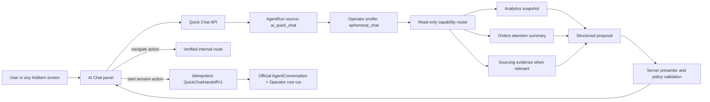

# KidItem AI Chat Quick Ask V1 Implementation Plan

> **For agentic workers:** REQUIRED SUB-SKILL: Use
> `superpowers:subagent-driven-development` (recommended) or
> `superpowers:executing-plans` to implement this plan task-by-task. Steps use
> checkbox (`- [ ]`) syntax for tracking.

**Goal:** Replace the legacy CopilotKit/Claude CLI chatbot with one globally
available, read-only Quick Ask surface answered by the KidItem Operator, render
presentation-safe text, blocks, suggested replies, and buttons, and create an
official Agent OS conversation only after the user explicitly accepts a
verified session proposal.

**Architecture:** AI Chat is an ephemeral interaction profile of the existing
`manager`/Operator Agent OS definition, not a new agent type. Every answer runs
as an audited inline Agent OS request without an `AgentConversation`, reads
bounded organization-scoped facts through registered capabilities, validates a
strict model proposal, and persists a short-lived presentation envelope. A
deterministic action handler owns navigation and idempotent promotion into a
durable Agent OS conversation. Business domains retain their facts and
mutations; AI Chat V1 has no business-write capability.

**Tech Stack:** NestJS, TypeScript, Prisma/PostgreSQL, Zod, OpenAI Responses
structured output, Agent OS capability/tool audit, Next.js App Router, React
Query, Vitest, Testing Library, Lucide, and the existing KidItem design tokens.

**Reference design:**
`docs/superpowers/specs/2026-08-13-ai-chat-interactive-response-design.md`

## Global Constraints

- Treat this as one declared Agent OS platform-boundary change. It may add
  narrow read adapters in Analytics, Orders, and Sourcing, but it must not
  rewrite those domains or change their formulas, state machines, or mutation
  ownership.
- `AI Chat` is the global surface, `Quick Ask` is its interaction mode, and the
  answering Agent OS identity is `manager` / `Operator`. Do not add another
  `quick_ask`, `assistant`, or `chatbot` agent definition.
- A Quick Ask run uses `interactionMode='ephemeral_chat'`; an official Agent OS
  conversation uses `interactionMode='agent_conversation'`; existing direct
  business surfaces use `interactionMode='direct_surface'` where applicable.
- Quick Ask is read-only. Its allowlist contains only capabilities whose
  declared side effects are exactly `['read']` and whose approval risk is
  `none`. It cannot invoke a mutation and cannot treat creation of an official
  conversation as approval for a later mutation.
- A user can start an official conversation only by clicking a server-minted
  `start_agent_session` action. Never silently create an `AgentConversation`
  from an answer, suggestion, free-form message, navigation action, retry, or
  panel open.
- Every model answer must have an `AgentRun`, exact provider/model, token usage,
  priced `costMicros`, ToolInvocation audit, and current-run evidence artifacts
  even though its transcript is not an official Agent OS conversation.
- Missing model selection, provider credentials, output schema, capability,
  or exact model pricing is an explicit readiness/error state. There is no
  provider, model, stale-UI-data, or legacy-chat fallback.
- Model output is a proposal. It cannot author HTML, component names, styles,
  arbitrary URLs, backend routes, action IDs, organization scope, approval
  semantics, or business-write actions.
- Text is the primary answer. A response remains understandable without using
  blocks or buttons. Do not implement a dedicated `더 자세히` action; concrete
  follow-ups remain ordinary messages or suggested replies.
- V1 uses synchronous JSON request/response, not streaming. Render no
  suggestions or actions before the entire model proposal, evidence set, and
  presentation envelope validate.
- Suggested replies are visible user turns, valid only for the latest eligible
  assistant response, and single-use as a set. A selected suggestion or any new
  free-form message consumes all sibling suggestions atomically.
- Navigation is internal only and server-verified. The browser submits an
  action ID, receives an allowlisted `href`, then calls `router.push()`; it does
  not construct a route from model text.
- One user has at most one active Quick Ask per organization. Create it on the
  first message; expire it after four idle hours or 24 total hours; close it on
  explicit `새 대화`, logout, or organization switch.
- Send at most the latest 12 quick-chat messages to the model. Older messages
  may contribute bounded intent only; no old factual value is accepted as
  current evidence. The web snapshot is capped separately for rendering.
- Quick Ask source `ai_quick_chat` is inline-only, `maxAttempts=1`, excluded
  from the background worker, failed as `process_interrupted` on restart, and
  never replayed automatically.
- Controllers derive organization scope from `@CurrentOrganization()` and the
  authenticated user decorator. No AI Chat DTO accepts `organizationId`,
  `userId`, provider, model, capability key, URL, or approval mode.
- Frontend code reaches data only through NestJS. Do not import Prisma, `pg`, a
  Supabase database client, or a domain repository into the web app.
- Use the focused `@kiditem/shared/ai-chat` subpath. Do not expand the shared
  root barrel.
- Use `String` fields plus Zod/domain validation for statuses and interaction
  modes; do not add Prisma/PostgreSQL enums.
- Keep raw presentation and handoff JSON bounded and non-authoritative.
  Organization, actor, identity, status, expiry, request/run, proposal, and
  conversation links remain normalized columns.
- The new Prisma shape is additive. After Task 0 verifies that `0.1.30` is the
  open unreleased train, keep `VERSION 0.1.30`, use compatible `db:push`, and
  declare no data migration/backfill. If that premise has changed, stop and
  reclassify the release decision before schema work.
- Do not delete or rewrite legacy `chat` AgentInstance rows. Removing the
  code-owned `chat` definition makes them absent from the registered catalog;
  retaining the rows preserves rollback evidence.
- Keep the legacy CopilotKit path only until the new vertical slice passes its
  contract, backend, and web tests. Remove it completely in the same cutover;
  do not leave two global assistants or a long-lived compatibility endpoint.
- Update `docs/ARCHITECTURE.md` because top-level web and Agent OS ownership
  changes. Update scoped `AGENTS.md` files only for durable boundary rules, then
  run `check:agents-hygiene`.

## Target Request Flow



## File Responsibility Map

### Shared response and API contract

- `packages/shared/src/ai-chat/index.ts`: all bounded V1 request, response,
  block, suggestion, action, route-key, feedback, and handoff Zod contracts.
- `packages/shared/src/ai-chat/index.spec.ts`: limit, discriminated-union,
  forbidden-field, and round-trip tests.
- `packages/shared/package.json` and `packages/shared/tsup.config.ts`: focused
  `@kiditem/shared/ai-chat` export and build entry.

### Agent OS interaction profile and runtime assets

- `agent-config/prompts/agents/manager-quick-ask.md`: read-only Operator answer
  policy, evidence rules, and session-boundary reasons.
- `agent-config/schemas/operator-quick-ask-answer.schema.json`: provider-neutral
  model proposal, deliberately excluding final IDs, URLs, and styling.
- `apps/server/src/agent-os/domain/agent-definition.registry.ts`: one
  `ephemeral_chat` interaction profile on the existing Manager definition.
- `apps/server/src/agent-os/adapter/out/runtime/filesystem-agent-runtime-assets.adapter.ts`:
  load and validate an expected schema ID instead of hard-coding the Sourcing
  answer schema.
- `apps/server/src/agent-os/adapter/out/runtime/openai-responses-structured-output.adapter.ts`:
  generic strict structured-output call used by both existing Operator
  decisions and Quick Ask answers.

### Quick-chat ledger, lifecycle, and HTTP boundary

- `prisma/models/agents.prisma`: additive quick-chat, quick-message, session
  proposal, and run interaction-mode columns/relations.
- `apps/server/src/agent-os/application/port/out/repository/agent-quick-chat-repository.port.ts`:
  focused organization-fenced persistence contract.
- `apps/server/src/agent-os/adapter/out/repository/agent-quick-chat.repository.ts`:
  lifecycle, suggestion consumption, feedback, final response, and promotion
  transactions.
- `apps/server/src/agent-os/application/service/agent-quick-chat.service.ts`:
  active-chat acquisition, message submission, retry, response finalization,
  close, and snapshot orchestration.
- `apps/server/src/agent-os/adapter/in/http/agent-quick-chat.controller.ts` and
  `dto/agent-quick-chat.dto.ts`: authenticated public API without client-owned
  organization/model/action authority.

### Read capabilities and answer verification

- `apps/server/src/analytics/dashboard/application/service/dashboard-agent-snapshot.service.ts`:
  bounded reuse of existing dashboard context/sales/ad/inventory services.
- `apps/server/src/analytics/dashboard/adapter/in/agent/dashboard-agent-snapshot-capability.adapter.ts`:
  `analytics.readBusinessSnapshot` registration and evidence artifacts.
- `apps/server/src/orders/application/service/orders-attention-summary.service.ts`:
  bounded stats and oldest attention-order query.
- `apps/server/src/orders/adapter/in/agent/orders-attention-summary-capability.adapter.ts`:
  `orders.readAttentionSummary` registration and evidence artifacts.
- `apps/server/src/agent-os/application/service/quick-chat-context-builder.service.ts`:
  recent-message context plus current-run capability reads.
- `apps/server/src/agent-os/application/service/quick-chat-response-presenter.service.ts`:
  artifact/resource verification, limit enforcement, formatting, and final
  response envelope.
- `apps/server/src/agent-os/domain/quick-chat-route.registry.ts` and
  `quick-chat-session-policy.ts`: route and promotion allowlists.

### Web surface and official-session deep link

- `apps/web/src/components/ai-chat/*`: controlled panel, API hook, typed
  renderer, blocks, actions, utilities, composer, and tests.
- `apps/web/src/components/layout/AppLayout.tsx`: mount the controlled new
  panel without hidden DOM-button clicks.
- `apps/web/src/app/agent-os/page.tsx` and
  `components/AgentOsOperatorWorkspace.tsx`: open a verified
  `?conversationId=` target and select that conversation.

### Legacy cutover and durable guards

- `scripts/check-ai-chat-boundary.mjs`: prevent CopilotKit, `/api/chat/copilot`,
  direct run submission, model-authored action parsing, or frontend database
  access from re-entering the global AI Chat boundary.
- `apps/server/src/chat/`, `apps/web/src/components/layout/CopilotChat.tsx`, and
  `apps/web/src/components/chat/ChatBot.tsx`: delete after the new path passes.
- `apps/server/src/main.ts`, `apps/server/src/app.module.ts`,
  `apps/web/next.config.mjs`, and `apps/web/src/proxy.ts`: remove legacy raw
  middleware, module wiring, rewrite, and auth bypass.

---

### Task 0: Establish an executable branch and release baseline

**Files:**
- Read: `AGENTS.md`
- Read: `docs/runbooks/ai-collaboration.md`
- Read: `docs/runbooks/release-train-versioning.md`
- Read: `VERSION`
- No product-file changes

- [ ] **Step 1: Confirm the working tree and preserve the two planning files**

The current planning checkout is detached. Before implementation, record the
state and confirm the only expected untracked files are the design spec and
this plan:

```bash
rtk git status --short --branch
rtk git diff --name-only
rtk git ls-files --others --exclude-standard
```

Expected untracked paths:

```text
docs/superpowers/specs/2026-08-13-ai-chat-interactive-response-design.md
docs/superpowers/plans/2026-08-13-ai-chat-quick-ask-v1.md
```

Stop on any unrelated modification. Do not stash, reset, or overwrite another
collaborator's work.

- [ ] **Step 2: Create the implementation branch from the intended base**

Fetch without rebasing, verify `origin/develop`, then create a normal topic
branch. Preserve the two untracked documentation files through the switch:

```bash
rtk git fetch origin develop main release/office
rtk git rev-parse --verify origin/develop
rtk git switch -c codex/ai-chat-quick-ask-v1 origin/develop
rtk git branch --show-current
rtk git merge-base --is-ancestor origin/develop HEAD
```

Expected branch: `codex/ai-chat-quick-ask-v1`. If the untracked paths conflict
with files now present on `origin/develop`, stop and reconcile their content
explicitly instead of overwriting either copy.

- [ ] **Step 3: Classify the release train before schema edits**

```bash
rtk sed -n '1p' VERSION
rtk git show origin/main:VERSION
rtk git show origin/develop:VERSION
```

If `0.1.30` is still the open unreleased `develop` train, record this PR
decision verbatim:

```text
Release decision: keep VERSION 0.1.30; compatible additive Prisma change;
no data migration or backfill.
```

If `develop` has advanced or `0.1.30` is already promoted, update the decision
to the live train before continuing. Do not bump `VERSION` merely because this
plan adds tables.

- [ ] **Step 4: Capture the legacy boundary baseline**

Run the narrow existing tests before changing behavior:

```bash
rtk npm exec --workspace=apps/server vitest -- run src/chat src/agent-os
rtk npm exec --workspace=apps/web vitest -- run \
  src/components/layout/__tests__/CopilotChat.spec.tsx \
  src/__tests__/next-config.spec.ts \
  src/__tests__/proxy.spec.ts
rtk npm run build --workspace=packages/shared
```

Save failures as baseline evidence. Do not weaken an existing test to make the
new architecture pass.

---

### Task 1: Define the V1 wire contract and Operator interaction profile

**Files:**
- Create: `packages/shared/src/ai-chat/index.ts`
- Create: `packages/shared/src/ai-chat/index.spec.ts`
- Modify: `packages/shared/package.json`
- Modify: `packages/shared/tsup.config.ts`
- Create: `agent-config/prompts/agents/manager-quick-ask.md`
- Create: `agent-config/schemas/operator-quick-ask-answer.schema.json`
- Modify: `apps/server/src/agent-os/domain/agent-os.types.ts`
- Modify: `apps/server/src/agent-os/domain/agent-definition.registry.ts`
- Modify: `apps/server/src/agent-os/domain/__tests__/agent-definition.registry.spec.ts`
- Modify: `apps/server/src/agent-os/application/port/out/runtime/agent-runtime-assets.port.ts`
- Modify: `apps/server/src/agent-os/adapter/out/runtime/filesystem-agent-runtime-assets.adapter.ts`
- Modify: `apps/server/src/agent-os/adapter/out/runtime/__tests__/filesystem-agent-runtime-assets.adapter.spec.ts`
- Modify: `apps/server/src/agent-os/application/service/agent-runtime-assets-startup-validator.service.ts`
- Modify: `apps/server/src/agent-os/application/service/__tests__/agent-runtime-assets-startup-validator.service.spec.ts`

**Interfaces:**

Add these code-owned concepts without adding an agent type:

```ts
export type AgentInteractionMode =
  | 'agent_conversation'
  | 'direct_surface'
  | 'ephemeral_chat';

export interface AgentInteractionProfileRecord {
  key: 'quick_ask_v1';
  interactionMode: 'ephemeral_chat';
  promptPath: string;
  outputSchemaPath: string;
  outputSchemaId: 'operator-quick-ask-answer.v1';
  capabilityKeys: readonly [
    'analytics.readBusinessSnapshot',
    'orders.readAttentionSummary',
    'sourcing.retrieveWorkspaceEvidence',
  ];
}
```

The Manager definition owns `quick_ask_v1`. The legacy `chat` definition stays
unchanged until Task 9, so Tasks 1–8 can be rolled back without breaking the
current global button.

The model proposal is narrower than the web response:

```ts
interface OperatorQuickAskProposalV1 {
  schemaVersion: 'operator-quick-ask-answer.v1';
  text: string;
  dataAsOf: string | null;
  partial: boolean;
  blocks: ProposedBlockV1[];
  citationArtifactIds: string[];
  dataGaps: string[];
  suggestions: Array<{ label: string; message: string }>;
  navigation: Array<{
    label: string;
    routeKey: AiChatRouteKey;
    resourceType: string | null;
    resourceId: string | null;
  }>;
  sessionProposal: null | {
    reasonCode:
      | 'delegation'
      | 'business_write'
      | 'external_side_effect'
      | 'approval'
      | 'asynchronous_work'
      | 'durable_artifact'
      | 'resumable_work'
      | 'monitoring';
    goal: string;
    reason: string;
    expectedOutput: string;
  };
}
```

It contains no final `responseId`, `suggestionId`, `actionId`, `proposalId`,
`href`, component/style field, endpoint, provider, model, or organization.

- [ ] **Step 1: Write failing shared-contract tests**

Cover all discriminated unions and exact limits from the design:

- `text <= 6,000` characters;
- at most four blocks;
- metric groups at most four items;
- resource lists at most five items;
- comparisons at most four columns and four rows;
- at most 12 citations and data gaps;
- at most three suggestions and two actions;
- only `metric_group | resource_list | comparison | notice` blocks;
- only `navigate | start_agent_session | open_agent_session` response actions;
- route keys are an enum, never an arbitrary URL;
- message bodies do not accept organization/model/capability fields;
- `QuickChatHandoffV1` uses schema version `quick-chat-handoff.v1`.

Use `z.strictObject()` at every browser boundary so unexpected authority fields
fail parsing instead of being silently stripped.

- [ ] **Step 2: Implement and export `@kiditem/shared/ai-chat`**

Add the focused `exports` and `typesVersions` entries to `package.json` and the
entry to `tsup.config.ts`. Export inferred TypeScript types next to their Zod
schemas. Do not re-export the module from `packages/shared/src/index.ts`.

The response snapshot must include:

```ts
interface AiChatSnapshotV1 {
  schemaVersion: 'ai-chat-snapshot.v1';
  readiness: { ready: boolean; reasonCode: string | null; message: string | null };
  chat: null | {
    id: string;
    status: 'active';
    idleExpiresAt: string;
    hardExpiresAt: string;
    historyTruncated: boolean;
    messages: AiChatTranscriptMessageV1[];
  };
}
```

Assistant messages embed the validated `AiChatResponseV1`; user messages carry
plain text and optional `selectedSuggestionId`. Message utilities such as copy,
feedback, and retry are not included in the model-authored action array.

- [ ] **Step 3: Write the Quick Ask prompt and strict JSON Schema**

The prompt must state:

- answer only from supplied current capability artifacts;
- cite artifact IDs, not invented source labels;
- say what is missing when the evidence cannot answer;
- never claim a write, delegation, refresh, submission, approval, or monitoring
  action occurred;
- propose a session only for one of the eight enumerated reasons;
- keep text useful without blocks/actions;
- suggest concrete follow-up questions, not generic `더 자세히`;
- never return markup, URLs, action IDs, routes outside the enum, or UI styles.

The JSON Schema uses `additionalProperties: false` recursively and mirrors the
proposal limits. Add fixtures for a fact answer, partial answer, navigation,
and session proposal.

- [ ] **Step 4: Attach the profile to the existing Manager definition**

Extend `AgentDefinitionRecord` with `interactionProfiles`, defaulting to an
empty list. Assert:

```ts
expect(findAgentDefinitionByType('manager')).toMatchObject({
  type: 'manager',
  name: 'Operator',
  interactionProfiles: [
    expect.objectContaining({
      key: 'quick_ask_v1',
      interactionMode: 'ephemeral_chat',
      outputSchemaId: 'operator-quick-ask-answer.v1',
    }),
  ],
});
```

Also assert that no `quick_ask` agent definition exists and that the profile's
capability list has no duplicates.

- [ ] **Step 5: Generalize runtime-asset schema validation**

Replace the Sourcing-specific hard-coded schema ID check with an input field:

```ts
interface ResolveAgentRuntimeAssetsInput {
  agentType: string;
  promptPath: string;
  skillKeys: string[];
  outputSchemaPath: string;
  expectedOutputSchemaId: string;
}
```

Preserve all path-containment, file-size, JSON parsing, hash, and Sourcing tests.
Add Quick Ask startup validation that fails on a missing prompt/schema, wrong
schema ID, or escaping path. Do not let a request provide any asset path.

- [ ] **Step 6: Run the focused contract and asset gates**

```bash
rtk npm exec --workspace=packages/shared vitest -- run src/ai-chat/index.spec.ts
rtk npm exec --workspace=apps/server vitest -- run \
  src/agent-os/domain/__tests__/agent-definition.registry.spec.ts \
  src/agent-os/adapter/out/runtime/__tests__/filesystem-agent-runtime-assets.adapter.spec.ts \
  src/agent-os/application/service/__tests__/agent-runtime-assets-startup-validator.service.spec.ts
rtk npm run build --workspace=packages/shared
```

Expected: shared consumers can import only `@kiditem/shared/ai-chat`, Manager
owns the profile, and both Sourcing and Quick Ask assets validate at startup.

---

### Task 2: Add the ephemeral ledger and focused repository

**Files:**
- Modify: `prisma/models/agents.prisma`
- Modify: `prisma/models/core.prisma`
- Modify: `apps/server/src/agent-os/domain/agent-os.types.ts`
- Modify: `apps/server/src/agent-os/application/port/in/agent-runner.port.ts`
- Modify: `apps/server/src/agent-os/application/port/out/repository/agent-os-repository.port.ts`
- Create: `apps/server/src/agent-os/application/port/out/repository/agent-quick-chat-repository.port.ts`
- Create: `apps/server/src/agent-os/adapter/out/repository/agent-quick-chat.repository.ts`
- Create: `apps/server/src/agent-os/adapter/out/repository/__tests__/agent-quick-chat.repository.spec.ts`
- Create: `apps/server/src/agent-os/__tests__/agent-quick-chat-repository.pg.integration.spec.ts`
- Modify: `apps/server/src/agent-os/adapter/out/repository/agent-os.repository.mapper.ts`
- Modify: `apps/server/src/agent-os/adapter/out/repository/agent-os.request.repository.ts`
- Modify: `apps/server/src/agent-os/agent-os.module.ts`

**Data model:**

Add `interactionMode String? @map("interaction_mode")` to
`AgentRunRequest`. Existing rows remain `null`; all new first-party entrypoints
set it explicitly. Add an index appropriate for source/mode observability, but
do not turn the string into a Prisma enum.

Add three models:

```text
AgentQuickChat
  id, organizationId, createdByUserId
  status                  active | closed | expired
  activeSlot              "active" for active rows, null otherwise
  idleExpiresAt, hardExpiresAt, lastMessageAt
  createdAt, updatedAt

AgentQuickChatMessage
  id, organizationId, quickChatId
  role                    user | assistant
  content
  response                bounded AiChatResponseV1 JSON or null
  requestId, runId, replyToMessageId
  selectedSuggestionId, suggestionsConsumedAt
  feedback                up | down | null
  failureCode, createdAt

AgentQuickChatSessionProposal
  id, organizationId, quickChatId, sourceMessageId
  goal, reasonCode, reason, expectedOutput
  handoff                 bounded QuickChatHandoffV1 JSON
  status                  pending | consumed | expired
  expiresAt, conversationId
  createdAt, updatedAt
```

Use `@@unique([organizationId, createdByUserId, activeSlot])`. PostgreSQL allows
multiple `NULL` values, so closed/expired history coexists while
`activeSlot='active'` enforces one active chat without an unmanaged partial
index. Every state transition sets both `status` and `activeSlot` in the same
transaction, and a domain test rejects any other active-slot value.

Every child relation is organization-fenced with a composite parent key such
as `@@unique([id, organizationId])`. Add the required relation arrays to
`Organization`, `User`, `AgentConversation`, `AgentRunRequest`, and `AgentRun`.
Do not add `tenantId` or `User.organizationId`.

- [ ] **Step 1: Write the domain and repository contract tests first**

Define a focused port with operations for:

- get-or-create active chat with idle/hard expiry;
- read a user-scoped snapshot;
- atomically append a free-form or suggested user turn;
- atomically finalize an assistant response or a failed turn;
- load at most 12 recent model-context messages;
- load a bounded web history, newest 100 returned chronologically;
- consume the latest response's suggestions;
- close a chat and clear `activeSlot`;
- set feedback on an owned assistant response;
- persist/load a normalized session proposal;
- idempotently create/link an official conversation for a proposal.

Unit tests must prove all calls require organization and user scope, use the
same clock passed by the service, and never expose generic Prisma access.

- [ ] **Step 2: Add the Prisma models and relationships**

Use UUID IDs and mapped snake-case table/column names consistent with
`agents.prisma`. Add indexes for:

- active lookup by organization/user/status;
- message ordering by quick chat and `createdAt`;
- request/run lookup;
- proposal expiry/status;
- conversation lookup.

Make `sourceMessageId` unique for session proposals. Use the service-generated
assistant message ID as `responseId`, avoiding a duplicate response identity
column.

- [ ] **Step 3: Implement lifecycle and concurrency transactions**

The adapter must use transactions for these races:

1. lazy-expire an active row, clear its slot, then create a new active row;
2. consume all prior suggestions and append the next visible user message;
3. finalize exactly one assistant message for one user message/request;
4. create one session proposal per assistant response;
5. create/link at most one official conversation per proposal.

If concurrent first messages race on the active-slot unique key, catch only
that named constraint and reread the winning active row. Do not catch broad
database errors as success.

- [ ] **Step 4: Add PostgreSQL integration coverage**

Use two organizations and two users. Prove:

- one active row under concurrent creation;
- closed and expired rows no longer occupy the active slot;
- four-hour idle and 24-hour hard expiry are both enforced;
- organization/user IDOR reads and writes return no row;
- a selected suggestion consumes siblings exactly once;
- a simultaneous free-form message makes the suggestion stale;
- assistant finalization is idempotent by user message/request;
- proposal consumption returns the same conversation under retries;
- cascade/restrict behavior cannot orphan audit links.

- [ ] **Step 5: Push the additive schema and regenerate artifacts**

```bash
rtk npm run db:push
rtk npx prisma generate
rtk npm run build --workspace=packages/shared
rtk npm run db:erd
rtk npm run check:schema-artifact-sync
```

Expected: compatible additions only. `rtk git diff -- prisma/models` must show
no destructive column/type rewrite, and no `scripts/data-migrations/` file is
created.

- [ ] **Step 6: Run repository tests and tenancy guards**

```bash
rtk npm exec --workspace=apps/server vitest -- run \
  src/agent-os/adapter/out/repository/__tests__/agent-quick-chat.repository.spec.ts
rtk npm run test:integration -- \
  src/agent-os/__tests__/agent-quick-chat-repository.pg.integration.spec.ts
rtk npm run check:idor
rtk npm run check:tenant-scope
```

---

### Task 3: Register bounded Analytics and Orders read capabilities

**Files:**
- Create: `apps/server/src/analytics/dashboard/domain/capability/analytics-dashboard.capabilities.ts`
- Create: `apps/server/src/analytics/dashboard/application/port/in/dashboard-agent-snapshot.port.ts`
- Create: `apps/server/src/analytics/dashboard/application/service/dashboard-agent-snapshot.service.ts`
- Create: `apps/server/src/analytics/dashboard/application/service/dashboard-agent-snapshot.service.spec.ts`
- Create: `apps/server/src/analytics/dashboard/adapter/in/agent/dashboard-agent-snapshot-capability.adapter.ts`
- Create: `apps/server/src/analytics/dashboard/adapter/in/agent/__tests__/dashboard-agent-snapshot-capability.adapter.spec.ts`
- Modify: `apps/server/src/analytics/dashboard/dashboard.module.ts`
- Modify: `apps/server/src/analytics/dashboard/__tests__/dashboard.module.wiring.spec.ts`
- Create: `apps/server/src/orders/domain/capability/orders.capabilities.ts`
- Create: `apps/server/src/orders/application/port/in/orders-attention-summary.port.ts`
- Create: `apps/server/src/orders/application/service/orders-attention-summary.service.ts`
- Create: `apps/server/src/orders/application/service/orders-attention-summary.service.spec.ts`
- Create: `apps/server/src/orders/adapter/in/agent/orders-attention-summary-capability.adapter.ts`
- Create: `apps/server/src/orders/adapter/in/agent/__tests__/orders-attention-summary-capability.adapter.spec.ts`
- Modify: `apps/server/src/orders/orders.module.ts`
- Modify: `apps/server/src/orders/__tests__/orders.module.wiring.spec.ts`
- Modify: `apps/server/src/agent-os/domain/agent-definition.registry.ts`
- Modify: `apps/server/src/agent-os/domain/__tests__/agent-definition.registry.spec.ts`

**Capability contracts:**

```ts
analytics.readBusinessSnapshot({ range: 'day' | 'week' | 'month' })
  -> {
    range, capturedAt, dataAsOf, partial, dataGaps,
    sales, profit, advertising, inventory,
    topProducts: ProductSummary[0..5]
  }

orders.readAttentionSummary({ limit?: 1..5 })
  -> {
    capturedAt, totalByStatus, todayCount, weekCount,
    attentionCount,
    oldestAttentionOrders: OrderSummary[0..5],
    dataGaps
  }
```

`analytics.readBusinessSnapshot` reuses the existing Dashboard context and
sales/ad/inventory application services; it does not duplicate calculations or
read repositories directly. `orders.readAttentionSummary` uses a new narrow
application service and organization-scoped query. It must not add AI-specific
branching to `OrdersService` or expose order mutations.

- [ ] **Step 1: Add manifest tests for two read-only capabilities**

Assert for both capabilities:

```ts
expect(manifest).toMatchObject({
  effects: ['read'],
  approval: 'none',
  visibility: 'agent',
});
```

Add a cross-profile test that every Quick Ask capability resolves to a
registered handler and declares only `read` side effects. The existing Sourcing
capability `sourcing.retrieveWorkspaceEvidence` is reused with `topK <= 5`; do
not fork it or expose `refreshCollection`, validation, review, scrape, or
ingestion capabilities.

- [ ] **Step 2: Build the bounded Analytics snapshot service**

Call existing Dashboard services with one `DashboardContext` and the same
organization/range. Run independent summaries in parallel. Normalize only
presentation-neutral facts and timestamps; leave currency/percent formatting
to the presenter/web shared formatters.

Return partial data with named gaps when one optional source is stale or
unavailable. Throw on organization/auth boundary failures. Cap products at
five and exclude raw payloads, credentials, supplier secrets, or unbounded
daily series.

- [ ] **Step 3: Build the Orders attention service**

Use existing order status semantics. `attention` for V1 means unprocessed
orders in `ACCEPT | INSTRUCT`; do not invent a new persisted order status. Return
up to five oldest records with only stable ID, display title/order number,
channel label, status, ordered/created timestamp, and age basis.

Tests cover zero orders, mixed statuses, chronological ordering, the limit,
and organization isolation.

- [ ] **Step 4: Register Agent OS capability adapters**

Each adapter registers on module init through `AgentCapabilityRegistry`,
validates input/output with Zod, and returns:

- one summary artifact for aggregate facts;
- at most five resource artifacts for canonical products/orders;
- stable `targetDomain`, `targetModel`, and `targetId` values;
- `capturedAt`, freshness, and data gaps in the summary.

Import/export only the narrow module seam needed to access the registry. Avoid
an `AgentOsModule <-> Dashboard/Orders` circular dependency; Agent OS must not
import the business modules.

- [ ] **Step 5: Allow exactly three Manager read policies**

Add policies for:

```text
analytics.readBusinessSnapshot
orders.readAttentionSummary
sourcing.retrieveWorkspaceEvidence
```

Each policy is `effect='allow'`, `approvalMode='none'`, and constrained to
read-only execution. Do not add any Manager write policy in this task.

- [ ] **Step 6: Run business-domain and registration tests**

```bash
rtk npm exec --workspace=apps/server vitest -- run \
  src/analytics/dashboard/application/service/dashboard-agent-snapshot.service.spec.ts \
  src/analytics/dashboard/adapter/in/agent/__tests__/dashboard-agent-snapshot-capability.adapter.spec.ts \
  src/orders/application/service/orders-attention-summary.service.spec.ts \
  src/orders/adapter/in/agent/__tests__/orders-attention-summary-capability.adapter.spec.ts \
  src/agent-os/domain/__tests__/agent-definition.registry.spec.ts \
  src/analytics/dashboard/__tests__/dashboard.module.wiring.spec.ts \
  src/orders/__tests__/orders.module.wiring.spec.ts
```

Expected: no business mutation is callable through the Quick Ask profile and
existing dashboard/order calculations remain unchanged.

---

### Task 4: Execute Quick Ask through an audited Operator runtime

**Files:**
- Create: `apps/server/src/agent-os/application/service/quick-chat-intent-router.ts`
- Create: `apps/server/src/agent-os/application/service/__tests__/quick-chat-intent-router.spec.ts`
- Create: `apps/server/src/agent-os/application/service/quick-chat-context-builder.service.ts`
- Create: `apps/server/src/agent-os/application/service/__tests__/quick-chat-context-builder.service.spec.ts`
- Create: `apps/server/src/agent-os/application/port/out/runtime/agent-structured-output-runtime.port.ts`
- Create: `apps/server/src/agent-os/domain/agent-runtime-execution.error.ts`
- Create: `apps/server/src/agent-os/adapter/out/runtime/openai-responses-structured-output.adapter.ts`
- Create: `apps/server/src/agent-os/adapter/out/runtime/__tests__/openai-responses-structured-output.adapter.spec.ts`
- Modify: `apps/server/src/agent-os/adapter/out/runtime/openai-responses-operator-runtime.adapter.ts`
- Modify: `apps/server/src/agent-os/adapter/out/runtime/__tests__/openai-responses-operator-runtime.adapter.spec.ts`
- Create: `apps/server/src/agent-os/application/service/agent-model-cost.service.ts`
- Create: `apps/server/src/agent-os/application/service/__tests__/agent-model-cost.service.spec.ts`
- Modify: `apps/server/src/agent-os/application/service/agent-runtime.config.ts`
- Create: `apps/server/src/agent-os/adapter/out/runtime/quick-chat-runtime.service.ts`
- Create: `apps/server/src/agent-os/adapter/out/runtime/__tests__/quick-chat-runtime.service.spec.ts`
- Modify: `apps/server/src/agent-os/adapter/out/runtime/operator-runtime.handler.ts`
- Modify: `apps/server/src/agent-os/adapter/out/runtime/__tests__/operator-runtime.handler.spec.ts`
- Modify: `apps/server/src/agent-os/application/port/out/runtime/agent-runtime.port.ts`
- Modify: `apps/server/src/agent-os/application/service/agent-run-coordinator.service.ts`
- Modify: `apps/server/src/agent-os/application/service/agent-run-executor.service.ts`
- Create: `apps/server/src/agent-os/domain/inline-agent-source.policy.ts`
- Modify: `apps/server/src/agent-os/application/service/agent-run-worker.service.ts`
- Modify: `apps/server/src/agent-os/application/service/agent-inline-run-reconciler.service.ts`
- Modify: `apps/server/src/agent-os/application/service/__tests__/agent-run-coordinator.service.spec.ts`
- Modify: `apps/server/src/agent-os/application/service/__tests__/agent-run-executor.service.spec.ts`
- Modify: `apps/server/src/agent-os/application/service/__tests__/agent-run-worker.service.spec.ts`
- Modify: `apps/server/src/agent-os/application/service/__tests__/agent-inline-run-reconciler.service.spec.ts`
- Modify: `apps/server/src/agent-os/__tests__/agent-inline-run-reconcile.pg.integration.spec.ts`
- Modify: `apps/server/src/agent-os/__tests__/agent-os.module.wiring.spec.ts`
- Modify: `apps/server/src/agent-os/agent-os.module.ts`
- Modify: `apps/server/src/readiness/readiness.service.ts`
- Modify: `apps/server/src/readiness/__tests__/readiness.service.spec.ts`

**Runtime sequence:**

```text
claimed AgentRunRequest(interactionMode=ephemeral_chat)
  -> OperatorRuntimeHandler quick branch
  -> load <=12 recent QuickChat messages
  -> deterministic range/domain routing
  -> invoke current read capabilities through AgentToolRouter
  -> store ToolInvocations + evidence Artifacts on this run
  -> strict OpenAI structured output
  -> parse proposal
  -> return provider/tokens/cost with proposal
```

- [ ] **Step 1: Propagate interaction mode through the run envelope**

Add `interactionMode` to `AgentRunnerInput`, request creation, repository
mapping, `AgentRunRequestRecord`, and `AgentRuntimeExecutionContext`. New
first-party call sites set:

- `agent_conversation` in `AgentConversationService`;
- `direct_surface` in the existing Sourcing dashboard interaction;
- `ephemeral_chat` in the new Quick Chat service.

For existing rows only, `null` remains compatible. Runtime handlers must never
infer `ephemeral_chat` from a source string alone.

- [ ] **Step 2: Build deterministic context routing**

The intent router is not an LLM. It maps Korean/English time expressions to
`day | week | month`, invokes Analytics and Orders in parallel on every turn,
and invokes Sourcing evidence only when the route/resource context or query is
Sourcing-related. It caps Sourcing `topK` at five.

The context builder passes request/run IDs into `AgentToolRouter`, so all reads
produce same-run audit rows. A capability failure becomes a named `dataGap`;
an authorization, tenant, schema, or policy failure aborts the answer.

- [ ] **Step 3: Extract the generic Responses structured-output adapter**

Create one generic method:

```ts
generate({
  model,
  schemaName,
  schema,
  prompt,
  apiKey,
  baseUrl,
  timeoutMs,
}): Promise<{
  provider: 'openai_responses';
  outputText: string;
  responseId: string | null;
  model: string;
  inputTokens: number;
  cachedInputTokens: number;
  outputTokens: number;
  durationMs: number;
}>;
```

Keep `store:false`, strict JSON Schema, abort timeout, redacted errors, refusal
handling, incomplete-response handling, and token parsing. Reimplement the
existing Operator decision adapter as a thin compatibility wrapper and keep
its tests green.

When a provider completed and returned usage but later parsing/grounding fails,
wrap the failure in a typed `AgentRuntimeExecutionError` carrying only provider,
model, token counts, and calculated cost. `AgentRunExecutor` must persist that
usage/cost before finalizing the run as failed. Never mark an invalid answer
successful merely to preserve its cost audit.

The model recorded in `AgentRuntimeExecutionContext` is authoritative. If
`AGENT_OS_OPENAI_RESPONSES_MODEL` remains configured for the existing harness,
startup/runtime must require it to equal the resolved Manager run model; a
mismatch is `operator_runtime_model_mismatch`, not an override.

- [ ] **Step 4: Add exact model pricing and fail-closed readiness**

Parse a server-only map such as:

```json
{
  "exact-model-id": {
    "inputMicrosPerMillionTokens": 1000000,
    "cachedInputMicrosPerMillionTokens": 100000,
    "outputMicrosPerMillionTokens": 5000000
  }
}
```

from `AGENT_OS_OPENAI_MODEL_PRICING_JSON`. Do not hard-code a volatile public
price. Validate integer, non-negative values and exact model keys. Calculate:

```text
ceil((nonCachedInput * inputRate
    + cachedInput * cachedRate
    + output * outputRate) / 1_000_000)
```

using `bigint`. Quick Ask readiness is false if runtime selection, API key,
Manager model, schema, or exact price is missing/mismatched. Unit tests cover
cached tokens, rounding, zero usage, malformed JSON, unknown model, and cached
input greater than total input.

- [ ] **Step 5: Add the Quick Chat branch to the Operator handler**

Branch before the official-conversation requirement:

```ts
if (context.interactionMode === 'ephemeral_chat') {
  return this.quickChatRuntime.execute(context);
}
```

The quick runtime loads its profile assets, builds current evidence, generates
and parses one proposal, and returns tokens plus `costMicros`. It never invokes
`OperatorDecisionExecutor` or `AgentTaskDelegationService`. Existing
`agent_conversation` delegation and deterministic behavior remain unchanged.

Extend the executor catch path to recognize the typed runtime usage metadata.
Tests prove a schema-invalid/refused/ungrounded provider response fails the run
while still recording any provider-reported tokens and exact-model cost.

- [ ] **Step 6: Make inline-only source policy shared and non-replayable**

Create:

```ts
export const INLINE_ONLY_AGENT_SOURCES = [
  'sourcing_dashboard',
  'ai_quick_chat',
] as const;
```

Use it in all unscoped claim paths and boot reconciliation. Tests prove a
worker cannot claim either source, direct execute-by-ID can, interruption fails
both sources, and neither is requeued.

- [ ] **Step 7: Run runtime, audit, and readiness tests**

```bash
rtk npm exec --workspace=apps/server vitest -- run \
  src/agent-os/application/service/__tests__/quick-chat-intent-router.spec.ts \
  src/agent-os/application/service/__tests__/quick-chat-context-builder.service.spec.ts \
  src/agent-os/application/service/__tests__/agent-model-cost.service.spec.ts \
  src/agent-os/adapter/out/runtime/__tests__/openai-responses-structured-output.adapter.spec.ts \
  src/agent-os/adapter/out/runtime/__tests__/openai-responses-operator-runtime.adapter.spec.ts \
  src/agent-os/adapter/out/runtime/__tests__/quick-chat-runtime.service.spec.ts \
  src/agent-os/adapter/out/runtime/__tests__/operator-runtime.handler.spec.ts \
  src/agent-os/application/service/__tests__/agent-run-executor.service.spec.ts \
  src/agent-os/application/service/__tests__/agent-run-worker.service.spec.ts \
  src/agent-os/application/service/__tests__/agent-inline-run-reconciler.service.spec.ts \
  src/readiness/__tests__/readiness.service.spec.ts
```

Expected: every successful Quick Ask run has provider, exact model, token
counts, non-optional `costMicros`, and same-run read artifacts; it has no
conversation and no delegated child request.

---

### Task 5: Verify model proposals and mint safe response actions

**Files:**
- Create: `apps/server/src/agent-os/application/service/quick-chat-proposal-parser.service.ts`
- Create: `apps/server/src/agent-os/application/service/__tests__/quick-chat-proposal-parser.service.spec.ts`
- Create: `apps/server/src/agent-os/application/service/quick-chat-response-presenter.service.ts`
- Create: `apps/server/src/agent-os/application/service/__tests__/quick-chat-response-presenter.service.spec.ts`
- Create: `apps/server/src/agent-os/domain/quick-chat-route.registry.ts`
- Create: `apps/server/src/agent-os/domain/__tests__/quick-chat-route.registry.spec.ts`
- Create: `apps/server/src/agent-os/domain/quick-chat-session-policy.ts`
- Create: `apps/server/src/agent-os/domain/__tests__/quick-chat-session-policy.spec.ts`
- Create: `apps/server/src/agent-os/application/service/__tests__/fixtures/quick-chat-proposals.ts`
- Modify: `apps/server/src/agent-os/adapter/out/runtime/quick-chat-runtime.service.ts`
- Modify: `apps/server/src/agent-os/adapter/out/runtime/__tests__/quick-chat-runtime.service.spec.ts`
- Modify: `apps/server/src/agent-os/agent-os.module.ts`

**Verified route keys:**

Start with only live first-party destinations:

```text
dashboard
sourcing_decision_center
orders
order_collection
stock_operations
advertising_operations
profit_loss
agent_os
```

The registry owns each canonical `href` and allowed resource types. Broad route
navigation may omit a resource ID. Resource-specific navigation requires a
matching current-run artifact target and a route that supports that resource.

- [ ] **Step 1: Reject structurally valid but ungrounded proposals**

Parser/presenter tests must reject or remove:

- citation IDs not produced by a successful ToolInvocation on this run;
- resource rows not backed by a current-run artifact;
- an arbitrary/internal/external URL;
- an unknown route key or incompatible resource type;
- more than the contract limits;
- HTML/component/style fields;
- an unsupported session reason;
- a mutation-like navigation/session claim;
- empty text with block-only meaning.

Never silently substitute a broad route for an invalid resource target. Keep
the answer but return the action disabled/unavailable with an explicit reason,
or fail the response when grounding affects the factual claim.

Split pure verification from final ID/persistence work:

```ts
verifyProposal({ organizationId, requestId, runId, proposal, artifacts })
  -> VerifiedQuickChatProposalV1

present({ quickChatId, responseId, verifiedProposal, now })
  -> AiChatResponseV1 + normalized session proposal
```

Call `verifyProposal` inside `QuickChatRuntimeService` before it returns to
`AgentRunExecutor`. A grounding failure therefore fails the AgentRun and uses
the typed usage/cost failure path from Task 4. Task 6 calls `present` only after
that verified run succeeds; it never reparses raw provider text.

- [ ] **Step 2: Derive presentation values from evidence**

Where a block points at known aggregate/resource fields, the presenter reads
the artifact summary and formats the value itself. The model may choose which
verified facts to emphasize, but it does not supply a conflicting amount,
status, or resource label. Keep server formatting locale-neutral where the web
already has shared currency/number/date helpers.

Set `context.generatedAt` from the server clock and `dataAsOf` from verified
capability freshness. Set `partial=true` whenever any used domain reports a
gap, even if the model omitted it.

- [ ] **Step 3: Mint suggestions and action IDs**

Generate opaque IDs after verification. Normalize and cap labels/messages;
reject prompt-injection-like control characters and blank values. Suggestions
carry `expiresWithResponseId=responseId` and have no endpoint or action style.

At most one primary persistent action is exposed. Visual emphasis is derived
later from action kind; the response contract never accepts a model-provided
tone for buttons.

- [ ] **Step 4: Enforce deterministic session-boundary policy**

Permit a `start_agent_session` action only for the eight enum reasons from the
design. The model supplies rationale, but the server verifies the requested
goal requires delegation, write/external effect, approval, asynchronous work,
durable artifact, resumption, or monitoring. If the user asks a question that
can be answered from reads, keep it in Quick Ask.

Persist a normalized proposal with a short expiry no later than the Quick Chat
hard expiry. The response contains only proposal ID, reason, expected output,
and expiry; no conversation exists yet.

- [ ] **Step 5: Run presenter and policy tests**

```bash
rtk npm exec --workspace=apps/server vitest -- run \
  src/agent-os/application/service/__tests__/quick-chat-proposal-parser.service.spec.ts \
  src/agent-os/application/service/__tests__/quick-chat-response-presenter.service.spec.ts \
  src/agent-os/domain/__tests__/quick-chat-route.registry.spec.ts \
  src/agent-os/domain/__tests__/quick-chat-session-policy.spec.ts
```

Include golden fixtures for the three design examples: order count with
suggestions, inventory/advertising comparison with navigation, and Sourcing
collection request with an Agent OS session proposal.

---

### Task 6: Expose the Quick Chat lifecycle API

**Files:**
- Create: `apps/server/src/agent-os/application/port/in/agent-quick-chat.port.ts`
- Create: `apps/server/src/agent-os/application/service/agent-quick-chat.service.ts`
- Create: `apps/server/src/agent-os/application/service/__tests__/agent-quick-chat.service.spec.ts`
- Create: `apps/server/src/agent-os/adapter/in/http/dto/agent-quick-chat.dto.ts`
- Create: `apps/server/src/agent-os/adapter/in/http/agent-quick-chat.controller.ts`
- Create: `apps/server/src/agent-os/adapter/in/http/__tests__/agent-quick-chat.controller.spec.ts`
- Create: `apps/server/src/agent-os/__tests__/agent-quick-chat-flow.pg.integration.spec.ts`
- Modify: `apps/server/src/agent-os/agent-os.module.ts`

**HTTP contract:**

```text
GET    /api/agent-os/quick-chat
POST   /api/agent-os/quick-chat/messages
POST   /api/agent-os/quick-chat/messages/:messageId/retry
DELETE /api/agent-os/quick-chat/:quickChatId
PUT    /api/agent-os/quick-chat/responses/:responseId/feedback
POST   /api/agent-os/quick-chat/responses/:responseId/actions/:actionId/execute
```

`POST /messages` accepts:

```ts
{
  quickChatId?: string;
  content: string;
  surfaceContext: {
    routeKey: AiChatRouteKey;
    resourceRefs: Array<{ kind: string; id: string }>;
  };
  suggestion?: { responseId: string; suggestionId: string };
  clientRequestId: string;
}
```

`clientRequestId` is an opaque UUID scoped to the authenticated user/chat and
provides network-retry idempotency. It never becomes the AgentRun ID.

- [ ] **Step 1: Write lifecycle service tests**

Cover:

- GET does not create a chat;
- first POST creates the active chat and visible user message;
- the request uses Manager, `ai_quick_chat`, `ephemeral_chat`, and
  `maxAttempts=1`;
- execute-by-ID is called inline and response finalization waits for completion;
- response failure keeps the user turn and a retryable failure code;
- refetch after a lost response returns the accepted turn/result;
- client request replay returns the same response;
- free-form/suggested turns consume suggestions atomically;
- stale suggestions return a typed conflict without losing draft text;
- retry reuses the failed/latest unanswered user message and creates no second
  visible user turn;
- explicit close returns the next GET as no active chat;
- idle/hard expiry is lazy and deterministic under a fake clock;
- organization switch cannot read or mutate the prior chat.

- [ ] **Step 2: Implement message orchestration**

Use this order:

1. validate readiness and scope;
2. acquire or verify the active chat;
3. consume prior suggestions and persist the user turn/idempotency key;
4. create the Manager run request with `sourceResourceId=userMessage.id`;
5. execute that exact request inline;
6. read its run output and current-run artifacts;
7. present and persist the assistant response/session proposal atomically;
8. return the updated transcript slice.

If the process dies after step 4, boot reconciliation marks the request failed;
the same user turn remains retryable. Never regenerate automatically at boot.

- [ ] **Step 3: Implement typed navigation execution**

For a `navigate` action, load the owned assistant response, find the stored
action by ID, revalidate route/resource/expiry against the server registry, and
return:

```ts
{ kind: 'navigate', href: '/verified/internal/path' }
```

Do not run an Agent, increment suggestion state, or redirect server-side.
Unknown, expired, cross-organization, or unavailable resource actions fail
closed.

- [ ] **Step 4: Implement feedback and close as client-owned utilities**

Feedback accepts only `up | down | null`, is user/org fenced, and updates the
assistant message without an Agent run. Close clears the active slot and is
idempotent. Logout/org-switch invokes client cache clearing; server expiry
remains the security boundary if the browser cannot send close.

- [ ] **Step 5: Add endpoint throttling and concurrency behavior**

Apply `@Throttle({ default: { limit: 20, ttl: 60_000 } })` to model-generating
message/retry endpoints. Keep GET/navigation/feedback under the normal global
guard. Reject a second non-idempotent message while the same chat has an
in-flight user turn; do not produce out-of-order assistant responses in V1.

- [ ] **Step 6: Run controller, service, and flow tests**

```bash
rtk npm exec --workspace=apps/server vitest -- run \
  src/agent-os/application/service/__tests__/agent-quick-chat.service.spec.ts \
  src/agent-os/adapter/in/http/__tests__/agent-quick-chat.controller.spec.ts
rtk npm run test:integration -- \
  src/agent-os/__tests__/agent-quick-chat-flow.pg.integration.spec.ts
```

Expected: API responses parse with the shared contract; no controller accepts
organization/model/capability/action payload authority.

---

### Task 7: Promote a verified proposal into an official Agent OS conversation

**Files:**
- Modify: `apps/server/src/agent-os/application/service/agent-conversation.service.ts`
- Modify: `apps/server/src/agent-os/application/service/__tests__/agent-conversation.service.spec.ts`
- Modify: `apps/server/src/agent-os/adapter/out/repository/agent-os.conversation.repository.ts`
- Modify: `apps/server/src/agent-os/application/port/out/repository/agent-os-repository.port.ts`
- Modify: `apps/server/src/agent-os/application/service/agent-quick-chat.service.ts`
- Modify: `apps/server/src/agent-os/application/service/__tests__/agent-quick-chat.service.spec.ts`
- Modify: `apps/server/src/agent-os/adapter/in/http/agent-quick-chat.controller.ts`
- Modify: `apps/server/src/agent-os/__tests__/agent-quick-chat-flow.pg.integration.spec.ts`

**Handoff contract:**

```ts
interface QuickChatHandoffV1 {
  schemaVersion: 'quick-chat-handoff.v1';
  quickChatId: string;
  sourceResponseId: string;
  goal: string;
  userMessage: string;
  surfaceContext: {
    routeKey: AiChatRouteKey;
    resourceRefs: Array<{ kind: string; id: string }>;
  };
  citations: Array<{ kind: string; id: string }>;
  dataGaps: string[];
}
```

- [ ] **Step 1: Write idempotent promotion tests first**

Prove:

- no proposal/action click means no `AgentConversation`;
- an expired, consumed, inaccessible, or non-session action creates nothing;
- concurrent clicks create one conversation and one initial user message;
- the root Manager request uses idempotency key
  `quick-chat-proposal:<proposalId>`;
- queue failure after conversation creation can be retried against the same
  conversation/request identity;
- a successful retry returns `open_agent_session`, not a second start action;
- transcript text beyond the structured handoff is not copied;
- the promoted run sets `interactionMode='agent_conversation'`;
- promotion does not execute/approve a business capability.

- [ ] **Step 2: Add a dedicated conversation creation method**

Implement `AgentConversationService.startFromQuickChatProposal(...)`. Its
repository transaction:

1. locks and validates the organization/user-owned pending proposal;
2. creates or reuses one `AgentConversation` with metadata
   `{ surface:'agent_os', origin:'quick_chat', quickChatProposalId }`;
3. creates one initial user message containing the normalized goal and handoff
   metadata;
4. links the proposal to the conversation and marks it consumed.

After the transaction, call `runner.runByType('manager', ...)` with the exact
proposal idempotency key, `sourceType='agent_os_conversation'`, and structured
handoff in the payload. Update `rootRequestId` idempotently.

- [ ] **Step 3: Return a stable open-session action**

The action endpoint returns:

```ts
{
  kind: 'open_agent_session',
  conversationId,
  href: `/agent-os?conversationId=${conversationId}`,
}
```

The href is created by the server route registry. On subsequent snapshot reads,
the original start action is presented as `open_agent_session` using the linked
conversation.

- [ ] **Step 4: Run promotion unit and integration tests**

```bash
rtk npm exec --workspace=apps/server vitest -- run \
  src/agent-os/application/service/__tests__/agent-conversation.service.spec.ts \
  src/agent-os/application/service/__tests__/agent-quick-chat.service.spec.ts
rtk npm run test:integration -- \
  src/agent-os/__tests__/agent-quick-chat-flow.pg.integration.spec.ts
```

---

### Task 8: Build the typed global AI Chat panel and Agent OS deep link

**Files:**
- Create: `apps/web/src/components/ai-chat/ai-chat-api.ts`
- Create: `apps/web/src/components/ai-chat/use-ai-chat.ts`
- Create: `apps/web/src/components/ai-chat/AiChatPanel.tsx`
- Create: `apps/web/src/components/ai-chat/AiChatMessage.tsx`
- Create: `apps/web/src/components/ai-chat/AiChatBlocks.tsx`
- Create: `apps/web/src/components/ai-chat/AiChatActions.tsx`
- Create: `apps/web/src/components/ai-chat/AiChatComposer.tsx`
- Create: `apps/web/src/components/ai-chat/__tests__/ai-chat-api.spec.ts`
- Create: `apps/web/src/components/ai-chat/__tests__/AiChatPanel.spec.tsx`
- Create: `apps/web/src/components/ai-chat/__tests__/AiChatMessage.spec.tsx`
- Create: `apps/web/src/components/ai-chat/__tests__/AiChatActions.spec.tsx`
- Modify: `apps/web/src/components/layout/AppLayout.tsx`
- Modify: `apps/web/src/components/layout/__tests__/AppLayout.auth.spec.tsx`
- Modify: `apps/web/src/app/agent-os/page.tsx`
- Modify: `apps/web/src/app/agent-os/__tests__/page.spec.tsx`
- Modify: `apps/web/src/app/agent-os/components/AgentOsOperatorWorkspace.tsx`
- Modify: `apps/web/src/app/agent-os/components/ConversationList.tsx`
- Modify: `apps/web/src/app/agent-os/lib/agent-os-chat-api.ts`

**Web state ownership:**

- React Query owns the server snapshot, messages, readiness, and action result.
- Local state owns only panel open/closed, composer text, focus, and pending
  optimistic presentation.
- Route context is derived from `pathname` through a local canonical route-key
  mapper. It is a relevance hint, never authorization.
- Organization/auth changes clear the query cache and local composer before
  fetching the new scoped snapshot.

- [ ] **Step 1: Write API and renderer tests against the shared schemas**

Test valid and invalid API payloads with `AiChatSnapshotV1Schema`. Render each
block/action variant and assert unknown variants fail closed with a compact
error state. Do not render model HTML or use `dangerouslySetInnerHTML`.

- [ ] **Step 2: Implement the panel shell and transcript**

Use the existing purple semantic tokens, light-only design, Lucide icons, and
44px interactive targets. The panel must support:

- global open/close from the existing sidebar trigger;
- empty state without creating a server chat;
- loading/readiness/error/retry states;
- chronological user/assistant transcript;
- composer submit with one in-flight turn;
- `새 대화` close/reset;
- panel persistence across route changes, without localStorage transcript
  authority.

Use `role='log'`, an appropriately scoped `aria-live` region for final answers,
labelled controls, keyboard submit/newline behavior, focus return on close, and
no focus stealing when a background refetch completes.

- [ ] **Step 3: Render response layers in their defined order**

For every assistant message render:

1. answer text;
2. freshness/context line;
3. typed blocks;
4. citations/data gaps;
5. persistent actions;
6. suggestions only on the latest eligible response;
7. client-owned copy/feedback/retry toolbar.

Suggested-reply clicks immediately render the reply as a pending visible user
turn, remove all sibling chips, and send both IDs plus the message. Roll back
only the pending state on a typed stale-conflict response; preserve any composer
draft.

- [ ] **Step 4: Implement typed action handlers**

- `navigate`: POST execute, verify response with the shared schema, then
  `router.push(href)`.
- `start_agent_session`: disable during the idempotent POST; on success replace
  it with an `open_agent_session` control and navigate only when the user
  chooses to open it.
- `open_agent_session`: navigate to the server-returned Agent OS href.
- copy/feedback/retry: remain in the utility toolbar and never enter the
  agent-authored action handler.

- [ ] **Step 5: Replace hidden DOM-button control in AppLayout**

`AppLayout` owns explicit panel state and passes it to `AiChatPanel`. Delete the
pattern that queries/clicks a hidden `.copilotKitButton`. Preserve existing
fullscreen-route behavior unless the design intentionally exposes a separate
Agent OS-native entry; do not mount two AI panels on `/agent-os`.

- [ ] **Step 6: Add official-conversation deep linking**

Read `conversationId` from the Agent OS page search params. After fetching the
organization-scoped list, select the exact matching conversation and open the
Operator workspace. If it is absent/inaccessible, show the existing not-found
state rather than selecting the first conversation. Normal `/agent-os` without
the param keeps current selection behavior.

- [ ] **Step 7: Run web behavior and build gates**

```bash
rtk npm exec --workspace=apps/web vitest -- run \
  src/components/ai-chat \
  src/components/layout/__tests__/AppLayout.auth.spec.tsx \
  src/app/agent-os/__tests__/page.spec.tsx
rtk npm run build --workspace=apps/web
```

Expected: all design examples are keyboard-operable; suggestion/action utility
semantics stay distinct; no browser code constructs a model-provided URL or
posts directly to `/api/agent-os/runs`.

---

### Task 9: Cut over and remove CopilotKit/legacy Chatbot ownership

**Files:**
- Create: `scripts/check-ai-chat-boundary.mjs`
- Create: `scripts/__tests__/check-ai-chat-boundary.test.mjs`
- Modify: `package.json`
- Modify: `package-lock.json`
- Modify: `apps/web/package.json`
- Modify: `apps/server/package.json`
- Delete: `apps/server/src/chat/`
- Delete: `apps/web/src/components/layout/CopilotChat.tsx`
- Delete: `apps/web/src/components/layout/__tests__/CopilotChat.spec.tsx`
- Delete: `apps/web/src/components/chat/ChatBot.tsx`
- Delete: `agent-config/prompts/agents/chat.md`
- Modify: `apps/server/src/main.ts`
- Modify: `apps/server/src/app.module.ts`
- Modify: `apps/server/src/agent-os/domain/agent-definition.registry.ts`
- Modify: `apps/server/src/agent-os/domain/__tests__/agent-definition.registry.spec.ts`
- Modify: `apps/web/next.config.mjs`
- Modify: `apps/web/src/proxy.ts`
- Modify/Delete: legacy rewrite/proxy tests as required by the new boundary

- [ ] **Step 1: Add the regression guard before deletion**

The scanner fails if it finds:

- any `@copilotkit/*` dependency/import;
- `/api/chat/copilot` or the old `/api/chat` SSE boundary;
- `ChatModule` or `src/chat` wiring;
- `[ACTION:` or another model-text action regex;
- AI Chat code posting directly to `/api/agent-os/runs`;
- AI Chat importing Prisma, `pg`, Supabase DB clients, or domain repositories;
- a registered Agent OS definition with `type: 'chat'`;
- an AI Chat action containing an arbitrary `url` field.

Add the scanner to `check:conventions` after its own fixture tests prove both
pass and fail cases.

- [ ] **Step 2: Remove the server compatibility path**

Delete `apps/server/src/chat/`, remove `ChatModule` from `AppModule`, and remove
the pre-Nest raw Express Copilot middleware/manual auth branch from `main.ts`.
Normal Nest global guards now protect the Quick Chat controller.

Verify that no raw body/response handling remains solely for CopilotKit and
that normal API bootstrap behavior is unchanged.

- [ ] **Step 3: Remove the web compatibility path**

Delete the CopilotKit component and unused regex-based `ChatBot`. Remove the
Next rewrite and proxy auth bypass for `/api/chat/copilot`; keep unrelated API
rewrites/proxy behavior intact. Update tests to assert the legacy route is
absent and `/api/agent-os/quick-chat` follows normal authenticated proxy rules.

- [ ] **Step 4: Remove the conceptual Chatbot agent**

Delete the `chat` definition and prompt plus `AGENT_CHAT_MODEL` documentation.
Add tests that the catalog exposes Operator with `quick_ask_v1` and no Chatbot.
Do not delete historical database rows or add a backfill.

- [ ] **Step 5: Uninstall CopilotKit packages and update the lockfile**

Use workspace-aware npm removal rather than hand-editing dependency trees:

```bash
rtk npm uninstall --workspace=apps/web \
  @copilotkit/react-core @copilotkit/react-ui
rtk npm uninstall --workspace=apps/server @copilotkit/runtime
rtk npm uninstall \
  @copilotkit/react-core @copilotkit/react-ui @copilotkit/runtime
```

Then assert:

```bash
rtk rg -n "@copilotkit|api/chat/copilot|ACTION:run_agent" \
  package.json package-lock.json apps agent-config scripts
```

Expected: no matches except deliberate negative-test fixture strings inside
the boundary scanner tests.

- [ ] **Step 6: Run cutover guards and builds**

```bash
rtk npm run test:scripts
rtk node scripts/check-ai-chat-boundary.mjs
rtk npm exec --workspace=apps/server vitest -- run src/agent-os
rtk npm exec --workspace=apps/web vitest -- run \
  src/components/ai-chat src/components/layout src/__tests__
rtk npm run build --workspace=apps/server
rtk npm run build --workspace=apps/web
```

Expected: there is one global AI Chat implementation, backed only by the
Operator ephemeral profile.

---

### Task 10: Document, verify, and perform the V1 acceptance run

**Files:**
- Modify: `docs/ARCHITECTURE.md`
- Modify: `apps/server/src/agent-os/AGENTS.md`
- Modify: `apps/web/AGENTS.md`
- Modify: `apps/server/.env.example`
- Modify: `docs/runbooks/environment-variables.md`
- Modify: `docs/superpowers/specs/2026-08-13-ai-chat-interactive-response-design.md`
  only to record final status/implementation deviations, if any
- Modify: `docs/superpowers/plans/2026-08-13-ai-chat-quick-ask-v1.md`

- [ ] **Step 1: Document final ownership and operating contract**

`docs/ARCHITECTURE.md` must state:

- the global AI Chat belongs to Agent OS as an ephemeral Operator profile;
- Quick Ask transcripts are not `AgentConversation` records;
- business reads remain domain-owned capabilities;
- official promotion is explicit and idempotent;
- the old `chat` module/CopilotKit boundary is retired.

`apps/server/src/agent-os/AGENTS.md` records the read-only profile, audited
inline source, non-replay rule, cost requirement, and promotion boundary.
`apps/web/AGENTS.md` records typed response rendering, verified action dispatch,
and the ban on model-authored markup/URLs/direct run submission.

- [ ] **Step 2: Document environment and readiness variables**

Document at least:

```dotenv
AGENT_OS_OPERATOR_RUNTIME=openai_responses
AGENT_MANAGER_MODEL=
AGENT_OS_OPENAI_RESPONSES_MODEL=
AGENT_OS_OPENAI_RESPONSES_TIMEOUT_MS=
AGENT_OS_OPENAI_RESPONSES_BASE_URL=
AGENT_OS_OPENAI_MODEL_PRICING_JSON=
OPENAI_API_KEY=
```

Explain that Manager and Responses model values must match if both are set,
pricing is keyed by that exact model, and Quick Ask is unavailable rather than
silently falling back when readiness fails. Remove `AGENT_CHAT_MODEL`.

- [ ] **Step 3: Run all scoped automated gates**

```bash
rtk npm run build --workspace=packages/shared
rtk npm exec --workspace=apps/server vitest -- run \
  src/agent-os src/analytics/dashboard src/orders
rtk npm run test:integration -- \
  src/agent-os/__tests__/agent-quick-chat-repository.pg.integration.spec.ts \
  src/agent-os/__tests__/agent-quick-chat-flow.pg.integration.spec.ts
rtk npm exec --workspace=apps/web vitest -- run \
  src/components/ai-chat src/components/layout src/app/agent-os src/__tests__
rtk npm run build --workspace=apps/server
rtk npm run build --workspace=apps/web
rtk npm run check:conventions
rtk npm run check:web-db-boundary
rtk npm run check:idor
rtk npm run check:tenant-scope
rtk npm run check:agents-hygiene
rtk npm run check:pr-reconstruction -- --base origin/develop --head HEAD
rtk npm run check:pr-release-contract -- --base origin/develop --head HEAD
rtk git diff --check
```

Expected: all PASS. The release guard reports a compatible additive schema,
unchanged active train, and no data migration/backfill.

- [ ] **Step 4: Boot the Nest server and verify readiness**

With ignored local environment files supplied without printing secrets:

```bash
rtk npm run seed:agent-os
rtk npm run dev:server
```

Confirm Nest boots with the Manager Quick Ask assets, all three read capability
handlers, the exact model/pricing entry, and no ChatModule. Stop the process
after the boot/readiness check. This is the required backend verification gate.

- [ ] **Step 5: Perform authenticated end-to-end acceptance**

Using one signed-in organization, verify:

1. Opening/closing AI Chat creates no DB chat and works from Dashboard,
   Sourcing, Orders, Stock, Ads, and P&L routes.
2. Ask `오늘 미처리 주문 몇 건이야?`; confirm text, freshness, metric/resource
   blocks, up to three single-use suggestions, and a verified Orders navigation
   button.
3. Select a suggestion; confirm it appears as a user turn and sibling chips
   disappear on reload as well as locally.
4. Ask a cross-domain stock/advertising question; confirm bounded, cited,
   current-read evidence and a partial warning if one source is missing.
5. Ask to refresh external Sourcing data; confirm no refresh starts and the
   answer offers a session proposal with reason/expected output.
6. Reload and click `AgentOS 작업 시작` twice under simulated slow response;
   confirm one conversation/root request and a stable open-session link.
7. Open the link; confirm `/agent-os?conversationId=...` selects the exact
   promoted conversation and the official Operator rereads facts before work.
8. Confirm Quick Ask itself created no business mutation, approval, delegation,
   external request, Operations run, or durable business artifact.
9. Confirm each answer has one `ai_quick_chat` request/run, read-only
   ToolInvocations/artifacts, exact provider/model/tokens/cost, and null
   conversation ID.
10. Interrupt a running answer by restarting Nest; confirm
    `failed/process_interrupted`, no automatic replay, visible failed user turn,
    and one manual retry without a duplicated user message.
11. Switch organizations and confirm no transcript, feedback, suggestion,
    action, proposal, or official-conversation ID crosses scope.
12. Wait/use a fake-clock acceptance path for idle/hard expiry and confirm a new
    chat starts without listing the old one in Agent OS.

- [ ] **Step 6: Inspect final scope before PR handoff**

```bash
rtk git status --short --branch
rtk git diff --stat origin/develop...HEAD
rtk git diff --name-only origin/develop...HEAD
rtk git log --oneline origin/develop..HEAD
```

Stop on an unexpected base, duplicate commit, unrelated business rewrite,
VERSION bump, data-migration file, legacy assistant path, or missing
architecture/environment documentation. Use the repository PR template and
record the release decision, schema addition, no-backfill decision, test
evidence, and authenticated acceptance results.

## Completion Criteria

V1 is complete only when all of the following are true:

- users have one global chatbot-like AI Chat surface with text, bounded typed
  blocks, single-use suggestions, verified navigation, and separate utilities;
- the same KidItem Operator answers both Quick Ask and official Agent OS
  conversations under explicit interaction modes;
- no Quick Ask is listed as an official conversation before explicit promotion;
- all Quick Ask evidence is current, organization-scoped, read-only, audited,
  and costed;
- session promotion is policy-gated, explicit, idempotent, and deep-links to
  the exact official conversation;
- no model-authored URL/HTML/action parser or direct browser run submission
  remains;
- CopilotKit, the legacy ChatModule, and the conceptual Chatbot agent definition
  are removed;
- schema, backend boot, frontend build, tenancy, convention, reconstruction,
  release-contract, and acceptance gates pass with evidence.
