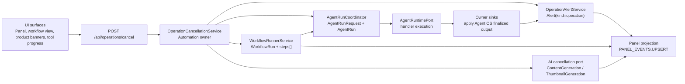
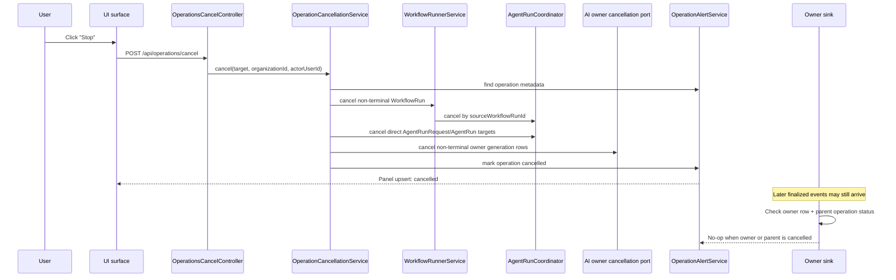
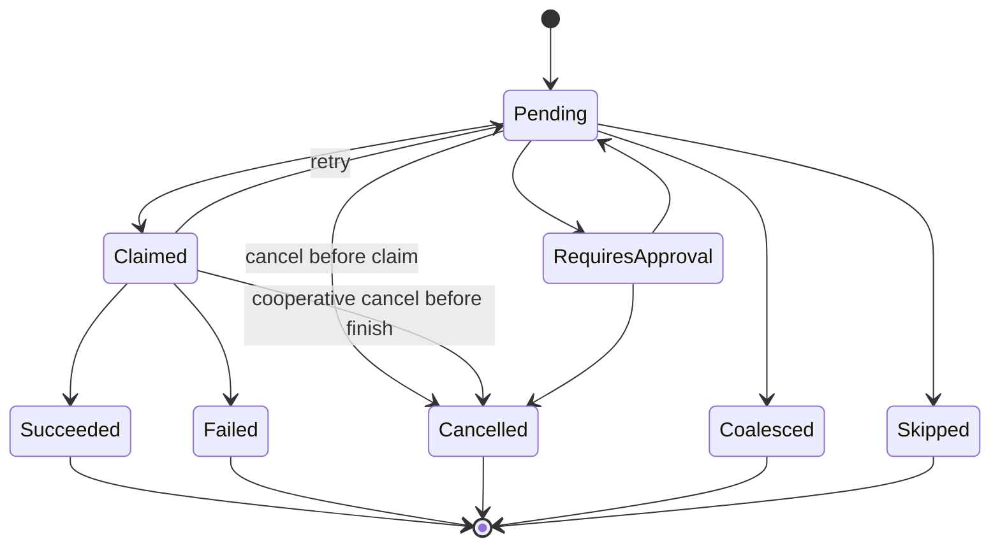
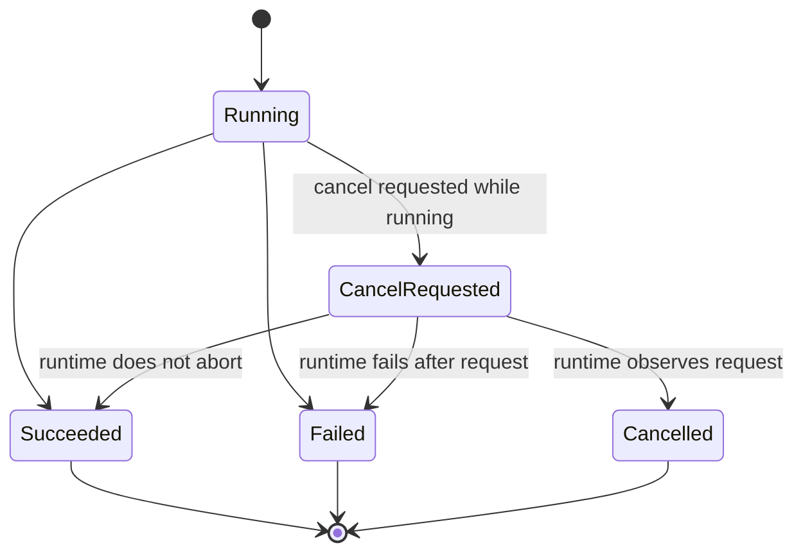
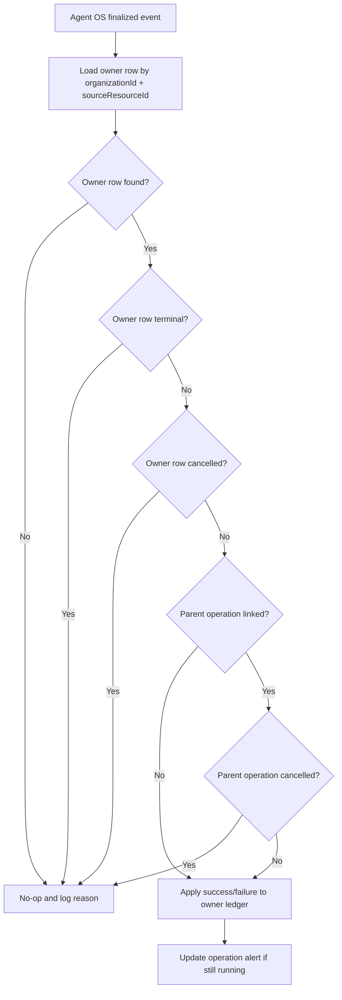

# Platform Operation Cancellation Design

Date: 2026-05-17
Status: Approved design for implementation planning

## Problem

KidItem shows long-running work in several places: operation alerts, product
pipeline banners, product cards, generation start modals, workflow run views,
and tool-call progress surfaces. Users need to stop that work from wherever it
is visible.

This must not be a UI-only spinner change. Cancellation has to be a platform
contract over durable execution ledgers so that a late success or failure cannot
overwrite a user's cancel request or apply unwanted generated output.

## Scope

In scope:

- Server-known long-running work with a durable ledger:
  - `Alert(kind='operation')`
  - `WorkflowRun` and `WorkflowRun.steps[]`
  - `AgentRunRequest` and `AgentRun`
  - AI owner rows such as `ContentGeneration` and `ThumbnailGeneration`
- Tool-wrapper calls delegated through Agent OS.
- Workflows that call tools through `agent_task.create`.
- Product generation parent operations and their detail-page / thumbnail child
  ledgers.
- UI surfaces that already display these operations as running or pending.

Out of scope for this design:

- Short UI-only states such as button submit spinners, page loading, and local
  form saves.
- Arbitrary browser extension jobs that do not have a server-side operation
  alert or owner ledger.
- Hard provider termination as a first-release guarantee. First release must
  guarantee no cancelled result is applied; deeper provider abort support can
  follow.

## Reference Patterns

The design follows mature workflow systems:

- GitHub Actions cancels from the server, propagates a cancellation message to
  runners, then escalates if processes do not exit.
- Argo distinguishes stopping a workflow from skipping cleanup; `argo stop`
  still lets exit handlers run.
- Airflow treats task instances as stateful records and separately detects
  mismatches such as zombie or undead tasks.
- Temporal-style cancellation scopes model cancellation as a request propagated
  through scoped async work, with cleanup able to run in a non-cancellable scope.

Sources:

- https://docs.github.com/en/actions/reference/workflows-and-actions/workflow-cancellation
- https://argo-workflows.readthedocs.io/en/release-3.7/cli/argo_stop/
- https://airflow.apache.org/docs/apache-airflow/2.10.5/core-concepts/tasks.html
- https://app.unpkg.com/%40temporalio/workflow%401.12.1/files/src/cancellation-scope.ts

## Design Principles

1. Cancellation is a durable execution contract, not a UI convention.
2. Every cancel mutation is organization-scoped on the server.
3. Owner ledgers remain the source of truth for owner-domain side effects.
4. Already-terminal successful outputs are preserved.
5. Only non-terminal work is cancelled.
6. Late success or failure events are no-ops against cancelled owner rows and
   cancelled operation alerts.
7. Cancellation is idempotent. Repeating the same cancel request returns the
   current terminal state.
8. The first release guarantees result application is stopped; provider/runtime
   abort is cooperative and can deepen over time.

## API Shape

Add one frontend-facing cancellation endpoint under Automation:

```http
POST /api/operations/cancel
```

Request body:

```ts
type CancelOperationRequest =
  | { targetType: 'operation_key'; operationKey: string; reason?: string }
  | { targetType: 'workflow_run'; runId: string; reason?: string }
  | { targetType: 'agent_run_request'; requestId: string; reason?: string }
  | { targetType: 'agent_run'; runId: string; reason?: string }
  | { targetType: 'content_generation'; generationId: string; reason?: string }
  | { targetType: 'thumbnail_generation'; generationId: string; reason?: string };
```

Response body:

```ts
interface CancelOperationResponse {
  ok: true;
  status: 'cancelled' | 'already_terminal' | 'not_cancellable';
  message: string;
  operationKey: string | null;
  affected: {
    workflowRunIds: string[];
    agentRunRequestIds: string[];
    agentRunIds: string[];
    contentGenerationIds: string[];
    thumbnailGenerationIds: string[];
  };
  preserved: {
    contentGenerationIds: string[];
    thumbnailGenerationIds: string[];
  };
}
```

Controllers must derive `organizationId` and `actorUserId` from auth decorators.
The request body never accepts organization scope.

## Server Architecture

Add `OperationCancellationService` in the Automation application layer. It owns
target resolution and alert lifecycle updates. It does not directly mutate
other owner-domain tables.

Dependencies:

- Automation repository ports for operation alert and workflow run state.
- Agent OS incoming port additions for request/run cancellation.
- AI incoming cancellation port, exported by `AiModule`, for content and
  thumbnail generation rows.

The service flow:

1. Resolve target and verify organization scope.
2. Read operation alert metadata when an `operationKey` is supplied.
3. Build a cancellation plan of owner-ledger targets.
4. Call owner handlers. Each handler is idempotent and terminal guarded.
5. Mark the operation alert cancelled unless it is already terminal.
6. Emit panel upserts through the existing panel/alert projection path.

## Agent OS Diagrams

These diagrams are implementation guides for the Agent OS and workflow/tool
parts of the cancellation contract.

### Component Map



### Workflow Tool-Call Cancellation Sequence



### Agent OS State Boundaries





Important distinction:

- `AgentRunRequest` owns queue and cancellation intent.
- `AgentRun` owns one accepted execution attempt.
- A running `AgentRun` may finish after cancellation was requested.
- Owner sinks decide whether the result is allowed to mutate business rows.

### Late Result Guard



## Owner Handlers

### Operation Alert

`Alert(kind='operation')` receives:

```ts
status = 'cancelled'
metadata.cancel = {
  requestedByUserId,
  requestedAt,
  reason,
  completedChildren,
  cancelledChildren,
}
```

`OperationAlertService.progress/succeed/fail` must not reopen a cancelled or
otherwise terminal operation unless a caller explicitly starts a new operation
with a new `operationKey`.

### WorkflowRun

If `WorkflowRun.status` is `pending` or `running`:

- Set run status to `cancelled`.
- Set `completedAt`.
- Mark the currently running step as `cancelled`.
- Leave succeeded steps untouched.
- Leave later unstarted steps absent from `steps[]`.
- Emit a panel upsert.

`WorkflowRunnerService` must check cancellation:

- before marking a run `running`,
- before each node execution,
- after each executor returns,
- before marking the run `succeeded`.

If a workflow node has already delegated to Agent OS through
`agent_task.create`, cancelling the workflow also cancels non-terminal
`AgentRunRequest` rows linked by `sourceWorkflowRunId`.

### Agent OS

Add cancellation methods to the Agent OS incoming port:

- cancel by request id
- cancel by run id
- cancel by source
- cancel by workflow run id

For `AgentRunRequest`:

- `pending`, `claimed`, and `requires_approval` become `cancelled`.
- `succeeded`, `failed`, `cancelled`, `coalesced`, and `skipped` are terminal
  and are not changed.

For `AgentRun`:

- If a run has not started, no run row is created.
- If a run is already `running`, record the cancel request through
  `AgentRunEvent` and request-level error metadata; do not add a new column in
  the first release. Runtime handlers may cooperatively abort and finalize as
  `cancelled`.
- If the runtime cannot abort and later reports success/failure, owner sinks
  must still treat cancelled owner rows as terminal no-ops.

### AI Generation Ledgers

AI owns its generated-content side effects.

For `ContentGeneration`:

- `PENDING` / `PROCESSING` become `CANCELLED`.
- `READY`, `FAILED`, and `CANCELLED` are terminal.
- The existing detail-page cancel path is reused behind the new AI cancellation
  port where possible.

For `ThumbnailGeneration`:

- `pending` / `running` become `cancelled`.
- `succeeded`, `failed`, `cancelled`, `applied`, and `skipped` are terminal for
  cancellation purposes.
- The existing skip/cancel persistence path is reused behind the new AI
  cancellation port where possible.

Product generation parent operations cancel only non-terminal child ledgers.
Already completed detail-page or thumbnail results remain available. Parent
operation metadata records which children were preserved and which were
cancelled.

If a `WorkflowRun` is already terminal, cancelling the workflow-run target
returns `already_terminal`. Non-terminal tool calls started by that workflow
remain cancellable from their own operation or Agent OS surfaces. Cancelling a
non-terminal workflow run also attempts to cancel linked non-terminal
`AgentRunRequest` rows by `sourceWorkflowRunId`.

## Late-Result Guard

Every owner sink that applies Agent OS output must check both local owner status
and parent operation status before applying.

Required guard:

- If owner row is cancelled, return no-op.
- If parent operation alert is cancelled, return no-op for non-terminal child
  completion updates.
- If owner row is already terminal, return no-op.

This applies to:

- detail-page generation sink,
- thumbnail generation sink,
- workflow runner finalization,
- Agent OS operation-alert bridge.

## UI Design

All running/pending durable operation surfaces expose a `중단` button.

First-release surfaces:

- `PanelAlertRow` for operation alerts.
- `PanelRunItem` / workflow run display for workflow runs.
- Product pipeline generation banners.
- Product card processing banners.
- Product generation start modal.
- Detail-page and thumbnail generation workspaces that already display running
  ledgers.
- Tool-call progress surfaces backed by `AgentRunRequest` or an operation
  alert.

Interaction:

1. User clicks `중단`.
2. Confirmation modal explains that completed results remain and only
   in-progress child work is stopped.
3. UI enters optimistic `중단 요청됨` state.
4. Success shows `중단됨` or `일부 완료 후 중단됨`.
5. Failure rolls back the optimistic state and shows an error toast.

Frontend should use one shared hook:

```ts
useCancelOperation()
```

The hook calls `POST /api/operations/cancel`, invalidates relevant React Query
keys, and updates panel state optimistically where the item is already present.

## Error Handling

- Missing target: `404`.
- Target belongs to another organization: `404`.
- Unsupported target type: `400`.
- Already terminal target: `200` with `status='already_terminal'`.
- Target exists but has no cancellable owner handler: `200` with
  `status='not_cancellable'`.
- Partial handler failure: cancel handlers that succeeded remain committed; the
  response lists affected ledgers and includes a user-readable warning message.

## Rollout

Implement in two PR-sized stages from this design:

1. Backend cancellation contract.
   - New cancel endpoint.
   - Operation cancellation service.
   - Agent OS cancellation port additions.
   - Workflow run cancellation checks.
   - AI cancellation port.
   - Terminal guards in sinks and bridges.
2. UI surfaces.
   - Shared frontend API/hook.
   - Panel alert/run cancel buttons.
   - Product pipeline banners/cards/modals.
   - Workflow/detail/thumbnail views.

No Prisma schema change is required for the first release. If cancellation
audit requirements outgrow existing alert metadata and owner ledger events, add
a dedicated cancellation audit table in a later schema-backed design.

## Testing

Backend:

- Unit test target resolution and idempotent terminal handling.
- Unit test workflow runner cancellation checks before/after node execution.
- Service test cancellation by operation key for product generation metadata.
- Service test cancellation by workflow run cancels linked non-terminal
  AgentRunRequests.
- Agent OS tests for request/run/source/workflow cancellation.
- AI sink tests proving late success/failure does not overwrite cancelled
  `ContentGeneration` or `ThumbnailGeneration`.
- Operation alert tests proving `progress/succeed/fail` cannot reopen a
  cancelled operation.

Frontend:

- `PanelAlertRow` shows `중단` only for running/pending durable operations.
- Workflow run row/view shows `중단` for running/pending runs.
- Product pipeline banners/cards/modals call `useCancelOperation`.
- Optimistic `중단 요청됨` rolls back on API failure.
- Successful partial cancellation displays `일부 완료 후 중단됨`.

Required verification for implementation PRs:

```bash
npm exec --workspace=apps/server -- vitest run src/automation src/agent-os src/ai
npm run build --workspace=apps/server
npm run build --workspace=apps/web
npm run dev:server
```

Schema commands are not required unless implementation adds new Prisma models or
fields.

## Open Decisions Locked By This Design

- Cancellation is broad across durable tool/workflow/AI operations, not limited
  to product generation.
- Completed child outputs are preserved.
- Non-terminal child work is cancelled.
- Result-application prevention is the first-release hard guarantee.
- Provider/runtime abort is cooperative and can be deepened after the durable
  contract is in place.
