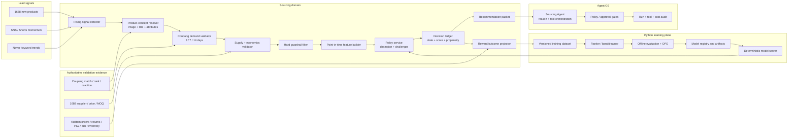

# Sourcing Agent Learning Architecture Design

- Date: 2026-07-31
- Updated: 2026-08-01
- Status: Proposed
- Classification: sourcing-domain reconstruction plus cross-layer ML control plane
- Scope: 1688/SNS/keyword lead-signal discovery, Coupang demand validation, 1688 supply validation, sourcing recommendation quality, learning data, offline training, guarded online exploration, model evaluation and deployment
- Cross-domain exception: read-only outcome attribution from Channels, Orders, Finance, Supply, Inventory, Advertising, and Agent OS audit ledgers for one sourcing operator workflow

## 0. Exact product objective

This system is a cross-market product discovery and validation model. Its job is
to find product concepts early from 1688 new products, SNS momentum, and keyword
trends; determine whether the same or a close substitute is showing real demand
on Coupang; verify that a viable 1688 supplier and unit economics exist; and
recommend the smallest safe sourcing action.

```text
1688 new product ─┐
SNS rising item ──┼─> product concept normalization and deduplication
keyword trend ────┘                 │
                                    v
                     Coupang product/image/keyword match
                                    │
                                    v
                    3/7/14-day Coupang demand validation
                                    │
                                    v
                 1688 supplier + landed cost + MOQ validation
                                    │
                                    v
                       test_order | hold | reject
```

The system therefore contains five distinct model capabilities:

1. **Lead-signal detector** — detects unusual acceleration and freshness in
   1688, Shorts/TikTok-style creative evidence, and search trends.
2. **Cross-market product matcher** — normalizes a product concept and matches
   1688/SNS items to Coupang using image, translated title, category,
   attributes, and price-band evidence.
3. **Coupang demand validator** — estimates whether a matched product is
   gaining real market reaction using rank movement, review velocity, observed
   or derived sales, conversion, low-review sales power, and competition.
4. **Supply/economics validator** — checks 1688 availability, supplier quality,
   MOQ, landed cost, fulfillment, expected contribution margin, and blocking
   KC/IP/safety risks.
5. **Recommendation policy** — combines only validated evidence into one
   `test_order`, `hold`, or `reject` decision with confidence and provenance.

Reinforcement learning is an optimization mechanism for the fifth capability
after outcomes exist. It is not the discovery engine itself. The first four
capabilities should be independently testable supervised, retrieval, or
deterministic models.

For external Coupang products, “actually selling” means the strongest
observable persisted market evidence and an explicitly identified estimate;
the system must not present unavailable competitor order counts as facts. After
a KidItem test order is listed, actual KidItem orders, returns, advertising,
inventory movement, and contribution profit become the authoritative outcome.

### 0.1 Canonical positive-decision gate

A `test_order` recommendation requires all of the following:

- at least three supporting signals across at least two platforms;
- persisted Coupang × 1688 cross-evidence;
- canonical model decision of order/recommend;
- confidence of at least `0.67`;
- known landed cost, margin, and required risk checks;
- no blocking KC/safety, IP/licensing, supplier, or unit-economics risk.

Promising but incomplete evidence is `hold`; excluded demand, negative unit
economics, or a blocking risk is `reject`. Google Trends and paid LinkFox data
remain shadow evidence with zero decision impact until a separate 30-day review
promotes them.

## 1. Decision

KidItem should not begin by fine-tuning the entire Sourcing Agent with online
PPO. The first production learning system should have three separate layers:

1. A deterministic candidate and safety layer that removes candidates which
   violate IP, compliance, budget, margin, supplier, or evidence constraints.
2. A learned ranking and contextual-bandit policy that decides which eligible
   candidates to recommend, in what order, and whether the recommendation is
   exploitation or bounded exploration.
3. An LLM Sourcing Agent that explains evidence and orchestrates approved
   KidItem tools. It does not own the numeric reward function and cannot bypass
   hard policy gates.

The initial learned model is an offline learning-to-rank model. Online learning
starts only after decision propensities and mature business outcomes are
available. LLM preference tuning is a later, independent optimization track.

## 2. Why this fits the current system

The repository already has most of the runtime and evidence foundations:

- Agent OS owns durable requests, runs, events, tool invocations, approvals,
  cost, model identity, and runtime routing.
- Sourcing owns market evidence and daily snapshots from Naver, Coupang, 1688,
  Shorts, live commerce, and pilot shadow sources.
- `SourcingCandidate.sourceUrl` identifies the sourced opportunity, while
  `ChannelListing.sourceCandidateId` preserves attribution after registration.
- Order lines, listing daily snapshots, P&L, returns, inventory, and advertising
  data can supply delayed business outcomes without moving ownership into
  Sourcing.
- Current sourcing market models are versioned but use hand-written weights and
  thresholds.
- Current sourcing RAG is a bounded lexical index over snapshot payloads, not a
  trained retriever.
- The default Sourcing runtime is a deterministic tool-wrapper. Hermes can own
  the leaf agent only when explicitly configured.

The missing foundation is a durable learning contract: the system does not yet
record the complete candidate slate, chosen action, action probability,
feature/model version, delayed reward, or champion/challenger assignment.
Without those fields, off-policy evaluation and safe reinforcement learning
are not valid.

## 3. Learning problem definition

### 3.1 Decision unit

One decision is one recommendation slate for one organization, intent, and
decision time.

```text
context x
  = organization segment
  + sourcing intent (keyword/category/budget/channel)
  + time/season
  + current evidence freshness and coverage
  + recent portfolio/inventory state

available actions A(x)
  = eligible candidate products generated for that request

policy action a
  = candidate selection + rank position + recommendation class
    (test_order | observe | exclude)

observed reward r
  = operator feedback + downstream risk-adjusted commercial outcome
```

The available action set changes on every run, so the eventual online policy is
an action-dependent-feature contextual bandit. It is not initially a long
horizon Markov decision process.

### 3.2 Separate learning targets

| Target | First model | Input | Output | Optimization |
|---|---|---|---|---|
| Candidate relevance | XGBoost LambdaMART | point-in-time market/supplier/product features | ranking score | NDCG@10 |
| Outcome probability | calibrated tree model | same features plus proposed action | probability of 28/56-day success | log loss, Brier score |
| Safe exploration | contextual bandit | context plus candidate features | selected candidate and propensity | doubly robust policy value |
| Explanation/tool choice | hosted LLM prompt, later SFT/DPO | evidence packet and tool state | rationale and bounded tool call | preference win rate and tool correctness |

Do not use the LLM as the only numeric ranker. Its role is evidence synthesis,
exception handling, and tool orchestration around a versioned ranking policy.

## 4. Target architecture



The lifecycle of one product concept is explicit:

```text
detected
  -> cross_market_matched
  -> observing_3d
  -> demand_validated | demand_rejected | evidence_incomplete
  -> supply_validated | supply_rejected
  -> recommended
  -> test_order_approved
  -> listed
  -> outcome_matured_28d/56d
```

### 4.1 Ownership boundaries

- Sourcing owns feature semantics, the decision ledger, reward definition,
  model deployment selection, recommendation packets, and outcome attribution.
- Agent OS owns autonomous execution, LLM model identity, tool policy,
  approvals, cost, and run observability. It does not own reward or business
  outcome rows.
- `agents/` owns Python training, evaluation, and deterministic model inference
  compute. It returns validated artifacts/results and never writes canonical
  Sourcing, Channel, Order, Finance, or Inventory rows directly.
- Automation may schedule deterministic dataset, training, evaluation, outcome,
  and monitoring capabilities. Those workflows must not create Agent OS runs.
- Channels, Orders, Finance, Supply, Inventory, and Advertising remain the
  source of truth for their outcomes. Sourcing reads them through narrow
  cross-domain ports and stores only attributed, versioned projections.

## 5. Online request flow

1. The Sourcing capability loads evidence known at `decisionAt` and produces a
   candidate slate.
2. Hard policy removes ineligible candidates. Examples include blocked brands,
   IP terms, unsafe categories, insufficient evidence, margin floor failure,
   invalid supplier identity, or budget violation.
3. The point-in-time feature builder emits a typed feature vector with
   `featureSchemaVersion` and freshness metadata.
4. The champion ranker scores every eligible candidate. Challengers score the
   same slate in shadow mode.
5. The policy service chooses the ranked slate. When safe exploration is
   enabled, it explores only inside a preapproved eligible pool and emits the
   exact probability for every displayed action.
6. The decision and complete slate are persisted before any operator-facing
   result or downstream action.
7. A recommendation packet contains facts, model contributions, uncertainty,
   risks, and citations to snapshot IDs. The LLM converts this packet into a
   concise explanation and invokes only allowed KidItem tools.
8. Purchase submission, marketplace registration, or other material side
   effects continue to use existing human approval and execution ledgers.

If an explicitly selected learned model is unavailable, schema-incompatible,
or fails validation, the request fails with a model configuration/runtime
error. A heuristic policy can be an explicitly deployed champion, but it must
not be a silent fallback.

## 6. New durable data contracts

The exact names can change during implementation, but these concepts must be
first-class sourcing-owned rows rather than opaque fields in
`SourcingWorkspaceSnapshot.payload`.

### 6.0 Product discovery and validation spine

The learning ledger depends on a stable product-concept identity. A URL-level
`SourcingCandidate` cannot be the only identity because one physical product
may appear in many 1688 offers, SNS posts, keywords, and Coupang listings.

- `SourcingProductConcept` is the normalized, platform-independent product
  concept. It stores a canonical title/category, normalized attributes,
  image/text fingerprint references, and concept version.
- `SourcingProductEvidence` links a concept to one immutable platform entity or
  snapshot reference: 1688 offer, SNS post/video, keyword observation, Coupang
  product/vendor item, or existing Sourcing candidate. It marks every metric as
  raw or model-derived and records observation time.
- `SourcingCrossMarketMatch` records versioned concept-to-platform matches with
  image/title/attribute/category component scores, match method, confidence,
  verifier status, and source identities. Ambiguous matches remain explicit and
  cannot supply positive Coupang × 1688 evidence.
- `SourcingValidationEpisode` owns the `detected -> observing -> validated`
  lifecycle, observation window, required evidence families, data gaps, and
  final `test_order | hold | reject` result. It does not reuse or expand
  `SourcingCandidate.status`, whose domain contract remains `sourced|rejected`.

Raw time series stay in the existing owner snapshots. These rows hold normalized
identity, provenance, and versioned decisions rather than copying provider
payloads.

### 6.1 `SourcingPolicyDecision`

One immutable decision header.

```text
id, organizationId, requestId?, agentRunId?, conversationId?
intentType, intentJson, decisionAt, cohortKey
policyKey, policyVersion, championModelVersion, featureSchemaVersion
rewardDefinitionVersion, explorationMode, randomizationUnit
status, createdAt
```

### 6.2 `SourcingPolicyDecisionItem`

One row per candidate in the offered slate, including candidates that were not
shown. This prevents top-result-only training bias.

```text
decisionId, organizationId, candidateKey, sourceCandidateId?
sourceSnapshotIds, featuresJson, featureHash
eligibilityStatus, guardrailReasons
modelScore, calibratedSuccessProbability, uncertainty
action, position?, selected, propensity
explanationFactors, challengerScoresJson
```

Required invariants:

- `propensity` is in `(0, 1]` for selected/displayed actions.
- the complete action set and features are frozen at decision time;
- model, policy, feature, and reward versions are immutable;
- no post-outcome field may be written into the decision feature snapshot;
- every organization-owned read and write binds `organizationId`.

### 6.3 `SourcingFeedbackEvent`

Append-only operator and workflow feedback.

```text
decisionItemId, organizationId, eventType, valueJson
actorType, actorId?, reasonCode?, occurredAt, idempotencyKey
```

Initial event types should include `opened`, `shortlisted`, `dismissed`,
`rejected`, `test_order_approved`, `preparation_created`, `registered`, and
`operator_preference`. Event strings remain `String` and are validated in
DTO/Zod/domain code.

### 6.4 `SourcingOutcomeSnapshot`

An append-only attributed outcome at a declared maturity horizon.

```text
decisionItemId, organizationId, sourceCandidateId?, channelListingId?
horizonDays, asOfDate, attributionConfidence
unitsSold, revenueKrw, contributionProfitKrw, adCostKrw
returnCount, returnRate, sellThroughRate, inventoryAgeDays
reward, rewardComponentsJson, rewardDefinitionVersion
isMature, sourceWatermarksJson, createdAt
```

### 6.5 `SourcingModelVersion` and `SourcingModelDeployment`

`SourcingModelVersion` records artifact URI/hash, algorithm, feature schema,
training dataset digest, code commit, training/evaluation metrics, and registry
run ID. `SourcingModelDeployment` selects an explicit model or heuristic policy
per organization and lane (`champion`, `challenger`, `shadow`) with activation
time and actor. Artifact binaries live in object storage or the MLflow artifact
store, not in PostgreSQL.

## 7. Feature architecture

### 7.1 Feature groups

| Group | Examples | Authoritative source |
|---|---|---|
| Demand | search volume/delta, SERP rank climb, review velocity, sales velocity, Shorts/live signals | Sourcing and Channels snapshots |
| Competition | seller count, review barrier, price dispersion, ad saturation | Sourcing and Channels snapshots |
| Supplier | 1688 monthly sales, supplier score, repurchase, fulfillment, evidence completeness | Sourcing supplier evidence |
| Economics | landed cost, sale price, expected commission, shipping, contribution margin, break-even units | Finance/Supply/Channels read ports |
| Portfolio | category concentration, active listing overlap, inventory exposure, recent test-order count | Channels/Inventory/Supply read ports |
| Risk | IP terms, compliance flags, supplier uncertainty, missing evidence, fragile/seasonal indicators | deterministic Sourcing policy |
| Context | business date, season, keyword/category intent, channel, budget band, organization segment | Sourcing request/context |

### 7.2 Point-in-time correctness

Training features must be reconstructed using only records with
`observedAt/capturedAt <= decisionAt`. The dataset builder must reject features
whose source watermark is newer than the decision. Random row splitting is
forbidden; use forward-chaining time splits and preserve slate/query groups.

Start with PostgreSQL plus versioned Parquet training exports. Do not add a
feature-store service until online/offline feature skew or throughput proves
that PostgreSQL-backed point-in-time views are insufficient.

## 8. Reward design

### 8.1 Reward horizons

Use separate labels instead of pretending an early click equals commercial
success:

- `R0`: operator preference and workflow progression, available immediately;
- `R14`: listing activation and early demand validation;
- `R28`: contribution profit, conversion, return, and inventory movement;
- `R56`: mature risk-adjusted commercial result.

The production objective is `R56`. Earlier rewards are auxiliary training
signals and monitoring indicators, not replacements for mature outcomes.

### 8.2 Versioned composite reward

The initial reward definition should be configurable and versioned in code:

```text
R56 = clip(
  + 0.40 * normalized_contribution_profit_roi
  + 0.20 * normalized_sell_through
  + 0.15 * demand_validation
  + 0.10 * operator_preference
  + 0.05 * supplier_reliability
  + 0.10 * evidence_confidence
  - 0.20 * normalized_return_rate
  - 0.20 * normalized_inventory_age
  - 0.35 * compliance_or_ip_incident,
  -1,
  1
)
```

Weights are starting hypotheses, not learned truth. Before activation, replay
them on historical listings, inspect category/price/supplier slices, and have an
operator approve the reward definition. Compliance/IP violations can also be a
hard exclusion, in which case their penalty is retained only for monitoring.

Do not optimize gross revenue alone. It would reward low-margin products, high
ad spend, avoidable returns, and slow inventory.

### 8.3 Attribution

The primary lineage is:

```text
SourcingPolicyDecisionItem
  -> SourcingCandidate
  -> ProductPreparation / ProductRegistrationExecution
  -> ChannelListing(sourceCandidateId)
  -> ChannelListingOption
  -> OrderLineItem / returns / daily facts / ProfitLoss / ad facts
```

When one candidate creates multiple listings, compute listing-level outcomes
first and then aggregate them into the decision item. Store attribution
confidence and source watermarks. Do not mutate historical rewards when a
source is late; append a replacement snapshot with a later `asOfDate`.

## 9. Training and evaluation plane

### 9.1 Dataset build

The NestJS Sourcing service builds a point-in-time manifest through owner
ports, stores a Parquet artifact, and returns its digest. The Python learning
worker receives the explicit artifact URI/digest and never performs unbounded
cross-domain table scans.

Each row contains:

```text
query/slate ID, organization segment, decision time
candidate/action features, chosen action, rank, propensity
model/policy/feature/reward versions
R0/R14/R28/R56 labels and maturity flags
```

Low-confidence attributions and immature horizons are excluded from the
primary objective but remain available for auxiliary analysis.

### 9.2 Model stages

1. **Heuristic v1 baseline**: preserve the current versioned rules as an
   explicit benchmark and emergency deployment option.
2. **Outcome model**: calibrated binary/regression models for probability of
   positive R28/R56 and expected contribution profit.
3. **Learning-to-rank v1**: XGBoost LambdaMART with query groups defined by
   decision slate and `rank:ndcg` as the initial objective.
4. **Contextual bandit v1**: action-dependent features with a small,
   guardrail-bounded exploration policy. Record propensities for IPS and doubly
   robust evaluation.
5. **Sequential offline RL**: consider CQL/MARWIL only if KidItem later models
   repeated order quantity/reorder actions and has sufficient trajectories.
   It is not part of the first implementation.

### 9.3 Offline gates

A challenger cannot leave shadow mode unless all applicable gates pass:

- point-in-time/leakage and feature-schema tests;
- `NDCG@10`, Precision@10, calibration, and expected-profit error versus the
  heuristic champion;
- doubly robust and IPS policy-value estimates with bootstrap confidence
  intervals when propensity data exists;
- no unacceptable regression in category, price, supplier, evidence-quality,
  new-product, and organization-size slices;
- stable inference latency and artifact hash verification;
- deterministic replay of a fixed golden dataset;
- an operator-reviewed model card and reward definition.

Do not promote on a higher average score alone. The lower confidence bound of
the business policy value must clear the champion while safety guard metrics do
not regress.

### 9.4 Experiment and model registry

Use MLflow for experiment runs, dataset digests, parameters, metrics, model
artifacts, and registry aliases. KidItem's `SourcingModelDeployment` remains the
runtime authority for organization-scoped champion/challenger assignment and
references the MLflow model/run ID plus immutable artifact hash.

## 10. Safe online exploration

### 10.1 Rollout sequence

```text
shadow 0%
  -> operator-only canary
  -> 5% eligible-slate exploration
  -> 20% organization-stable cohort
  -> 50% cohort
  -> champion
```

Assignments use a stable hash of organization plus decision ID. Never switch a
decision between policies after it has been shown.

### 10.2 Exploration constraints

- Explore only among candidates that passed every hard guardrail.
- Start inside the champion's safe top-N set; do not explore excluded items.
- Cap exploration per organization, category, budget period, and supplier.
- Log the full probability distribution, selected probability, random seed,
  and policy version.
- Keep purchase submission and registration approval-required.
- Provide an immediate kill switch that deploys the explicit heuristic or
  prior champion without changing historical assignments.

### 10.3 Online guard metrics

Primary metrics are mature contribution-profit ROI, sell-through, and policy
value. Guard metrics include returns, CS/compliance incidents, supplier failure,
inventory age, budget use, exposure concentration, missing evidence, latency,
and model/runtime failure rate.

## 11. LLM strengthening track

The LLM and numeric policy should be upgraded independently.

### 11.1 Before fine-tuning

- Expand the Sourcing Agent prompt from URL scraping to evidence-grounded
  recommendation orchestration.
- Give it a typed recommendation packet with source IDs, scores, uncertainty,
  risks, and allowed next actions.
- Upgrade lexical RAG to hybrid retrieval only after a retrieval benchmark is
  captured. Use an explicit embedding model; missing selection is an error.
- Add explicit sourcing `vision` and `verify` model roles only when the runtime
  consumes them. Do not silently reuse the primary LLM.
- Build golden tool-use tests for missing evidence, contradictory evidence,
  unsupported claims, IP risk, budget violation, and handoff/finalization.

### 11.2 Preference data

Capture chosen/rejected pairs from:

- operator edits to explanations;
- preference between two recommendation rationales;
- accepted versus rejected tool plans;
- verifier failures and corrected outputs;
- structured rejection reasons.

Do not infer a clean preference pair from a sale alone; commercial outcomes are
affected by price, media, ads, inventory, and channel execution after sourcing.

### 11.3 Fine-tuning sequence

1. Supervised fine-tuning on approved evidence-to-packet/tool examples.
2. DPO on high-confidence chosen/rejected response pairs.
3. Shadow evaluation against the hosted base model.
4. Canary rollout behind existing Agent OS model identity, tool policy, and
   approval controls.

PPO/GRPO for the LLM is not recommended until KidItem has a reliable automatic
verifier, a stable reward model, and enough high-quality trajectories. Numeric
business reward continues to train the ranker/bandit, not unrestricted language
generation.

## 12. Proposed code placement

```text
apps/server/src/sourcing/
  domain/learning/
    feature-schema.ts
    reward-definition.ts
    policy-decision.ts
  application/port/out/provider/
    sourcing-ranker.port.ts
  application/port/out/repository/
    sourcing-learning.repository.port.ts
  application/port/out/cross-domain/
    sourcing-outcome-read.port.ts
  application/service/
    sourcing-policy.service.ts
    sourcing-outcome-projection.service.ts
    sourcing-training-dataset.service.ts
    sourcing-policy-evaluation.service.ts
  adapter/out/model/
    sourcing-model-http.adapter.ts
  adapter/out/repository/
    sourcing-learning.repository.adapter.ts

agents/src/ml/sourcing/
  contracts.py
  build_dataset.py
  train_ranker.py
  evaluate_policy.py
  model_server.py

prisma/models/sourcing.prisma
  SourcingProductConcept
  SourcingProductEvidence
  SourcingCrossMarketMatch
  SourcingValidationEpisode
  SourcingPolicyDecision
  SourcingPolicyDecisionItem
  SourcingFeedbackEvent
  SourcingOutcomeSnapshot
  SourcingModelVersion
  SourcingModelDeployment
```

The deterministic ranker call is a Sourcing provider capability, not an Agent
OS child run. Model training and evaluation use a dedicated durable Sourcing ML
job/workflow contract if asynchronous execution is required; they do not reuse
`AgentRun` as a generic job queue.

## 13. Delivery plan and activation gates

### Phase 0 — instrument learning data

- Add decision/item, feedback, outcome, model-version, and deployment contracts.
- Freeze current heuristic scores as `heuristic-v1` and persist full slates.
- Capture operator actions and source-candidate-to-listing attribution.
- Build point-in-time leakage and organization-scope tests.

Exit gate: at least 95% of recommendation impressions have complete model,
feature, slate, and attribution metadata; no online exploration yet.

### Phase 1 — offline ranker

- Export versioned datasets and train calibrated outcome plus LambdaMART
  models.
- Add MLflow tracking/registry and deterministic golden-set replay.
- Serve the challenger in shadow mode and log side-by-side scores.

Exit gate: forward-time evaluation beats the heuristic on ranking/business
metrics and passes every safety slice.

### Phase 2 — bounded contextual bandit

- Introduce propensity logging and safe-pool exploration.
- Add IPS/doubly robust evaluation and bootstrap confidence intervals.
- Canary at 5%, then ramp only on mature guard metrics.

Exit gate: the challenger policy's lower confidence bound exceeds the champion
and no guard metric regresses beyond its approved tolerance.

### Phase 3 — LLM preference tuning

- Build typed evidence/tool datasets and preference pairs.
- Run SFT then DPO for explanations/tool selection if the model is self-hosted
  and the dataset is sufficient.
- Retain Agent OS policy, approvals, finalization, and explicit model selection.

Exit gate: higher blinded operator preference and tool correctness with no
grounding/safety regression.

### Phase 4 — sequential procurement policy, only if justified

Model test-order quantity, reorder, and stop/continue as a multi-step episode.
Evaluate conservative offline RL only after reliable state transitions and
large mature trajectories exist. Until then, those actions remain deterministic
calculations plus operator approval.

## 14. Tests and observability

Required durable verification for implementation:

- domain specs for reward, feature version, propensity, and eligibility
  invariants;
- repository integration specs for organization scope and immutable decision
  rows;
- point-in-time dataset/leakage fixtures;
- source-candidate-to-listing/order/P&L attribution integration specs;
- model adapter contract, schema mismatch, timeout, hash, and missing-model
  failure specs;
- champion/challenger assignment and kill-switch specs;
- deterministic replay and offline metric regression tests;
- Agent OS tool-policy tests proving the learned policy cannot submit purchase
  or registration actions without the existing approvals;
- dashboards for data freshness, label maturity, drift, slice performance,
  policy value, exploration budget, model failures, and reward distribution.

When implementation begins, schema changes require `db:push`, Prisma generate,
and shared build gates. NestJS module/service changes also require server build,
boot, IDOR, tenant-scope, narrow tests, and appropriate PostgreSQL integration
tests.

## 15. Explicit non-goals

- No unrestricted autonomous purchasing or listing registration.
- No direct database writes from a model or LLM runtime.
- No hidden model fallback.
- No per-organization deep-RL model while data is sparse.
- No feature store, Kafka, or Ray cluster in the first implementation.
- No training on future snapshots or immature outcomes as if they were final.
- No use of clicks/acceptance alone as the ultimate business reward.
- No use of Agent OS as a generic deterministic ML job queue.

## 16. OSS references

- XGBoost Learning to Rank: <https://xgboost.readthedocs.io/en/stable/tutorials/learning_to_rank.html>
- Vowpal Wabbit Contextual Bandits: <https://vowpalwabbit.org/docs/vowpal_wabbit/python/latest/tutorials/python_Contextual_bandits_and_Vowpal_Wabbit.html>
- Vowpal Wabbit Offline Policy Evaluation: <https://vowpalwabbit.org/tutorials/off_policy_evaluation.html>
- Ray RLlib Offline RL: <https://docs.ray.io/en/latest/rllib/rllib-offline.html>
- Hugging Face TRL DPO Trainer: <https://huggingface.co/docs/trl/dpo_trainer>
- MLflow Tracking and Model Registry: <https://mlflow.org/docs/latest/ml/tracking>
