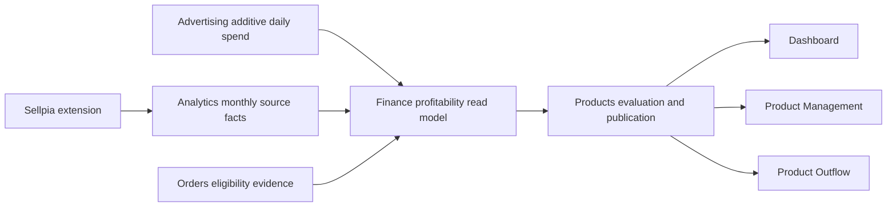

# Automatic Product Profitability ABC Design

**Date:** 2026-08-01  
**Status:** Approved in conversation; written specification pending review

## Classification

This is a declared cross-layer reconstruction of one product-profitability
workflow. It spans the Sellpia extension collector, Analytics source facts,
Advertising cost facts, Finance aggregation, Products-owned grading, and the
three existing product-grade read surfaces. The adjacent split between full
Sellpia synchronization and inventory-only synchronization is part of the same
operator workflow. Unrelated order, inventory, advertising, and finance
behavior is out of scope.

The change is larger than ten files and replaces persisted semantics, so the
implementation must use expand/backfill/contract sequencing and update the
relevant scoped `AGENTS.md` contracts and `docs/ARCHITECTURE.md` when ownership
or top-level read paths change.

## Goal

Give every eligible `MasterProduct` one automatic A, B, or C grade that answers
one question: how valuable and durable is this product's current contribution
profitability?

The same Products-owned grade is consumed by Dashboard, Product Management,
and Product Outflow. Operators never select a metric, period, threshold, or
grade. New products use the same A/B/C vocabulary as established products;
there is no provisional-versus-official grade system.

## Selected Decisions

- A means high contribution-profit amount, healthy contribution margin, and
  recent persistence.
- B means positive contribution profit without A-level magnitude or
  persistence.
- C means loss-making or persistently very low profit contribution.
- A product becomes eligible after either 30 calendar observation days from
  its first valid paid sale or 20 distinct valid paid orders, whichever occurs
  first.
- Before eligibility, the result is `INSUFFICIENT_EVIDENCE`, not a provisional
  A/B/C grade.
- Sellpia `stat_prd_profit` supplies product-option monthly revenue, quantity,
  and order-time supply cost.
- V1 deducts authoritative advertising spend. Marketplace commission,
  outbound fulfillment, return loss, and other variable costs remain explicit
  formula inputs with a value of zero and status `NOT_APPLIED`.
- Collection returns one continuous history. Fixed 1/2/3/6/12-month scoring
  windows and the legacy cumulative 70/90 contribution policy are removed.
- Time decay, score weights, shrinkage strength, and grade boundaries are
  calibrated from historical outcomes, validated out of time, and frozen in a
  versioned formula. They are not recalculated on every sync.
- A successful full Sellpia sync recalculates ABC automatically. An
  inventory-only sync is a distinct button and workflow and never collects
  profit data or recalculates ABC.

## Non-Goals

- V1 does not claim net profit after every operational cost.
- V1 does not estimate unintegrated commission, fulfillment, return, or other
  variable costs from mutable current settings.
- ABC is not a sales-quantity, inventory-depletion, reorder, popularity, or AI
  quality grade.
- There is no policy-selection modal, manual grade mutation, fixed grade
  quota, or requirement that every organization always contain all three
  grades.
- No LLM or Agent OS run participates in collection, calibration, or grading.
- This design does not introduce direct database access from the web app.

## Source Contract

### Sellpia product-profit collection

The authoritative collection surface is:

```text
https://kiditem.sellpia.com/stat_prd_profit.html#none
POST stat_action.ajax.html
mode=stat_prd_profit
buy_point=R
vat_tp=1
s_date=<continuous range start>
e_date=<yesterday in KST>
in_s_date=<same range start>
in_e_date=<same range end>
```

`buy_point=R` means the cost basis is the supply cost at order time. An
ingested fact is profitability-eligible only when its provenance is
`ORDER_TIME_SUPPLY_COST` and VAT inclusion is explicit. Legacy or unknown-cost
rows remain valid for Product Outflow but cannot enter ABC.

The extension requests approximately 400 continuous days once per full sync.
It does not issue separate 1/2/3/6/12-month requests. The response is persisted
at its natural product-code, option-code, and KST calendar-month grain. Facts
also retain the exact covered start and end dates so the oldest and current
partial month are not treated as full months.

### Product identity

Sellpia facts are resolved through the existing deterministic inventory/product
identity chain and then aggregated to `MasterProduct`:

1. exact Sellpia product code;
2. exact option code;
3. unique accepted barcode fallback where the existing contract permits it.

Ambiguous, inactive, or unmatched rows are not assigned to a product. They
produce `SOURCE_UNMAPPED` diagnostics and never become synthetic zero-profit C
products. All resolution and aggregation is organization-scoped.

### Advertising spend

Advertising owns additive listing/option daily spend facts. Finance consumes a
typed Advertising read port and aggregates the authoritative additive spend to
`MasterProduct` through `ChannelListing.masterProductId`; it does not sum
non-additive trailing keyword snapshots or duplicate owner streams.

A confirmed no-ad product contributes zero actual ad spend. Missing or failed
advertising coverage is not equivalent to zero: publication retains the last
normal grade and exposes `AD_SOURCE_STALE` until a complete source snapshot is
available.

### Eligibility evidence

Orders supplies the first valid paid-sale time and distinct valid paid-order
count for each resolved `MasterProduct`. Cancelled and fully refunded orders do
not count. `observationDays` is elapsed KST calendar days from the first valid
paid sale through the evaluation date, not merely the count of dates on which
sales occurred.

## Contribution-Profit V1

For each product and source bucket:

```text
recognizedRevenue      = Sellpia orderAmount
orderTimeCogs          = Sellpia inAmount
advertisingSpend       = authoritative mapped ad spend
marketplaceCommission  = 0  [NOT_APPLIED]
outboundFulfillment    = 0  [NOT_APPLIED]
returnLoss             = 0  [NOT_APPLIED]
otherVariableCost      = 0  [NOT_APPLIED]

contributionProfitV1 =
  recognizedRevenue
  - orderTimeCogs
  - advertisingSpend
  - marketplaceCommission
  - outboundFulfillment
  - returnLoss
  - otherVariableCost

contributionMarginV1 = contributionProfitV1 / recognizedRevenue
```

Zero revenue produces no finite margin and remains an evidence/status case; it
is never coerced to a zero-percent profitable observation. Each cost component
stores both an integer KRW value and provenance state. Product-detail UI must
say that V1 excludes commission, fulfillment, return, and other variable
costs. Later integrations can populate those fields without changing the
formula shape or silently reinterpreting historical zeroes.

## Evaluation Model

### Continuous time weighting

All eligible covered history up to the approximately 400-day collection limit
is considered. The evaluator does not select a named trailing window. For a
monthly bucket `i`, let `ageDays_i` be the number of days from the bucket's
coverage midpoint to the evaluation date and let `h` be the calibrated decay
half-life:

```text
weight_i = 2 ^ (-ageDays_i / h)
```

Partial-month coverage participates in the denominator by its actual covered
day count. The product's normalized profit-amount signal is:

```text
weightedProfitVelocity30 =
  30 * sum(weight_i * contributionProfit_i)
     / sum(weight_i * coveredDays_i)
```

The `30` is only a display normalization to KRW per 30 days. It is not a
collection or eligibility window. Weighted margin and loss recurrence are:

```text
weightedContributionMargin =
  sum(weight_i * contributionProfit_i)
  / sum(weight_i * recognizedRevenue_i)

weightedLossRecurrence =
  sum(weight_i * coveredDays_i for negative-profit buckets)
  / sum(weight_i * coveredDays_i)
```

The three explainable score inputs are profit velocity, contribution margin,
and the inverse of loss recurrence. Profit velocity remains the primary axis;
calibration constrains its coefficient to be at least as large as the margin
coefficient. Every coefficient is monotone: more profit or margin cannot lower
the score, and more loss recurrence cannot raise it.

Before combination, each raw input is mapped to a 0-to-100 value through the
organization's historical empirical distribution reconstructed by the
calibration dataset. The quantile knots and interpolation rule are frozen in
the formula version. Evaluation therefore compares a product with the
organization's calibrated operating history, not with only the products that
happen to be active in the current sync. Another product entering or leaving
the current portfolio cannot by itself change an unchanged product's score.
Values beyond the calibrated range clamp to 0 or 100.

### Sparse-evidence shrinkage

After eligibility, sparse observations may receive A, B, or C, but their score
is shrunk toward the organization-neutral score rather than being published as
a separate provisional grade:

```text
adjustedScore = 50 + reliability * (rawScore - 50)
```

Reliability is a deterministic function of valid-order count and observation
days. Its strength parameters are selected during calibration, stored in the
formula version, and constrained to increase monotonically as evidence grows.

### Calibration dataset

Calibration reconstructs each historical complete month-end as an `asOf`
snapshot using only facts that would have been available then. The next
complete source month is the primary realized-profit outcome because a
calendar month is the natural independent grain returned by Sellpia. Later
available months are robustness checks, not hard-coded scoring windows.

Rolling-origin validation selects:

- decay half-life within the available 30-to-365-day evidence range;
- monotone non-negative score coefficients;
- sparse-evidence shrinkage strength; and
- two ordered score boundaries.

Candidate formulas are compared out of time. Selection prioritizes:

1. rank agreement between score and subsequently realized profit velocity;
2. ordered realized outcomes (`A > B > C`) in every viable validation fold;
3. separation of the three realized-profit bands; and
4. lower month-to-month grade churn as the tie-breaker.

The boundaries are obtained by ordered one-dimensional segmentation of score
against subsequently realized profit, minimizing within-grade outcome error.
They are not cumulative-contribution percentages, fixed population
percentiles, or per-run clusters. A weighted contribution profit at or below
zero is a hard C guard regardless of score.

Calibration must emit a reproducible report containing the data cutoff,
eligible sample counts, selected parameters, fold metrics, grade distribution,
grade transition matrix, and formula checksum. A candidate that cannot keep
ordered grade outcomes out of time is not activated. The last active formula
remains in force; initial rollout stays `CALIBRATION_PENDING` until one formula
passes.

### Formula versioning

An active formula version contains:

- stable version key such as `ABC_V1`;
- calculation-code version/checksum;
- decay half-life;
- organization-owned feature-normalization knots;
- ordered score coefficients;
- shrinkage parameters;
- C/B and B/A score boundaries;
- calibration cutoff and summary metrics; and
- activation time.

Each formula is organization-owned and has at most one active version per
organization. Grades recalculate automatically from the active version, but
calibration does not silently alter the active version during a sync. A newly
validated formula is activated as a deliberate versioned release so grade
history can explain formula-driven changes.

## Result and State Contract

`MasterProduct.abcGrade` remains the nullable Products-owned published grade.
The current evaluation has one of these states:

| State | Published behavior |
|---|---|
| `READY` | Publish A, B, or C from the active formula. |
| `INSUFFICIENT_EVIDENCE` | Publish no grade while observation is under 30 days and valid paid orders are under 20. |
| `SOURCE_UNMAPPED` | Publish no grade for unresolved source identity. |
| `CALIBRATION_PENDING` | Publish no new-model grade until a formula passes validation. |
| `RECALCULATING` | Never expose a legacy grade as a new-model grade during cutover. |
| `SELLPIA_SOURCE_STALE` | Retain the last normal grade and expose the stale state. |
| `AD_SOURCE_STALE` | Retain the last normal grade and expose the stale state. |
| `CALCULATION_ERROR` | Retain the last normal grade and expose the failure. |

Status is separate from grade. A stale A remains visibly A with a stale badge;
it does not become `null` or C. Products records a grade-history row only when
the published grade changes, including the formula version, score, boundaries,
source cutoff, and reason. Formula-version activation may therefore produce an
auditable grade change even when source facts are unchanged.

Equal inputs produce equal component scores and equal grades. Stable identity,
not input iteration order, is used only for deterministic serialization; it
must not split score ties across grade boundaries.

## Ownership and Flow



- The extension reads Sellpia and submits source payloads; it never calculates
  or publishes ABC.
- Analytics owns the `stat_prd_profit` ingest lane and monthly source facts. It
  may continue serving Product Outflow sales quantities independently of ABC.
- Advertising owns authoritative additive ad-spend facts.
- Finance exposes an organization-scoped profitability evidence port that
  combines source-owner reads without creating a second grade.
- Products owns calibration orchestration, the active formula, deterministic
  evaluation, current snapshot, grade history, and
  `MasterProduct.abcGrade` publication.
- Dashboard and web product/inventory screens are read-only consumers through
  NestJS APIs.

Publication uses the existing organization advisory-lock/revision principle:
an older source snapshot cannot overwrite a newer completed publication. A
full sync publishes facts first and invokes evaluation only after every
required source stage is complete. Partial or failed collection never publishes
a newly computed grade.

## Persistence Transition

The implementation may reuse physical table names during an expand/contract
transition, but the persisted semantics become:

- `SellpiaProductMonthlySales`: add exact coverage dates and retain source/cost
  provenance needed for partial-bucket evaluation.
- automatic ABC formula record: replace operator-style
  `MasterProductAbcPolicy` metric/period/70/90/provisional fields with immutable
  versioned formula parameters and calibration evidence. No mutation API is
  exposed to operators.
- `MasterProductAbcEvaluation`: replace lifecycle/provisional and cumulative
  contribution fields with result state, formula version, observation range,
  evidence counts, every V1 formula component and provenance, weighted
  features, reliability, score, boundaries, and source timestamps.
- `MasterProductAbcGradeHistory`: replace legacy metric/period fields with
  formula version, old/new grade, score, boundaries, source cutoff, and change
  reason.

Shared schemas remove provisional grade, lifecycle stage, selectable metric,
period, and cumulative threshold contracts. They add calculation state,
formula version, component breakdown, score explanation, freshness, and
explicit `NOT_APPLIED` cost provenance.

Because existing stored grades have different meaning, the cutover requires a
durable, idempotent `v0.1.30` data migration. It marks old evaluations as
legacy/recalculating, clears old `MasterProduct.abcGrade` publication at the
new-model visibility boundary, and records affected counts. It does not
reinterpret or copy an old grade into the new model.

## Sellpia Sync Separation

The current sync control becomes two explicit actions, not a criteria modal or
dropdown:

| Action | Collection | ABC behavior |
|---|---|---|
| `SELLPIA_FULL_SYNC` / `전체 동기화` | Required Sellpia operational data, product-profit history, and dependent source completion | Recalculate automatically after successful publication. |
| `SELLPIA_INVENTORY_SYNC` / `재고만 동기화` | Authoritative inventory only | Never collect product-profit history and never recalculate ABC. |

The two actions have independent last-success timestamps and visible progress,
but share a provider/account exclusion lock so they cannot mutate overlapping
Sellpia state concurrently. Retrying inventory does not retry profitability,
and retrying full sync does not disguise a failed inventory-only run.

Workflow notification cleanup is presentation-safe:

- a durable running execution may be cancelled only through its owner
  capability;
- a UI entry whose durable execution no longer exists is reconciled to stale
  and can be dismissed;
- completed, failed, cancelled, and stale entries can be cleared individually
  or in bulk from the notification view; and
- clearing the notification does not delete immutable execution/audit history.

## UI Contract

All three surfaces read the same current Products evaluation.

### Dashboard

- counts for A, B, C, insufficient evidence, stale source, and unmapped source;
- contribution-profit amount and share by grade;
- recent grade changes and last successful calculation time;
- visible V1 notice that commission, fulfillment, return, and other variable
  costs are not yet applied; and
- grade cards link to Product Management with the matching filter.

### Product Management

The list shows grade/state, V1 contribution profit, margin, actual observation
range, and calculation time. Operators can filter A/B/C and non-ready states
and sort by profit or margin.

Selecting the grade opens a read-only explanation panel, not an editing modal.
It shows source amounts, every zero/`NOT_APPLIED` component, time-decay inputs,
reliability, final score, automatic boundaries, formula version, freshness,
and grade history.

### Product Outflow

The outflow row shows a compact grade badge, profit/margin summary, filter, and
stale indicator. Selecting it navigates to the Product Management explanation.
Product Outflow neither recalculates nor mutates the grade and continues to use
its own sales-quantity facts for depletion and reorder logic.

The existing Sellpia sync location displays separate `전체 동기화` and
`재고만 동기화` buttons with independent status and last-success labels.

## Failure Semantics

- Sellpia or ad collection failure preserves the last successful evaluation
  and exposes source staleness.
- Source/product resolution failure stays explicit and does not create a zero
  revenue, zero cost, or C product.
- Calculation failure is retryable and cannot partially publish grade rows.
- Replaying identical facts and formula versions is idempotent and creates no
  duplicate history.
- A full sync is not successful for ABC purposes until its required source
  stages and evaluation publication complete.
- Inventory-only success has no bearing on ABC freshness.
- Formula activation and grade publication are organization-scoped and
  serialized; tenant identifiers never come from client input.

## Cutover Sequence

1. Add new source coverage, formula, evaluation, history, and shared read
   contracts without deleting legacy readers.
2. Add regression gates proving that no operator mutation or legacy cumulative
   policy can publish a new grade.
3. Backfill approximately 400 days through a full Sellpia sync and reconcile
   source totals.
4. Run calibration, persist its reproducible report, and activate the first
   passing `ABC_V1` formula.
5. Run shadow evaluation and verify invariants without exposing legacy grades
   as new grades.
6. Execute the registered `v0.1.30` semantic-reset migration and publish all
   eligible products with the active formula.
7. Switch Dashboard, Product Management, and Product Outflow to the new shared
   read contract.
8. Remove legacy lifecycle/provisional/cumulative policy APIs, schema fields,
   UI, tests, and scoped instruction text after the replacement gate passes.

The implementation PR records whether compatible schema expansion uses
`db:push` and includes the required semantic data migration. Old and new
runtime overlap must remain safe until the contract step.

## Verification and Acceptance

### Source and formula

- Reconcile sampled Sellpia product/month quantity, revenue, and order-time
  cost with the provider page.
- Prove the extension sends one continuous range with explicit order-time cost
  and VAT provenance.
- Prove partial first/current month coverage uses actual covered dates.
- Prove authoritative advertising spend maps once to the correct
  `MasterProduct`; no-ad zero and missing coverage are distinct.
- Prove all four deferred costs equal zero with `NOT_APPLIED` provenance.
- Prove repeated ingest and calculation are idempotent.

### Calibration and grading

- Reproduce the active formula from its calibration report and checksum.
- Prove rolling-origin folds preserve ordered realized outcomes.
- Prove increasing profit or margin cannot lower score with other inputs held
  constant, and increasing loss recurrence cannot raise it.
- Prove zero/negative weighted contribution profit is C.
- Prove exact ties receive the same score and grade.
- Prove 30 observation days or 20 valid paid orders activates ordinary A/B/C,
  while earlier evidence remains `INSUFFICIENT_EVIDENCE`.
- Prove more evidence monotonically reduces shrinkage without creating a
  provisional grade.
- Prove source or calculation failure preserves the last normal grade with an
  explicit state.

### Synchronization and workflows

- Full sync collects profit facts and triggers ABC only after complete source
  publication.
- Inventory-only sync touches no profit/evaluation/history row and triggers no
  ABC calculation.
- Full and inventory-only runs cannot overlap for the same organization and
  provider account.
- UI-only orphaned workflows can be reconciled and cleared individually or in
  bulk while durable audit remains intact.
- Reloaded extension capability negotiation advertises the full-sync
  product-profit collector.

### UI consistency

- The same product shows the same grade/state/formula version on all three
  surfaces.
- Filters, sorting, deep links, and read-only explanation behave consistently.
- `INSUFFICIENT_EVIDENCE`, stale, unmapped, recalculating, and error states are
  not rendered as A/B/C.
- No criteria-selection or grade-edit modal remains.
- Every detailed profitability view discloses V1's four deferred cost inputs.

Required implementation gates remain the repository gates for each touched
layer: server boot, web production build, schema `db:push` plus Prisma/shared
generation, focused behavior/integration tests, data-migration tests, and
`git diff --check`.

## Research Basis

The design uses a multi-criteria profitability signal instead of traditional
single annual-use-value ABC, consistent with research showing why one-dimensional
ABC can omit operationally relevant criteria:

- Ramanathan, "ABC inventory classification with multiple-criteria using
  weighted linear optimization," *Computers & Operations Research*:
  <https://www.sciencedirect.com/science/article/pii/S0305054804001790>

Product age is treated as evidence rather than a fixed lifecycle label, which
is consistent with new-product demand research that explicitly models product
age and sparse early history:

- Vashishtha et al., "Product age based demand forecast model for fashion
  retail":
  <https://arxiv.org/abs/2007.05278>

These sources motivate the direction; KidItem's own rolling-origin calibration
determines the operational parameters.
