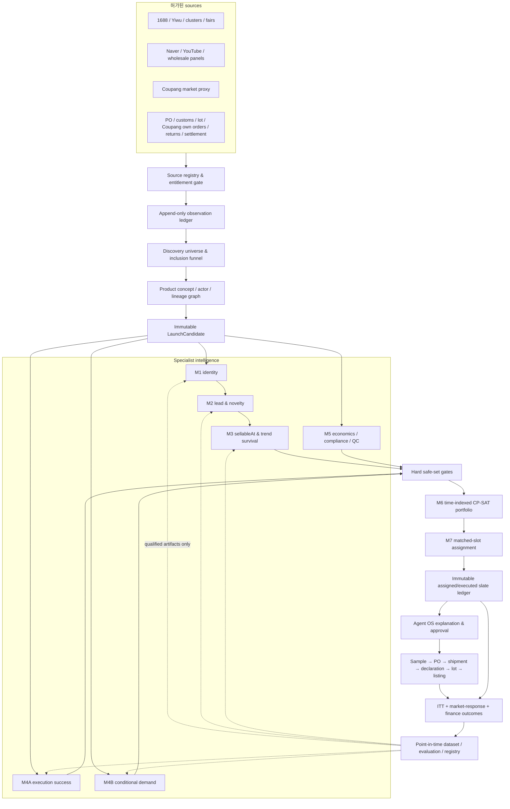

# Sourcing Intelligence V2.1 — Executable Decision and Learning Architecture

- Date: 2026-08-01
- Status: Phase 0–1 foundation implemented; learning/control-plane phases remain gated
- Supersedes the decision-learning portions of: `2026-08-01-sourcing-intelligence-v2-architecture-design.md`
- Classification: sourcing-domain reconstruction plus cross-layer read projections and ML control plane
- Goal: 중국·SNS·검색·한국 도매 신호에서 실제 판매 가능한 소싱 후보를 찾고, 동일 자본·운영 제약 아래 KidItem의 순증 매출과 공헌이익을 높이는 정책을 검증한다.

## 0. 결론

이 시스템은 **강화학습 모델 하나**가 아니다. 올바른 형태는 다음 다섯 층이다.

1. 허가된 데이터 수집과 증거 원장;
2. 상품 동일성·도착 시점 수요·실행 성공·손익의 지도학습 예측;
3. 예산·MOQ·CBM·공급사·규제 제약을 푸는 정수 최적화;
4. 동일 자본 슬롯의 전향적 무작위 실험과 인과 추정;
5. 충분한 성숙 결과가 쌓인 뒤 안전 후보 안의 한정된 탐색 슬롯에만 적용하는 contextual bandit.

현재 KidItem 코드로 **실제로 가능한 것**은 persisted Naver/1688/Shorts/Coupang evidence를 이용한 30일 replay, heuristic scoring, Google Trends/LinkFox shadow collection, 운영자 검토다. 현재 코드로 **아직 불가능한 것**은 정확한 신상품 variant의 자동 발주, lot별 실현 원가와 주문 라인별 정산이익 학습, 무편향 정책 백테스트, 자동 승격되는 RL이다.

따라서 첫 production 명칭은 `Sourcing Decision Intelligence`가 맞다. `Reinforcement Learning`은 마지막 제한적 bandit 단계에만 붙인다.

### 0.2 2026-08-01 implementation checkpoint

구현된 Phase 0–1 foundation은 다음과 같다.

- versioned `SourcingSourceEntitlementVersion`과 lifecycle/expiry/kill-switch/decision-impact gate;
- append-only `SourcingEvidenceIngestionRun`/`SourcingEvidenceObservation`과 point-in-time provenance;
- Supply-owned immutable `SupplierOfferSkuSnapshot`/`SupplierOfferPriceTier`;
- exact variant, target account, opaque version keys, launch plan, economics, compliance/IP/QC를 고정하는 `SourcingLaunchCandidate`;
- 전체 1688 supplier-match slate를 저장하는 immutable `SourcingDecisionBatch`/item/evidence;
- create-only `ProcurementTestIntent`와 RFQ/sample/test-order MOQ·tier·unit-conversion policy;
- organization-scoped HTTP/API, Prisma adapters, idempotency locks, module wiring, architecture/scanner/test gates.

Foundation hardening은 다음 무결성 경계를 추가로 고정한다.

- exact source/scope/version 권한과 수집·보존·점수·학습별 deny-by-default gate;
- complete run, current absolute revision, current minimum coverage/freshness,
  순차 revision 및 immutable evidence-series envelope;
- positive evidence의 정확한 `Coupang demand + 1688 supply` 역할쌍과
  3-family/2-platform 최소 조건;
- offer/launch/decision/intent의 exact identity binding과 Supply write 직전
  source-scope advisory lock 재검증;
- test order의 `LaunchCandidate.initialOrderQuantity` 서버 결정,
  purchase-unit→physical-unit→Korean sellable-bundle 정확 나눗셈 및 request
  hash 고정.

현재 discovery confidence는 여전히 coverage이며 calibrated purchase-success
probability가 아니다. 따라서 생성 배치는 `shadow`, propensity는 `null`,
canonical action은 hard reject가 아닌 한 `hold`다. 이 checkpoint는 자동
`test_order`, PO 변환, provider 주문, model training, OPE, contextual bandit을
의도적으로 구현하지 않는다.

### 0.1 무엇이 RL이고 무엇이 아닌가

| 기능 | 올바른 분류 | 초기 구현 |
|---|---|---|
| 1688/SNS/키워드/도매 신호 수집 | 데이터 엔지니어링 | 결정론적 collector |
| 동일·variant·대체 상품 판별 | 지도학습/검색 | multimodal retrieve-and-rerank + 검수 |
| 트렌드·쿠팡 반응·판매 가능 시점 수요 | 지도학습/생존분석 | 규칙 baseline → GBDT/survival |
| 판매 0건과 판매량·이익 분포 | 지도학습/확률예측 | hurdle model + scenario simulation |
| 발주 후보와 수량 선택 | 조합 최적화 | CP-SAT; RL 아님 |
| champion/challenger 비교 | 무작위 실험/인과추론 | matched-slot ITT |
| 과거 propensity 기반 정책 평가 | OPE | IPS/DR; RL 자체가 아님 |
| 안전 후보 중 탐색 슬롯 선택 | contextual bandit | 마지막 단계의 제한적 RL |
| 브라우징→판단→수량→재주문 end-to-end PPO | 부적합 | 금지 |

## 1. 의사결정 대상과 성공의 정의

### 1.1 `ProductConcept`가 아니라 `LaunchCandidate`

실제 발주와 성과 측정 단위는 다음의 immutable 조합이다.

```text
LaunchCandidate =
  ProductConceptVersion
  + SupplierOfferSkuSnapshot
  + KoreanSellableBundleVersion
  + intendedAge/use/material/labeling
  + LaunchPlanVersion
  + ComplianceAssessmentVersion
  + QualitySpecVersion
```

같은 콘셉트라도 재질, 색상, 구성수량, 포장, 공장, KC 적용 모델, 판매가, 광고, 초기수량이 다르면 서로 다른 `LaunchCandidate`다. M1–M3의 시장 추세는 concept 단위로 공유할 수 있지만, `test_order`, 손익, QC, 규제, 실험은 LaunchCandidate 단위다.

### 1.2 canonical action

최종 decision 값은 정확히 다음 셋만 사용한다.

- `test_order`: canonical Coupang × 1688 evidence, economics, compliance, IP, QC, supplier gate를 모두 통과하고 현재 portfolio에 선택됨;
- `hold`: 잠재력은 있으나 관찰·견적·샘플·분류·검증이 더 필요하거나 현재 제약상 선택되지 않음;
- `reject`: 수요·경제성·identity 또는 blocking risk가 실패함.

샘플 요청은 네 번째 decision이 아니다. `hold + nextEvidenceAction=request_sample|request_rfq|verify_hsk|verify_kc|observe_until`로 표현한다. 현재 코드의 `order|observe_3d|exclude`는 `heuristic-v1` 내부 결과로만 남기고 canonical policy decision으로 저장하지 않는다.

### 1.3 최적화 목표

비실험 상태에서 개별 신상품 매출은 `attributed sourced revenue`라고 부른다. `incremental revenue` 또는 `incremental profit`은 무작위 portfolio 비교에서만 사용한다.

Primary estimand:

```text
E[동일 자본·CBM·운영 슬롯에서 challenger 정책의 조직 단위 공헌이익]
- E[동일 제약에서 champion 정책의 조직 단위 공헌이익]
```

Primary business reward는 90일 true-up 기준 조직 단위 순증 공헌이익이다. 56일 값은 provisional 운영지표이며, net revenue는 성장 guardrail로 함께 보고한다. 180일에는 잔존재고·markdown·폐기·재주문·리콜 tail을 true-up한다.

`decisionConfidence >= 0.67`의 사건은 다음으로 고정한다.

```text
P(
  90d contributionProfit > 0
  AND downsideLoss <= categoryLossLimit
  AND no blocking compliance/IP/QC event
  | decisionAt 정보, LaunchCandidate, standard LaunchPlan
)
```

0.67은 evidence contract의 최소값일 뿐이며, 어린이 안전 고위험 segment는 별도 상향 threshold를 갖는다.

## 2. 외부 데이터의 실제 가용성

모든 source는 `sourceLifecycle`과 `decisionImpact`를 분리한다.

```text
sourceLifecycle = proposed | onboarding | shadow | qualified | suspended
decisionImpact = disabled | enabled
```

`shadow`를 score 값으로 사용하지 않는다. `decisionImpact=enabled`인 source만 policy feature로 들어간다.

### 2.1 Source feasibility matrix

| Source | 실제 접근 경로 | 알 수 있는 것 | 알 수 없는 것 | 초기 역할 |
|---|---|---|---|---|
| Naver DataLab | 앱 등록 + client key, 일 1,000회 공식 API | 키워드군의 일/주/월 상대 검색 추이, 기기·성별·연령 segment | 절대 구매량, 쿠팡 판매량 | enabled lead signal |
| Naver Search Ad | 승인된 광고 API credential | 키워드 검색량·경쟁 proxy | 상품별 구매전환 | enabled lead signal |
| YouTube Data API | Google project/API key, quota | 영상·채널·게시시점·조회/반응 metadata | Shorts 상품 SKU와 구매량의 확정 관계 | enabled 또는 category별 shadow |
| TikTok | 상업용 범용 research feed 없음; Research API는 적격 비영리 연구 중심 | 승인 범위의 public content/account/shop 자료 | KidItem 상업 목적의 안정적 전수 trend feed | 기본 disabled; licensed provider만 별도 심사 |
| Google Trends | 2026-08 현재 공식 API는 alpha 신청제; 현재 RSS는 limited surface | 검색 관심·급상승 topic | 안정적 전수 API, 구매량 | disabled shadow |
| 1688 | 현재 브라우저/MTOP 기반 기술 경로는 존재; production은 공식 entitlement/partner/계약 확인 필요 | 관측 화면의 offer, 가격, MOQ 일부, 판매·supplier 표시값 | 한국 구매자, 전체 시장 denominator, 경쟁사 주문 | 권한 확인 전 shadow; canonical gate는 persisted evidence만 |
| Alibaba.com | 공식 open platform + 공급자별 OAuth 동의 | 승인된 공급자 계정의 상품·주문·buyer/shipping country | 1688 국내시장 전수 신규상품, 동의하지 않은 제3자 주문 | 동의 공급자 주문은 exact-consented; 그 외 shadow |
| Yiwugo | 공식 사이트가 API data output partnership을 안내 | 계약 범위의 Yiwu booth/catalog | 공개 무인 API와 전체 거래량은 보장 안 됨 | partnership 후 shadow |
| Chinagoods | platform/partnership 또는 승인 export 필요 | 계약 범위 catalog/booth | 공개 전수 API·한국행 주문 | partnership 후 shadow |
| Chenghai/Ningbo/전시회 | 정부·주최자 공개 catalog + 승인 feed + 수동 RFQ/샘플 | cluster/fair exhibit, factory/RFQ/sample evidence | booth 노출을 주문·판매로 해석 | manual/partner shadow |
| KCS 품목×국가 통계 | data.go.kr API key | 월×HSK×중국의 수입 중량·USD 가치와 revision | buyer, 1688 offer, SKU, 주문 건수 | aggregate inflow shadow |
| UNI-PASS | 로그인 후 OpenAPI 사용관리; 자사 신고/화물 reference | 권한 있는 자사 통관·화물 진행 | 시장 전체 경쟁사 발주 탐색 | own execution truth only |
| Safety Korea | 신청서 제출·승인 key | 인증/리콜 관련 공개 evidence | 인증서가 exact 옵션에 적용된다는 자동 확정, 수입/판매량 | compliance evidence; 사람 승인 필요 |
| Coupang Open API | KidItem vendor credential | 자사 상품·option, 주문, 반품, 정산 aggregate, 노출제한 | 다른 판매자의 주문·판매량 | own execution/outcome truth |
| Coupang public market surface | 고정 관측 protocol + 법무/약관 승인 필요 | SERP rank, ad 여부, 가격, review, seller/listing 변화 | 경쟁사 실제 units/revenue | market proxy only |
| 한국 도매 catalog | 각 업체의 공식 API/feed/export/계약 또는 허용된 수동 관측 | catalog adoption, 가격, 재고표시, 신상품표시 | 시장점유율, 실제 발주·판매 | source별 shadow 후 승격 |

Source onboarding 전 다음을 한 행도 빠짐없이 작성한다.

```text
SourceEntitlement {
  owner, legalBasis, allowedMethod, credentialRef,
  permittedFields, prohibitedUses, rateLimit,
  geography/account/search/category coverage,
  denominatorDefinition, historyBackfill,
  expectedDelay, revisionPolicy, retention,
  permissionExpiresAt, killSwitch, reviewer
}
```

접근권 또는 denominator가 없으면 `marketShareUnknown=true`다. 플랫폼 크기나 일부 catalog 수로 “중국/한국 최대 도매의 시장점유율”을 만들지 않는다.

### 2.2 중국에서 한국으로 들어오는 주문을 어디까지 아는가

정확하게 알 수 있는 범위는 네 층뿐이다.

1. **KidItem 자사 주문**: PO, invoice, payment, B/L, declaration, shipment, receipt lot를 연결하면 exact SKU/quantity/cost를 안다.
2. **동의한 공급자 범위**: Alibaba.com 등에서 OAuth를 허용한 공급자의 자기 주문에 한해 buyer/shipping country가 한국인 주문을 안다. 이는 그 공급자의 표본이지 중국 전체가 아니다.
3. **한국 전체 aggregate**: 관세청 API로 중국 원산/상대국의 HSK별 월 중량·금액 변화를 안다. 이는 category inflow regime다.
4. **제품 진입 준비 proxy**: Safety Korea 인증·리콜, 한국 도매 catalog, Coupang seller/listing propagation으로 concept-level 진입 가능성을 본다.

1688의 중국 포워더 주소만으로 최종 목적지가 한국인지 판별할 수도 없다. 공개 데이터만으로는 `경쟁업체 A가 1688 SKU B를 N개 주문했다`를 알 수 없다. KCS aggregate, KC certificate, B/L 화물상태, 쿠팡 listing을 결합해도 그것은 inference이며 주문 사실이 아니다. 추천 packet에는 항상 `evidenceGranularity=exact_own|exact_consented|aggregate_official|supply_catalog|compliance_proxy|inferred_observation`을 표시한다. 낮은 등급의 evidence를 상위 등급으로 승격시키지 않는다.

## 3. 견고한 logical architecture



원칙은 다음과 같다.

- NestJS Sourcing이 organization-scoped orchestration, hard gate, decision ledger의 canonical owner다.
- Supply/Inventory/Channels/Orders/Advertising/Finance는 자기 canonical fact를 소유하고 Sourcing에 as-of read projection만 제공한다.
- Python은 exported dataset으로 학습·추론·최적화하고 canonical business table을 쓰지 않는다.
- Automation은 deterministic collection/training/evaluation을 예약하고 Agent OS run을 만들지 않는다.
- Agent OS/LLM은 설명, 어려운 문서 구조화, missing evidence 요청, 사람 승인 조율만 한다. 숫자 예측·hard gate·발주 자기승인은 하지 않는다.

## 4. 빠지면 안 되는 canonical records

| Record | Owner | 역할 |
|---|---|---|
| SourceEntitlement | Sourcing | 접근권·필드·rate·expiry·kill switch |
| EvidenceIngestionRun | source owner/Sourcing | collector version, coverage, watermark, 누락·오류 |
| EvidenceObservation | Sourcing | eventAt/observedAt/availableAt/revisionAt를 가진 append-only fact |
| DiscoveryUniverseSnapshot | Sourcing | raw universe와 검색/수집 모수 |
| DiscoveryFunnelItem | Sourcing | retrieval→gate→feasible→assigned→executed 단계와 포함확률 |
| ProductConceptVersion | Sourcing | platform-neutral concept |
| SourceProductEntity | Sourcing | offer/listing/option/creative/keyword node |
| ConceptRelation | Sourcing | exact variant/base/substitute/unrelated edge |
| MarketActor/SourceLineage | Sourcing | seller/factory/trader/wholesaler와 mirrored feed cluster |
| SupplierOfferSkuSnapshot | Supply | 정확한 중국 variant, MOQ, price tier, pack, factory, quote validity |
| LaunchCandidate | Sourcing | 실제 추천·실험 단위의 frozen composition |
| LeadTimeScenario | Supply | 단계별 P10/P50/P90과 validUntil |
| LaunchPlan | Channels/Advertising | 가격, 쿠폰, 콘텐츠, 광고, fulfillment, 초기수량 standard protocol |
| RegulatoryRequirementAssessment | compliance owner | HSK/KC/label/age/use/model/factory 적용범위와 4단계 release |
| IpClearanceCase | compliance owner | trademark/design/patent/copyright/license/image rights |
| QualitySpec/GoldenSample/Inspection | Supply | BOM, material, AQL, critical/major/minor, chain of custody |
| DecisionBatch/EligibleCandidate | Sourcing | 동일 자본/운영 제약의 전체 safe slate |
| AssignedSlate/ExecutedSlate | Sourcing | joint policy probability, seed, solver/policy version, override |
| ProcurementTestIntent | Supply | 기존 Sellpia SKU 없이도 샘플/시험 발주를 시작하는 identity |
| ShipmentLine/DeclarationLine/ReceiptLot | Supply/Inventory | split shipment·partial receipt·quarantine·quantity conservation |
| InboundCostAllocation | Finance/Supply | lot별 actual landed cost와 allocation method |
| LaunchExecutionEpisode | Channels | 승인·검색노출·sellable·unsuppressed·in-stock 상태 |
| CommerceOutcomeProjection | owner-domain composition | 주문라인, 환불/반품, 광고, 정산, lot COGS의 as-of projection |
| PolicyOutcomeSnapshot | Sourcing | 56/90/180일 ITT와 conditional response, maturity/revision |
| ModelVersion/Deployment | Sourcing | artifact, dataset cutoff, schema hash, approval, champion alias |

### 4.1 물류는 선형 status가 아니다

```text
PO line <-> shipment line <-> declaration line <-> receipt lot
```

다대다 event graph로 split shipment, shortage, damage, customs hold, rework, return-to-origin, destruction, insurance claim을 표현한다. `offer pack → PO unit → customs unit → lot unit → Coupang bundle unit`에는 versioned `UnitOfMeasureConversion`을 적용하고 단계별 수량 보존식을 검증한다.

### 4.2 네 단계 release gate

1. pre-feasibility: 규제 분류와 예상 비용/시간 확인;
2. pre-order: exact variant/factory/material과 sample 계획 승인;
3. pre-shipment: KC/IP/QC/label/계좌·계약·수량 검증;
4. customs/sales release: 신고·입고 lot·표시·판매승인 확인.

미통과 lot는 `quarantine`이며 listing inventory로 이동할 수 없다. ProductSafetyCase/RecallCase는 lot→주문고객, 판매중지, 재고격리, 회수·환불·폐기·보고를 연결한다.

## 5. Discovery에서 추천까지의 모델 분해

### M0 — Coverage and source reliability

초기에는 ML이 아니다. source별 수집 성공률, 검색 깊이, truncation, 계정/지역/기기, 신규 baseline 기간, 수정률, mirrored lineage를 측정한다. `coverage denominator`가 없는 source의 신호는 confidence 상한을 낮춘다.

Discovery funnel:

```text
raw observed universe
→ retrieved candidate set
→ identity-resolved set
→ hard-gate eligible set
→ feasible portfolio set
→ assigned slate
→ executed slate
```

각 단계에 policy version, random seed, inclusion probability 또는 deterministic reason을 기록한다. 최종 후보만 저장하면 retrieval 단계의 선택편향을 복구할 수 없다. 최종 추천 밖의 random background reservoir도 계속 관측한다.

### M1 — Product identity resolver

- high-recall multilingual text/image/attribute retrieval;
- pairwise reranker로 `exact_variant|same_base|substitute|unrelated` 확률 출력;
- critical attribute mismatch는 exact를 금지;
- calibrated ambiguity band는 사람 review;
- supplier가 올린 문구·PDF·HTML은 untrusted input이며 LLM instruction으로 실행하지 않음.

신상품 정의를 분리한다: `new_listing`, `relist`, `new_to_supplier`, `new_design_or_mold`, `new_to_korea`, `new_to_kiditem`. 계절 재등록을 걸러내기 위해 장기 image/design memory를 유지한다.

### M2 — Lead, novelty, peer adoption

초기 baseline은 source별 변화율·가속도·creator/actor diversity·cross-platform persistence다. 학습 단계에서는 다음 사건의 calibrated hazard를 각각 예측한다.

- independent Chinese panel adoption;
- Korean wholesaler first adoption/restock;
- Coupang independent seller/listing propagation;
- price compression and saturation.

하나의 upstream feed를 복제한 여러 도매는 한 independence cluster로 센다. “최대 도매가 취급했다”보다 독립 actor 수, 최초관측 interval, 지속·재입고, 후행 Coupang 반응이 중요하다.

중국 문구·완구 panel은 `factory|trader|wholesaler|market_booth|mirror|unknown` 역할과 검증 근거를 저장하고 매 epoch 버전을 고정한다. `top-tier`는 시장점유율을 뜻하지 않는다. catalog 규모, 신상품 선행성, 갱신 지속성, 독립 플랫폼 확산, 샘플/QC, 실제 납기, 동의 범위의 한국행 주문을 합친 proxy score다. 신규·이탈 actor와 생존편향을 보고하고 한 cluster의 가중치 상한을 둔다.

### M2C — Korea inflow regime

`ProductConcept → HSK10`은 단일 답이 아니라 versioned candidate distribution이다. monthly KCS signal은 각 HSK 후보를 통한 민감도 범위로 계산한다. KC evidence와 HSK aggregate는 별도 시간축이다.

같은 episode의 KidItem PO/통관은 사전 feature가 아니라 outcome이다. 과거 자사 수입만 `availableAt < decisionAt`일 때 lagged feature가 될 수 있다.

### M3 — Sellable-at demand

결정일 수요가 아니라 실제 판매 가능 시점의 수요를 예측한다.

```text
sample
→ KC/IP review and test
→ production
→ China domestic freight
→ international freight
→ customs
→ receipt/QC/label
→ Coupang approval/search visibility
```

각 단계의 empirical duration distribution으로 `expectedFirstSellableAt P10/P50/P90`을 만든다. lead/trend survival model은 다음을 출력한다.

```text
P(trendEndAt > firstSellableAt_P50)
P(trendEndAt > firstSellableAt_P90)
expectedDemandAtSellableAt
```

P90 arrival가 trend survival window를 넘으면 빠른 상품이라도 `hold/reject`다.

### M4A — Execution Success Model

`P(on-time received, approved, visible, unsuppressed, in-stock | decisionAt plan)`을 예측한다. feature에는 decisionAt 당시의 계획과 예측만 사용한다. 실제 지연·품절·미등록은 label이다.

### M4B — Conditional Demand and Profit Model

정상 판매기회가 생겼다는 조건 아래 다음을 따로 출력한다.

- `P(any sale)`;
- units/revenue/return distribution conditional on sale;
- `P(profit > 0)`;
- `P(sellThrough >= threshold)`;
- 56/90/180일 contribution-profit distribution.

가격·쿠폰·광고·콘텐츠는 관측 데이터에서 treatment-confounded 변수다. 초기에는 `standard LaunchPlan`을 고정한다. 별도 무작위 실험 전에는 이 값을 바꿔 생기는 효과를 인과 최적화하지 않는다.

수요 label의 exposure contract는 `sellable && searchVisible && unsuppressed && inStock`인 시간과 실제 traffic을 보존한다. 품절·검색억제·등록지연 구간의 판매 0은 수요 0이 아니라 censored observation이다. 이 실패는 policy ITT 손익에는 포함하되 conditional demand 모델에는 그대로 0 label로 넣지 않고 execution model과 lost-demand 추정으로 분리한다.

Hurdle quantile은 `P(any sale) × conditional quantile`로 계산하지 않는다. `p=P(U>0|x)`이고 양수 판매량의 CDF가 `F+(u)`라면 `u>0`에서 `F_U(u)=1-p+pF+(u)`다. 따라서 `τ<=1-p`이면 `Qτ(U)=0`, 그 외에는 `Qτ(U)=F+^-1((τ-(1-p))/p)`다. 판매량 혼합 CDF와 비용 scenario를 구성해 Monte Carlo로 무조건부 P10/P50/P90을 다시 구한다. 0건 판매도 검사·매입·광고·보관 비용 때문에 profit은 음수일 수 있다.

독립 변수의 quantile을 더하고 빼지 않는다. 일반적으로 `Qτ(X+Y) != Qτ(X)+Qτ(Y)`다. 같은 scenario draw 안에서 판매량·가격·반품·운송·원가·잔존가치를 함께 계산한 뒤 profit과 portfolio의 quantile/CVaR을 구한다.

### M5 — Economics, compliance and defensibility

Landed-cost scenario는 다음을 포함한다.

```text
unit price + China freight + consolidation + international freight
+ chargeable weight/CBM/minimum fees + insurance + duty
+ non-recoverable tax + broker/customs/inspection + KC/IP/QC
+ labeling/packaging/inbound + fulfillment + return/disposal
+ working-capital cost - conservative residual recovery value
```

Incoterm, currency, origin/RCEP evidence, royalty, bundle yield, lot allocation을 frozen version으로 남긴다. 회수 가능한 VAT는 P&L cost와 cash occupancy를 분리한다.

Defensibility vector에는 supplier/territory exclusivity, 한국형 bundle/package, content demo hook, brand fit, 쉽게 복제되는 정도, 예상 price war를 넣는다. 모두가 같은 1688 offer를 고르면 수요 예측이 맞아도 이익이 사라질 수 있다.

### M6 — Time-indexed portfolio optimizer

이 단계는 RL이 아니라 CP-SAT 정수 최적화다. decision variable은 `LaunchCandidate × quantityTier × intendedSellableWeek`다.

목적함수 예:

```text
maximize
  expected_attributed_contribution
  - λ1 * CVaR_loss
  - λ2 * stale_inventory_cost
  - λ3 * cannibalization
  + λ4 * learning_value
```

전향적 실험 전에는 첫 항을 `expected_attributed_contribution`으로 부른다. Phase 4 이후 검증된 treatment effect support 안에서만 `expected_incremental_contribution`으로 교체한다.

제약은 test budget, cash-by-week, MOQ, CBM, warehouse, supplier/category concentration, QC/KC capacity, launch slots, maximum loss, trend survival, exact bundle quantity conservation이다. solver가 `FEASIBLE`만 반환했는지 `OPTIMAL`인지, time limit/gap, binding constraints를 packet에 남긴다.

초기 quantity는 승인된 소수 tier와 newsvendor-style 규칙으로 제한한다. 재주문·가격·광고·markdown은 별도 policy다. 규칙 기반 reorder/stop policy를 bandit보다 먼저 만든다.

## 6. Backtest와 실제 매출 검증

### 6.1 세 가지 truth level

| Level | 답할 수 있는 질문 | 답할 수 없는 질문 |
|---|---|---|
| Historical market replay | 그때 알 수 있던 정보로 미래 Coupang proxy를 얼마나 잘 예측했나 | KidItem이 발주했으면 벌었을 매출 |
| Chosen-product outcome replay | 과거 출시품의 실제 성과를 얼마나 잘 예측했나 | 출시되지 않은 후보의 자사 counterfactual |
| Prospective policy experiment | 동일 제약에서 challenger가 champion보다 순증 성과를 냈나 | 실험 support 밖의 상품/정책 효과 |

미출시 `hold/reject`는 자사 판매 0 label이 아니라 `unobserved`다. 과거 deterministic 결정에는 propensity를 사후 조작해 넣지 않는다. OPE는 genuine randomized logging 이후에만 가능하다.

### 6.2 Point-in-time replay

- 모든 feature는 `availableAt <= decisionAt`;
- concept/variant/supplier family가 train-test를 넘지 않도록 group split;
- rolling-origin 내부 validation과 완전히 잠근 forward audit window 분리;
- outcome·보고·정산·revision lag가 지난 episode만 matured;
- 실제 당시 예산·MOQ·창고·launch capacity로 portfolio replay;
- source/season/category/support별 calibration과 uncertainty 보고;
- ablation은 “예측력이 추가됐다”만 말하며 인과 매출효과를 증명한다고 쓰지 않음.

30 KST business days는 collection stability를 보는 최소 shadow 기간이다. 성과 승격은 다음을 모두 요구한다.

```text
observationDays >= 30 business days
AND elapsedTime >= outcomeHorizon + return/settlement/revision lag
AND maturedEpisodes meet preregistered power/MDE requirement
AND coverage/season/category support is adequate
AND, when OPE is used, overlap and effective sample size pass the gate
```

고정된 임의의 episode 숫자를 미리 “충분”하다고 쓰지 않는다. baseline variance와 감당 가능한 MDE로 power analysis를 사전 등록한다.

### 6.3 첫 인과 실험

`test_order vs 빈 hold`는 잘못된 비교다. 예산을 비워두면 정책 효과와 자본투입 효과가 섞인다.

첫 실험은 matched last-slot design으로 한다.

1. 운영자가 hard-gate safe set을 사전 승인한다.
2. category, price, risk, season, predicted value, capital을 block한다.
3. champion이 K-1개 슬롯을 채운다.
4. 마지막 동일 자본 슬롯을 `champion next-best`와 `challenger candidate` 사이에서 무작위 배정한다.
5. 수량, 가격, 광고, 콘텐츠, fulfillment protocol을 고정한다.
6. assignmentAt부터 ITT 손익을 잰다. 지연·QC 실패·미등록·suppression·stockout도 정책 결과에 포함한다.
7. firstSellableAt부터는 conditional market-response를 별도 분석한다.
8. 신규 상품과 사전 정의한 substitute 기존 SKU군을 함께 합산해 cannibalization을 포함한다.

```text
Policy clock: assignmentAt → 56/90/180d ITT outcome
Demand clock: firstSellableVisibleInStockAt → conditional response
```

assigned slate와 executed slate를 분리한다. 사후 운영자 override가 있어도 primary는 assigned 기준 ITT다. executed/as-treated는 보조 분석이다.

### 6.4 Propensity와 slate

상품 하나의 propensity로 portfolio OPE를 하지 않는다. 다음을 기록한다.

- upstream candidate inclusion probability;
- common eligibility snapshot;
- joint slate probability 또는 검증된 sequential conditional factorization;
- optimizer version, policy version, random seed;
- assigned quantity tiers;
- assigned/executed slate와 override;
- batch-level reward와 interference cluster.

support/overlap이 없으면 IPS/DR 결과를 내지 않고 prospective experiment로 돌아간다.

## 7. RL 진입 계약

### R0 — No RL

현재 단계다. deterministic evidence gate, heuristic-v1, standard LaunchPlan, full-slate logging, exact outcome ledger를 만든다.

### R1 — Supervised prediction/ranking

- hurdle classifier/regressor, survival model, calibrated probability;
- time/concept-held-out evaluation;
- ranker는 score를 내며 확률처럼 표시하지 않음;
- historical selection bias와 support를 packet에 표시.

### R2 — Optimization and randomized evidence

- CP-SAT portfolio;
- matched-slot experiment;
- ITT 분석, preregistered MDE/power/stop rules;
- policy epoch를 고정하고 mature batch에서만 업데이트.

### R3 — Offline policy evaluation

- 실제 logging propensity와 overlap이 있을 때만 DM/clipped IPS/DR 비교;
- cluster/bootstrap 단위는 decision batch와 concept-family/category/week;
- estimator 간 모순, extreme weights, low ESS면 승격 금지.

### R4 — Constrained contextual bandit

bandit action은 safe set 안의 마지막 탐색 슬롯 하나 또는 승인된 소수 quantity tier다. context는 decisionAt의 category/season/lead/economics/capacity state이고 reward는 maturity가 끝난 batch-level incremental contribution이다.

다음 조건 전에는 시작하지 않는다.

- exact LaunchCandidate 및 full discovery funnel;
- complete assigned/executed slate와 valid joint propensity;
- lot/order-line/settlement outcome completeness;
- 충분한 mature randomized episodes와 overlap;
- automatic loss budget, compliance stop, rollback;
- 고정된 policy epoch와 independent approval.

Vowpal Wabbit 같은 contextual-bandit 구현은 action·probability·cost logging pattern을 참고할 수 있다. 그러나 여러 SKU·수량이 상호의존하는 전체 portfolio를 단순 ADF item bandit으로 오인하지 않는다.

## 8. Physical runtime design

### 8.1 지금 추가할 것

- current Postgres: observation, concept metadata, source registry, decision/outcome ledger;
- NestJS deterministic worker: collection, projection, gate, schedule, owner-domain read ports;
- Parquet export: immutable point-in-time training dataset and manifest;
- Python batch package/process: embedding, GBDT/survival/calibration, CP-SAT, offline evaluation;
- object storage: raw media and immutable model artifacts when needed;
- `SourcingModelVersion` + deployment row: champion/challenger pointer and approval.

실시간 recommendation request 안에서 학습·승격하지 않는다. Python은 요청 DTO를 받아 결과 DTO만 반환한다.

### 8.2 지금 추가하지 않을 것

- Kafka;
- graph database;
- vector database service;
- separate online feature-store cluster;
- distributed Ray/Dask training;
- self-updating online weights;
- end-to-end RL agent.

Feast의 point-in-time join 계약과 MLflow의 model lineage/alias는 유용한 reference다. 그러나 현재 규모에서는 SQL/Parquet dataset manifest와 Postgres deployment row로 같은 불변성을 먼저 구현한다. 관측된 throughput, feature reuse, model count가 별도 서비스를 정당화할 때 도입한다.

### 8.3 Python dependency gate

현재 `agents/pyproject.toml`에는 pandas/scikit-learn/XGBoost/scikit-survival/OR-Tools/Vowpal Wabbit/MLflow/Feast가 없다. ML 기능을 이름만 붙여 production이라고 부르지 않는다.

도입 순서:

1. dataset/evaluation slice: `numpy`, `pandas` 또는 `polars`, `scikit-learn`;
2. rank/forecast slice: `xgboost`, 필요 시 `scikit-survival`;
3. portfolio slice: `ortools`;
4. bandit gate를 통과한 뒤에만 `vowpalwabbit` 또는 별도 검증 구현;
5. MLflow/Feast는 운영 복잡도가 실제로 필요할 때 별도 ADR.

모든 dependency 추가는 pinned lock, artifact dependency digest, 재현 테스트를 포함한다.

### 8.4 실행 DAG와 실패 의미

운영 run은 다음 의존성을 가진다.

```text
entitlement check
→ collect raw observations
→ reconcile coverage/watermark/revisions
→ freeze decisionAt snapshot
→ identity/enrichment
→ qualified model inference
→ hard safe-set gates
→ portfolio solve
→ immutable recommendation packet
→ human approval / execution
```

- collector는 at-least-once로 실행하되 `organizationId/source/scope/window/collectorVersion` idempotency key와 raw payload hash로 중복을 제거한다;
- observation은 수정하지 않고 revision event를 추가하며 source별 `eventAt/observedAt/availableAt` watermark를 보존한다;
- critical source의 freshness·coverage·permission gate가 실패하면 새 추천 batch를 만들지 않는다. 이전 batch는 `stale`, `expiresAt`, 빠진 source를 표시하고 자동 실행할 수 없다;
- 재시도 후에도 parsing/schema/coverage가 실패한 payload는 quarantine하고 해당 source의 `decisionImpact`를 자동 비활성화한다;
- daily inference와 weekly/monthly challenger training을 분리한다. 학습은 maturity가 끝난 label과 frozen dataset manifest만 사용한다;
- model promotion은 evaluation artifact, schema/dataset checksum, 승인자를 가진 명시적 deployment 변경이며 실시간 자동 승격하지 않는다;
- credential은 secret reference로만 저장하고 원문 주문·통관·고객 PII는 최소권한, field minimization, retention/deletion policy를 적용한다.

운영 지표는 source freshness/coverage/revision, identity ambiguity, feature null/drift, probability calibration, outcome completeness, cost reconciliation, optimizer infeasibility/gap, override rate, experiment SRM/overlap/ESS다. 어느 지표가 어느 release gate를 차단하는지 threshold와 owner를 사전 등록한다.

### 8.5 운영자에게 주는 recommendation packet

추천 한 건은 단일 score가 아니라 다음을 함께 보여준다.

```text
LaunchCandidate identity and TTL
decision = test_order | hold | reject
evidence by family, grade, observedAt, source coverage
arrival P10/P50/P90 and trend-survival probability
sale/profit/sell-through distributions and P10/P50/P90/CVaR
landed-cost scenario, cash/CBM/MOQ, quantity tier
compliance/IP/QC gates and unresolved unknowns
portfolio binding constraints and rejected next-best alternatives
model/dataset/policy/solver versions
reason codes, uncertainty, nextEvidenceAction, approval history
```

필수 evidence가 없거나 packet TTL이 만료되면 `test_order`가 아니라 `hold`다. LLM 설명은 위 frozen facts를 번역할 뿐 score와 gate를 재계산하지 않는다.

## 9. 현재 저장소의 실행 가능성 판정

### 이미 동작하는 기반

- `prisma/models/sourcing.prisma`: Naver keyword/popular, 1688 hot product, Shorts, live-commerce daily snapshots;
- `SourcingMarketDiscoveryService`: 30일 replay와 persisted evidence 결합;
- `sourcing-market-model.ts`, `sourcing-rising-product-model.ts`, `sourcing-1688-new-product-model.ts`: reproducible heuristic-v1;
- `SourcingShadowSignalService`: Google Trends/LinkFox `decisionImpact=disabled`, 30일 review gate;
- Coupang SERP/selected Wing snapshot, sourcing candidate→listing bridge, orders/returns/settlement의 일부 canonical fact;
- NestJS↔Python HTTP runtime seam과 deterministic Agent OS capability seam.

2026-08-01 감사에서 다음 focused unit suite가 통과했다.

```text
4 test files, 20 tests passed
- market discovery replay
- market shadow signal
- 1688 new-product heuristic
- rising-product heuristic
```

### production 추천을 막는 P0

1. 정확한 `LaunchCandidate`와 pre-inventory `SupplierOfferSku/ProcurementTestIntent` 없음;
2. `SourcingWorkspaceSnapshot`은 upsert cache이며 immutable evidence/decision ledger가 아님;
3. current 1688 adapter는 브라우저/MTOP fallback이므로 production permission gate 미완료;
4. 1688 “new products”가 supplier newest catalog가 아니라 keyword hot search일 수 있음;
5. 휴리스틱의 3일 판매가 28일 값에서 추정될 수 있어 실제 D+3 cohort가 아님;
6. fixed CNY 환율/buffer는 landed cost가 아니며 MOQ/통관/KC/QC/freight가 불완전;
7. PO가 기존 Sellpia inventory SKU를 요구해 진짜 신상품 test intent가 막힘;
8. PO→shipment→declaration→lot→listing→order line의 다대다 trace 없음;
9. 현재 mutable purchase price와 월 settlement로는 historical lot profit label을 확정할 수 없음;
10. full discovery universe, joint slate propensity, assigned/executed slate 없음;
11. 현재 Python 서비스는 scraping 중심이며 numeric ML/optimizer runtime이 아님;
12. external competitor sales와 exact China→Korea competitor order truth는 원천적으로 없음;
13. sourcing collector/capability endpoint는 있으나 unattended daily deterministic schedule은 확인되지 않음;
14. 현재 `30 days` 구현은 달력일 range/count에 가깝고 evidence contract가 요구하는 30 KST business days와 동일하지 않음.

따라서 현재 운영 판정은 다음과 같다.

| Capability | 판정 |
|---|---|
| 시장 신호 수집·replay | 수동 GO; freshness가 확인된 unattended daily run은 NO-GO |
| heuristic shadow 추천 | GO, 의사결정 보조만 |
| 샘플/RFQ 요청 | GO after separate intent and budget control |
| 자동 `test_order` | NO-GO |
| 지도학습 shadow challenger | NO-GO until truth spine/dataset |
| causal revenue claim | NO-GO until prospective experiment |
| contextual bandit | NO-GO until R4 gates |

## 10. 구현 순서와 exit gates

### Phase 0 — Source and baseline freeze

Deliver:

- heuristic-v1 artifact/version freeze;
- SourceEntitlement, ingestion run, coverage report;
- sourceLifecycle/decisionImpact 분리;
- 1688/Coupang/도매 수집의 법무·계약·rate-limit 검토;
- current output에 `proxy|own_fact|inferred` badge.

Exit: 승인되지 않은 source가 scheduler에서 실행되거나 점수에 기여할 수 없다.

### Phase 1 — Exact truth spine

Deliver:

- SupplierOfferSkuSnapshot, LaunchCandidate, ProcurementTestIntent;
- shipment/declaration/receipt lot/UOM/cost allocation;
- LaunchPlan/ExecutionEpisode;
- order-line/return/ad/settlement/lot COGS projection;
- 56/90/180 outcome maturity and revision.

Exit: 새 상품 한 건을 offer부터 90일 realized contribution까지 reconcile하고, 오늘의 purchase price로 과거 COGS가 바뀌지 않는다.

### Phase 2 — Discovery and arrival-time shadow

Deliver:

- append-only observation and DiscoveryUniverse;
- concept/variant resolver and review;
- source-lineage dedupe/background reservoir;
- HSK aggregate and Safety Korea shadow;
- sellableAt P10/P50/P90 and trend survival;
- M4A execution/M4B conditional demand separation.

Exit: future leakage test, source ablation, point-in-time replay, calibration/coverage gates를 통과한다. 모든 신규 source는 계속 decisionImpact disabled다.

### Phase 3 — Safe portfolio

Deliver:

- full hard gates and compliance/IP/QC release;
- landed-cost/profit scenarios;
- CP-SAT portfolio with deterministic replay;
- rule-based initial quantity/reorder/stop;
- exact decision batch and assigned/executed slate.

Exit: unknown mandatory cost/risk는 `test_order`를 만들지 못하고 solver result가 입력 snapshot으로 재현된다.

### Phase 4 — Prospective validation

Deliver:

- matched last-slot experiment;
- frozen standard LaunchPlan;
- ITT and conditional-demand clocks;
- cannibalization/substitute cluster;
- preregistered power/MDE/stop/promotion rules.

Exit: matured randomized evidence의 lower confidence bound가 champion을 이기며 margin, return, safety, inventory tail이 악화되지 않는다.

### Phase 5 — Limited bandit

Deliver:

- valid joint/sequential propensities;
- DM/IPS/DR audit and overlap/ESS gates;
- one safe exploration slot, capped capital/loss;
- fixed policy epoch, automatic rollback;
- independent promotion approval.

Exit: bandit은 승인된 safe set 밖의 상품, 수량, compliance decision을 생성할 수 없다.

## 11. Kill switches and adversarial controls

즉시 `decisionImpact=disabled` 또는 policy rollback 조건:

- source permission expiry/terms change/credential misuse;
- collection truncation, stale critical evidence, parser drift;
- supplier fake sales/relist/image clone/certificate mismatch;
- external HTML/PDF의 prompt injection 또는 tool instruction;
- concept exact-match calibration drift;
- missing future-leakage guard;
- cost allocation reconciliation failure;
- propensity/joint slate logging failure, sample-ratio mismatch;
- differential override/outcome missingness;
- compliance/IP/QC incident or quarantine bypass;
- loss budget, CVaR, cash or inventory-tail breach;
- model artifact/schema/checksum mismatch.

LLM이 추출한 값은 `unverified_extraction`으로 저장하며 original evidence reference 없이 hard gate를 통과하지 못한다.

## 12. Acceptance criteria

V2.1은 다음이 모두 참일 때만 “실제 매출 학습 시스템”이다.

1. exact LaunchCandidate를 supplier variant부터 Coupang option까지 추적한다.
2. 모든 feature를 decisionAt 시점으로 재현한다.
3. raw discovery universe와 탈락 경로를 보존한다.
4. source access, coverage denominator, revision, kill switch를 감사할 수 있다.
5. public HSK/KC/catalog evidence를 competitor order로 표시하지 않는다.
6. sellableAt P10/P50/P90과 trend survival이 policy gate에 들어간다.
7. execution success와 conditional demand를 별도 모델로 평가한다.
8. unknown cost/compliance/IP/QC는 `test_order`를 차단한다.
9. lot/order-line/return/ad/settlement 기반 realized profit을 true-up한다.
10. portfolio solver는 actual budget/capacity/cannibalization을 반영한다.
11. assigned slate와 executed slate, joint propensity, override를 보존한다.
12. unlaunched candidate를 zero-sale label로 만들지 않는다.
13. backtest는 locked forward audit와 matured outcomes를 사용한다.
14. incremental claim은 matched prospective ITT에서만 한다.
15. 30 business days를 성과 증명으로 오인하지 않는다.
16. contextual bandit은 R4 gate와 bounded safe slot 이후에만 켠다.
17. Python/LLM/optimizer가 canonical owner와 조직 경계를 우회하지 않는다.
18. production model 누락 시 명시적으로 실패하고 silent default를 사용하지 않는다.

## 13. Primary references

Data/access:

- [Naver DataLab Search Trend API](https://developers.naver.com/docs/serviceapi/datalab/search/search.md)
- [YouTube Data API search](https://developers.google.com/youtube/v3/docs/search/list)
- [TikTok Research API eligibility](https://developers.tiktok.com/products/research-api/)
- [Google Trends API alpha](https://developers.google.com/search/apis/trends)
- [Alibaba Group 1688 description](https://www.alibabagroup.com/en-US/about-alibaba-businesses-1941299332078632960)
- [Alibaba Open Platform API list](https://developer.alibaba.com/docs/api_list.htm)
- [Yiwugo API partnership description](https://img1.yiwugo.com/webpage/2018/enaboutus/index.html)
- [KCS item-by-country trade API](https://www.data.go.kr/data/15100475/openapi.do)
- [Safety Korea Open API application](https://www.safetykorea.kr/release/openapi2)
- [UNI-PASS Open API access](https://www.customs.go.kr/kcs/na/ntt/selectNttInfo.do?mi=10260&nttSn=10056766&nttSnUrl=search)
- [Coupang seller product API](https://developers.coupangcorp.com/hc/en-us/articles/360033645034-Product-list-paging-query)
- [Coupang seller order API ownership limit](https://developers.coupangcorp.com/hc/en-us/articles/41131195825433-RG-Order-API-List-Query)
- [Coupang return API](https://developers.coupangcorp.com/hc/en-us/articles/360034562353-Query-one-return-request)
- [Coupang settlement API](https://developers.coupangcorp.com/hc/en-us/articles/360034152213-Settlement-Detail-Query)

Implementation/statistics:

- [Google OR-Tools CP-SAT](https://developers.google.com/optimization/cp/cp_solver)
- [XGBoost Learning to Rank](https://xgboost.readthedocs.io/en/stable/tutorials/learning_to_rank.html)
- [scikit-learn probability calibration](https://scikit-learn.org/stable/modules/calibration.html)
- [scikit-survival evaluation](https://scikit-survival.readthedocs.io/en/stable/user_guide/evaluating-survival-models.html)
- [Feast point-in-time joins](https://docs.feast.dev/getting-started/concepts/point-in-time-joins)
- [MLflow Model Registry](https://mlflow.org/docs/latest/ml/model-registry/workflow/)
- [Vowpal Wabbit Contextual Bandits](https://vowpalwabbit.org/docs/vowpal_wabbit/python/latest/tutorials/python_Contextual_bandits_and_Vowpal_Wabbit.html)
- [Slate off-policy evaluation](https://arxiv.org/abs/1605.04812)
- [Open Bandit Dataset and Pipeline](https://arxiv.org/abs/2008.07146)
- [Selective labels in decision data](https://pmc.ncbi.nlm.nih.gov/articles/PMC5958915/)
- [Stockout-censored demand estimation](https://papers.ssrn.com/sol3/papers.cfm?abstract_id=2654014)
- [Delayed non-stationary bandits](https://arxiv.org/abs/1902.08593)
