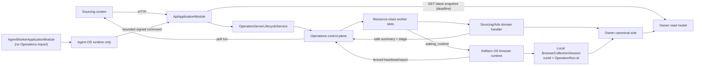

# Sourcing Long-Running Operations, API Lifecycle, and Snapshot-First UI Design

- Date: 2026-08-13
- Status: Approved
- Tracking issue: KID-24
- Source baseline: `origin/develop@0c6485b7` after KID-23 PR #478
- Classification: Operations platform reconstruction with bounded Sourcing,
  Advertising, Web, KidItem OS, and backend process-composition consumers
- Scope: the 14 routes under `/sourcing-ai`, their long-running collection and
  derived-snapshot actions, the shared execution controls those actions use,
  and the lifecycle of every `OperationRun` owned by the API server process
- Data decision: additive `OperationRun` metadata and read-model endpoints; no
  backfill of sourcing observations, recommendations, or tracking history
- Release decision: additive rollout by surface; no lifecycle schema migration;
  never run a legacy path and a replacement operation for the same user command

## 0. Executive decision

Every sourcing command that depends on a browser, an external provider, or an
expected p95 execution time above 500 ms uses the existing `OperationRun` control
plane. A command request persists the run and returns `202 Accepted` with a run
ID; the web page renders the latest persisted snapshot independently from the
new run. The page never holds an HTTP request or an extension message open until
collection finishes.

This design extends the existing Operations platform instead of creating a
second sourcing queue:

1. `OperationRun` remains the only server-side run identity, lifecycle, retry,
   cancellation, lease, and audit record.
2. Browser operations continue through the existing server claim, heartbeat,
   and fenced report APIs in `operation-runtime-client.js`.
3. `BrowserCollectionSession` remains an extension-local tab, attention, and
   recovery projection. For migrated operations it uses the `OperationRun.id` as
   its `runId`; it is not a second server queue or a second persisted execution
   ledger.
4. Long-running server work is isolated by resource class so one Playwright,
   Wing, or Naver task cannot block unrelated operations.
5. The UI is snapshot-first: reads show the last completed result, collection is
   explicit or scheduled, and run progress is a separate status region.
6. `partial` and `no_change` are terminal result outcomes of a `succeeded` run,
   not new top-level statuses. This preserves the existing Operations state
   machine and its consumers.
7. The API server lifecycle and every `OperationRun` execution lifecycle end
   together. Server shutdown or loss terminally cancels old active/waiting runs;
   a later server process never reclaims, resumes, or requeues them. The narrow
   AgentOS durable-runtime continuation described in §5.5 creates a distinct
   successor envelope after `ACCEPTING`; it never changes the cancelled row.
8. The HTTP API and Agent OS worker use separate Nest root modules. Only the API
   root imports `OperationsModule` and owns operation creation, scheduling,
   execution, startup cleanup, and shutdown cancellation.

## 1. Why this work is required

### 1.1 Browser QA baseline

Chrome QA on 2026-08-13 exercised route entry, search buttons, refresh buttons,
filters, and extension-backed actions rather than inspecting only initial page
loads. The measurements below are diagnostic observations, not performance
targets.

| Surface/action                          | Observed behavior                                                                                           |
| --------------------------------------- | ----------------------------------------------------------------------------------------------------------- |
| Market local search/filter/detail       | 468 ms / 619 ms / 633 ms; duplicate React keys were emitted for several Coupang IDs                         |
| Naver market refresh                    | 1.99 s                                                                                                      |
| All trend sources                       | 30.474 s; 327 rows reported: Naver 118, 1688 200, Shorts 9; one pending state waited for the slowest source |
| Individual trend sources                | Naver 11.772 s, 1688 26.086 s, Shorts 3.692 s; the 1688 toast reported zero despite persisted data          |
| Wing validation, 12 keywords            | roughly 110 s; progress sat at 11/12 before eventually producing 154 recommendations                        |
| Keyword search for `슬라임`             | more than 58 s; Naver results arrived but the extension timeout remained as stale page state                |
| Keyword trend/rank actions              | trend find 20.365 s; rank refresh 16.884 s; trend compare 1.007 s                                           |
| Wholesale route entry                   | automatically launched six keyword searches and 24 image matches                                            |
| Wholesale image matches                 | 24/24 failed because no Coupang image was available, while the page displayed `수집 완료 24개`              |
| Wholesale keyword cards                 | remained loading for more than 90 s and disabled retry                                                      |
| Category collection                     | more than 79.288 s although the UI described a one-minute maximum                                           |
| Competitor collection                   | more than 64.719 s                                                                                          |
| Wing catalog, keyword `레고`, two pages | more than 72.533 s with no visible incremental progress                                                     |
| Recommendations route                   | 17.7 s to render; rank refresh 964 ms; validation used the same serial Wing pattern                         |
| Rising products route/detect            | 13.17 s to render; detect more than 71.565 s                                                                |
| Product tracking                        | 24.118 s route load; per-product history stayed loading for more than 60 s; refresh exceeded 23 s           |

The browser was finalized after the evidence was captured. These numbers are a
baseline for later comparison, not a promise that the same provider conditions
can be reproduced exactly.

### 1.2 Current execution split

The same user concept, “collect or recompute data and then show it,” currently
uses four incompatible orchestration paths:

| Path                              | Current examples                                      | Structural problem                                                                                                          |
| --------------------------------- | ----------------------------------------------------- | --------------------------------------------------------------------------------------------------------------------------- |
| `OperationRun` polling            | daily trend, category sourcing                        | correct start contract, but the server worker drains one run globally and long handlers can outlive their lease             |
| Direct extension request/response | Wing catalog, keyword suggestions, competitor catalog | a web promise remains open for up to 90 seconds and cannot reliably represent queued, attention, cancel, or recovery states |
| Synchronous NestJS request        | 1688 keyword/image search, rising detection           | provider and persistence work occupy the HTTP request; browser navigation and refresh cannot safely detach                  |
| Client-side serial loop           | market validation, recommendations, product tracking  | work disappears with page lifecycle, progress is local, and one timeout can leave stale error state after later successes   |

The result is not just slow rendering. The system has no single answer for which
run is active, whether it is still alive, whether zero means no change or
failure, or how cancellation fences late provider writes.

### 1.3 Confirmed code-level causes

- `apps/web/src/lib/api-client.ts` exposes no signal or deadline for GET and only
  accepts a caller signal for POST. A lost read can therefore keep a route in a
  loading state indefinitely.
- `apps/web/src/lib/extension-bridge.ts` defaults to 15 seconds, while Wing
  catalog overrides the call to 90 seconds and waits for the final extension
  response.
- `SellochMarketAnalysisPage.tsx`, `TodayRecommendationsPage.tsx`, and
  `ProductTrackingPage.tsx` await `searchWingCatalogProducts` sequentially per
  keyword.
- `ProductTrackingPage.tsx` uses one history query per tracked product.
- `SellochWholesaleKeywordSearch.tsx` and
  `SellochWholesaleCoupangMatches.tsx` start collection from mount effects.
- `TrendCollectService` visits selected sources sequentially, then visits Naver
  batches and 1688 seeds sequentially.
- the 1688 controllers execute Playwright-backed service work synchronously in
  the HTTP request.
- `OperationRunWorkerService` has one process-wide `busy` flag, claims one run,
  and awaits the entire dispatch. Its claim query is not resource-class aware.
- server handlers receive no `AbortSignal`, and the worker does not renew a
  long-running server lease while it is executing.
- the extension runtime persists active claims and reports fenced results, but
  a heartbeat failure is swallowed; marketplace work can continue after the
  server has cancelled or fenced the attempt.

## 2. Goals and non-goals

### 2.1 Goals

- A manual start endpoint returns a durable run ID with p95 latency below one
  second under normal database load.
- A sourcing page renders its last successful snapshot with p95 latency below
  two seconds and does not start external collection on mount.
- Every active run exposes stage, elapsed time, numeric progress when known,
  cancel, and a terminal outcome.
- Page refresh, route navigation, and MV3 service-worker restart within one
  accepting API lifecycle do not lose the canonical run state.
- Provider/browser concurrency is bounded independently for Naver, Coupang,
  1688 Playwright, and snapshot computation.
- A cancellation or expired fence stops further extension work and prevents a
  late result from becoming canonical.
- Zero accepted records, partial source failure, all-source failure, and no
  change have different contracts and UI copy.
- Existing source-control, evidence, provenance, organization scope, and
  attempt-token rules remain mandatory.
- Server startup is fail-closed: no HTTP listener, operation claim, scheduler
  dispatch, browser runtime, or composite resume opens until old active/waiting
  runs are terminally cancelled.
- A server restart never revives a prior `OperationRun`. An operator retry of a
  server-cancelled run always creates a new run and keeps the old row as audit
  history.

### 2.2 Non-goals

- adding a message broker, new microservice, or second job table;
- moving deterministic sourcing commands into Agent OS;
- changing recommendation, validation, rising-product, or score policy;
- redesigning the sourcing navigation or the 14 route information hierarchy;
- changing provider accounts, credentials, host permissions, or login policy;
- backfilling historical sourcing or Ads-owned tracking data;
- persisting a server-lifecycle ID or adding a lifecycle schema migration in
  the current single-API-instance deployment;
- supporting multiple API replicas or rolling overlap between API processes;
- automatically restarting, requeueing, reclaiming, or resuming an existing
  `OperationRun` across a server lifecycle boundary. The only exception is the
  explicit AgentOS durable-runtime continuation in §5.5, which creates a new
  immutable envelope for the same persisted external handle after `ACCEPTING`;
- including KID-23 inventory UI work in this issue;
- returning raw provider rows, HTML, payloads, tokens, or credentials in an
  `OperationRun.result`.

## 3. Existing designs and authority

This document narrows execution and performance behavior; it does not replace
the sourcing data model.

- `2026-08-01-unified-operation-control-plane.md` remains authoritative for the
  Operations owner, statuses, organization scope, schedules, and engine
  dispatch. This design adds resource classes, stage/progress details,
  deadlines, and sourcing consumers.
- `2026-07-14-background-browser-collection-session-design.md` remains
  authoritative for extension-local managed tabs, attention, security, and
  restart controls. Its server queue is already superseded by Operations. This
  design fixes the identity relationship: migrated sessions use the
  `OperationRun.id` and never form another server control plane.
- `2026-08-08-sourcing-backend-data-stabilization-design.md` remains
  authoritative for source allowlists, collection permits, immutable evidence,
  normalized data, projections, and compatibility facades.
- `2026-08-10-sourcing-agentos-capability-runtime-design.md` remains
  authoritative for judgment-bearing Agent OS work. These deterministic
  collection commands do not create Agent OS runs.

If a future implementation discovers a conflict, the source/evidence and
organization contracts above win; KID-24 must be revised instead of bypassing
them.

This revision explicitly narrows the earlier lease/retry authority: leases and
`maxAttempts` may recover an ordinary retryable failure only while the same API
server lifecycle is accepting work. They do not authorize recovery across API
server shutdown, crash, replacement, or startup.

## 4. Considered approaches

### 4.1 Selected: extend the existing OperationRun control plane

This path reuses catalog registration, start/list/get/cancel APIs, browser
claims, attempt fencing, schedules, and `useOperationRun`. It removes client
orchestration without introducing a second operational database.

### 4.2 Rejected: only add longer frontend timeouts

Longer timeouts preserve the architectural failure: navigation owns the job,
cancel is ambiguous, MV3 restart loses the response channel, and stale errors
remain possible. They also make failure slower rather than observable.

### 4.3 Rejected: one global server queue with higher concurrency

A global concurrency number allows Playwright work to consume every slot and
does not express provider-specific rate or profile constraints. Resource
classes are required even if all classes initially run in one worker process.

### 4.4 Rejected: browser collection session as a new server parent

`BrowserCollectionSession` already solves local tab recovery. Promoting it to a
second server parent would duplicate lifecycle, cancellation, and audit state.
The server parent is `OperationRun`; the local session is its one-to-one browser
projection.

### 4.5 Rejected: add `partial` to `OperationStatus`

Partial completion is a domain result, not an execution phase. Adding a status
would expand every Operations transition and consumer while still requiring a
result summary. `succeeded + outcome=partial` is explicit and compatible.

### 4.6 Selected: process-start cutoff without a lifecycle schema

The API process obtains a database `clock_timestamp()` before accepting work.
It terminally cancels every pre-existing active/waiting run at or before that
cutoff, advances missed schedules without creating runs, and only then opens
the operation gate. This matches the current single-API-instance deployment and
adds no backfill or lifecycle table.

### 4.7 Rejected for now: persisted lifecycle generation

Tagging every run with a durable server generation would make overlapping API
replicas explicit, but it requires schema, backfill, and ownership arbitration
that the current deployment does not need. It becomes mandatory before API
replicas or rolling overlap are introduced.

### 4.8 Rejected: lease-based resurrection after server loss

Reclaiming an expired `running` row, restoring a claimed row to `queued`, or
decrementing its attempt hides the actual execution history and violates the
approved operating model. Old rows remain durable audit records with a terminal
server-lifecycle cancellation; retry is a new `OperationRun`.

### 4.9 Rejected: deployment-script-only cleanup

A deployment hook cannot cover local execution, process crashes, or a direct
server restart. Lifecycle cleanup belongs inside the API application startup
and shutdown boundary and must fail closed before the HTTP listener opens.

## 5. Target architecture



### 5.1 Command and read separation

Every migrated page has two independent queries:

1. **Snapshot query** reads the latest completed owner projection. It may return
   data plus `generatedAt`, `stale`, and `staleReason`. It never initiates work.
2. **Operation query** reads an optional active/recent `OperationRun`. It shows
   current execution state and invalidates the snapshot only after a successful
   terminal outcome.

The start response is the created run, not collected data. The UI stores the
run ID in the query cache and may recover the latest matching run from the
server after reload. It does not store provider results in component state.

### 5.2 Operation metadata

The shared and persisted Operation contracts add the following fields:

| Field                               | Contract                                                                      |
| ----------------------------------- | ----------------------------------------------------------------------------- |
| `resourceClass`                     | code-owned enum copied from the definition to the run                         |
| `stage`                             | nullable code value matching `^[a-z][a-z0-9_]{0,79}$`; localized by the UI    |
| `stageUpdatedAt`                    | changes only when the stage changes                                           |
| `progressCurrent` / `progressTotal` | nullable non-negative integers; both required together and `current <= total` |
| `deadlineAt`                        | nullable absolute execution deadline set on first claim                       |

`progress` remains a normalized 0..1 value for existing consumers. When counts
exist, the server derives it from the two counters. `updatedAt` continues to
change on heartbeat and is the communication-freshness signal;
`stageUpdatedAt` is the work-stagnation signal.

Operation definitions add:

```ts
interface OperationDefinition {
  // existing fields omitted
  resourceClass: OperationResourceClass;
  executionTimeoutMs: number;
}

type OperationResourceClass =
  | "default"
  | "naver_api"
  | "extension_coupang"
  | "playwright_1688"
  | "snapshot_compute";
```

The definition values are copied to a run at creation so a deployed catalog
change cannot alter the execution policy of an existing run.

### 5.3 Resource-class scheduling

The operation worker inside the API process replaces its single `busy` boolean
with independent active slots.
The repository claims only the class for which a slot is available. Default
limits are conservative and configurable as a validated JSON object on the API
process:

| Resource class      | Executor                     |                                                    Default capacity | Reason                                                               |
| ------------------- | ---------------------------- | ------------------------------------------------------------------: | -------------------------------------------------------------------- |
| `default`           | server worker                |                                                                   2 | short orchestration and ordinary provider HTTP                       |
| `naver_api`         | server worker                |                                                                   2 | bounded Naver API parallelism                                        |
| `playwright_1688`   | server worker                |                                                                   1 | one persistent browser profile must remain serialized                |
| `snapshot_compute`  | server worker                |                                                                   2 | bound JSON/aggregation memory and DB pressure                        |
| `extension_coupang` | server dispatch + KidItem OS | 4 dispatch slots; one active claim per environment in the extension | dispatch is short; the logged-in Wing browser is the scarce resource |

The runtime parses `OPERATION_RESOURCE_CLASS_LIMITS` strictly. Unknown classes,
zero/negative values, or malformed JSON fail API startup. Definitions use
the defaults when the variable is absent. The system does not silently merge an
unknown class into `default`.

The server worker launches up to the available slots without awaiting one
class before polling another. Composite-child reconciliation has its own
single-flight guard and cannot block run claims.

### 5.4 Process composition and lifecycle ownership

The API and Agent OS worker no longer bootstrap the same Nest root module.

- `main.ts` bootstraps `ApiApplicationModule`. It owns HTTP controllers, domain
  modules, `OperationsModule`, operation schedules, the resource-class worker,
  browser runtime APIs, and `OperationServerLifecycleService`.
- `worker.ts` bootstraps `AgentWorkerApplicationModule`. It contains only the
  Agent OS runtime and the narrow infrastructure/runtime adapters that worker
  requires. It has no HTTP controllers, global HTTP guards, `OperationsModule`,
  operation scheduler, operation claim loop, or operation lifecycle hook.
- Domain capabilities required by Agent OS are exposed through focused worker
  composition modules rather than importing an entire HTTP/domain root that
  transitively brings `OperationsModule` back into the worker.
- `sourcing.refreshCollection` remains an Agent OS capability, but its MCP
  child does not import or call `OperationRunService`. The trusted parent
  issues a two-minute HMAC grant scoped to the exact organization, Agent OS
  request, run, agent instance, and capability. The child presents only that
  bounded grant to an API-internal collection-command endpoint. The API
  verifies the signature and expiry with a timing-safe comparison, verifies
  the same active Agent OS request/run tuple in PostgreSQL, derives the actor
  and idempotency key from that persisted context, requires the lifecycle gate
  to be `ACCEPTING`, and then starts a new operation through
  `OPERATION_RUNNER_PORT`.
- `AGENT_API_CAPABILITY_GRANT_SECRET` has at least 32 random UTF-8 bytes, stays
  in the API/Agent worker parent environment, and is never copied into the
  model CLI environment or MCP descriptor. The MCP entrypoint removes any
  locally dotenv-loaded copy before creating its Nest context. The bounded
  bearer may be replayed only during its two-minute lifetime, and replay
  resolves the same operation via the derived idempotency key. Nginx returns
  404 for `/api/internal/**`; direct container/localhost access still requires
  the grant and database tuple.
- Ownership is structural and covered by architecture tests. Environment flags
  may enable a feature inside its owning root, but they never decide which
  process owns the Operations lifecycle.

The API process is the one lifecycle owner in the supported deployment. API
replica overlap is prohibited. A future multi-API deployment requires the
rejected persisted-generation design to be approved first.

### 5.5 API server lifecycle gate

`OperationServerLifecycleService` is the only Nest lifecycle hook that opens or
closes operation intake. Worker and scheduler expose explicit start/stop
methods; they do not independently install timers during module initialization.
The gate has four states:

```text
BOOTSTRAPPING -> ACCEPTING -> STOPPING -> STOPPED
```

Only `ACCEPTING` permits a user/schedule start, retry, server/browser claim,
composite resume, or child creation. Other states reject new mutation with
`503 operation_server_lifecycle_unavailable`. Heartbeats and reports remain
attempt-token fenced; once cleanup clears the token, late work cannot publish a
successful result.

| State at lifecycle boundary                                         | State after cleanup | Audit rule                                        |
| ------------------------------------------------------------------- | ------------------- | ------------------------------------------------- |
| `queued`                                                            | `cancelled`         | preserve `attempts` even when it is zero          |
| `waiting_runtime`                                                   | `cancelled`         | clear browser claim ownership; never reclaim      |
| `waiting_dependency`                                                | `cancelled`         | preserve parent/child links; never resume         |
| `running`                                                           | `cancelled`         | clear claim/token/lease; preserve attempt history |
| `attention_required`, `succeeded`, `failed`, `cancelled`, `skipped` | unchanged           | already-terminal history is immutable             |

#### Startup

Before the HTTP listener, scheduler, worker, browser claim, or composite resume
opens, the API process:

1. reads a cutoff from PostgreSQL `clock_timestamp()`;
2. terminally cancels every `OperationRun` from every owner domain whose status
   is `queued`, `waiting_runtime`, `waiting_dependency`, or `running` and whose
   `createdAt <= cutoff`;
3. advances every enabled schedule with `nextRunAt <= cutoff` directly to its
   first future occurrence without creating a run, including schedules whose
   ordinary misfire policy is `catch_up_once`;
4. verifies that no matching old run or missed schedule remains; and
5. changes the gate to `ACCEPTING` and starts the scheduler and worker.

Cleanup uses bounded batches of 100 with `FOR UPDATE SKIP LOCKED`, Prisma tagged
SQL, and an exact `{ organizationId, runId }` mutation after selection. A zero
row batch is not proof of completion: an `EXISTS` check detects rows hidden by a
concurrent lock. If cleanup cannot reach zero within 30 seconds, or any database
step fails, application initialization rejects and the HTTP listener never
opens.

#### Graceful shutdown

The single lifecycle owner performs shutdown in this order:

1. synchronously moves the gate to `STOPPING` and stops scheduler/worker intake;
2. aborts in-flight start/claim transactions;
3. runs a first all-domain active/waiting cancellation sweep, clearing attempt
   tokens before any late handler report;
4. aborts active handlers and waits at most five seconds for provider/browser
   resource cleanup; and
5. runs a final sweep to catch a start or claim that committed at the shutdown
   boundary, then moves to `STOPPED`.

The first and final sweeps use `operation_server_shutdown`. Startup cleanup of
rows left by an abrupt process loss uses
`operation_server_lifecycle_expired`. Both transitions set `finishedAt`, clear
`claimedBy`, `attemptToken`, `claimedAt`, and `leaseExpiresAt`, and preserve
`attempts`, `startedAt`, stage/counts, deadline, schedule, idempotency,
parent/child references, and already committed immutable observations. Rows
are never deleted.

If a graceful-shutdown database step fails or remains locked beyond the
five-second cleanup budget, the process records a lifecycle cleanup failure and
exits without pretending cancellation succeeded. The next API process still
cannot open until its startup cleanup reaches zero, so a residual row cannot
resurrect.

`attention_required`, `succeeded`, `failed`, `cancelled`, and `skipped` are
already terminal audit outcomes and are not changed by lifecycle cleanup. A
cancelled run is immutable. Operator retry creates a new `OperationRun`; it
never reactivates the old row.

#### AgentOS durable-runtime continuation

An official durable AgentOS runtime is distinct from the API-owned envelope:
one immutable `AgentExecutionAttempt` owns its opaque external runtime handle,
while `AgentExecutionAttemptOperationBinding` records every immutable
`OperationRun` envelope that has carried that attempt. When startup cleanup
cancels the current AgentOS envelope but its session task, execution, and
attempt are still running, the API wrapper waits until this gate is
`ACCEPTING`, then atomically creates a successor `OperationRun`, a binding with
the predecessor run ID and an idempotent continuation key, and a successor
runtime-handle checkpoint. The original run remains cancelled audit history;
its binding is never moved or overwritten.

The successor reuses the exact persisted runtime type, external run ID,
encrypted handle reference, generation, and canonical AgentOS identifiers. It
does not create another attempt or external run. Recovery is organization
fenced, accepts only a current lifecycle-cancelled AgentOS binding whose task is
still `running`, and is idempotent for duplicate boot/retry calls. An approval
uses the same boundary with an `approval:<approvalId>` key; it never requeues
the old `attention_required` row. Shutdown, a lost attempt fence, and an idle
stream deadline stop event consumption; only the deadline cancels the exact
external handle and terminalizes its canonical graph.

An unexpected kill cannot run the graceful hook. Its memory work disappears
with the process, and the next startup cleanup terminally cancels every old
active/waiting row before opening. Expired `running` leases are never reclaimed
by a later API process.

Missed schedules never cross a server lifecycle boundary. Within one live
`ACCEPTING` lifecycle, ordinary misfire and retry policies still apply; after a
shutdown or crash, a schedule resumes only at its first future occurrence.

### 5.6 Lease, cancellation, and deadlines

Long execution is safe only if work and ownership stay fenced.

- A server worker creates an `AbortController` per claimed attempt and renews
  its lease at one third of the lease duration.
- `OperationHandlerContext` receives `signal` and a `checkpoint` function that
  renews the fenced lease and can update stage/counts.
- If lease renewal returns no matching `runId + attemptToken + running` row, the
  worker aborts the signal and must not report success.
- Domain provider ports that perform external I/O accept `AbortSignal` and
  check it between batch items. A cancelled run may retain already committed,
  immutable observations, but it cannot publish a successful projection.
- The first claim sets `deadlineAt` from the run's copied
  `executionTimeoutMs`. An ordinary retry inside the same accepting API
  lifecycle does not extend the original deadline. A retry after
  server-lifecycle cancellation is an explicit new run with a new deadline.
- A deadline abort transitions the fenced attempt to `failed` with
  `operation_deadline_exceeded`.
- Browser runtime heartbeat/report rejects work past its deadline or after
  cancellation. The extension treats a fenced heartbeat as an abort, closes
  managed background tabs, and skips a terminal report from the stale attempt.
- Operator retry of `attention_required` uses the existing retry endpoint and
  attempt fencing only inside the same accepting lifecycle. Automatic retry is
  limited by `maxAttempts`, never crosses a lifecycle boundary, and never
  retries authentication/CAPTCHA attention as if it were a transient error.

### 5.7 Browser start acknowledgement and recovery

The web start request never waits for `searchWingCatalogProducts` or another
marketplace action. After the server returns the run, the page sends a
best-effort `wakeOperationRuntime` message to KidItem OS with a three-second
client deadline. The extension acknowledges `{ success: true, accepted: true }`
immediately and starts `resumeOrTick(environmentId)` without holding the
message response open. If the nudge is unavailable, the existing 30-second
alarm remains the recovery path.

This extension recovery exists only inside the same accepting API lifecycle.
After API shutdown or replacement, the server-side run is cancelled and the
alarm cannot reclaim or revive it.

The service worker retains the runtime instance so the shared external
dispatcher can call `wake`. The action carries no operation key, URL, token, or
payload; the extension still claims the exact server-issued job through the
authenticated runtime API.

For a claimed sourcing browser operation, the exact operation handler starts or
resumes a local collection session with:

```text
runId            = OperationRun.id
producer         = exact domain producer, for example sourcing.wing_catalog_batch
environmentId    = verified sender/runtime environment
restartStrategy  = extension
classification   = background_preferred
```

The extension persists only sanitized input identity, progress, tab identity,
and attention state. Raw marketplace rows are posted to an owner ingest API
using the attempt token; the terminal operation report contains counts and
safe references only.

### 5.8 Progress and result contract

Every migrated operation reports code-owned stages. Examples include
`loading_targets`, `waiting_browser`, `collecting_keyword`, `persisting`, and
`building_snapshot`. The UI owns Korean labels and does not display raw provider
error text as a stage.

The terminal safe result uses this shape:

```ts
type SourcingOperationOutcome = "complete" | "partial" | "no_change";

interface SourcingOperationResult {
  outcome: SourcingOperationOutcome;
  summary: {
    discovered: number;
    accepted: number;
    duplicate: number;
    unchanged: number;
    failed: number;
  };
  sources: Array<{
    source: string;
    outcome: "complete" | "partial" | "no_change" | "failed" | "skipped";
    accepted: number;
    failed: number;
    errorCode?: string;
  }>;
  snapshotGeneratedAt?: string;
}
```

The schema remains below the existing 32 KiB safe-result limit and its keys do
not include raw rows, responses, payloads, files, tokens, or credentials.

Terminal rules are deterministic:

- all attempted units failed and none were accepted: top-level `failed`;
- at least one accepted unit and at least one failed unit: `succeeded` with
  `outcome=partial`;
- no failures and no new or changed canonical rows: `succeeded` with
  `outcome=no_change`;
- otherwise: `succeeded` with `outcome=complete`.

Thus 24 failed wholesale image matches can never render as “24 collected.”

## 6. Surface migration map

All 14 sourcing routes were included in the static inventory. Only commands
that cross the long-running threshold migrate; ordinary reads and local UI
operations remain direct.

| Route                              | Snapshot/read behavior                       | Long-running command after migration                                                                                    |
| ---------------------------------- | -------------------------------------------- | ----------------------------------------------------------------------------------------------------------------------- |
| `/sourcing-ai`                     | server-built home snapshot                   | no collection on mount; links to the owner run when a refresh is requested                                              |
| `/sourcing-ai/market`              | latest persisted market/trend snapshot       | `sourcing.collect_daily_trends`; sources execute with bounded parallelism and per-source summaries                      |
| `/sourcing-ai/category-sourcing`   | latest category result                       | existing operation gains stage, deadline, and lane metadata                                                             |
| `/sourcing-ai/competitor-analysis` | Ads-owned competitor snapshots               | `advertising.collect_competitor_catalog` browser operation                                                              |
| `/sourcing-ai/keywords`            | persisted Naver/keyword snapshots            | Naver server operations and `sourcing.collect_keyword_suggestions` browser operation; stale source errors clear per run |
| `/sourcing-ai/wholesale-search`    | interest targets and latest offer matches    | `sourcing.search_1688_keyword_batch` and `sourcing.match_wholesale_images`; no mount-triggered collection               |
| `/sourcing-ai/recommendations`     | persisted recommendation run                 | `sourcing.collect_wing_catalog_batch` followed by the existing deterministic recommendation service                     |
| `/sourcing-ai/validation`          | persisted validation run                     | reuses the same Wing batch operation and existing validation policy                                                     |
| `/sourcing-ai/final-selection`     | persisted review selection                   | no new long-running work; direct bounded mutations remain direct                                                        |
| `/sourcing-ai/decision-center`     | persisted decision read model                | no deterministic collection on mount; Agent OS boundary remains unchanged                                               |
| `/sourcing-ai/wing-catalog`        | latest ingested Wing catalog search snapshot | pilot consumer of `sourcing.collect_wing_catalog_batch`                                                                 |
| `/sourcing-ai/product-tracking`    | one bulk Ads history read                    | `advertising.refresh_tracked_wing_products` browser operation; no per-product GET fan-out                               |
| `/sourcing-ai/rising-products`     | latest persisted rising snapshot             | `sourcing.detect_rising_products` in `snapshot_compute`                                                                 |
| `/sourcing-ai/settings`            | source controls and configuration reads      | no OperationRun for CRUD; save/test requests have explicit request deadlines                                            |

### 6.1 Wing batch ownership

`sourcing.collect_wing_catalog_batch` accepts a bounded keyword list, maximum
pages, and a purpose enum: `catalog_search`, `market_analysis`,
`recommendation_validation`, or `tracked_metrics`. The extension loops the
keywords, reports `current/total`, and ingests each completed keyword so a later
failure does not erase prior canonical observations. The operation result never
contains the product array.

Market analysis, recommendation validation, and tracking stop calling the
extension in React loops. They start one run and render server read models after
that run completes.

### 6.2 1688 ownership

Direct 1688 keyword and image controllers stop executing Playwright work in the
HTTP request. Commands start bounded operations whose inputs contain canonical
interest/offer IDs or normalized keywords, not arbitrary target URLs. The
existing server allowlist, source-control permit, persistent-browser profile,
and evidence coordinator remain in force. `playwright_1688` capacity stays one
until separate profiles and account policy exist.

### 6.3 Trend collection

`sourcing.collect_daily_trends` remains the user-visible parent. It starts exact
source child runs for Naver, 1688, and Shorts and waits with an all-settled
multi-child composite policy. The children use `naver_api`,
`playwright_1688`, and `default` resource classes respectively, so a 1688 stall
does not occupy Naver capacity. Naver chunks use a small bounded map, while
1688 seeds remain serialized by the single profile. Each source writes through
the existing collection coordinator and contributes one safe source summary;
the parent derives complete, partial, no-change, or failed only after all
selected children are terminal. Existing one-child composite behavior remains
unchanged for other operations.

### 6.4 Product tracking bulk history

Advertising remains the data owner. It adds one organization-scoped bulk read,
declared before parameterized routes:

```text
GET /api/ads/wing-tracked-products/history?days=30
```

The response groups points by `trackedProductId` and uses one bounded query.
The existing single-product endpoint remains during migration, then is retained
only for drill-down consumers. Route entry no longer issues N history requests.

## 7. Frontend request and UI-state contract

### 7.1 Request deadlines

`apiClient` adds a common request option with composed cancellation:

```ts
interface ApiRequestOptions {
  signal?: AbortSignal;
  timeoutMs?: number | null;
  suppressNetworkErrorLog?: boolean;
}
```

- GET, `getNullable`, and `getParsed` default to 15 seconds.
- sourcing snapshot reads explicitly use 10 seconds.
- POST/PUT/PATCH/DELETE keep no implicit behavioral change in the first slice;
  operation starts pass 10 seconds explicitly.
- `timeoutMs: null` is allowed only for audited streaming/upload callers, never
  for sourcing collection.
- caller abort and deadline abort are distinguishable. Deadline becomes
  `ApiError(0, 'request_timeout', ...)`; caller abort remains an `AbortError` so
  React Query can discard it without a failure toast.
- the composed controller and timer are cleaned after every response or error.

### 7.2 Loading semantics

The page uses separate labels for separate state:

| State                       | UI behavior                                                                                  |
| --------------------------- | -------------------------------------------------------------------------------------------- |
| snapshot query pending      | skeleton limited by the read deadline                                                        |
| stale snapshot + active run | keep data visible; show a non-blocking run panel                                             |
| queued/waiting runtime      | show queue/runtime wait and elapsed time                                                     |
| running                     | show localized stage and count/fraction when known                                           |
| attention required          | show the required action and explicit retry/open-tab control                                 |
| succeeded/complete          | invalidate snapshot and show accepted counts                                                 |
| succeeded/partial           | keep successful data and list failed source codes                                            |
| succeeded/no change         | show last checked time and “변경 없음”                                                       |
| failed                      | retain the previous snapshot and show retryable error; never replace it with an empty result |
| request timeout             | stop the skeleton and show retry; do not leave “불러오는 중” indefinitely                    |

Retry never replays a component-local loop. Within one accepting API lifecycle,
an ordinary retry may use the existing run only where its operation policy
allows it. A server-lifecycle-cancelled run is immutable, and its retry action
starts a new run. Run state is keyed by run ID, so a failure from an older run
cannot overwrite a later success.

## 8. Observability and performance gates

### 8.1 Metrics and logs

Operations emits structured events without raw inputs/results:

- `operation_started`, `operation_stage_changed`, `operation_completed`,
  `operation_failed`, `operation_cancelled`, `operation_lease_lost`,
  `operation_server_lifecycle_opened`, and
  `operation_server_lifecycle_cleanup_failed`;
- dimensions: `operationKey`, `definitionVersion`, `engineType`,
  `resourceClass`, `triggerSource`, `stage`, `outcome`, and bounded error code;
- measurements: queue wait, execution duration, stage duration, accepted/failed
  counts, attempt number, and heartbeat age.

Logs include run ID and organization ID under existing access controls. Provider
search terms and product rows are not metric labels.

### 8.2 Acceptance SLOs

| Contract            | Gate                                                                                           |
| ------------------- | ---------------------------------------------------------------------------------------------- |
| Operation start     | p95 below 1 s; response is `202` with a schema-valid run                                       |
| Snapshot route data | p95 below 2 s on seeded local data; no collection request during mount                         |
| Active feedback     | stage or queue state visible within 500 ms after start response                                |
| Progress freshness  | a running batch updates heartbeat at least every lease/3 and stage/count at each unit boundary |
| Cancellation        | fenced within one heartbeat interval; late report cannot change terminal state                 |
| Lifecycle startup   | old active/waiting runs and missed schedules reach zero before HTTP listen                     |
| Lifecycle shutdown  | intake closes first; handler cleanup is bounded to 5 s; final sweep catches boundary commits   |
| No resurrection     | a second API boot never claims, resumes, or requeues a run from the first lifecycle            |
| Resource isolation  | a blocked `playwright_1688` run does not prevent `naver_api` or `snapshot_compute` claim       |
| Product history     | one bulk HTTP request and one bounded repository query, independent of card count              |
| Terminal copy       | all-failed, partial, no-change, and complete fixtures render different messages                |

Exact provider completion time is not an SLO because Wing, 1688, Naver, and
Shorts are external systems. Queue/start responsiveness, bounded concurrency,
progress freshness, deadline behavior, and truthful outcomes are SLOs.

## 9. Rollout and rollback

Implementation is staged inside one KID-24 integration PR. Resource metadata
and read models are additive; the API/Agent worker root composition and server
lifecycle behavior intentionally replace the shared-root and cross-lifecycle
recovery behavior. The accountable human explicitly approved this large-PR
exception on 2026-08-13. Each phase remains a reviewer-readable commit series
and a Linear checkpoint; there are no child implementation issues or stacked
PRs.

1. **Execution safety and observability**: separate API/Agent worker root
   modules, the fail-closed lifecycle gate, server-bound cancellation,
   resource classes, lane worker, heartbeat, deadline, stage/count fields, and
   regression tests.
2. **Deadline and snapshot-first reads**: web request deadline, bulk tracking
   history, removal of mount-triggered collections, truthful terminal copy.
3. **Browser operation pilot**: immediate runtime nudge, operation/session
   identity, attempt-token ingest, Wing catalog pilot.
4. **Long-flow migration**: market, recommendations, validation, tracking,
   competitor, keyword, 1688, rising, and trend consumers.
5. **Legacy removal and performance gates**: delete unused direct extension and
   synchronous endpoints only after static callers are zero; run full Chrome QA
   and record before/after evidence.

Rollout is per surface. A feature switch may choose legacy or operation-backed
UI during a PR, but one user command must never start both. Rollback switches the
surface back while preserving additive run rows and canonical observations.
The first deployment intentionally terminally cancels every pre-existing
active/waiting run and advances missed schedules without creating runs. There
is no additional lifecycle backfill or lifecycle schema migration. The
deployment remains one API instance; rolling overlap and replica scale-out are
blocked until a persisted lifecycle-generation design exists.

The PR updates `docs/ARCHITECTURE.md`, deployment architecture, and environment
guidance because the top-level Nest composition changes. The release/data note
states that cancelled rows remain audit history and operator retry creates a
new run.

After all callers are migrated, the static guard rejects reintroduction of:

- `searchWingCatalogProducts` loops in React components;
- collection-starting mount effects in sourcing routes;
- direct synchronous use of 1688 Playwright services from HTTP controllers;
- a sourcing snapshot `useQueries` fan-out by product.

## 10. Verification strategy

### 10.1 Contract and unit tests

- shared schema tests for resource class, stage/count consistency, safe result,
  heartbeat/report, and unchanged status vocabulary;
- Operations worker tests proving per-class isolation, bounded capacity, lease
  renewal, cancellation fencing, and deadline failure;
- lifecycle-state tests proving only `ACCEPTING` admits starts, retries, claims,
  child creation, schedule dispatch, and composite resume;
- architecture tests proving `ApiApplicationModule` owns `OperationsModule`
  and `AgentWorkerApplicationModule` cannot import it directly or transitively;
- internal-command tests proving an Agent MCP child can start
  `sourcing.refreshCollection` only through the API with an unexpired,
  capability-scoped grant and an active organization/request/run tuple, while
  wrong-tenant, expired, forged, terminal-run, and non-accepting cases create
  zero `OperationRun` rows;
- shutdown tests proving intake stops before cancellation, active handlers
  receive abort, cleanup waits at most five seconds, and a final sweep catches
  a start/claim committed at the boundary;
- schedule tests proving lifecycle-missed occurrences advance to the first
  future time without creating a run, including `catch_up_once` schedules;
- extension tests proving immediate wake acknowledgement, exact handler
  registration, run/session ID equality, heartbeat fence abort, restart resume,
  and no raw result report;
- web tests for composed abort/deadline cleanup, snapshot retention, truthful
  outcomes, no mount commands, and one bulk history request;
- sourcing/advertising service tests for source summaries, idempotent ingest,
  organization scope, and bulk history query bounds.

### 10.2 Integration and build gates

Each implementation phase runs its nearest scoped tests, and the single PR runs
all repository-required gates before review. Schema work additionally follows
`prisma/AGENTS.md` and runs
`npm run db:push`, `npx prisma generate`, and the shared build. NestJS wiring
changes run `npm run dev:server` and confirm successful boot. Frontend changes
run `npm run build --workspace=apps/web`. Extension changes run the exact Node
test suites and `node --check` for modified worker scripts.

PostgreSQL integration tests cover all owner domains and all four active/waiting
statuses, cutoff equality, terminal-row preservation, attempt/stage/deadline and
parent/child audit preservation, bounded batching, lock contention, and late
browser reports. A Nest bootstrap integration holds a matching row lock beyond
the 30-second cleanup budget and proves the API never listens. A process-root
integration proves the Agent OS worker starts without reading or mutating
`OperationRun`, while API startup cancels old runs before worker/scheduler
intake. A two-boot regression proves no prior run resurrects.

### 10.3 Browser regression matrix

Chrome QA repeats every baseline interaction in section 1.1 and records network
requests, elapsed time, visible progress, terminal text, retry, cancellation,
route navigation during a run, and page reload recovery. It also verifies all
14 routes produce no console errors and no automatic external collection on
mount. Provider-unavailable cases are required test cases, not skipped cases.

## 11. Completion criteria

KID-24 is complete only when:

- every long-running sourcing action in the migration map starts or reuses a
  durable `OperationRun`;
- no sourcing React component owns a serial extension/provider collection loop;
- no 1688 Playwright command remains synchronous in a user HTTP request;
- product tracking history is bulk-read;
- every active run has bounded wait, stage/elapsed feedback, cancellation, and
  truthful terminal semantics;
- API shutdown and replacement terminally cancel all active/waiting
  `OperationRun` rows across owner domains without deleting rows, decrementing
  attempts, or restoring `queued`;
- startup cleanup and missed-schedule advancement complete before the HTTP
  listener, scheduler, worker, browser claim, or composite resume opens;
- a lifecycle-cancelled run never resumes; operator retry creates a new run;
- API and Agent OS worker root modules are structurally separated, and only the
  API root can own `OperationsModule`;
- the Agent OS `sourcing.refreshCollection` capability crosses that boundary
  only through the bounded, tenant-verified API command grant and never through
  a direct Operations import;
- a Playwright stall cannot block unrelated resource classes;
- the static guard, scoped tests, required builds, server boot, and full Chrome
  regression matrix pass;
- `docs/ARCHITECTURE.md` and the sourcing collection runbook describe the final
  ownership and operating controls.
